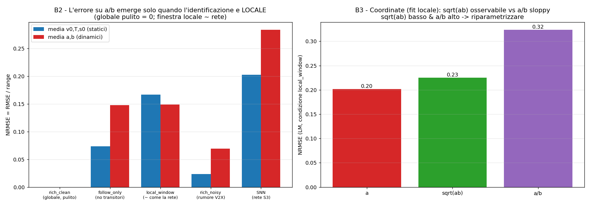
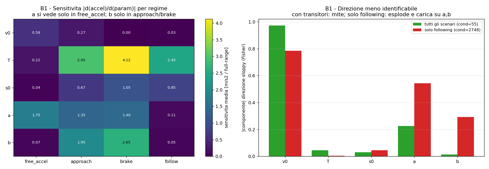
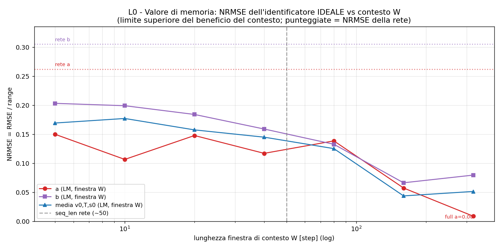

# Dynamic_Study — Studio B: risultati (la causa del tetto a/b)

> **Versione**: 2026-06-20  (branch `Dynamic_Study`)
> **Generatore**: `scripts/dynamic_study_B.py` (locale, niente Azure; rieseguibile).
> **Prerequisito**: `document/DYNAMIC_STUDY_PLAN.md` (disegno dello studio).

---

## 0. Verdetto in tre righe

1. **Il tetto NON è identificabilità di fondo**: un ottimizzatore classico (Levenberg-Marquardt) su
   dati **globali e puliti** recupera tutti e 5 i parametri **esattamente** (NRMSE 0.000, a/b inclusi).
   L'informazione **è** nei dati.
2. **La causa dominante è la LOCALITÀ**: la rete predice i parametri **per-istante**, e nei tratti
   senza transitori a/b sono *localmente ciechi*. Appena si toglie l'informazione globale (fit su
   finestre corte o su solo-following) a/b crollano a NRMSE ~0.12–0.18 e il problema diventa
   mal condizionato (Fisher cond 55 → 2748).
3. **Esiste anche un gap SNN-specifico recuperabile**: la rete (a 0.26, b 0.31) è peggiore perfino
   dell'ottimizzatore locale ideale (a 0.12, b 0.18) → ~+0.13 di margine da leve SNN
   (surrogate/encoding/loss). E la direzione di errore è il **rapporto a/b** (riparametrizzabile).

Questo **riordina le priorità**: la leva più grande, finora ignorata, è la **località** (memoria/contesto
+ loss per-regime + incertezza dichiarata), non solo la riparametrizzazione o il surrogate.

---

## 1. Metodo

Confronto della rete con un **ottimizzatore classico (LM)** che fitta i 5 parametri IDM agli stessi
dati (funzione fisica `_acc_iidm_accel`, la stessa che genera i dati → il fit può azzerare), sotto
4 condizioni progressivamente più vicine a ciò che la rete affronta. Metrica **identica** alla rete:
`NRMSE = RMSE / range_param` (train.py:757). Più B1 = sensitività/Fisher sul modello GT.

| Condizione | Cosa | Cosa isola |
|---|---|---|
| `rich_clean` | tutti gli scenari (+launch), puliti, fit **globale** | limite superiore (info nei dati) |
| `follow_only` | solo following stazionario, pulito | assenza di transitori |
| `local_window` | fit su finestre da 40 step (~ contesto della rete) | identificazione **locale** |
| `rich_noisy` | tutti gli scenari + rumore V2X (gap 10%, accel 0.1, packet loss 2%) | noise floor |

---

## 2. Risultati

### 2.1 Recovery LM vs SNN (NRMSE = RMSE/range)

| Condizione | v0 | T | s0 | **a** | **b** |
|---|---|---|---|---|---|
| `rich_clean` (globale, pulito) | 0.00 | 0.00 | 0.00 | **0.00** | **0.00** |
| `follow_only` (no transitori) | 0.01 | 0.02 | 0.19 | **0.14** | **0.16** |
| `local_window` (~ come la rete) | 0.14 | 0.16 | 0.20 | **0.12** | **0.18** |
| `rich_noisy` (rumore V2X) | 0.03 | 0.03 | 0.02 | **0.10** | **0.04** |
| **SNN (rete S3)** | 0.22 | 0.25 | 0.13 | **0.26** | **0.31** |

Letture:
- **`rich_clean` = 0 ovunque** → identificabilità piena su dati puliti e ben eccitati. Causa 1 (tetto
  di identificabilità di fondo) **falsificata**.
- **`local_window`** porta a/b a 0.12/0.18 e *anche* v0/T a 0.14/0.16: l'identificazione **locale**
  degrada tutto. È la condizione che più assomiglia alla rete (predice per-istante da contesto corto).
- **`rich_noisy`** (fit globale): a/b restano bassi (0.10/0.04). Il rumore **da solo** non è il killer,
  perché il fit globale media su molti istanti.
- **La SNN è peggiore di OGNI condizione LM su a/b** (0.26/0.31), e peggiore del `local_window` ideale
  anche su v0/T. → oltre la località c'è un **gap di approssimazione SNN** (vedi §3).

*Fig. B2/B3 — Sinistra: media NRMSE statici (v0,T,s0) vs dinamici (a,b) per condizione. L'errore su
a/b è ~0 sul globale pulito ed emerge con l'identificazione locale. Destra: coordinate nel fit locale
(normalizzazione consistente) — il rapporto a/b (0.32) è la coordinata peggiore.*

### 2.2 Sensitività per regime e direzione "molle" (B1)

*Fig. B1 — Sinistra: |∂accel/∂param| per regime di guida. Destra: composizione della direzione meno
identificabile (Fisher).*

- **Sensitività per regime** (heatmap): `b` è osservabile **solo** in approach (1.95) e brake (2.65),
  ≈0 in free_accel (0.07) e follow (0.05). `a` è sensibile nei transitori (free_accel 1.75, approach
  1.35, brake 1.40) ma ≈0 in follow (0.11). `v0` solo in free_accel (0.58). `T` quasi ovunque
  (massimo in brake 4.12). **Esattamente la previsione del manuale** (car-follow ch12/17).
- **Condizionamento di Fisher**: con tutti gli scenari **cond = 55** (mite); con **solo following
  cond = 2748** (50× peggio). Togliere i transitori rende il problema mal posto.
- **Direzione molle**: con tutti gli scenari carica su **v0 (0.97)** e `a` (−0.23) — la coppia molle
  v0↔a già nota. Con solo-following carica su **v0 (−0.79), a (0.54), b (0.29)** — a e b entrano nella
  direzione non identificabile quando mancano i transitori.

### 2.3 Coordinate (fit locale, normalizzazione consistente)

`a` = 0.20, `√(a·b)` = 0.23, **`a/b` = 0.32**. Il **rapporto a/b è la coordinata peggiore**
(la più sloppy); `√(a·b)` (l'osservabile) è meglio del rapporto. Regredire `[a, √(a·b)]` e derivare
`b` evita di regredire direttamente la direzione molle.

---

## 3. La causa, scomposta

L'errore su a/b non ha **una** causa: è la somma di tre contributi, ciascuno con la sua leva.

| Contributo | Evidenza | Quanto | Leva |
|---|---|---|---|
| **Identificabilità di fondo** | `rich_clean` = 0 | **nullo** | — (l'info c'è) |
| **Località** (predizione per-istante) | `local_window`/`follow_only` ~0.12–0.18; Fisher cond 55→2748 | **dominante, in parte irriducibile** per un predittore per-istante | memoria/contesto, loss per-regime, **incertezza dichiarata** |
| **Gap SNN-specifico** | SNN 0.26/0.31 > local-LM 0.12/0.18 (~+0.13) | **reale, recuperabile** | surrogate width, encoding Δv'/jerk, TET loss |
| **Coordinate** | a/b (0.32) ≫ √(ab) (0.23) | sovrapposto agli altri | **riparametrizzazione [a, √(ab)]** |

> Nota importante: la SNN è peggiore del `local_window` LM **anche su v0/T** → esiste un gap di
> approssimazione SNN **generale** (l'ALIF non è un identificatore locale efficiente), separato dal
> problema a/b. Migliorare a/b e migliorare l'efficienza-locale della rete sono due assi distinti.

---

## 4. Conseguenze sul batch di soluzioni (riordinato)

Rispetto al piano iniziale, lo studio **promuove la località** a leva principale.

1. **Attaccare la LOCALITÀ** (nuova priorità #1, finora ignorata):
   - **Memoria/contesto**: la rete ha ricorrenza low-rank — è sfruttata abbastanza da *portare*
     l'informazione di un transitorio recente attraverso i tratti stazionari? Verificare/estendere il
     contesto temporale; eventuali feature esplicite del "transitorio recente".
   - **Loss per-regime (S4)**: pesare il residuo nei transitori (decel→b, accel→a) così il gradiente
     da quegli istanti domina — allinea il training a dove il parametro è osservabile.
   - **Propagazione dell'incertezza**: in un istante stazionario la rete **non può** conoscere a/b;
     dichiararlo (uncertainty omoschedastica) è più corretto che indovinare. Alto valore per il layer
     SLOW V2X.
2. **Chiudere il gap SNN** (surrogate width/arctan, encoding di Δv'/jerk, TET loss) — leve SNN-expert.
3. **Riparametrizzazione [a, √(ab)] → derivo b** (+log-space) — toglie la coordinata molle dalla
   regressione; beneficio modesto ma reale e a basso rischio.
4. **Cambio modello (Future-B: smooth caps / decouple √ab)** — resta in frigo (closed-loop già OK).

---

## 5. Caveat (onestà)

- Il baseline LM è un **limite superiore**: dati puliti + modello esatto. Il `local_window` usa finestre
  casuali (alcune contengono transitori) → è un proxy della rete, non la rete.
- Il gap SNN-vs-LM **conflà** più fattori SNN (capacità, surrogate, encoding, quantizzazione Po2,
  ottimizzazione): lo Studio B **non** isola quale domina. Serve un esperimento dedicato se si decide
  di tirare quella leva.
- `follow_only` ha piccole fluttuazioni del leader → un po' di segnale a/b residuo; l'evidenza pulita
  dell'assenza di info in following è la **Fisher cond (2748)** e la riga `b` della heatmap (~0).
- δ è fissato a 4 (non identificato), come nel modello.

---

## 6. L0 — curva del "valore di memoria" (`scripts/dynamic_study_L0.py`)

Quanto scende l'errore a/b se l'identificatore IDEALE (LM) ha una finestra di contesto di
lunghezza `W` crescente? È il **limite superiore** del beneficio del contesto temporale.

*Fig. L0 — NRMSE ideale (LM) vs lunghezza finestra W. Punteggiate = NRMSE della rete.*

| W [step] | a | b | media v0,T,s0 |
|---|---|---|---|
| 5 | 0.150 | 0.203 | 0.169 |
| 40 (~seq_len) | 0.117 | 0.159 | 0.145 |
| 80 | 0.139 | 0.133 | 0.125 |
| 160 | 0.057 | 0.066 | 0.044 |
| 320 | 0.009 | 0.080 | 0.052 |
| full | 0.000 | 0.000 | 0.000 |

**La curva ha una forma a SOGLIA, non un decadimento liscio.** Da W=5 a W~80 (che bracketa il
`seq_len` della rete ~50) a/b restano ~0.12–0.20; il crollo vero arriva a **W≥160 (~16 s)**, dove
a/b scendono a ~0.06. Interpretazione: a/b non migliorano con "un po' più di memoria" — migliorano
quando la finestra **cattura un transitorio** (accel/brake). Con finestre corte la maggior parte dei
tratti è stazionaria → a/b indeterminati; serve un orizzonte abbastanza lungo da contenere gli eventi
informativi e **trattenerne** l'informazione.

**Due leve ortogonali, entrambe reali:**
1. **Chiudere il gap-SNN al contesto attuale.** Al `seq_len` della rete il tetto IDEALE è a/b ~0.12–0.16;
   la rete è a 0.26/0.31 → ~**+0.13 di gap-SNN** recuperabile *senza* toccare la memoria
   (per-regime loss, surrogate, encoding). Leva **affidabile e immediata**.
2. **Estendere la RITENZIONE.** Per scendere verso ~0.06 serve W≥160 (~16 s): un orizzonte lungo che
   l'ALIF con leak veloce (`V←V−V≫3`, β≈0.875/tick) quasi certamente **non trattiene**. Quindi
   "allungare `seq_len`" da solo aiuta poco: serve una memoria capace di *trattenere* il transitorio
   (canale ricorrente lento / latch). Leva **a tetto più alto ma più difficile** — fattibilità da
   verificare in L1.

> Nota: anche i parametri statici (v0,T,s0) hanno lo stesso gap rete-vs-ideale → esiste un gap-SNN
> generale, non solo su a/b. Il gap è solo *più grande* su a/b.

---

## 7. Stato

- [x] Studio B (`dynamic_study_B.py`) + L0 (`dynamic_study_L0.py`) eseguiti → `figures_dynamic/`.
- [ ] **L1 (Azure, niente training)**: la rete addestrata usa la memoria? NRMSE(a,b) vs distanza
      dall'ultimo transitorio + ablazione della ricorrenza. Decide tra "ritenzione" e "gap-SNN".
- [ ] **L2 (Azure, training)**: l'intervento indicato — leva #1 (per-regime loss/surrogate/encoding)
      quasi certa; leva #2 (canale ricorrente lento) solo se L1 mostra che la ritenzione è il collo.
- Deliverable parallelo: **incertezza dichiarata** (la rete non può conoscere a/b lontano dai
  transitori → comunicarlo invece di indovinare).
