# CF_FSNN — Report FPGA (Fase A)

> **Profilo di idoneità FPGA (Zynq-7020 / PYNQ-Z1) dei 4 champion, pre-silicio — 45 figure a dati reali su 10 sezioni**

> Terzo membro del trio v3 · gemelli: HOW_IT_WORKS_v3 (teoria) · VALIDATION_REPORT_v3 (risultati)  
> Branch EventProp_Study · Fase A "software_now": profilazione SW pre-silicio (le Fasi B/C = HDL/board)  
> Sorgente figure: scripts/fpga_figures.py (librerie weight/state/latency/seu/io) · risultati: results/evaluate/FPGA/  

---

## In una pagina: cos'è e come si legge

Questo report è la valutazione di idoneità FPGA dei 4 champion (2 BPTT: Raffaello, Leonardo; 2 EventProp: Donatello, Michelangelo) PRIMA di toccare il silicio. È la Fase A "software_now": ogni numero 🟢 è calcolato dai tensori e dal forward reali della rete (non da un datasheet), tramite le 5 librerie di profilazione. Le figure marcate 🟡/🔴 (datapath HDL, area, termico) sono STIME di progetto, da confermare solo con la sintesi Vivado e la misura su board (Fasi B/C).

Come si legge: la sezione 0 è il cruscotto (radar + tabella di numeri reali) con il verdetto di deploy; le sezioni 1-8 lo fondano dimensione per dimensione (pesi po2, fixed-point, spiking, energia, timing, risorse, SEU, I/O); la 9 è termica (stime). Contesto e teoria della rete: HOW_IT_WORKS_v3 §16. I risultati di validazione della guida (sicurezza, traffico, accuratezza): VALIDATION_REPORT_v3 (di cui §9 è il sommario FPGA che rimanda qui).

> **Nota.** Due verità che attraversano tutto il report (coerenti col fix del bug n_ticks): (1) i champion sparano ~13-21%, NON sono iper-sparsi; (2) il vantaggio energetico (~5.11-8.38×) viene dal costo AC<MAC e da 0 DSP, NON dalla sparsità. L'edge FPGA degli EventProp è ρ<1 (contrattivo) + 0 neuroni morti.

| Champion | Metodo | Checkpoint | ρ(U·V) | spike % | energia × | footprint |
|---|---|---|---|---|---|---|
| Raffaello | BPTT | R33_C2_A1_T12_fix | 2.99 | 13.9% | 8.38× | 400 B |
| Leonardo | BPTT | LS3_PEAK_R0_launch_d03 | 1.16 | 12.6% | 8.38× | 400 B |
| Donatello | EventProp | PE_t05_gp0002 | 0.05 | 20.8% | 5.11× | 656 B |
| Michelangelo | EventProp | A_lr1e2_t06_r16 | 0.39 | 15.5% | 5.11× | 656 B |

## 0. Readiness: la scorecard di idoneità FPGA

La sezione apre con il cruscotto: un radar per champion e una tabella di numeri reali. Le sei dimensioni della readiness sono TUTTE metriche misurate (niente colonne costanti o etichette fuorvianti): ρ<1 (contrattività della ricorrenza), Fix-pt (robustezza alla quantizzazione po2), Sparsità (firing), Energia (vantaggio AC<MAC), Timing (margine sul deadline), SEU (robustezza al bit-flip). Il radar dà la forma d'insieme; la tabella deploy_verdict dà i valori esatti confrontabili, colorati per rango.

Il candidato al deploy è **Donatello** (EventProp): ρ minimo (0.051), errore di quantizzazione po2 il più basso, 0 neuroni morti. Il rovescio onesto: spara di più (20.8%) e ha quindi il vantaggio energetico più BASSO (5.11×). **Leonardo** (BPTT) è il più fragile (Fix-pt e SEU bassi). L'edge FPGA di EventProp è ρ<1 + 0 morti, NON la sparsità o l'energia.

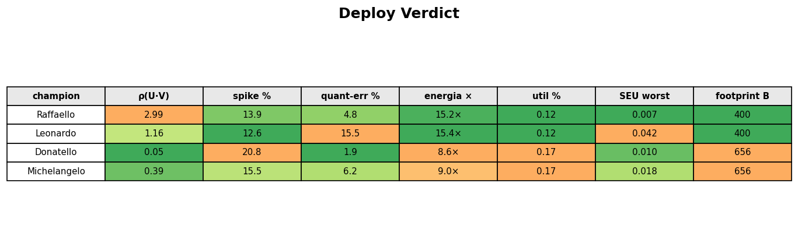
*I NUMERI REALI dietro il radar, una colonna per asse + footprint. Colorazione per RANGO (verde = migliore dei 4 su quella metrica, nessuna soglia arbitraria). Candidato deploy: Donatello (ρ minimo 0.05, quant robusto).*

*Radar di FPGA-readiness per champion (small-multiples). Ogni asse 0-1 con ANCORA esplicita fra parentesi (1 = ideale FPGA): ρ<1 (contrattivo), Fix-pt (quant po2 senza errore), Sparsità (poco firing), Energia (≥15× vs ANN), Timing (util≈0), SEU (0 bit critici). I valori numerici reali sono nella tabella successiva.*

## 1. Pesi Power-of-Two: il moltiplicatore che sparisce

Il cuore del co-design è la quantizzazione po2 (schema e razionale in HOW_IT_WORKS_v3 §15). Qui il lato hardware misurato: il moltiplicatore diventa un bit-shift → **0 DSP**; e l'istogramma po2_alphabet mostra la SPARSITÀ DEI PESI (sinapsi a valore 0 = eliminabili dal connettoma) — da non confondere coi neuroni morti (attività, §3): sono sinapsi che semplicemente non esistono in hardware.

Il footprint dei pesi è di 400-656 byte per champion (rank-8 vs rank-16): trascurabile vs la BRAM (§6). Il raggio spettrale ρ(U·V) (definizione in HOW §11) separa nettamente EventProp (contrattivo, ρ<1) da BPTT (espansivo, ρ>1): è il discriminante che rende gli EventProp sicuri in aritmetica a virgola fissa.

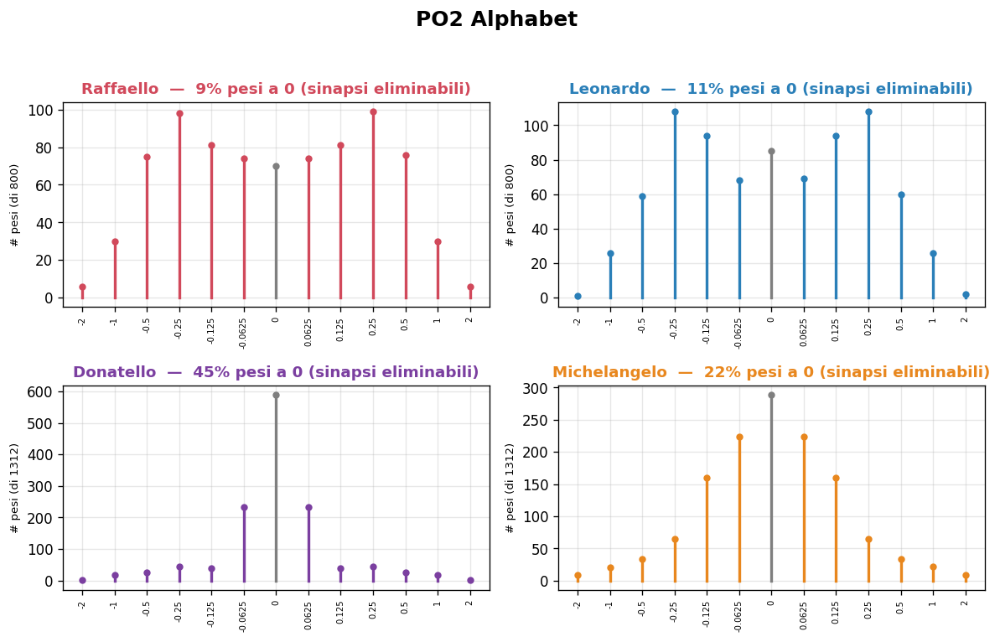
*Alfabeto po2 dei pesi (13 valori sign·2^k) per champion. "pesi a 0 = sinapsi eliminabili" è la potatura strutturale del connettoma (sinapsi a peso 0), NON neuroni morti. Il moltiplicatore è UNO di 13 valori → barrel-shifter, 0 DSP.*

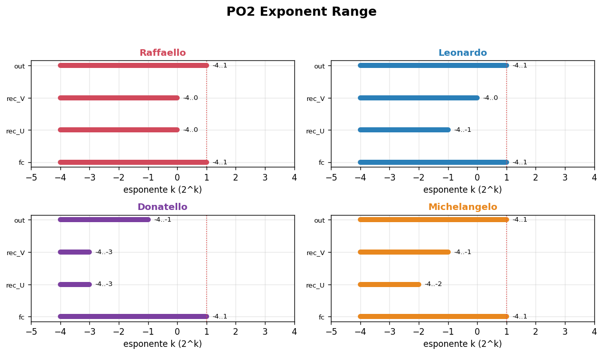
*Range di esponente po2 usato per matrice, per champion → numero di bit di esponente necessari.*

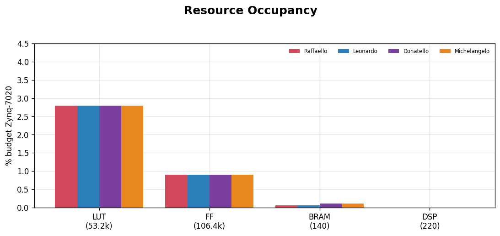
*Occupazione stimata del budget Zynq-7020 (LUT/FF/BRAM/DSP) per champion. BRAM reale (footprint pesi); LUT/FF stima; DSP = 0 (po2 → shift-add).*

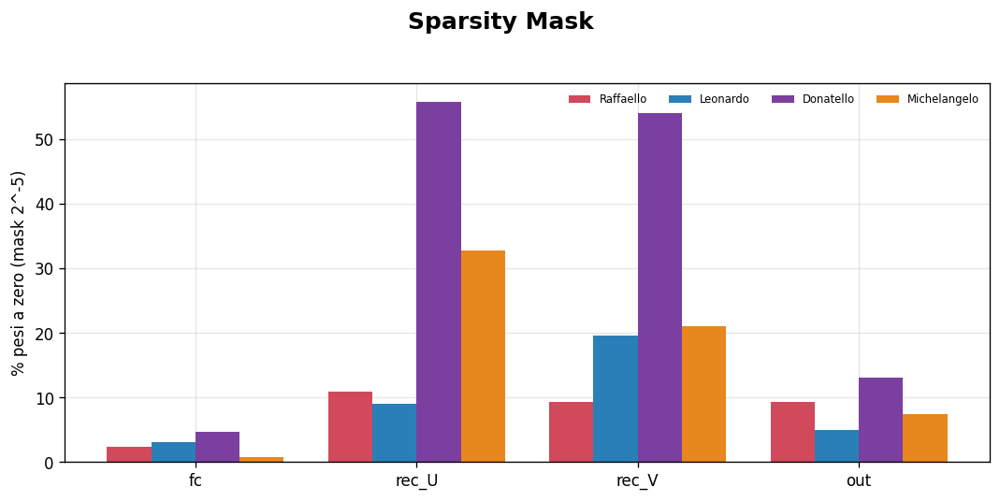
*% pesi a zero per matrice (fc / rec_U / rec_V / out), per champion: la sparsità strutturale del connettoma → sinapsi eliminabili in hardware.*

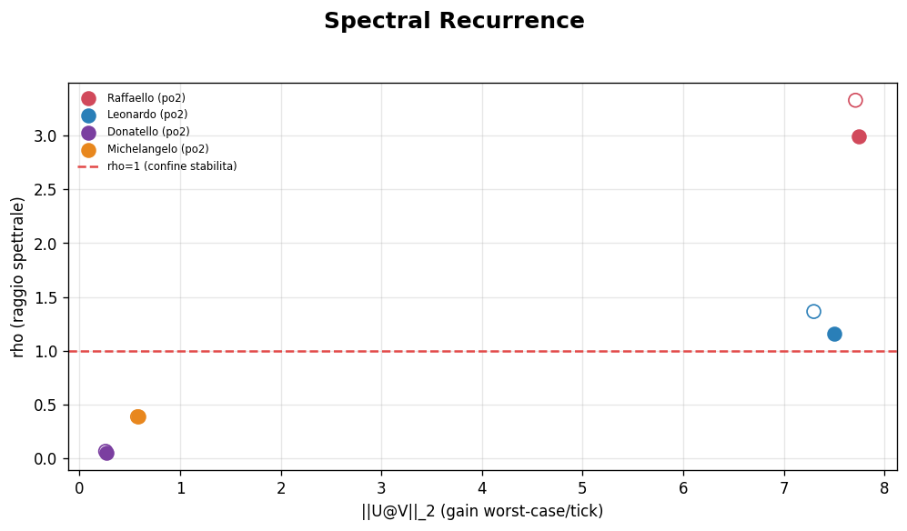
*Raggio spettrale ρ(U·V): pieno = po2, vuoto = float. ρ<1 (EventProp) = loop contrattivo, sicuro in fixed-point; ρ>1 (BPTT) = espansivo (rischio overflow). È IL discriminante di stabilità hardware.*

## 2. Fixed-point: formato Qm.n e robustezza alla quantizzazione

Ogni registro interno (potenziale, fatica, corrente ricorrente, uscita LI) riceve un formato Qm.n con gli interi dal RANGE MISURATO e i frazionari dal budget di bit. La rete tollera una quantizzazione aggressiva: l'errore di identificazione resta basso fino a pochi bit. Il punto fragile è la quantizzazione po2 di deploy: **Leonardo** ha l'errore po2 più alto (quant-err ~15-16%), gli altri restano bassi (Donatello ~2%).

Il caveat onesto: la curva quant_vs_bits è pienamente valida solo con re-training QAT; qui è una stima post-hoc. Il leak di membrana (bit-shift, cfr. HOW §15) con troppo pochi frac_bits manda il potenziale in sotto-flusso e lo blocca — un vincolo reale sul numero minimo di bit frazionari (figura leak_decay). Gli state-range sono catturati solo per i baseline (limite del profiler sulla variante EventProp, che non fa un forward per-step).

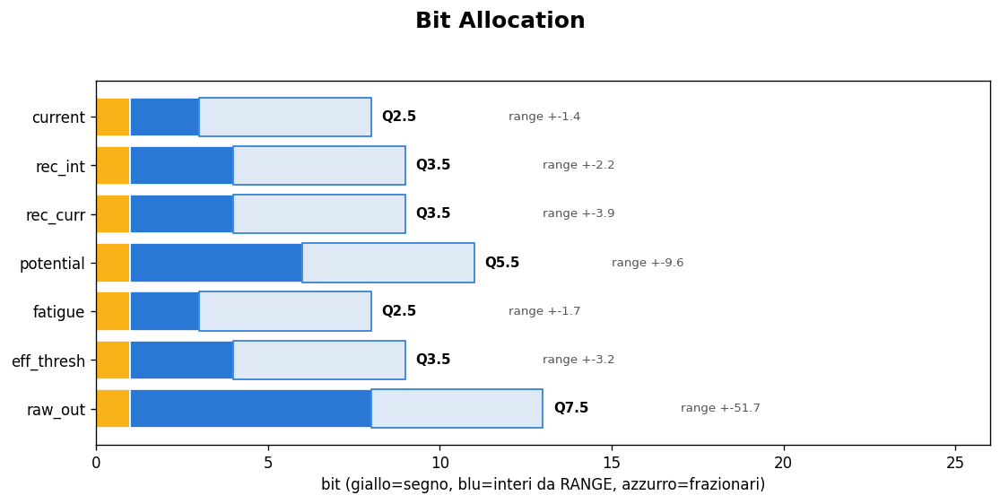
*Formato Qm.n per ogni stato interno (segno + interi dal RANGE MISURATO + frazionari). Solo baseline (gli stati non sono catturati per la variante EventProp — limite del profiler).*

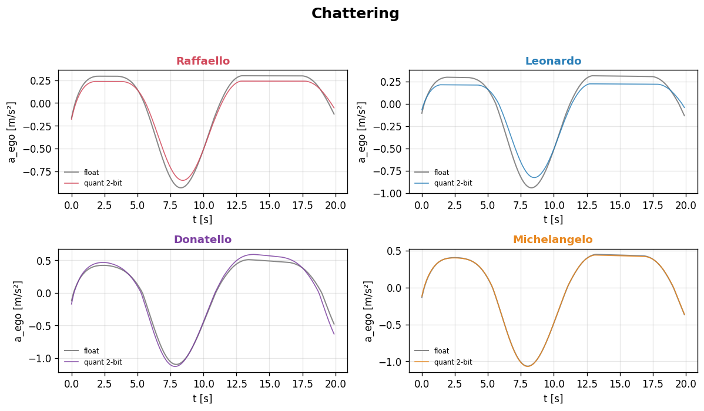
*Accelerazione closed-loop: float (liscia) vs parametri quantizzati a 2 bit (nervosa), per champion — stress test dell'instabilità da quantizzazione.*

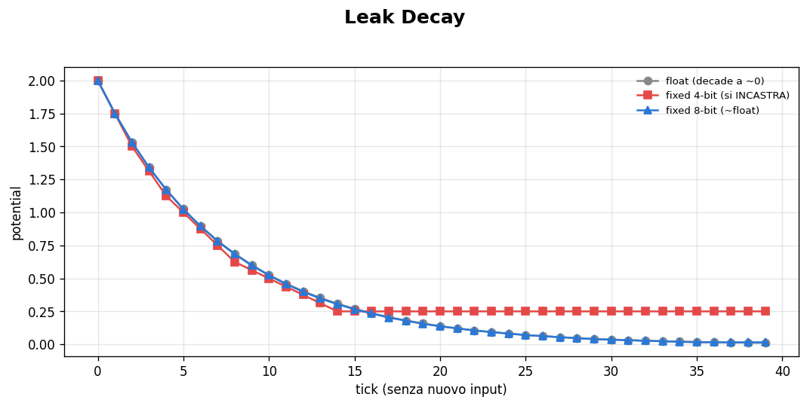
*Il leak di membrana è un bit-shift (V·7/8): con pochi frac_bits il potenziale va in sotto-flusso e resta BLOCCATO; con 8 bit ~ float.*

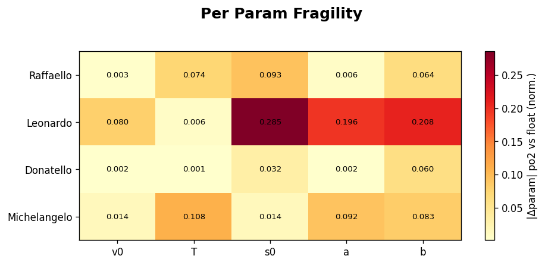
*Quale dei 5 parametri cede di più sotto quantizzazione po2, per champion.*

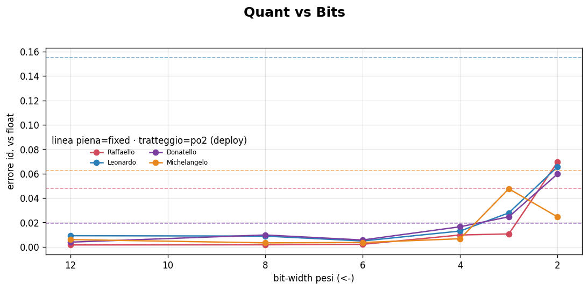
*Errore di identificazione vs bit-width dei pesi, per champion (linea piena = fixed Qm.n, tratteggio = po2 di deploy). La rete tollera pochi bit; Leonardo ha l'errore po2 più alto.*

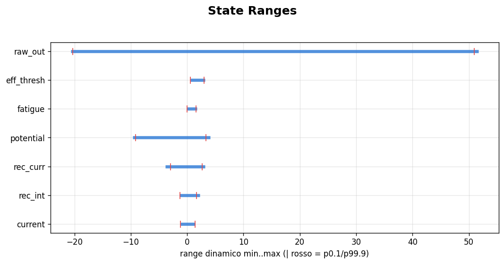
*Range dinamico min..max dei registri interni fixed-point (| rosso = p0.1/p99.9): il range fissa gli int_bits.*

## 3. Dinamica spiking: sparsità reale e salute della rete

La dinamica spiking sfata un equivoco: i champion **sparano ~13-21%** dei neuroni per tick, NON sono iper-sparsi (~1-2%). Il raster e la mappa di attività lo mostrano cross-champion. Questo è il dato corretto dopo il fix del bug n_ticks: il valore ~1.5% era un artefatto di calcolo (doppia divisione per n_ticks). NB: questi spike-rate (profiler op-count, finestra launch) differiscono di ~1-2 punti da VALIDATION §9.2 (evaluate a 6-tier; es. Donatello 20.8% qui vs 19.0% là) — stessa realtà, finestre/metodo di misura diversi.

Il picco di spike simultanei per tick dimensiona l'albero di accumulo (AC) in hardware; l'ISI minimo dà il worst-case back-to-back. La salute della rete è il vero discriminante: gli **EventProp hanno 0 neuroni morti**, i BPTT ~31% — la ricorrenza contrattiva e il gradiente esatto tengono viva l'intera popolazione.

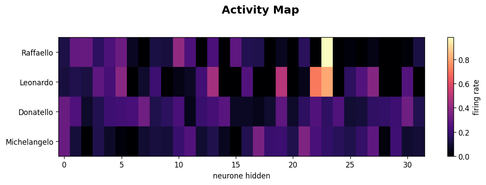
*Mappa di firing per neurone hidden, per champion: hotspot vs neuroni morti (rate 0).*

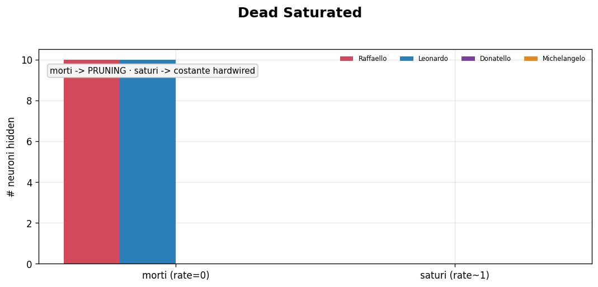
*Neuroni morti (rate 0) e saturi (rate ~1) per champion: gli EventProp hanno 0 morti, i BPTT ~31% — la salute della rete è un vantaggio del gradiente esatto.*

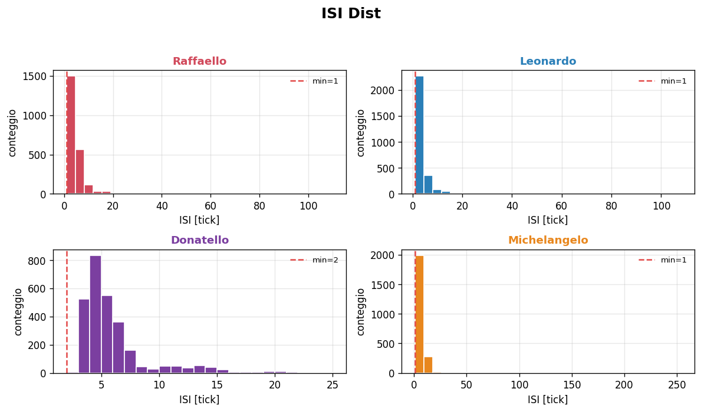
*Distribuzione degli inter-spike-interval, per champion: l'ISI minimo dà il worst-case back-to-back.*

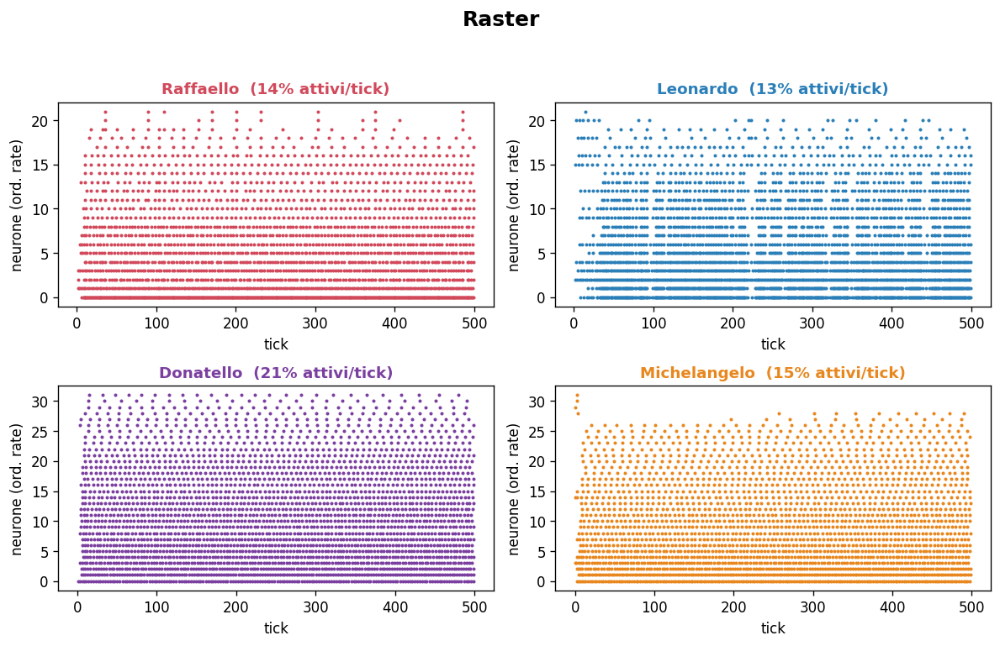
*Raster degli spike ordinato per firing-rate, tutti i champion (% attivi/tick fra parentesi). I champion sparano ~13-19% — NON sono iper-sparsi.*

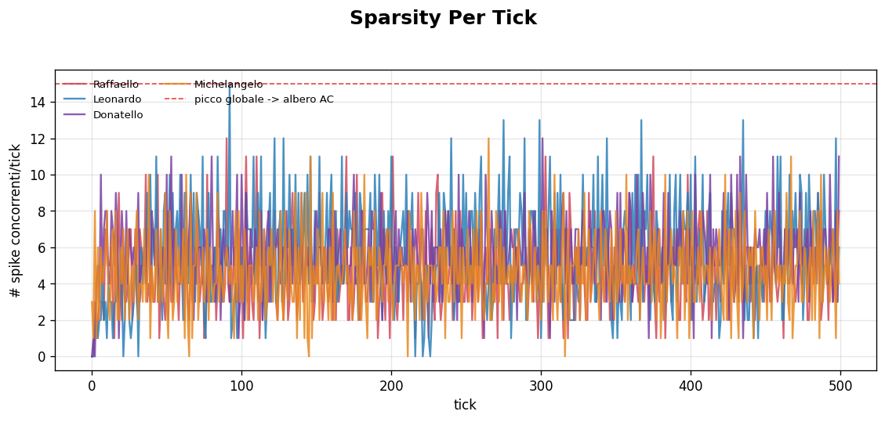
*Spike concorrenti per tick, per champion: il MAX simultaneo fissa la larghezza dell'albero di accumulo (AC).*

## 4. Energia: il vantaggio AC<MAC (e da dove NON viene)

Il vantaggio energetico vs una ANN densa è **~5.11-8.38×** (worst-case; fino a ~15× nel caso tipico). NON viene dalla sparsità: le SynOps eguagliano o superano i MAC dell'ANN. Viene dal minor costo unitario di un accumulo (AC) rispetto a una moltiplicazione-accumulo (MAC), amplificato su FPGA dai pesi po2 (AC = shift+add) e da 0 DSP.

Conseguenza contro-intuitiva: **Donatello**, il più contrattivo, spara di più (~20.8%) e ha quindi il vantaggio energetico più basso (~5.11×). Il breakdown mostra dove si spendono i pJ (la ricorrenza rec_V/rec_U domina nei rank-16); il grafico energy_vs_rate marca il rate operativo reale, ben dentro il regime denso, non quello iper-sparso.

Coerenza col gemello: VALIDATION_REPORT_v3 §9.2 riporta una stima più grossolana (~4.77-6.01×) dall'evaluate a 6-tier; qui il modello op-count distingue il worst-case (~5.11-8.38×) dal tipico (~9-15×). Stesso ordine di grandezza — e ben lontano dai 22-30× pre-fix del bug n_ticks.

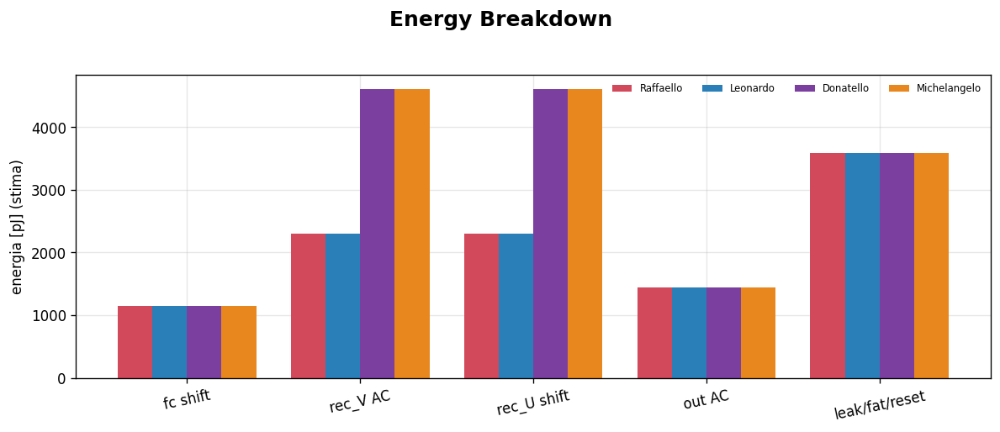
*Dove si spendono i pJ per champion (fc / rec_V / rec_U / out / non-sinaptiche).*

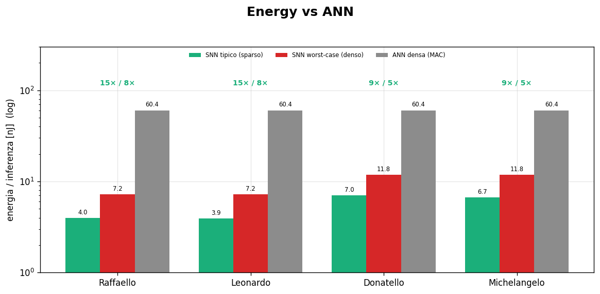
*Energia per inferenza: SNN tipico (sparso) vs SNN worst-case (denso) vs ANN densa (MAC), per champion, con il vantaggio ×. Il guadagno viene dal costo AC<MAC (0 DSP), NON dalla sparsità.*

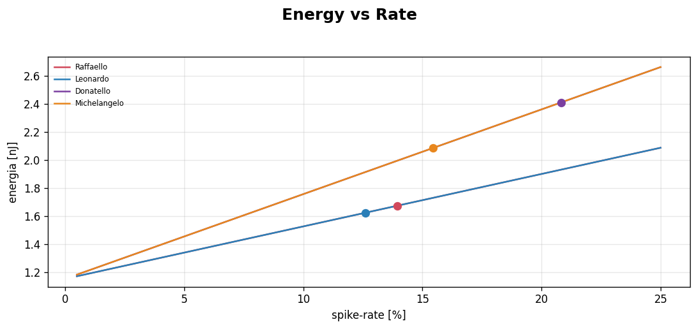
*Energia vs spike-rate: i pallini marcano il rate operativo reale (~13-19%) — i champion NON sono nel regime iper-sparso.*

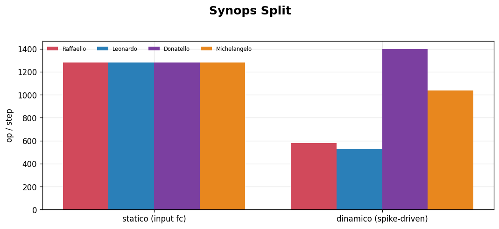
*Parte statica (input, sempre-on) vs dinamica (spike-driven) delle SynOps per champion → dove conviene il clock-gating.*

## 5. Timing / WCET: margine sul deadline e jitter zero

Il conteggio operazioni per tick è l'input del WCET e distingue rank-8 (baseline) da rank-16 (EventProp) sui rami ricorrenti. Su qualunque delle 4 architetture HW considerate, il tempo di inferenza è di pochi µs contro un **deadline di controllo di 100 ms**: il margine è enorme (utilizzo ~0.1%). Il budget di 100 ms è la leva che permette di ottimizzare per AREA (CORDIC iterativo, DSP≈0) invece che per velocità.

Proprietà preziosa per un sistema safety: **WCET == BCET**. Il numero di operazioni è costante a ogni spike-rate (worst-case), quindi il jitter di calcolo è nullo — un vantaggio di determinismo temporale rispetto a un'esecuzione data-dependent.

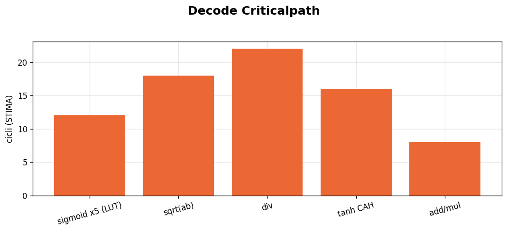
*STIMA del datapath del decode ACC-IIDM (sqrt/div/sigmoid/tanh) in PL: CORDIC iterativo (shift-add, DSP≈0) sul budget di 100 ms.*

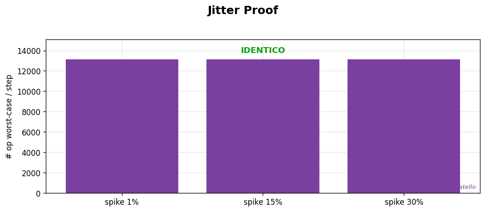
*WCET == BCET: il numero di operazioni è costante a ogni spike-rate → jitter di calcolo = 0 (esemplare: Donatello).*

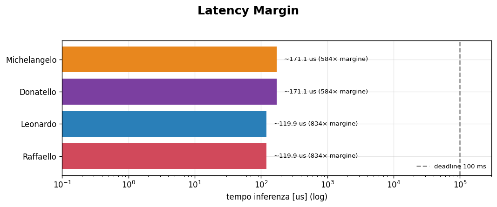
*Tempo di inferenza vs deadline di controllo 100 ms, per champion: margine enorme (util ~0.1%).*

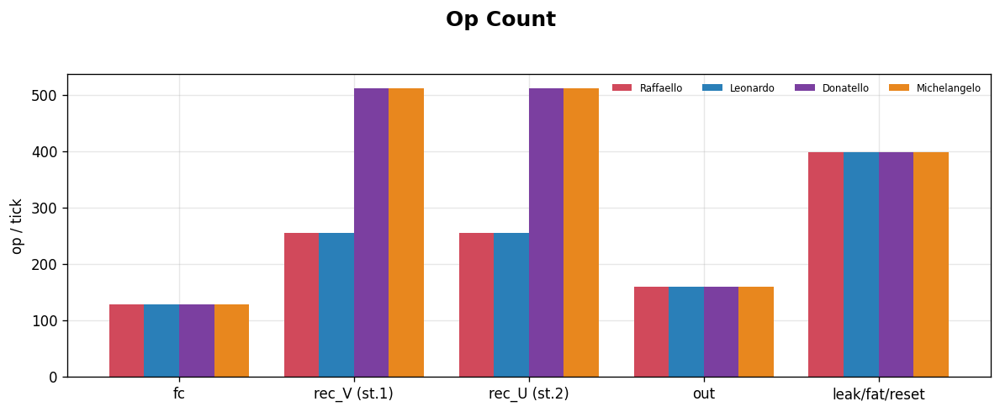
*Conteggio operazioni per tick (input del WCET), per champion: si vede la differenza rank-8 (baseline) vs rank-16 (EventProp) sui rami ricorrenti.*

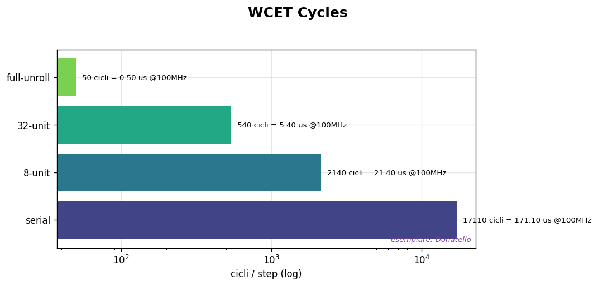
*Cicli e µs per inferenza secondo 4 architetture HW (esemplare: Donatello; datapath simile fra champion).*

## 6. Risorse e DSE: 0 DSP, <1% BRAM

Il conto delle risorse è netto: **0 DSP** (ogni operazione è AC o shift-add, nessun moltiplicatore) e **<1 BRAM su 140** per la memoria pesi (<1% del budget). Lo spazio di design (DSE) mostra il trade-off area↔latenza al variare del parallelismo: con 100 ms di budget conviene la variante seriale, minima in area.

Le stime di area LUT/FF (area_model) sono pre-sintesi e vanno confermate in Fase B (Vivado); la BRAM e il conteggio operazioni sono invece reali.

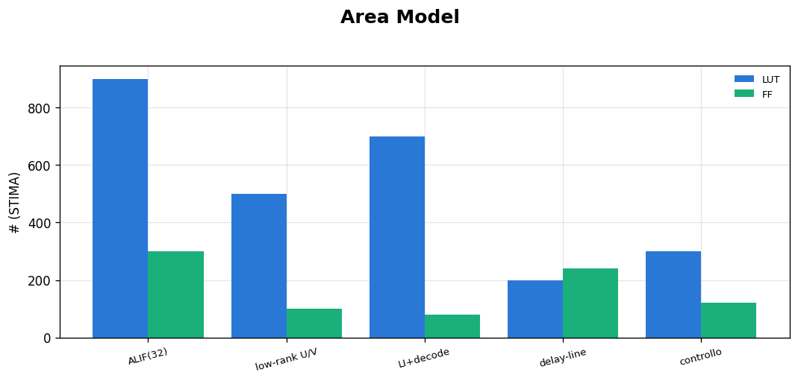
*STIMA dell'area (LUT/FF) al variare del parallelismo — da confermare in sintesi (Fase B).*

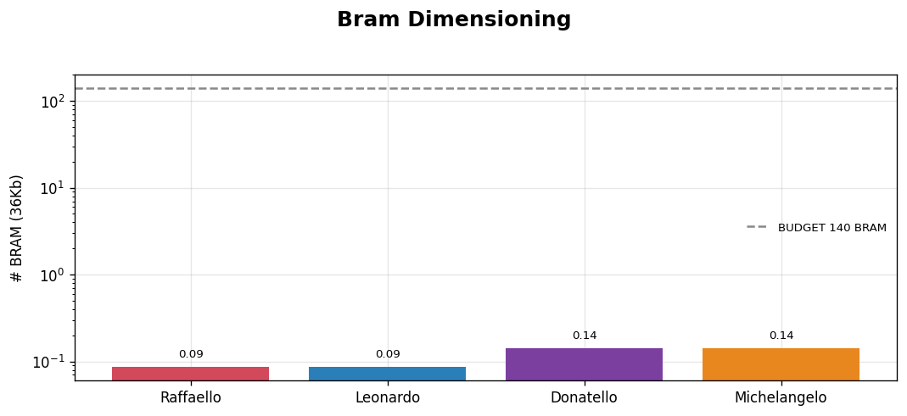
*Memoria pesi per champion: <1 BRAM su 140 (<1% del budget).*

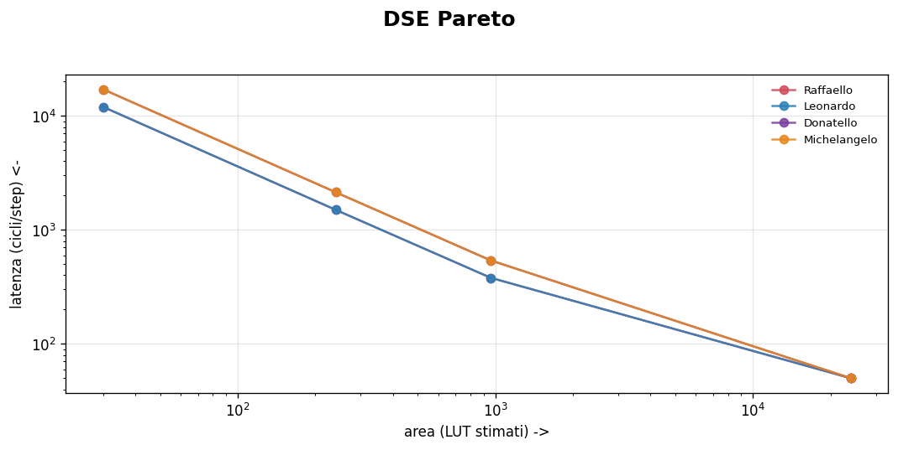
*Trade-off area↔latenza per grado di parallelismo, per champion (latenza reale, area STIMA).*

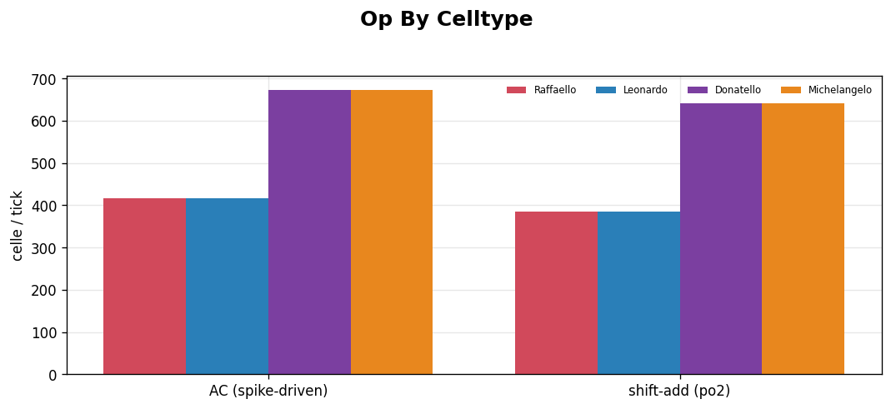
*Operazioni per tipo di cella (AC spike-driven vs shift-add po2) per champion: nessun moltiplicatore → 0 DSP.*

## 7. SEU / ISO 26262: robustezza ai bit-flip e TMR mirato

La robustezza ai Single Event Upset (un neutrone atmosferico che inverte un bit nella memoria pesi) è profilata via fault-injection software: si decodifica il peso po2, si inverte un bit, si riesegue l'identificazione. La mappa di sensibilità e la criticità per bit dicono quali bit dominano il rischio (l'esponente-MSB e il segno) → ECC mirata invece che totale.

La curva degrade_vs_flips mostra 0 collisioni fino a 8 bit-flip accumulati per tutti e 4 i champion → il periodo di scrubbing può essere rilassato. **Leonardo** è il più fragile ai SEU. Il confronto hidden vs readout indica dove concentrare il TMR (il readout, più critico). Le stime di overhead TMR sono di progetto (da validare in sintesi).

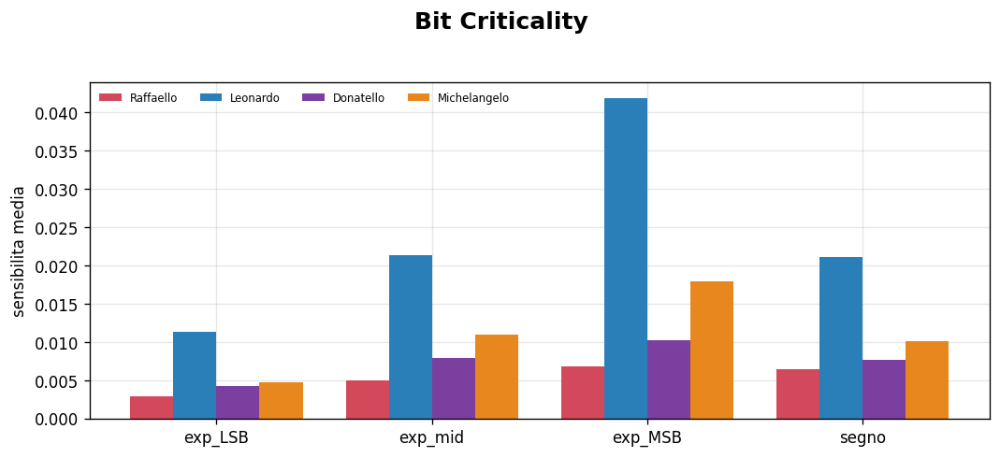
*Quali bit (esponente-LSB/mid/MSB, segno) dominano il rischio SEU, per champion → ECC mirata.*

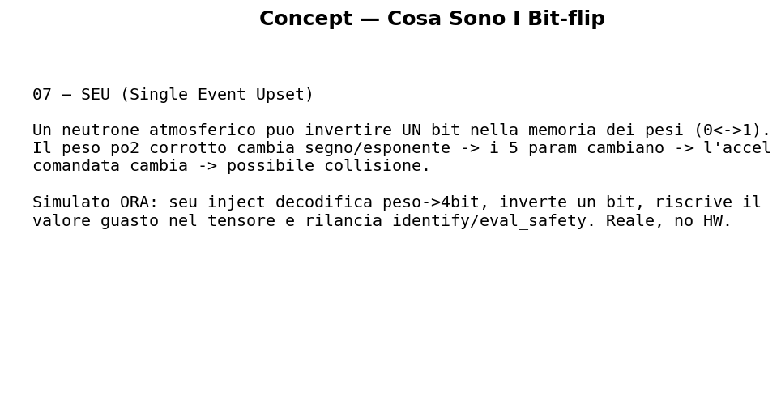
*Concetto: un Single Event Upset (SEU) inverte UN bit nella memoria dei pesi po2 → i 5 parametri cambiano → l'accelerazione cambia → possibile collisione. Simulato via seu_inject (reale, no HW).*

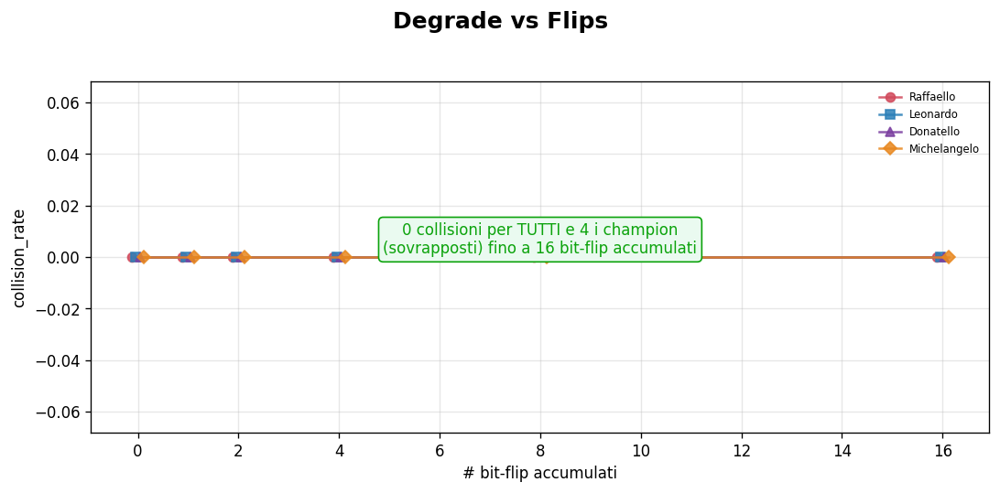
*Collisione closed-loop vs numero di bit-flip accumulati, per champion: 0 collisioni fino a 8 flip (i 4 champion sovrapposti a 0) → periodo di scrubbing.*

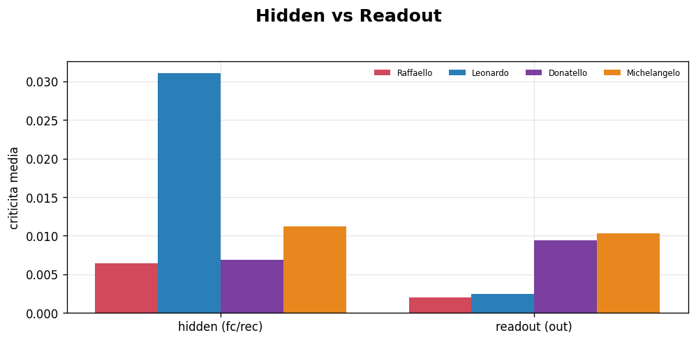
*Criticità SEU media hidden (fc/rec) vs readout (out), per champion → dove concentrare il TMR (il readout è più critico?).*

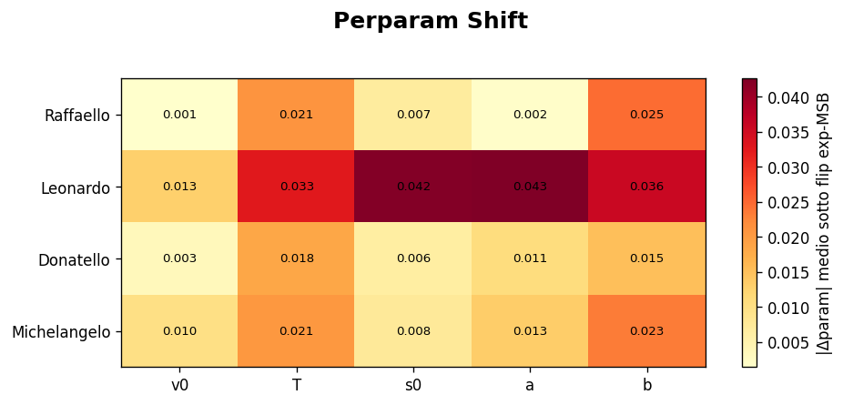
*Spostamento per-parametro sotto SEU, per champion: quale parametro è più esposto.*

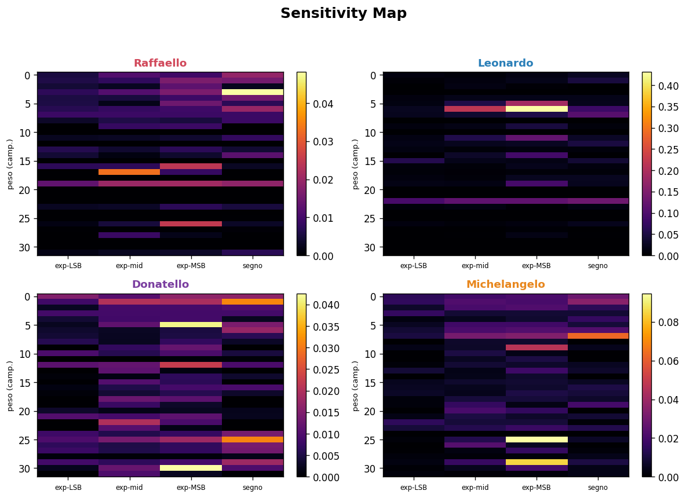
*Δ errore-di-identificazione invertendo 1 bit di un peso (heatmap), per champion: quali bit/pesi sono critici.*

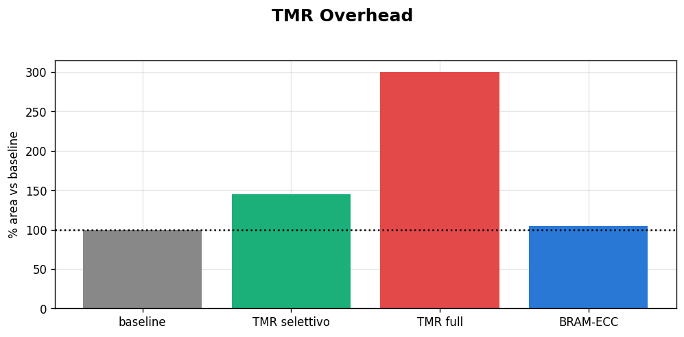
*STIMA del costo del Triple Modular Redundancy (TMR) selettivo sul readout vs protezione totale.*

## 8. I/O e Hardware-in-the-Loop: canale V2X e code

Il lato I/O modella il canale V2X e le code di ingresso. La superficie AoI (Age-of-Information) dà l'età massima tollerabile di un CAM prima che la guida diventi insicura, sul piano gap×Δv. Il messaggio chiave, coerente col report di validazione: la robustezza alla perdita di pacchetti è dell'HANDLER "hold-last", NON della rete — senza handler la collisione esplode.

Il dimensionamento della coda RX (M/M/1/K) dà il buffer minimo anti-burst dei messaggi; la curva PDR mostra il "ginocchio" oltre cui la perdita pacchetti diventa pericolosa. Queste figure combinano dati reali (comportamento della rete) e stime di modello (coda).

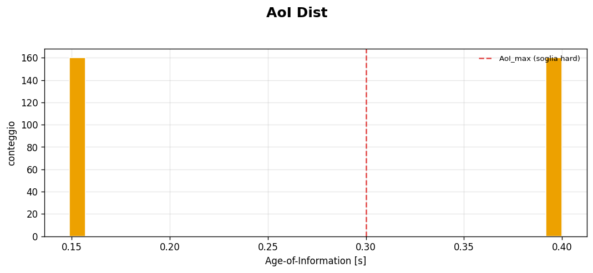
*Distribuzione dell'Age-of-Information sotto perdita/ritardo dei pacchetti V2X.*

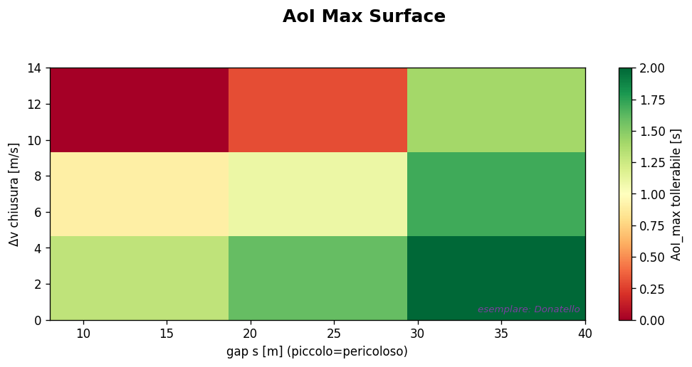
*Età MAX tollerabile del CAM V2X (AoI) sul piano gap×Δv oltre cui la guida è insicura (verde = tollera di più; esemplare: Donatello).*

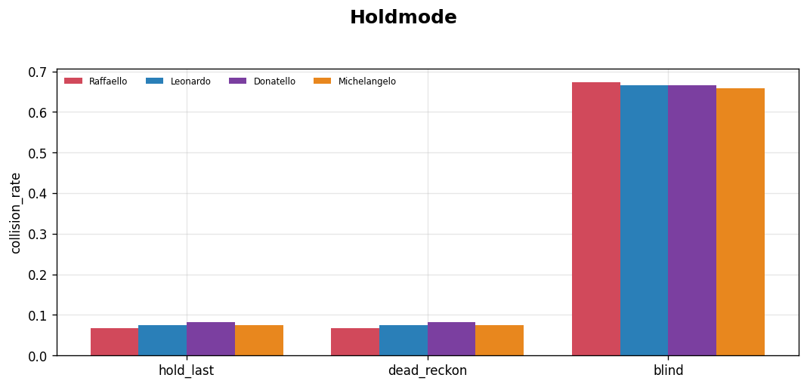
*Confronto degli handler di pacchetti mancanti (hold-last / dead-reckon / blind): la robustezza V2X è dell'HANDLER, non della rete.*

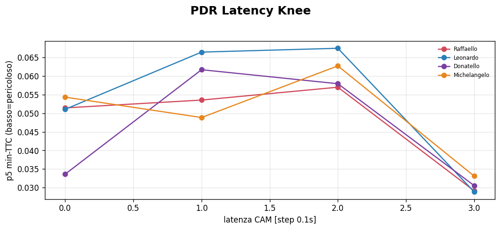
*Curva collisione vs Packet Delivery Ratio / latenza V2X: il "ginocchio" oltre cui perdita e ritardo dei pacchetti CAM diventano pericolosi per la guida.*

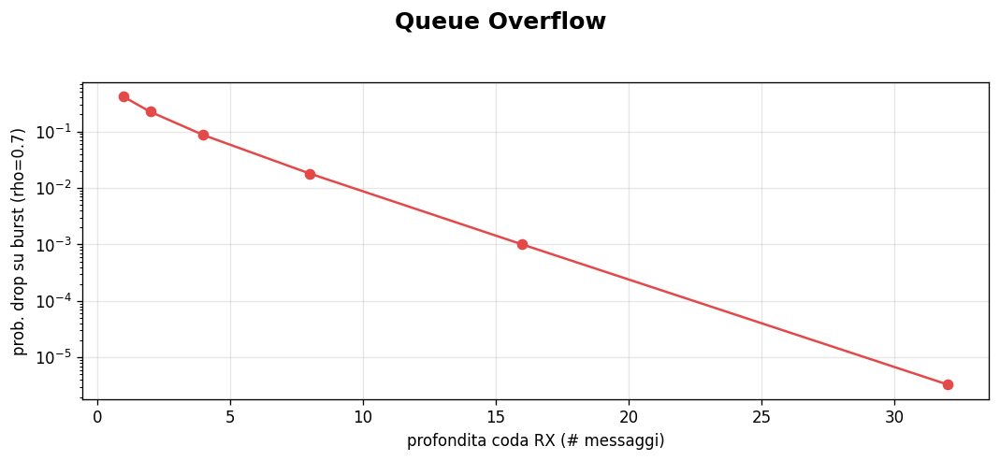
*Probabilità di drop su burst vs profondità della coda RX (M/M/1/K, STIMA): buffer minimo anti-burst dei messaggi CAM.*

## 9. Termico: derating (stime pre-sintesi)

La sezione termica è interamente di STIMA (🟡): il derating di Fmax con la temperatura di giunzione e il budget termico sullo Zynq-7020. Servono a impostare i margini, ma i numeri reali arriveranno solo dalla sintesi e dalla misura su board (Fasi B/C). Sono inclusi marcati come stime, non come risultati.

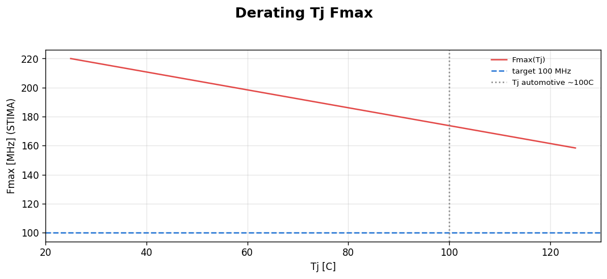
*STIMA: Fmax vs temperatura di giunzione Tj — a caldo il clock scende, resta headroom sul target a 100 °C?*

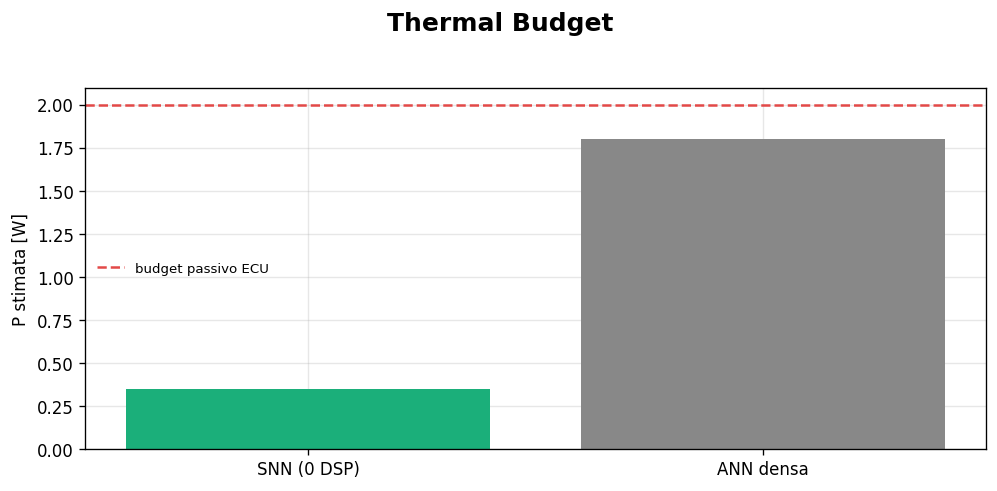
*STIMA del budget termico (potenza vs dissipazione) sullo Zynq-7020.*

## Verdetto e prossimi passi

Sul profilo pre-silicio il candidato al deploy è **Donatello** (EventProp): ricorrenza contrattiva (ρ≈0.051 → fixed-point sicuro), quantizzazione po2 robusta, 0 neuroni morti, timing e risorse soddisfatti con margine enorme (0 DSP, <1% BRAM, µs vs 100 ms). Il rovescio onesto: essendo il più attivo (~20.8% firing) ha il vantaggio energetico più basso (~5.11×); e **Leonardo** resta il più fragile su quantizzazione e SEU.

> **Nota.** Cosa è REALE e cosa è STIMA. Reali (🟢): readiness, pesi po2, spiking, energia (modello Horowitz), op-count/timing, footprint/BRAM, SEU (fault-injection SW). Stime (🟡/🔴): area LUT/FF, datapath del decode, overhead TMR, coda RX, termico. Le stime si confermano solo in Fase B (sintesi Vivado → LUT/FF/DSP/Fmax reali) e Fase C (FPGA-in-the-Loop → potenza/latenza/SEU su silicio).

## Riproducibilità e mappa dei file

| Cosa | Dove |
|---|---|
| Figure e CSV FPGA (45 figure, 10 sez.) | results/evaluate/FPGA/ |
| Generatore figure (dati reali) | scripts/fpga_figures.py |
| Librerie Fase A | utils/{weight_profiler,state_profiler,latency_model,seu_inject,io_hil}.py |
| Notebook FPGA-evaluate | Eval_FPGA.ipynb |
| Verifica manifest post-run | scripts/verify_fpga_eval.py |
| Questo report (generatore) | scripts/build_fpga_report.py |
| Design e framework della valutazione | document/FPGA_EVALUATE_DESIGN.md / FPGA_EVALUATION_FRAMEWORK.md |
| Teoria della rete (gemello) | document/HOW_IT_WORKS_v3.md |
| Risultati di validazione (gemello) | document/VALIDATION_REPORT_v3.md (§9 = sommario FPGA) |
