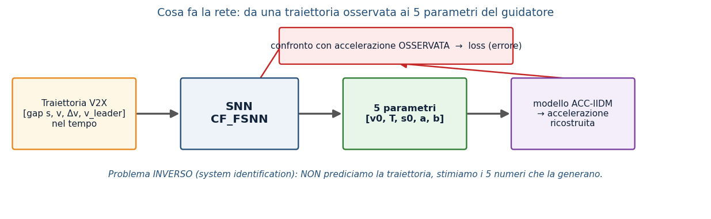
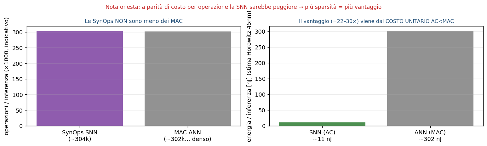
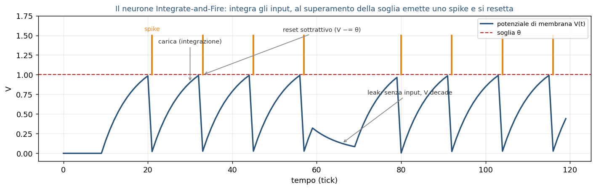
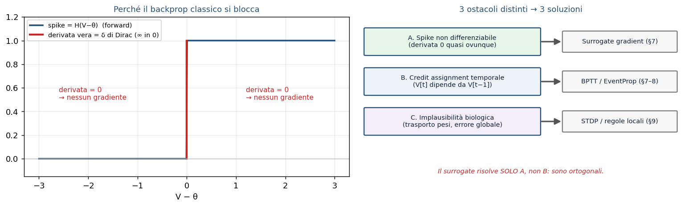
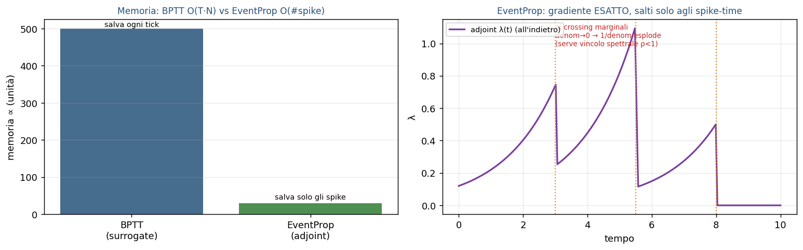
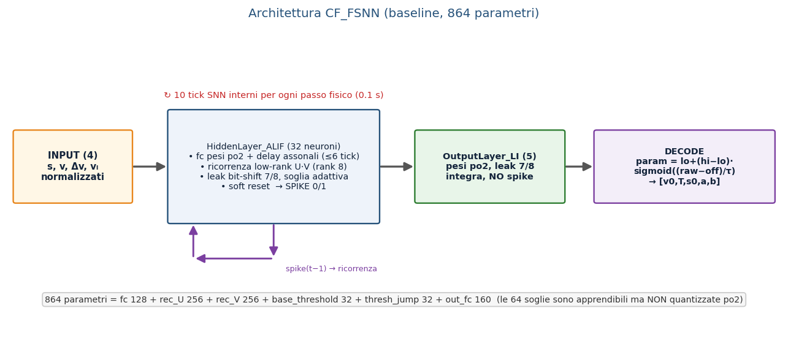
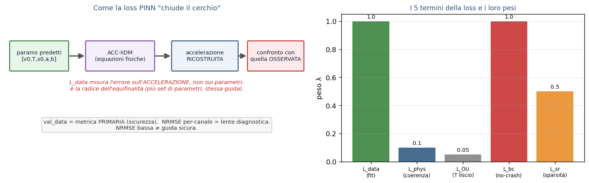
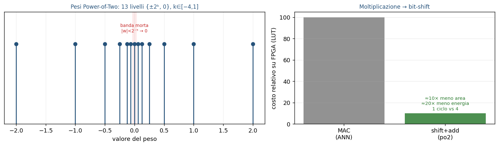

# CF_FSNN — Come Funziona (v3)

> **La rete spiega se stessa: SNN vs ANN, addestramento (BPTT, EventProp, STDP), l'architettura del progetto, l'approccio PINN e il co-design per FPGA**

> Versione: 2026-07-01  (branch EventProp_Study) — supersede HOW_IT_WORKS.md (v1) e _v2  
> Documento gemello: VALIDATION_REPORT_v3 spiega i RISULTATI; questo spiega LA RETE  
> Fondato sul codice live (core/network.py, neurons.py, hardware.py, eventprop.py, train.py)  
> Lettore atteso: ingegnere che parte da zero sulle SNN e vuole piena coscienza in ~45 minuti  

---

## Parte I — Cos'è una SNN e come si addestra

### 0. Bussola: il problema, i 3 concetti-chiave, i documenti gemelli

CF_FSNN risolve un PROBLEMA INVERSO. Non prevede dove andrà l'auto: osserva una traiettoria di car-following (gap dal veicolo davanti, velocità propria, differenza di velocità Δv, velocità del leader — tutto via V2X) e ne IDENTIFICA i 5 numeri che la generano, cioè i parametri del modello di guida ACC-IIDM: [v0, T, s0, a, b]. Questa distinzione va tenuta a mente per tutto il documento: tutto ciò che segue (loss, identificabilità, metriche) ha senso solo alla luce del fatto che stimiamo PARAMETRI, non traiettorie.

*Figura 0.1 — Il problema inverso. La SNN mappa la traiettoria osservata nei 5 parametri; questi, immessi nel modello fisico ACC-IIDM, ricostruiscono l'accelerazione, che viene confrontata con quella osservata per formare la loss.*

Una SNN (Spiking Neural Network) ha 3 proprietà irriducibili che la distinguono da una rete classica (ANN): (1) DINAMICA TEMPORALE — ogni neurone ha uno stato interno che persiste e integra gli input nel tempo; (2) COMPUTAZIONE SPARSA A EVENTI — comunica con impulsi (spike) e l'energia è proporzionale al numero di spike, non di moltiplicazioni; (3) ATTIVAZIONE NON DIFFERENZIABILE — lo spike è un gradino (0/1), la cui derivata è nulla quasi ovunque. Queste tre proprietà generano tutto il resto: la terza obbliga a reinventare l'addestramento (Parte I), le prime due giustificano le scelte hardware (Parte II).

> **Nota.** Filo conduttore. Ogni decisione di progetto vive in un TRIANGOLO con tre vertici in tensione: bio-realismo ↔ addestrabilità ↔ efficienza hardware. Guadagnare su un vertice costa sugli altri. Torneremo su questo triangolo alla fine (§17) per rileggere tutte le scelte come punti in questo spazio.

> **Nota.** Documenti gemelli. Questo documento (HOW_IT_WORKS_v3) spiega LA RETE. Il suo gemello VALIDATION_REPORT_v3 spiega i RISULTATI (4 champion, verdetto di deploy, 15 dimensioni di validazione). Quando qui incontri ρ(U·V), ALIF, po2, EventProp, sparsità — il report li USA dando per scontato che tu li conosca; è qui che li fondiamo.

### 1. Le tre generazioni di reti neurali

Una SNN è la "terza generazione" di rete neurale (Maass, 1997). 1ª generazione: il percettrone (McCulloch-Pitts), unità a soglia con uscita binaria, nessuna nonlinearità continua. 2ª generazione: le ANN moderne (sigmoid, ReLU) — ogni unità emette un VALORE REALE ad ogni forward pass, ed è differenziabile ovunque, per questo si addestrano con la backpropagation. 3ª generazione: le SNN — l'unità comunica con SPIKE (eventi discreti) nel TEMPO continuo; il tempo non è un semplice indice di layer ma parte della rappresentazione. Un singolo spike temporizzato può, in teoria, codificare più informazione di un valore rate-based, e su hardware neuromorfico l'energia scala con gli eventi.

> **Nota.** Equivoco da evitare: "terza generazione" NON significa "più accurata". Significa un ASSE DI OTTIMIZZAZIONE diverso — energia, latenza, idoneità al silicio — spesso pagato con un po' di accuratezza. Su una GPU, per questo stesso compito, un MLP sarebbe più semplice e preciso; il valore della SNN sta nel target FPGA.

### 2. ANN vs SNN su assi multipli

Il confronto non va fatto su un solo asse ("le SNN sono più efficienti"): differiscono su almeno sei assi indipendenti, e ognuno ha una conseguenza concreta per CF_FSNN.

| Asse | ANN (2ª gen.) | SNN (3ª gen.) | Implicazione per CF_FSNN |
|---|---|---|---|
| Unità di comunicazione | valore reale per layer | treno di spike 0/1 nel tempo | output leggibile solo integrando i spike |
| Stato / memoria | stateless per campione | potenziale di membrana persistente | nativamente adatta a serie temporali (traiettorie) |
| Computazione | MAC densi sincroni | accumulo + confronto soglia, event-driven | energia ∝ spike; sparsità ~1–2% |
| Differenziabilità | end-to-end | gradino di Heaviside (non diff.) | serve surrogate / EventProp (§6–8) |
| Hardware ideale | GPU / TPU (matmul densa) | neuromorfico / FPGA (memoria-vicino-calcolo) | target PYNQ-Z1; pesi po2 → shift |
| Dati nativi | tensori densi | eventi / serie temporali | input V2X sequenziale |

*Figura 2.1 — Neurone ANN vs neurone spiking. La differenza strutturale non è "reale vs binario", ma la presenza di uno STATO che evolve nel tempo e di una soglia non differenziabile.*

Una precisazione che il report dà per scontata e che conviene anticipare qui: il vantaggio energetico delle SNN NON viene dalla sparsità in sé. Le operazioni sinaptiche (SynOps, l'analogo spiking dei MAC) di questa rete eguagliano o superano i MAC di una ANN equivalente; a parità di costo per operazione la SNN sarebbe anzi peggiore. Il guadagno viene dal minor costo unitario di un ACCUMULO (AC) rispetto a una MOLTIPLICAZIONE-ACCUMULO (MAC) — e su FPGA con pesi potenze-di-due l'AC diventa un semplice shift+add. Ne segue la regola: più sparsità = più vantaggio. Il payoff energetico stimato è ~22-30x rispetto a una ANN equivalente (quantificato in §16).

*Figura 2.2 — Perché la SNN è più efficiente pur facendo lo stesso numero (o più) di operazioni: il costo unitario AC < MAC. La sparsità amplifica il margine, non lo crea.*

### 3. Dal neurone biologico al neurone LIF

Il neurone artificiale spiking è un'astrazione minimale del neurone biologico. In 5 fatti: la membrana si comporta come un condensatore che accumula carica; gli input sinaptici la caricano (integrazione); la membrana perde carica nel tempo (LEAK, con costante di tempo τ) — cioè il neurone "dimentica" gli input vecchi; al superamento di una SOGLIA emette un impulso (spike / potenziale d'azione); dopo lo spike si RESETTA. Questo è il modello Integrate-and-Fire con leak (LIF). Non serve il realismo completo della biofisica (Hodgkin-Huxley, 4 equazioni differenziali per i canali ionici): l'obiettivo è la computazione e l'energia, non riprodurre l'elettrofisiologia.

*Figura 3.1 — Dinamica di un neurone LIF: l'input carica il potenziale, il leak lo fa decadere in assenza di stimolo, al superamento della soglia si genera uno spike e il potenziale si riduce (reset sottrattivo).*

### 4. La gerarchia dei modelli e perché CF_FSNN usa ALIF

I modelli di neurone formano una gerarchia di "spogliazione" progressiva: più si scende, meno dettaglio biologico e più addestrabilità/velocità. Dall'alto: Hodgkin-Huxley (4 ODE) → AdEx (2 ODE) → Izhikevich (2 ODE, 20 pattern di scarica) → ALIF (LIF + soglia adattiva) → LIF (1 ODE + reset) → IF (integratore puro). La regola pratica: immagini statiche → LIF; compiti sequenziali/con memoria lunga → ALIF/LSNN; neuroscienza → Izhikevich/AdEx; biofisica → HH.

*Figura 4.1 — Gerarchia dei neuroni (sx) e comportamento ALIF vs LIF (dx). L'ALIF alza la soglia a ogni spike (fatica) e poi la lascia decadere, riducendo la frequenza di scarica nel tempo.*

CF_FSNN usa ALIF (Adaptive Leaky Integrate-and-Fire): un LIF con una variabile di adattamento in più — una FATICA che alza temporaneamente la soglia effettiva a ogni spike e poi decade. Nel codice: soglia_effettiva = base_threshold + fatica, con base_threshold e thresh_jump (l'incremento per spike) entrambi apprendibili, con init base_threshold=1.5 e thresh_jump=0.5. Perché ALIF e non LIF puro? Tre ragioni, tutte di addestrabilità/hardware, non ornamentali: (1) il car-following è un problema temporale che beneficia di una memoria a due scale (veloce = membrana, lenta = fatica); (2) la fatica REGOLA la sparsità del firing e stabilizza il training — è documentato che azzerando thresh_jump il training ESPLODE, che l'ottimo è ~0.5 e che valori più alti causano underfit; (3) aggiunge solo 2 stati per neurone, resta economica su FPGA.

> **Nota.** Costo onesto di ALIF: complica sia l'addestramento con EventProp (la soglia adattiva aggiunge una dinamica di cui tenere conto nell'adjoint) sia la conversione in HDL — gli strumenti standard (FINN) non supportano il neurone ALIF (vedi §16). E un valore di soglia iniziale troppo alto negli strati non-input può "spegnere" i neuroni: la taratura conta.

### 5. Codifica neurale: input continuo, spiking interno (sezione ad alto rischio di equivoci)

Come entrano ed escono i numeri da una rete a impulsi? Esistono molti schemi di codifica (rate coding = conteggio spike in una finestra; temporale = i tempi precisi degli spike; time-to-first-spike; popolazione; fase; burst). MA — ed è l'equivoco numero uno da prevenire — in CF_FSNN l'INPUT NON è codificato in spike. I 4 segnali V2X, normalizzati in [0,1], entrano come CORRENTE DIRETTA (I = W·x): sono iniettati nel potenziale, non convertiti in treni di impulsi Poisson o a latenza. Solo lo strato nascosto ALIF spara; lo strato di uscita è un integratore continuo (LI = Leaky Integrator) SENZA spike. La rete è quindi IBRIDA: continuo → spiking → continuo.

*Figura 5.1 — Il percorso del segnale. Continuo in ingresso (corrente diretta), spiking solo nell'hidden ALIF, continuo in uscita (LI). Ogni passo fisico da 0.1 s è elaborato con 10 tick SNN interni a input costante — tempo di "assestamento", non nuova informazione.*

Due conseguenze. (a) L'output si legge dal POTENZIALE dell'ultimo strato LI (voltage decoding), non da un conteggio di spike: a soli 10 tick il rate coding sarebbe troppo rumoroso, il voltage decoding è più stabile e a bassa latenza. (b) I 10 tick interni per ogni passo NON portano nuova informazione, ma decuplicano la profondità temporale reale vista dall'addestramento (una traiettoria di 50 passi diventa una catena di 500 tick) — un aggravante per il problema che vediamo ora. Da evitare anche l'equivoco opposto: non è "una ANN col leak", perché l'hidden ha soglia vera, reset e non-differenziabilità.

### 6. Perché il backprop classico NON può funzionare

Addestrare significa calcolare come cambiare ogni peso per ridurre l'errore — cioè il gradiente della loss rispetto ai pesi. Su una SNN, tre ostacoli DISTINTI lo impediscono, e ognuno richiede una soluzione diversa.

*Figura 6.1 — A sinistra: lo spike è un gradino di Heaviside, la cui derivata è zero quasi ovunque (e infinita sulla soglia) → il gradiente che torna indietro è nullo, la rete non impara. A destra: i tre ostacoli e le tre soluzioni corrispondenti.*

Ostacolo A — NON DIFFERENZIABILITÀ (spaziale): la derivata del gradino è nulla quasi ovunque, il gradiente si annulla e nessun peso si aggiorna. Ostacolo B — CREDIT ASSIGNMENT TEMPORALE: poiché lo stato V[t] dipende da V[t−1], per attribuire l'errore bisogna propagarlo all'indietro nel tempo (Backpropagation Through Time, BPTT), su una profondità reale di seq_len × 10 tick — con i noti rischi di gradiente che svanisce o esplode e un costo di memoria O(T·N). Ostacolo C — IMPLAUSIBILITÀ BIOLOGICA: il backprop richiede trasporto simmetrico dei pesi e un segnale d'errore globale, assenti nel cervello (rilevante per l'apprendimento on-chip). La mappa è: A → surrogate gradient (§7); B → BPTT ed alternative come EventProp (§8); C → STDP e regole locali (§9).

> **Nota.** Distinzione critica, spesso confusa: il surrogate gradient risolve SOLO l'ostacolo A (la non-differenziabilità), NON il B (il credit assignment temporale). Sono ortogonali: si usa il surrogate DENTRO il BPTT.

### 7. Metodo 1 — Surrogate gradient + BPTT (l'addestramento di produzione)

L'idea è uno Straight-Through Estimator: nel FORWARD si usa lo spike vero (gradino di Heaviside), ma nel BACKWARD si finge che la funzione sia liscia, sostituendo la derivata inesistente con una curva a campana centrata sulla soglia. È lo stesso principio dello STE usato per i pesi po2 (§15). Nel codice la surrogata è 1/(1+γ|V−θ|)² con γ=1.0 (era 0.3): un kernel più stretto fa contribuire al gradiente meno neuroni vicini alla soglia, riducendo l'amplificazione attraverso la ricorrenza U·V su 500–1000 tick (≈ seq_len 50–100 passi × 10 tick interni).

*Figura 7.1 — Il trucco del surrogate gradient: il forward resta un gradino binario, il backward usa una campana liscia. Con γ=1.0 (verde) il kernel è più stretto che con γ=0.3, quindi meno neuroni "near-soglia" sommano il loro gradiente → meno rischio di esplosione.*

> **Nota.** Fatto controintuitivo (dal codice): il backward della surrogata ritorna None per il gradiente verso la soglia (scelta hardware-friendly). Conseguenza: base_threshold e thresh_jump NON ricevono gradiente dallo spike; l'UNICO canale attraverso cui base_threshold impara è il soft reset (V −= spike·θ_eff). È il motivo per cui staccare (detach) quel reset ha reso la rete non-addestrabile e va evitato.

Il surrogate produce un gradiente APPROSSIMATO (dipende dalla forma del kernel), quindi BIASED — ed è proprio questo il movente per studiare EventProp. La ricetta di produzione, con le patologie reali che previene: ALIF + soft reset + surrogate + Adam + GRADIENT CLIPPING a norma 1.0 (non negoziabile per BPTT su SNN) + poche epoche. Senza clipping il gradiente esplode; se lo spike rate collassa a zero (dead neurons) il gradiente sparisce (da qui il regolatore L_sr, §12). Segnale diagnostico chiave osservato: reti da 864 a 9605 parametri si fermano tutte sullo stesso plateau — indizio che il collo di bottiglia non è la capacità ma il gradiente/identificabilità.

### 8. Metodo 2 — EventProp (gradiente esatto via adjoint)

EventProp (Wunderlich & Pehle, 2021) tratta la SNN come un sistema dinamico con salti e calcola il gradiente ESATTO della loss vera (non smussata) risolvendo un'equazione AGGIUNTA (adjoint) che si propaga all'indietro nel tempo con salti SOLO agli istanti di spike. Niente surrogata. La memoria scala con il numero di spike, O(#spike), non con tutta la sequenza O(T·N). Il movente diretto nel progetto: se il plateau di errore è colpa del BIAS del surrogate, un gradiente esatto dovrebbe romperlo.

*Figura 8.1 — EventProp. A sinistra: memoria O(#spike) contro O(T·N) del BPTT. A destra: la variabile aggiunta λ viene propagata all'indietro e "salta" solo agli istanti di spike; ai crossing marginali il termine 1/denom può esplodere.*

La fragilità di EventProp è numerica: il salto dell'adjoint contiene un fattore 1/denom con denom ≈ (drive − soglia); se uno spike è "marginale" (il potenziale supera la soglia di pochissimo) denom→0 e il gradiente esplode. Nel progetto questo è governato non tanto dai clamp di sicurezza (jump_clamp, lv_clamp: le stabilizzazioni C8), quanto da un VINCOLO SPETTRALE (C11): un termine di loss che tiene il raggio spettrale della ricorrenza ρ(U·V) sotto controllo. La causa profonda dell'instabilità era proprio ρ che cresceva e faceva divergere l'adjoint; vincolarlo rende EventProp contrattivo PER COSTRUZIONE (§11). Nell'implementazione, l'adjoint completo della soglia adattiva (C13) è risultato corretto ma neutro, quindi thresh_jump è congelato di default.

> **Nota.** Cosa EventProp NON risolve: non tocca l'identificabilità/equifinalità (§9) né garantisce di uscire dai minimi locali. Dà il "gradiente giusto", non un "paesaggio migliore". Stato: EventProp è oggetto di studio (branch EventProp_Study); l'addestramento di PRODUZIONE resta BPTT+surrogate. EventProp è un "ponte" tra le regole locali (STDP) e il gradiente globale (BPTT).

### 9. Metodo 3 — STDP, e il limite strutturale dell'identificabilità

STDP (Spike-Timing-Dependent Plasticity) è la regola di apprendimento biologica: il peso cambia in base al TIMING relativo tra spike pre- e post-sinaptico (se il pre precede il post → potenziamento; viceversa → depressione), con una finestra esponenziale. È LOCALE e NON SUPERVISIONATA (esistono varianti a tre fattori, R-STDP, che aggiungono un segnale di ricompensa/neuromodulatore per il reinforcement learning). Perché CF_FSNN NON usa STDP? Perché il compito è una REGRESSIONE SUPERVISIONATA a 5 uscite con una loss globale (PINN): STDP non ha modo di propagare l'informazione "l'accelerazione ricostruita è sbagliata di 4.2 m/s²" fino ai pesi. Non è inutile — è ottima per feature unsupervised e apprendimento on-chip — è semplicemente fuori scopo qui.

Questa sezione è anche il posto giusto per il concetto più spesso trascurato, che il report dà per scontato: l'IDENTIFICABILITÀ SLOPPY. Dai soli dati di car-following, i parametri a e b entrano quasi esclusivamente attraverso il prodotto √(a·b) nel gap desiderato s* = s0 + max(0, v·T + v·Δv/(2·√(a·b))). Il RAPPORTO a/b è quindi NON OSSERVABILE per costruzione: la rete impara bene √(a·b) (~−12% di errore) ma sbaglia a (~−40%) e b (~+30%) in modo che si compensano. È un limite del PROBLEMA, non della rete: ingrandire la rete (864→9605 parametri) non cambia nulla; il rimedio è sui DATI/scenari (aggiungere free-flow e launch ha portato v0 da NRMSE 0.50 a 0.22). NRMSE (Normalized Root-Mean-Square Error) è l'errore quadratico medio normalizzato sul range del parametro (0 = perfetto, più basso = meglio); l'obiettivo di riferimento di Treiber è ~0.20.

*Figura 9.1 — La "valle piatta" dell'identificabilità. Nel piano (a, b) la loss ha una valle lungo √(a·b)=costante: tutti quei punti spiegano ugualmente bene la stessa guida. La rete scivola lungo la valle e non sa distinguere il valore vero da una stima con lo stesso prodotto.*

> **Nota.** Corollario cruciale (ponte col report): "sicura e stabile" NON implica "parametri accurati". La rete è conservativa proprio perché il bias su a/b la rende prudente. Per questo la metrica primaria è il comportamento fisico — val_data, cioè la componente L_data (§12) valutata sul set di validazione, che misura l'errore sull'ACCELERAZIONE (la guida) e non sui parametri — non la NRMSE nuda: una NRMSE bassa non garantisce una guida sicura.

#### 9-bis. La quarta via: conversione ANN→SNN (perché non qui)

Per completezza: si può anche addestrare una ANN classica e CONVERTIRLA in SNN (equivalenza tra ReLU e frequenza di scarica di un neurone IF, con calibrazione delle soglie). Dà ottima accuratezza su reti profonde ma richiede molti timestep (alta latenza) e non si applica qui: non abbiamo una ANN-target, serve la dinamica temporale nativa, e il co-design po2/PINN/FPGA richiede l'addestramento diretto.

## Parte II — La rete specifica del progetto

### 10. Architettura CF_FSNN, strato per strato

La pipeline: INPUT(4) → HiddenLayer_ALIF(32) → OutputLayer_LI(5) → decode → [v0,T,s0,a,b]. Totale 864 parametri. Ogni passo fisico è elaborato con 10 tick SNN interni.

*Figura 10.1 — Architettura baseline (864 parametri). Lo strato nascosto ALIF combina pesi po2 con delay assonali e una ricorrenza a basso rango U·V; l'uscita è un integratore continuo, decodificato nei 5 parametri fisici.*

Dettagli che contano. RICORRENZA LOW-RANK: invece di una matrice ricorrente piena 32×32 (1024 pesi), si fattorizza come U(32×8)·V(8×32) = 512 pesi (metà), init ortogonale gain 0.2. È qui che vive il raggio spettrale ρ(U·V) (§11). DELAY ASSONALI: ogni sinapsi ha un ritardo intero campionato in [0,6) tick, realizzato con un ring-buffer O(1); attenzione, sono tick SNN interni (≈0.06 s), non il tempo di reazione biologico. OUTPUT LI: integratore leaky con leak bit-shift (7/8) e pesi po2, SENZA spike. DECODE: param = lo + (hi−lo)·sigmoid((raw − offset)/τ), con bound fisici per canale; offset e τ sono la calibrazione R29 (di default offset=0, τ=1). I 864 parametri: fc 128 + rec_U 256 + rec_V 256 + base_threshold 32 + thresh_jump 32 + out_fc 160 — le 64 soglie (32 base_threshold + 32 thresh_jump) sono apprendibili ma NON quantizzate po2.

| Parametro fisico | Simbolo | Lo | Hi | Unità |
|---|---|---|---|---|
| velocità desiderata | v0 | 8.0 | 45.0 | m/s |
| time headway | T | 0.5 | 2.5 | s |
| gap minimo fermo | s0 | 1.0 | 5.0 | m |
| accel. massima | a | 0.3 | 2.5 | m/s² |
| decel. confortevole | b | 0.5 | 3.0 | m/s² |

### 11. Il raggio spettrale ρ(U·V): contrattivo vs espansivo

Il raggio spettrale ρ di una mappa lineare è il suo autovalore dominante in modulo: dice se applicare ripetutamente la mappa AMPLIFICA (ρ>1) o SMORZA (ρ<1) lo stato. Applicato alla ricorrenza U·V, ρ(U·V) misura se lo stato del neurone cresce o si smorza di tick in tick. Perché è IL discriminante per FPGA: in aritmetica a virgola fissa (pochi bit, senza il range dinamico del float) una ricorrenza contrattiva (ρ<1) mantiene lo stato limitato e gli errori di arrotondamento si smorzano; una espansiva (ρ>1) li amplifica fino a saturazione/overflow. (Nota tecnica: nel codice ρ è misurato come norma spettrale σ_max della matrice ricorrente — un limite superiore del vero raggio spettrale — riportata nei CSV come rec_spectral_radius.)

*Figura 11.1 — A sinistra: con ρ<1 lo stato si smorza, con ρ>1 diverge. A destra: i 4 champion (i quattro modelli migliori selezionati nel report gemello: 2 BPTT, 2 EventProp) — i due EventProp (○) sono contrattivi (ρ 0.05 e 0.39), i due BPTT (□) espansivi (ρ 1.16 e 2.99). Donatello (ρ=0.05 + migliore accuratezza) è il candidato al deploy.*

> **Nota.** Doppio ruolo di ρ. La stessa grandezza governa (a) la stabilità in hardware e (b) la convergenza dell'adjoint di EventProp (ρ che cresce fa divergere λ, §8). Il vincolo spettrale C11 rende EventProp contrattivo per costruzione: non è un caso che i champion EventProp abbiano ρ<1.

### 12. L'approccio PINN: la loss a 5 componenti

PINN (Physics-Informed Neural Network) significa: la rete non fa un fitting cieco dei parametri (che non sono direttamente osservabili), ma li PREDICE, li immette nelle equazioni fisiche ACC-IIDM per RICOSTRUIRE l'accelerazione, e confronta questa con quella osservata. La fisica è il ponte tra ciò che la rete produce (5 numeri) e ciò che possiamo misurare (il comportamento).

*Figura 12.1 — Il ciclo PINN (sx) e i pesi dei 5 termini (dx). Punto chiave: L_data misura l'errore sull'accelerazione ricostruita, non sui parametri — ecco perché parametri diversi possono dare la stessa loss (equifinalità).*

| Termine | λ | Cosa impone | Formula (dal codice) |
|---|---|---|---|
| L_data | 1.0 | fit: accel. ricostruita ≈ vera, sui passi con V2X ricevuto | RMSE mascherato / N_valid |
| L_phys | 0.1 | coerenza fisica su TUTTI i passi (anche V2X mancante) | mean((â − a_gt)²) |
| L_OU | 0.05 | T(t) segue la mean-reversion realistica | residuo OU su T |
| L_bc | 1.0 | no-crash: s0 predetto non superi il gap reale | mean(relu(s0−s+0.1)²) |
| L_sr | 0.5 | sparsità: spike rate verso il 15% (anti dead-neuron) | (spike_rate − 0.15)² |

Alcune verità del codice che il vecchio documento riportava male: L_data NON è più una SRMSE normalizzata sull'energia del target (formula che esplodeva quando l'accelerazione vera è ~0 su un tratto a velocità costante), ma una RMSE normalizzata per il numero di campioni validi. L_OU ha un "floor" irriducibile (~1.8e-4) perché il generatore fa variare T con salti di Markov, non con un vero processo OU continuo. L'accelerazione del leader a_l non è un input: è ri-stimata da differenze finite filtrate. Esistono anche termini ausiliari di supervisione DIRETTA sui parametri (aggiunti negli studi R25/R30) ma sono disattivati di default. Diagnosi importante: azzerare phys/ou/bc sposta la val di appena ~0.007 → il PINN non è il collo di bottiglia; la quantizzazione po2 pesa ~0.2%; il grosso del plateau (~78%) è architettura/gradiente.

### 13. Il modello fisico ACC-IIDM (il bersaglio del PINN)

La rete identifica i parametri di un controllore ACC basato su IIDM (Improved Intelligent Driver Model) con blend CAH (Treiber & Kesting, Cap. 12). Vale la pena conoscere le equazioni ATTUALI del codice — quelle del vecchio documento sono diverse.

Gap desiderato: s* = s0 + max(0, v·T + v·Δv/(2·√(a·b))), con Δv = v − v_leader (Δv>0 = ci si avvicina). IIDM (con δ=4 fisso): definito v_free = a·(1 − (v/v0)⁴) e z = s*/s_safe (dove s_safe = clamp(gap, min 2.0 m) è il gap al denominatore, vedi nota sotto), la rete distingue regime di free-flow (z<1) da car-following (z≥1) e i casi v≤v0 / v>v0 (in free-flow l'accelerazione è governata da v_free, in car-following dal termine di interazione a·(1−z²)) — questo elimina il difetto dell'IDM base vicino a v=v0. CAH (Constant-Acceleration Heuristic): a_cah = min(a_l, a) − relu(Δv)²/(2·s_safe), che anticipa la frenata del leader e riduce le sovra-reazioni nei cut-in lievi. Blend: se a_iidm ≥ a_cah si usa a_iidm, altrimenti (1−c)·a_iidm + c·(a_cah + b·tanh((a_iidm−a_cah)/b)), con COOLNESS c=0.99 FISSO. Provvista anti-crash: accelerazione limitata a [−9, a].

> **Nota.** Due dettagli del codice, spesso ignorati. (1) La rete predice solo 5 dei 7 parametri: coolness (0.99) e δ (4) sono FISSI, non predetti. (2) s_safe = clamp(gap, min=2.0), NON 0.5: è una scelta di controllo del gradiente (con 0.5 il termine v/s_safe arrivava a ~76 e la grad-norm a ~8000 in autostrada; con 2.0 scende a ~19 e ~200), allineata tra il simulatore e il generatore dati.

### 14. Il generatore di dati sintetici

Non usiamo dati reali di auto (costosi/complessi): generiamo traiettorie sintetiche con lo stesso modello ACC-IIDM. Ogni traiettoria dura 120 s (di cui 20 s di warmup esclusi dalla loss) → ~1000 passi utili da 0.1 s; 5000 traiettorie di training, 500 di validazione, 500 di test. Per ogni passo si registrano [s, v, Δv, v_leader, v̇, T_vero, mask]; dopo normalizzazione l'input è (N,4) e il target di fisica è (N,2) = [accelerazione, T_vero]. Ingredienti realistici: T(t) varia con SALTI di Markov (non un OU continuo — da qui il floor di L_OU); mix di scenari (highway 50%, urban 30%, truck 10%, mixed 10%, più freeflow e launch per rendere osservabili v0 e a); profili del leader (costante/sinusoidale/stop-and-go/free/launch); cut-in nel 20% dei casi (un secondo veicolo si infila, gap → 5–15 m); perdita pacchetti V2X ~2% (i frame persi escono da L_data ma restano in L_phys); rumore OU su gap/velocità/accelerazione. La variante "wide" campiona uniformemente i 5 parametri per ampliare la copertura.

### 15. Quantizzazione Power-of-Two (po2) e Straight-Through Estimator

Il cuore del co-design hardware. I pesi sinaptici sono vincolati a potenze di due: w_q = sign(w)·2^(round(log2|w|)) con l'esponente in [−4, 1] e i pesi sotto 2⁻⁵ azzerati → 13 livelli totali {±1/16 … ±2, 0}. Su FPGA moltiplicare per 2ᵏ è un semplice BIT-SHIFT (1 ciclo, ~10 LUT) invece di una moltiplicazione vera (4 cicli, ~100 LUT).

*Figura 15.1 — I 13 livelli po2 con la banda morta |w|<2⁻⁵ (sx) e il risparmio su FPGA: la moltiplicazione diventa uno shift (dx).*

Come si addestra una rete con pesi così discreti? Con lo Straight-Through Estimator (STE), lo stesso principio del surrogate gradient (§7): nel FORWARD si usano i pesi quantizzati, nel BACKWARD il gradiente attraversa la quantizzazione come se fosse l'identità e aggiorna i pesi RAW in virgola mobile. La quantizzazione è quindi forward-only durante il training: per questo — misura controintuitiva — il po2 pesa solo ~0.2% sul plateau di errore, e l'affermazione "quantizzare rovina tutto" qui non regge. Coerenza hardware: anche il leak di membrana è un bit-shift (V·7/8) e il reset è sottrattivo (nessun divisore).

## Parte III — Bilancio, hardware, stato

### 16. Il deployment su FPGA/HDL: il problema aperto

Onestà sul target hardware: il modello è addestrato e validato in PyTorch (in simulazione), ma il deploy su FPGA è un OBIETTIVO DI DESIGN, non un risultato raggiunto. Gli strumenti standard di conversione (FINN di AMD/Xilinx) NON supportano il neurone ALIF con soglia adattiva, né la ricorrenza low-rank custom, né i delay assonali: servirebbe HDL scritto a mano, o un percorso via Simulink + HDL Coder (nodo aperto, documentato in FPGA_EVALUATE_DESIGN.md). Le scelte hardware-aware (po2→shift, leak→shift, surrogata→LUT, delay→ring-buffer, reset sottrattivo) sono NECESSARIE ma non SUFFICIENTI: riducono l'attrito, non lo eliminano. Il vantaggio energetico di 22–30× è una STIMA da modello (Horowitz 45 nm), non una misura su silicio; restano da validare l'utilizzo dei DSP, la banda di memoria e la quantizzazione dello STATO (V, fatica) oltre che dei pesi.

### 17. Il triangolo: rileggere tutte le scelte

Ogni decisione di CF_FSNN è un punto di equilibrio nel triangolo bio-realismo / addestrabilità / efficienza-hardware.

*Figura 17.1 — Le scelte del progetto posizionate nel triangolo. ALIF sta al centro (memoria+stabilità); surrogate e PINN spingono verso l'addestrabilità; po2, low-rank e bit-shift verso l'hardware; EventProp riguadagna esattezza al costo di complessità (vincolo spettrale).*

| Aspetto | Vantaggio | Svantaggio / costo onesto |
|---|---|---|
| SNN vs ANN | energia (AC<MAC), temporale nativa, sparsa, piccola (864 par.) | più difficile da addestrare; su GPU un MLP sarebbe più preciso |
| ALIF | memoria a 2 scale, regola la sparsità, stabilizza | complica EventProp e la conversione HDL |
| Surrogate+BPTT | funziona, robusto in produzione | gradiente biased; richiede clipping; costo O(T·N) |
| EventProp | gradiente esatto, contrattivo, memoria O(#spike) | fragile ai crossing marginali; ancora sperimentale |
| po2 + STE | moltiplicazione → shift; ~0.2% di costo | gamut di pesi discreto |
| PINN | usa la fisica per compensare la capacità ridotta | non risolve l'identificabilità sloppy |

> **Nota.** Tre note oneste che il report enuncia e che qui abbiamo fondato: (1) il vantaggio energetico viene dal costo AC<MAC, NON dalla sparsità; (2) la robustezza alla perdita di pacchetti V2X è dell'handler "hold-last", NON della rete (senza handler la collisione esplode); (3) una NRMSE bassa non implica una guida sicura. Inoltre i champion BPTT hanno ~31% di neuroni morti e ρ>1, gli EventProp 0 morti e ρ<1: la salute della rete è un vantaggio concreto del gradiente esatto.

### 18. Sintesi end-to-end e rimando ai risultati

Un episodio completo: l'input V2X normalizzato entra come corrente; per 10 tick lo strato ALIF integra, spara sparsamente e si retroalimenta via U·V; lo strato LI accumula i spike; il potenziale finale viene decodificato (sigmoid + bound) nei 5 parametri; questi, dati al controllore ACC-IIDM, guidano un'auto in anello chiuso confrontata con l'oracolo. La mappa teoria → codice: ALIF (§4) → ALIFCell; codifica (§5) → corrente diretta + LI + 10 tick; surrogate (§7) → SurrogateSpike_Hardware; EventProp (§8) → ALIFLayer_EventProp_Full; po2 (§15) → PowerOf2Quantize; PINN (§12) → pinn_loss.

Stato reale, onesto: il plateau di validazione è ~0.28 (l'obiettivo di riferimento di Treiber è ~0.20), con due cause diagnosticate — l'identificabilità sloppy di a/b e la qualità del gradiente SNN — e un fronte di Pareto tra BPTT (vince di poco sulla fisica) ed EventProp (vince su NRMSE, stabilità e idoneità FPGA); entrambi guidano in SICUREZZA. Distinguere sempre ciò che è VALIDATO IN PRODUZIONE (BPTT+surrogate, checkpoint della famiglia Loss_Study) da ciò che è STUDIATO/roadmap (EventProp, deploy HDL).

> **Nota.** Hai capito COME funziona la rete. Per i RISULTATI — i 4 champion, il verdetto di deploy (Donatello), le 15 dimensioni di validazione, sicurezza/traffico/energia — vedi il documento gemello VALIDATION_REPORT_v3.

### 19. Mappa dei file e riferimenti

| Cosa | Dove |
|---|---|
| Rete, decode, fisica ACC-IIDM | core/network.py |
| Neurone ALIF (leak, soglia adattiva, reset) | core/neurons.py |
| Surrogate gradient + po2 (STE) | core/hardware.py |
| EventProp adjoint (1/denom, C8–C13) | core/eventprop.py |
| Loss PINN a 5 componenti | train.py (pinn_loss) |
| Generatore dati (jump-Markov, cut-in, V2X) | data/generator.py |
| Risultati e verdetto (documento gemello) | document/VALIDATION_REPORT_v3.md / .pdf |
| Stato studio EventProp, vincolo spettrale | document/EVENTPROP_STATUS.md |
| Glossario codici (P/A/B/F) e termini | document/GLOSSARY.md |
| Questo documento (generatore) | scripts/build_how_it_works_v3.py |

Riferimenti esterni: Maass 1997 (terza generazione); Gerstner, Neuronal Dynamics (LIF/ALIF); Bellec et al. 2018 (LSNN, ALIF); Neftci et al. 2019 (surrogate gradient); Wunderlich & Pehle 2021 (EventProp); Treiber & Kesting, Traffic Flow Dynamics 2ª ed. (ACC-IIDM, Cap. 12). Tutti i diagrammi di questo documento sono ricostruiti eseguendo "python scripts/build_how_it_works_v3.py" — nessun checkpoint richiesto.
