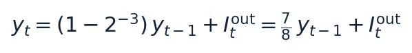
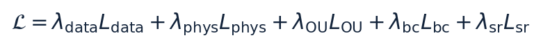

# CF_FSNN — Come Funziona (v3)

> **Una rete neuronale spiking per l'identificazione di un controllore di car-following: teoria delle SNN, addestramento (BPTT+surrogate, EventProp, STDP), architettura del progetto, approccio PINN e co-design per FPGA**

> Documento della terna CF_FSNN — gemello di VALIDATION_REPORT_v3 (i risultati) e FPGA_REPORT (il profilo hardware)  
> Contenuto fondato sul codice sorgente: core/network.py, core/neurons.py, core/hardware.py, core/eventprop.py, train.py  

---

## Sommario

| Sezione | Contenuto |
|---|---|
| Parte I | Cos'è una SNN e come si addestra |
| 0 | Bussola: il problema inverso, le tre proprietà, i documenti gemelli |
| 1 | Le tre generazioni di reti neurali |
| 2 | ANN vs SNN su assi multipli |
| 3 | Dal neurone biologico al neurone LIF |
| 4 | La gerarchia dei modelli e la scelta di ALIF |
| 5 | Codifica neurale: input continuo, spiking interno |
| 6 | Perché il backprop classico non è sufficiente |
| 7 | Metodo 1 — Surrogate gradient + BPTT (addestramento di produzione) |
| 8 | Metodo 2 — EventProp (gradiente esatto via adjoint) |
| 9 | Metodo 3 — STDP e il limite di identificabilità sloppy |
| Parte II | La rete specifica del progetto |
| 10 | Architettura CF_FSNN, strato per strato |
| 11 | Il raggio spettrale ρ(U·V): contrattivo vs espansivo |
| 12 | L'approccio PINN: la loss a cinque componenti |
| 13 | Il modello fisico ACC-IIDM (il bersaglio del PINN) |
| 14 | Il generatore di dati sintetici |
| 15 | Quantizzazione Power-of-Two e Straight-Through Estimator |
| Parte III | Bilancio, hardware, stato |
| 16 | Il deployment su FPGA/HDL: il problema aperto |
| 17 | Il triangolo: rileggere tutte le scelte |
| 18 | Sintesi end-to-end |
| 19 | Mappa dei file |
| 20 | Riferimenti |

## Parte I — Cos'è una SNN e come si addestra

### 0. Bussola: il problema inverso, le tre proprietà, i documenti gemelli

CF_FSNN risolve un problema inverso. Non prevede la traiettoria futura del veicolo: osserva una traiettoria di car-following — gap dal veicolo che precede, velocità propria, differenza di velocità Δv e velocità del leader, ricevuti via V2X — e ne identifica i cinque numeri che la generano, cioè i parametri del modello di guida ACC-IIDM [v0, T, s0, a, b]. Questa distinzione regge l'intero documento: loss, identificabilità e metriche hanno senso solo alla luce del fatto che si stimano parametri, non traiettorie.

*Figura 0.1 — Il problema inverso. La rete mappa la traiettoria osservata nei cinque parametri; questi, immessi nel modello fisico ACC-IIDM, ricostruiscono l'accelerazione, confrontata con quella osservata per formare la loss.*

Una rete neuronale spiking (SNN) possiede tre proprietà che la distinguono da una rete classica (ANN) e da cui discende tutto il resto (Maass 1997; Gerstner et al. 2014): (1) dinamica temporale — ogni neurone ha uno stato interno che persiste e integra gli input nel tempo; (2) computazione sparsa a eventi — la comunicazione avviene per impulsi (spike) e l'energia scala con il numero di spike, non di moltiplicazioni; (3) attivazione non differenziabile — lo spike è un gradino a valori {0,1}, con derivata nulla quasi ovunque. La terza proprietà obbliga a reinventare l'addestramento (Parte I); le prime due giustificano le scelte hardware (Parte II).

> **Nota.** Filo conduttore. Ogni decisione di progetto vive in un triangolo con tre vertici in tensione: bio-realismo, addestrabilità, efficienza hardware. Guadagnare su un vertice costa sugli altri; la §17 rilegge tutte le scelte come punti in questo spazio.

> **Nota.** Documenti gemelli. Questo documento spiega la rete. VALIDATION_REPORT_v3 riporta i risultati — i quattro champion, il verdetto di deploy, le dimensioni di validazione — e FPGA_REPORT ne profila l'implementazione hardware. Le grandezze introdotte qui (ρ(U·V), ALIF, po2, EventProp, sparsità) sono usate là dandole per acquisite.

### 1. Le tre generazioni di reti neurali

La SNN è la "terza generazione" di rete neurale (Maass 1997). La prima generazione è il neurone a soglia di McCulloch & Pitts (1943): unità con uscita binaria, senza nonlinearità continua. La seconda generazione sono le ANN moderne (sigmoide, ReLU): ogni unità emette un valore reale a ogni forward pass ed è differenziabile ovunque, e per questo si addestra con la backpropagation. La terza generazione, le SNN, comunica con spike (eventi discreti) nel tempo continuo: il tempo non è un semplice indice di strato, ma parte della rappresentazione. Un singolo spike temporizzato può, in linea di principio, codificare più informazione di un valore rate-based, e su hardware neuromorfico l'energia scala con gli eventi.

> **Nota.** Un equivoco da evitare: "terza generazione" non significa "più accurata", ma un asse di ottimizzazione diverso — energia, latenza, idoneità al silicio — spesso pagato con un po' di accuratezza. Su GPU, per questo stesso compito, un MLP sarebbe più semplice e preciso; il valore della SNN sta nel target FPGA.

### 2. ANN vs SNN su assi multipli

Il confronto non si riduce a un solo asse ("le SNN sono più efficienti"): le due famiglie differiscono su almeno sei assi indipendenti, ciascuno con una conseguenza concreta per CF_FSNN.

| Asse | ANN (2ª gen.) | SNN (3ª gen.) | Implicazione per CF_FSNN |
|---|---|---|---|
| Unità di comunicazione | valore reale per layer | treno di spike 0/1 nel tempo | output leggibile solo integrando gli spike |
| Stato / memoria | stateless per campione | potenziale di membrana persistente | nativamente adatta a serie temporali (traiettorie) |
| Computazione | MAC densi sincroni | accumulo + confronto soglia, event-driven | energia ∝ spike; spike rate ~13–21% |
| Differenziabilità | end-to-end | gradino di Heaviside (non diff.) | serve surrogate / EventProp (§6–8) |
| Hardware ideale | GPU / TPU (matmul densa) | neuromorfico / FPGA (memoria-vicino-calcolo) | target PYNQ-Z1; pesi po2 → shift |
| Dati nativi | tensori densi | eventi / serie temporali | input V2X sequenziale |

*Figura 2.1 — Neurone ANN vs neurone spiking. La differenza strutturale non è "reale vs binario", ma la presenza di uno stato che evolve nel tempo e di una soglia non differenziabile.*

Una precisazione che conviene anticipare: il vantaggio energetico delle SNN non nasce dalla sparsità in sé. Le operazioni sinaptiche (SynOps, l'analogo spiking dei MAC) di questa rete eguagliano o superano i MAC di una ANN equivalente; a parità di costo per operazione la SNN sarebbe anzi in svantaggio. Il guadagno viene dal minor costo unitario di un accumulo (AC) rispetto a una moltiplicazione-accumulo (MAC) — un rapporto misurato a livello di circuito (Horowitz 2014) — e su FPGA, con pesi potenze-di-due, l'AC si riduce a uno shift+add. La sparsità amplifica questo margine ma non lo crea. Il payoff energetico misurato per champion è in VALIDATION_REPORT_v3 §9.2 e il profilo op-count in FPGA_REPORT.

*Figura 2.2 — Perché la SNN è più efficiente pur facendo lo stesso numero (o più) di operazioni: il costo unitario AC < MAC. La sparsità amplifica il margine, non lo crea.*

### 3. Dal neurone biologico al neurone LIF

Il neurone artificiale spiking è un'astrazione minimale del neurone biologico. La membrana si comporta come un condensatore che accumula carica; gli input sinaptici la caricano (integrazione); in assenza di stimolo la membrana perde carica nel tempo (leak, con costante di tempo τ), cioè il neurone "dimentica" gli input vecchi; al superamento di una soglia emette un impulso (spike) e subito dopo si resetta. Questo è il modello Integrate-and-Fire con leak (LIF). Non serve il realismo completo della biofisica di Hodgkin & Huxley (1952) — quattro equazioni differenziali per i canali ionici — perché l'obiettivo è la computazione e l'energia, non l'elettrofisiologia.

In tempo discreto, il potenziale di membrana V evolve per integrazione con perdita. Nel codice il leak non è una divisione ma uno spostamento di bit (bit-shift) di ordine p, cioè un fattore 1−2⁻ᵖ:

*Equazione 3.1 — Aggiornamento del potenziale di membrana LIF (core/neurons.py). V = potenziale; I_ff = corrente feedforward (ritardata); I_rec = corrente ricorrente; p = ordine del bit-shift del leak (default p=3, cioè fattore 7/8). La forma a bit-shift evita divisori in hardware.*

*Figura 3.1 — Dinamica di un neurone LIF: l'input carica il potenziale, il leak lo fa decadere in assenza di stimolo, al superamento della soglia si genera uno spike e il potenziale si riduce (reset sottrattivo).*

### 4. La gerarchia dei modelli e la scelta di ALIF

I modelli di neurone formano una gerarchia di semplificazione progressiva: scendendo, si perde dettaglio biologico e si guadagna addestrabilità e velocità. Dall'alto: Hodgkin-Huxley (quattro ODE; Hodgkin & Huxley 1952) → AdEx (due ODE; Brette & Gerstner 2005) → Izhikevich (due ODE, molti pattern di scarica; Izhikevich 2003) → ALIF (LIF con soglia adattiva) → LIF (una ODE più reset) → IF (integratore puro). In pratica: immagini statiche → LIF; compiti sequenziali con memoria → ALIF/LSNN (Bellec et al. 2018); neuroscienza → Izhikevich/AdEx; biofisica → Hodgkin-Huxley.

*Figura 4.1 — Gerarchia dei neuroni (sx) e comportamento ALIF vs LIF (dx). L'ALIF alza la soglia a ogni spike (fatica) e poi la lascia decadere, riducendo la frequenza di scarica nel tempo.*

CF_FSNN usa il neurone ALIF (Adaptive Leaky Integrate-and-Fire): un LIF con una variabile di adattamento — una fatica che alza temporaneamente la soglia a ogni spike e poi decade (Bellec et al. 2018). La soglia effettiva è la somma della soglia base e della fatica; la fatica decade con lo stesso bit-shift della membrana e cresce di thresh_jump a ogni spike; dopo lo spike il potenziale subisce un reset sottrattivo. Le equazioni implementate (core/neurons.py) sono:

![Equazione 4.1 — Dinamica ALIF per tick. θ_base = soglia base (apprendibile, init 1.5); F = fatica/adattamento; θ_jump = incremento di soglia per spike (apprendibile, init 0.5); S ∈ {0,1} = spike; 1[·] = indicatore (funzione a gradino). Il reset è sottrattivo: non azzera il potenziale.](figures_howitworks_v3/eq_alif.png)
*Equazione 4.1 — Dinamica ALIF per tick. θ_base = soglia base (apprendibile, init 1.5); F = fatica/adattamento; θ_jump = incremento di soglia per spike (apprendibile, init 0.5); S ∈ {0,1} = spike; 1[·] = indicatore (funzione a gradino). Il reset è sottrattivo: non azzera il potenziale.*

La scelta di ALIF rispetto al LIF puro poggia su tre ragioni, tutte di addestrabilità o hardware: (a) il car-following è un problema temporale che beneficia di una memoria a due scale — veloce nella membrana, lenta nella fatica; (b) la fatica regola la sparsità del firing e stabilizza l'addestramento: nei test del progetto, azzerare thresh_jump porta il training a divergere, mentre valori troppo alti causano underfit, con un ottimo empirico intorno a 0.5 (da cui l'inizializzazione); (c) aggiunge solo due stati per neurone, restando economica su FPGA.

> **Nota.** Il costo di ALIF, dichiarato: complica sia l'addestramento con EventProp (la soglia adattiva aggiunge una dinamica da trattare nell'adjoint) sia la conversione in HDL, perché gli strumenti standard di conversione (FINN; Umuroglu et al. 2017) non supportano il neurone ALIF (§16). Inoltre una soglia iniziale troppo alta negli strati non di ingresso può spegnere i neuroni: la taratura conta.

### 5. Codifica neurale: input continuo, spiking interno

Come entrano ed escono i numeri da una rete a impulsi? Esistono molti schemi di codifica (rate coding = conteggio di spike in una finestra; codifica temporale = tempi precisi degli spike; time-to-first-spike; popolazione; fase; burst). In CF_FSNN, però, l'input non è codificato in spike — è l'equivoco più frequente da prevenire. I quattro segnali V2X, normalizzati in [0,1], entrano come corrente diretta iniettata nel potenziale, non come treni di impulsi Poisson o a latenza. Solo lo strato nascosto ALIF genera spike; lo strato di uscita è un integratore continuo (LI, Leaky Integrator) senza spike. La rete è quindi ibrida: continuo → spiking → continuo.

La normalizzazione degli ingressi fisici e l'iniezione di corrente nel primo strato sono (data/generator.py, core/network.py):

![Equazione 5.1 — Normalizzazione degli ingressi in [0,1] e corrente sinaptica del primo strato. s = gap [m]; v = velocità ego [m/s]; Δv = v−v_leader [m/s]; v_l = velocità del leader [m/s]; Q(W_fc) = pesi feedforward quantizzati po2 (mascherati per i ritardi). Non esiste alcun encoder a spike: l'ingresso è corrente.](figures_howitworks_v3/eq_norm.png)
*Equazione 5.1 — Normalizzazione degli ingressi in [0,1] e corrente sinaptica del primo strato. s = gap [m]; v = velocità ego [m/s]; Δv = v−v_leader [m/s]; v_l = velocità del leader [m/s]; Q(W_fc) = pesi feedforward quantizzati po2 (mascherati per i ritardi). Non esiste alcun encoder a spike: l'ingresso è corrente.*

*Figura 5.1 — Il percorso del segnale. Continuo in ingresso (corrente diretta), spiking solo nell'hidden ALIF, continuo in uscita (LI). Ogni passo fisico da 0.1 s è elaborato con 10 tick SNN interni a ingresso costante — tempo di assestamento della dinamica, non nuova informazione.*

Ne discendono due conseguenze. Primo: l'output si legge dal potenziale dell'ultimo strato LI (voltage decoding), non da un conteggio di spike; con soli 10 tick il rate coding sarebbe troppo rumoroso, mentre il voltage decoding è più stabile e a bassa latenza. Secondo: i 10 tick interni per passo non aggiungono informazione, ma decuplicano la profondità temporale effettiva vista dall'addestramento (una traiettoria di 50 passi diventa una catena di 500 tick), aggravando il problema di credit assignment discusso in §6. Il numero di tick è un compromesso: dieci bastano perché la dinamica ALIF si assesti a ingresso costante, senza moltiplicare oltre la profondità temporale. Va evitato anche l'equivoco opposto: non è "una ANN con leak", perché lo strato nascosto ha soglia vera, reset e non differenziabilità.

### 6. Perché il backprop classico non è sufficiente

Addestrare significa calcolare come modificare ogni peso per ridurre l'errore, cioè il gradiente della loss rispetto ai pesi. Su una SNN, tre ostacoli distinti lo impediscono, ciascuno con una soluzione diversa.

*Figura 6.1 — A sinistra: lo spike è un gradino di Heaviside, con derivata nulla quasi ovunque (e non definita sulla soglia); il gradiente che retropropaga è nullo e la rete non impara. A destra: i tre ostacoli e le tre soluzioni corrispondenti.*

Ostacolo A, non differenziabilità (spaziale): la derivata del gradino è nulla quasi ovunque, il gradiente si annulla e nessun peso si aggiorna. Ostacolo B, credit assignment temporale: poiché lo stato V[t] dipende da V[t−1], attribuire l'errore richiede di propagarlo all'indietro nel tempo (Backpropagation Through Time, BPTT; Werbos 1990), su una profondità reale di seq_len × 10 tick, con i noti rischi di gradiente che svanisce o esplode e un costo di memoria O(T·N). Ostacolo C, implausibilità biologica: il backprop richiede trasporto simmetrico dei pesi e un segnale d'errore globale, assenti nel cervello (rilevante per l'apprendimento on-chip). La mappa delle soluzioni è: A → surrogate gradient (§7); B → BPTT e alternative come EventProp (§8); C → STDP e regole locali (§9).

> **Nota.** Una distinzione spesso confusa: il surrogate gradient risolve solo l'ostacolo A (la non differenziabilità), non l'ostacolo B (il credit assignment temporale). Sono ortogonali: il surrogate si usa dentro il BPTT.

### 7. Metodo 1 — Surrogate gradient + BPTT (addestramento di produzione)

L'idea è uno Straight-Through Estimator (STE; Bengio et al. 2013): nel forward si usa lo spike vero (gradino di Heaviside), mentre nel backward si finge che la funzione sia liscia, sostituendo la derivata inesistente con una curva a campana centrata sulla soglia (surrogate gradient; Neftci et al. 2019). È lo stesso principio dello STE usato per i pesi po2 (§15). Nel codice la derivata surrogata è una fast-sigmoid:

*Equazione 7.1 — Derivata surrogata dello spike (core/hardware.py). V = potenziale; θ_eff = soglia effettiva; γ = ampiezza del kernel. Con γ = 1.0 il kernel è più stretto che con un γ minore (es. 0.3): meno neuroni vicini alla soglia sommano il proprio gradiente, riducendo l'amplificazione attraverso la ricorrenza U·V su 500–1000 tick (≈ 50–100 passi × 10 tick interni).*

*Figura 7.1 — Il meccanismo del surrogate gradient: il forward resta un gradino binario, il backward usa una campana liscia. Con γ = 1.0 (verde) il kernel è più stretto che con γ = 0.3, quindi meno neuroni vicini alla soglia contribuiscono al gradiente, con minor rischio di esplosione.*

> **Nota.** Un fatto controintuitivo, dal codice: il backward della surrogata restituisce None per il gradiente verso la soglia (scelta hardware-friendly). Di conseguenza base_threshold e thresh_jump non ricevono gradiente dallo spike; l'unico canale attraverso cui base_threshold impara è il soft reset (V −= spike·θ_eff). È il motivo per cui distaccare (detach) quel reset rende la rete non addestrabile.

Il surrogate produce un gradiente approssimato — la sua forma dipende dal kernel — e quindi distorto (biased): è proprio questo il movente per studiare EventProp (§8). La ricetta di produzione, con le patologie che previene: ALIF + soft reset + surrogate + Adam (Kingma & Ba 2015) + gradient clipping a norma 1.0 (indispensabile per il BPTT su SNN) + poche epoche. Senza clipping il gradiente esplode; se lo spike rate collassa a zero (neuroni morti) il gradiente sparisce, da cui il regolatore L_sr (§12). Un segnale diagnostico ricorrente: reti da 864 a 9605 parametri si arrestano tutte sullo stesso plateau di errore, indizio che il collo di bottiglia non è la capacità ma il gradiente e l'identificabilità.

### 8. Metodo 2 — EventProp (gradiente esatto via adjoint)

EventProp (Wunderlich & Pehle 2021) tratta la SNN come un sistema dinamico con salti e calcola il gradiente esatto della loss vera (non smussata) risolvendo un'equazione aggiunta (adjoint) che si propaga all'indietro nel tempo, con salti solo agli istanti di spike. Non usa alcuna surrogata. La memoria scala con il numero di spike, O(#spike), invece che con l'intera sequenza, O(T·N). Il movente nel progetto è diretto: se il plateau di errore dipende dalla distorsione del surrogate, un gradiente esatto dovrebbe superarlo.

*Figura 8.1 — EventProp. A sinistra: memoria O(#spike) contro O(T·N) del BPTT. A destra: la variabile aggiunta λ è propagata all'indietro e "salta" solo agli istanti di spike; ai crossing marginali il termine 1/denom può divergere.*

La fragilità di EventProp è numerica: il salto dell'adjoint contiene un fattore 1/denom con denom ≈ (drive − soglia); se uno spike è marginale (il potenziale supera la soglia di pochissimo) denom tende a zero e il gradiente diverge. Nel progetto questo è governato non tanto da clamp numerici di sicurezza, quanto da un vincolo spettrale: un termine di loss che mantiene il raggio spettrale della ricorrenza ρ(U·V) sotto una soglia (§11). La causa profonda dell'instabilità era proprio ρ che cresceva facendo divergere l'adjoint; vincolarlo rende EventProp contrattivo per costruzione. L'adjoint completo della soglia adattiva è risultato corretto ma numericamente neutro, e per questo thresh_jump è congelato per default sotto EventProp.

> **Nota.** Cosa EventProp non risolve: non tocca l'identificabilità/equifinalità (§9) né garantisce di uscire dai minimi locali. Fornisce il gradiente giusto, non un paesaggio migliore. In CF_FSNN è oggetto di uno studio dedicato (registrato in EVENTPROP_STATUS.md); l'addestramento di produzione resta BPTT+surrogate. Concettualmente è un ponte tra le regole locali (STDP) e il gradiente globale (BPTT).

### 9. Metodo 3 — STDP e il limite di identificabilità sloppy

La STDP (Spike-Timing-Dependent Plasticity; Bi & Poo 1998) è una regola di apprendimento biologica: il peso cambia in base al timing relativo tra spike pre- e post-sinaptico (se il pre precede il post, potenziamento; viceversa, depressione), con una finestra esponenziale. È locale e non supervisionata; esistono varianti a tre fattori (R-STDP) che aggiungono un segnale di ricompensa per il reinforcement learning. CF_FSNN non la usa perché il compito è una regressione supervisionata a cinque uscite con una loss globale (PINN): la STDP non ha modo di propagare l'informazione "l'accelerazione ricostruita è errata di 4.2 m/s²" fino ai pesi. Non è inutile — è ottima per feature non supervisionate e apprendimento on-chip — ma è fuori scopo qui.

Questa è anche la sede naturale per un concetto spesso trascurato: l'identificabilità sloppy. Dai soli dati di car-following, i parametri a e b entrano quasi esclusivamente attraverso il prodotto √(a·b) nel gap desiderato s*:

![Equazione 9.1 — Gap desiderato del modello (core/network.py, data/generator.py). s0 = gap minimo da fermo [m]; v = velocità ego [m/s]; T = time headway [s]; Δv = v−v_leader [m/s]; a, b = accelerazione massima e decelerazione confortevole [m/s²]. a e b compaiono solo tramite √(a·b).](figures_howitworks_v3/eq_sstar.png)
*Equazione 9.1 — Gap desiderato del modello (core/network.py, data/generator.py). s0 = gap minimo da fermo [m]; v = velocità ego [m/s]; T = time headway [s]; Δv = v−v_leader [m/s]; a, b = accelerazione massima e decelerazione confortevole [m/s²]. a e b compaiono solo tramite √(a·b).*

Il rapporto a/b è quindi non osservabile per costruzione: la rete apprende bene √(a·b) (errore ~−12%) ma sbaglia a (~−40%) e b (~+30%) in modo che si compensano. È un limite del problema, non della rete: ingrandirla (da 864 a 9605 parametri) non cambia nulla; il rimedio agisce sui dati e sugli scenari (aggiungere free-flow e launch ha portato l'NRMSE di v0 da 0.50 a 0.22). L'NRMSE (Normalized Root-Mean-Square Error) è l'errore quadratico medio normalizzato sul range del parametro (0 = perfetto): l'obiettivo di riferimento per la calibrazione dei modelli di traffico è dell'ordine di 0.20 (Treiber & Kesting 2013).

*Figura 9.1 — La valle piatta dell'identificabilità. Nel piano (a, b) la loss ha una valle lungo √(a·b) = costante: tutti quei punti spiegano ugualmente bene la stessa guida. La rete scivola lungo la valle e non distingue il valore vero da una stima con lo stesso prodotto.*

> **Nota.** Un corollario che fa da ponte con il report dei risultati: "sicura e stabile" non implica "parametri accurati". La rete è conservativa proprio perché il bias su a/b la rende prudente. Per questo la metrica primaria è il comportamento fisico — val_data, cioè la componente L_data (§12) valutata sul set di validazione, che misura l'errore sull'accelerazione e non sui parametri — e non l'NRMSE nuda: un'NRMSE bassa non garantisce una guida sicura.

#### 9-bis. La quarta via: conversione ANN→SNN (perché non qui)

Per completezza, si può anche addestrare una ANN classica e convertirla in SNN, sfruttando l'equivalenza tra ReLU e frequenza di scarica di un neurone IF con calibrazione delle soglie (Diehl et al. 2015; Rueckauer et al. 2017). Il metodo dà ottima accuratezza su reti profonde, ma richiede molti timestep (alta latenza) e non si applica qui: non esiste una ANN-target, serve la dinamica temporale nativa, e il co-design po2/PINN/FPGA richiede l'addestramento diretto.

## Parte II — La rete specifica del progetto

### 10. Architettura CF_FSNN, strato per strato

La pipeline è: INPUT(4) → HiddenLayer_ALIF(32) → OutputLayer_LI(5) → decode → [v0, T, s0, a, b], per un totale di 864 parametri. Ogni passo fisico (0.1 s) è elaborato con 10 tick SNN interni.

*Figura 10.1 — Architettura baseline (864 parametri). Lo strato nascosto ALIF combina pesi po2, ritardi assonali e una ricorrenza a basso rango U·V; l'uscita è un integratore continuo, decodificato nei cinque parametri fisici.*

Ricorrenza a basso rango. Invece di una matrice ricorrente piena 32×32 (1024 pesi), la ricorrenza è fattorizzata come prodotto di due matrici, U(32×8) e V(8×32), per 512 pesi (metà), con inizializzazione ortogonale (gain 0.2). Applicata al vettore di spike del tick precedente, produce la corrente ricorrente:

*Equazione 10.1 — Corrente ricorrente (core/network.py). S = vettore di spike dello strato nascosto (32) al tick precedente; U, V = fattori della ricorrenza; Q(·) = quantizzazione po2 (U e V sono quantizzate separatamente). La matrice efficace W_rec = Q(U)·Q(V) ha rango al più 8.*

Il rango 8 è un compromesso di capacità: dimezza i pesi ricorrenti e limita il rango della dinamica di feedback, riducendo la spinta all'espansione del raggio spettrale (§11) senza annullare la memoria. La ricorrenza è ritardata di un tick: il tick t vede gli spike del tick t−1. Al potenziale si somma anche la corrente feedforward con ritardi assonali: ogni sinapsi ha un ritardo intero campionato in [0, 6) tick, realizzato con un ring-buffer O(1), e i pesi feedforward sono ri-scalati di √6 all'inizializzazione per compensare la varianza persa a causa della maschera dei ritardi. Sono tick interni (≈0.06 s), non tempi di reazione biologici.

Uscita e decode. Lo strato di uscita è un integratore leaky (leak bit-shift, fattore 7/8, pesi po2, senza spike):

*Equazione 10.2 — Strato di uscita LI (core/neurons.py). y = potenziale del leaky integrator; I_out = corrente in ingresso. Il valore finale di y, dopo i 10 tick, è il raw decodificato dall'Equazione 10.3.*

Il potenziale finale è mappato nei cinque parametri fisici tramite una sigmoide vincolata ai bound per canale:

*Equazione 10.3 — Decode dei parametri (core/network.py). raw = potenziale LI finale; p_lo, p_hi = bound fisici del parametro; off, τ = calibrazione per canale (default off=0, τ=1); σ = sigmoide. La sigmoide garantisce che ogni parametro resti entro i bound fisici della tabella seguente.*

I 864 parametri della baseline (rango 8) si ripartiscono così: fc 128 + rec_U 256 + rec_V 256 + base_threshold 32 + thresh_jump 32 + out_fc 160. Le 64 soglie (32 base_threshold + 32 thresh_jump) sono apprendibili ma non quantizzate po2. Le varianti a rango 16 (usate da due dei champion del report gemello) raddoppiano i pesi ricorrenti, per ~1400 parametri. I bound fisici dei cinque parametri:

| Parametro fisico | Simbolo | Lo | Hi | Unità |
|---|---|---|---|---|
| velocità desiderata | v0 | 8.0 | 45.0 | m/s |
| time headway | T | 0.5 | 2.5 | s |
| gap minimo fermo | s0 | 1.0 | 5.0 | m |
| accel. massima | a | 0.3 | 2.5 | m/s² |
| decel. confortevole | b | 0.5 | 3.0 | m/s² |

### 11. Il raggio spettrale ρ(U·V): contrattivo vs espansivo

Il raggio spettrale ρ di una mappa lineare è il modulo del suo autovalore dominante, ρ(M) = max|λ_i(M)|: indica se applicare ripetutamente la mappa amplifica (ρ>1) o smorza (ρ<1) lo stato. Applicato alla ricorrenza, ρ(U·V) misura se lo stato del neurone cresce o si smorza di tick in tick. È il discriminante per l'FPGA: in aritmetica a virgola fissa (pochi bit, senza il range dinamico del floating point) una ricorrenza contrattiva (ρ<1) mantiene lo stato limitato e smorza gli errori di arrotondamento, mentre una espansiva (ρ>1) li amplifica fino a saturazione o overflow. Nel codice ρ è stimato con la norma spettrale σ_max della matrice ricorrente (un limite superiore del raggio spettrale) e riportato nei CSV come rec_spectral_radius.

*Figura 11.1 — A sinistra: con ρ<1 lo stato si smorza, con ρ>1 diverge. A destra: i quattro champion (i modelli selezionati nel report gemello: due BPTT, due EventProp) — i due EventProp (○) sono contrattivi (ρ<1), i due BPTT (□) espansivi (ρ>1). I valori di ρ per champion e il verdetto di deploy sono in VALIDATION_REPORT_v3 §9.3 e §10.*

> **Nota.** Il doppio ruolo di ρ. La stessa grandezza governa la stabilità in hardware e la convergenza dell'adjoint di EventProp (§8): un ρ crescente fa divergere la variabile aggiunta. Il vincolo spettrale usato in addestramento è un termine di loss relu(σ_max(Q(U)·Q(V)) − σ*)² con soglia σ* ≈ 1.5 (il regime di esplosione osservato inizia intorno a 2.5): rende EventProp contrattivo per costruzione, come confermano i champion in VALIDATION_REPORT_v3 §9.3.

### 12. L'approccio PINN: la loss a cinque componenti

In un approccio PINN (Physics-Informed Neural Network; Raissi et al. 2019) la rete non fa un fitting cieco dei parametri (che non sono direttamente osservabili): li predice, li immette nelle equazioni fisiche ACC-IIDM per ricostruire l'accelerazione, e confronta questa con quella osservata. La fisica è il ponte tra ciò che la rete produce (cinque numeri) e ciò che è misurabile (il comportamento). La loss totale è la somma pesata di cinque termini:

*Equazione 12.1 — Loss totale (train.py). Ogni L_i è un termine di errore, ogni λ_i il suo peso. I pesi attivi sono λ_data = 1.0, λ_phys = 0.1, λ_OU = 0.05, λ_bc = 1.0, λ_sr = 0.5.*

*Figura 12.1 — Il ciclo PINN (sx) e i pesi dei cinque termini (dx). L_data misura l'errore sull'accelerazione ricostruita, non sui parametri: ecco perché parametri diversi possono dare la stessa loss (equifinalità).*

| Termine | λ | Cosa impone | Formula (dal codice) |
|---|---|---|---|
| L_data | 1.0 | fit: accel. ricostruita ≈ vera, sui passi con V2X ricevuto | RMSE mascherato di (â − a_gt), / N_valid |
| L_phys | 0.1 | coerenza fisica su tutti i passi (anche V2X mancante) | mean((â − a_gt)²) |
| L_OU | 0.05 | T(t) segue la mean-reversion realistica | mean((T_{t+1} − (α·T_t + (1−α)·T̄))²) |
| L_bc | 1.0 | no-crash: s0 predetto non superi il gap reale | mean(relu(s0 − s + 0.1)²) |
| L_sr | 0.5 | sparsità: spike rate verso 0.15 (anti neuroni morti) | (spike_rate − 0.15)² |

Alcuni fatti di implementazione. L_data è una RMSE mascherata sull'accelerazione, normalizzata per il numero di campioni validi (non una SRMSE sull'energia del target, che divergerebbe sui tratti a velocità costante, dove l'accelerazione vera è ~0). L_OU ha un floor irriducibile (~1.8·10⁻⁴) perché il generatore fa variare T con salti di Markov, non con un processo OU continuo (§14). L'accelerazione del leader a_l non è un input: è ri-stimata da differenze finite filtrate. Esistono termini ausiliari di supervisione diretta sui parametri, ma sono disattivati per default.

> **Nota.** Da dove vengono i pesi λ. Sono una calibrazione empirica per bilanciamento d'ordine di grandezza: λ_data = 1 è l'àncora e gli altri pesi sono scelti perché il contributo di ciascun termine resti confrontabile (per esempio λ_phys·L_phys ≈ 0.1·0.2 ≈ 0.02). L'unico peso con una motivazione scritta è λ_sr = 0.5, calibrato su questo criterio dopo un addestramento in cui la rete degenerava verso uno spike rate troppo basso; il target 0.15 è il centro di una zona di firing sana (~10–25%) per una SNN. I valori λ_phys, λ_OU, λ_bc non derivano da uno sweep completato né da un valore di letteratura: uno sweep dedicato era pianificato ma non è stato eseguito, e un'ablazione mostra che azzerare i termini fisici sposta la validazione in modo trascurabile — i termini PINN pesano poco sull'accelerazione, pur restando utili come vincoli di plausibilità.

### 13. Il modello fisico ACC-IIDM (il bersaglio del PINN)

La rete identifica i parametri di un controllore ACC costruito sull'IIDM (Improved Intelligent Driver Model) con blend CAH (Constant-Acceleration Heuristic), nella formulazione di Treiber & Kesting (2013, cap. 11–12; cfr. Treiber et al. 2000 per l'IDM di base e Kesting et al. 2010 per la variante ACC/CAH). Di seguito le equazioni come implementate nel codice (core/network.py, data/generator.py).

Il punto di partenza è il gap desiderato s* (Eq. 9.1). Da esso si definiscono il gap clampato s_safe, il rapporto adimensionale z e il termine di free-flow a_free:

![Equazione 13.1 — Grandezze IIDM (core/network.py). s = gap [m]; s_safe = gap clampato a un minimo di 2.0 m (vedi nota); z = s*/s_safe; v = velocità ego [m/s]; v0 = velocità desiderata [m/s]; a = accelerazione massima [m/s²]; l'esponente δ = 4 è fisso.](figures_howitworks_v3/eq_iidm.png)
*Equazione 13.1 — Grandezze IIDM (core/network.py). s = gap [m]; s_safe = gap clampato a un minimo di 2.0 m (vedi nota); z = s*/s_safe; v = velocità ego [m/s]; v0 = velocità desiderata [m/s]; a = accelerazione massima [m/s²]; l'esponente δ = 4 è fisso.*

L'IIDM separa il regime di free-flow (z<1) da quello di car-following (z≥1), distinguendo anche v≤v0 da v>v0; questo elimina il difetto dell'IDM di base in prossimità di v = v0. L'accelerazione IIDM di base ha quattro rami:

| Condizione | a_IIDM |
|---|---|
| v ≤ v0,  z < 1 | a_free·(1 − z²) |
| v ≤ v0,  z ≥ 1 | a·(1 − z²) |
| v > v0,  z < 1 | a_free |
| v > v0,  z ≥ 1 | a_free + a·(1 − z²) |

Il termine CAH anticipa la frenata del leader e riduce le sovra-reazioni nei cut-in lievi, usando la stima dell'accelerazione del leader a_l:

![Equazione 13.2 — Constant-Acceleration Heuristic (core/network.py). a_l = accelerazione stimata del leader [m/s²]; relu(Δv) = max(Δv, 0) considera solo l'avvicinamento. Il risultato è limitato all'intervallo [−9, a].](figures_howitworks_v3/eq_cah.png)
*Equazione 13.2 — Constant-Acceleration Heuristic (core/network.py). a_l = accelerazione stimata del leader [m/s²]; relu(Δv) = max(Δv, 0) considera solo l'avvicinamento. Il risultato è limitato all'intervallo [−9, a].*

Infine il blend combina IIDM e CAH in modo continuo: quando l'IIDM è già più prudente del CAH lo si usa direttamente, altrimenti i due si mescolano in modo morbido con peso di coolness c = 0.99 (fisso):

| Condizione | a_ACC |
|---|---|
| a_IIDM ≥ a_CAH | a_IIDM |
| a_IIDM < a_CAH | (1−c)·a_IIDM + c·(a_CAH + b·tanh((a_IIDM − a_CAH)/b)) |

A valle, una provvista anti-crash limita l'accelerazione all'intervallo [−9, a] m/s².

> **Nota.** Due dettagli del codice, spesso trascurati. Primo: la rete predice solo cinque dei sette parametri — coolness (c = 0.99) e l'esponente δ (= 4) sono fissi. Secondo: s_safe è il gap clampato a un minimo di 2.0 m, non 0.5 m; è una scelta di controllo del gradiente (con 0.5, in autostrada, il termine v/s_safe raggiungeva ~76 e la grad-norm ~8000; con 2.0 scendono a ~19 e ~200), coerente tra simulatore e generatore di dati.

### 14. Il generatore di dati sintetici

I dati non provengono da auto reali (costose da strumentare): sono traiettorie sintetiche generate con lo stesso modello ACC-IIDM. Ogni traiettoria dura 120 s (di cui 20 s di warmup esclusi dalla loss), cioè circa 1000 passi utili da 0.1 s; il dataset comprende 5000 traiettorie di training, 500 di validazione, 500 di test. Per ogni passo si registrano [s, v, Δv, v_leader, v̇, T_vero, mask]; dopo normalizzazione l'input è (N,4) e il target fisico è (N,2) = [accelerazione, T_vero].

Due sorgenti di variabilità meritano la forma esplicita. Il time headway T(t) non è costante ma segue un processo a salti di Markov (estensione stocastica IDM-2d), non un OU continuo — da qui il floor di L_OU (§12). Le grandezze percepite portano inoltre un rumore di Ornstein-Uhlenbeck:

*Equazione 14.1 — Processo a salti per T(t) (sopra) e rumore OU sulle grandezze percepite (sotto). U(T1,T2) = estrazione uniforme; τ_2d ≈ 30 s = tempo di persistenza; τ = costante di tempo dell'OU; ξ = rumore bianco gaussiano. Il processo di T è a salti, mentre L_OU (§12) modella una mean-reversion continua: da qui il suo floor.*

Il resto della configurazione riproduce condizioni realistiche: un mix di scenari (highway 50%, urban 30%, truck 10%, mixed 10%, con l'aggiunta di free-flow e launch per rendere osservabili v0 e a); profili del leader (costante, sinusoidale, stop-and-go, free, launch); cut-in nel 20% dei casi (un secondo veicolo si inserisce, gap → 5–15 m); perdita di pacchetti V2X ~2% (i frame persi escono da L_data ma restano in L_phys). Una variante "wide" campiona uniformemente i cinque parametri per ampliare la copertura. Le proporzioni degli scenari e le probabilità sono scelte di configurazione, calibrate per coprire i regimi che rendono osservabili i diversi parametri (§9), non derivate da un dataset naturalistico.

### 15. Quantizzazione Power-of-Two e Straight-Through Estimator

È il cuore del co-design hardware. I pesi sinaptici sono vincolati a potenze di due, con esponente clampato in [−4, 1] e i pesi sotto 2⁻⁵ azzerati, per 13 livelli complessivi {±1/16 … ±2, 0}. Su FPGA, moltiplicare per 2ᵏ è un semplice bit-shift (un ciclo, dell'ordine di 10 LUT) invece di una moltiplicazione vera (più cicli, dell'ordine di 100 LUT):

![Equazione 15.1 — Quantizzatore po2 e suo gradiente (core/hardware.py). w = peso in virgola mobile; l'esponente arrotondato è clampato in [−4, 1]; 1[|w| > 2⁻⁵] azzera i pesi piccoli (banda morta). In backward il gradiente attraversa la quantizzazione come identità (STE).](figures_howitworks_v3/eq_po2.png)
*Equazione 15.1 — Quantizzatore po2 e suo gradiente (core/hardware.py). w = peso in virgola mobile; l'esponente arrotondato è clampato in [−4, 1]; 1[|w| > 2⁻⁵] azzera i pesi piccoli (banda morta). In backward il gradiente attraversa la quantizzazione come identità (STE).*

*Figura 15.1 — I 13 livelli po2 con la banda morta |w| < 2⁻⁵ (sx) e il risparmio su FPGA: la moltiplicazione diventa uno shift (dx).*

Come si addestra una rete con pesi così discreti? Con lo Straight-Through Estimator (STE; Bengio et al. 2013), lo stesso principio del surrogate gradient (§7): nel forward si usano i pesi quantizzati, nel backward il gradiente attraversa la quantizzazione come se fosse l'identità e aggiorna i pesi in virgola mobile. La quantizzazione è quindi forward-only durante l'addestramento: per questo — in modo controintuitivo — il po2 pesa solo ~0.2% sul plateau di errore, e l'affermazione "quantizzare rovina tutto" qui non regge. La coerenza hardware è totale: anche il leak di membrana è un bit-shift (fattore 7/8) e il reset è sottrattivo, senza divisori.

## Parte III — Bilancio, hardware, stato

### 16. Il deployment su FPGA/HDL: il problema aperto

Una nota di onestà sul target hardware: il modello è addestrato e validato in PyTorch (in simulazione), ma il deploy su FPGA è un obiettivo di design, non un risultato raggiunto. Gli strumenti standard di conversione (FINN; Umuroglu et al. 2017) non supportano il neurone ALIF con soglia adattiva, né la ricorrenza low-rank custom, né i ritardi assonali: servirebbe HDL scritto a mano, oppure un percorso via Simulink + HDL Coder (nodo aperto, documentato in FPGA_EVALUATE_DESIGN.md). Le scelte hardware-aware (po2→shift, leak→shift, surrogata→LUT, ritardi→ring-buffer, reset sottrattivo) sono necessarie ma non sufficienti: riducono l'attrito, non lo eliminano. Il vantaggio energetico è una stima da modello di circuito (Horowitz 2014), non una misura su silicio (i valori per champion sono in VALIDATION_REPORT_v3 §9.2, il profilo op-count in FPGA_REPORT); restano da validare l'utilizzo dei DSP, la banda di memoria e la quantizzazione dello stato (V, fatica) oltre che dei pesi.

### 17. Il triangolo: rileggere tutte le scelte

Ogni decisione di CF_FSNN è un punto di equilibrio nel triangolo bio-realismo / addestrabilità / efficienza-hardware.

*Figura 17.1 — Le scelte del progetto posizionate nel triangolo. ALIF sta al centro (memoria+stabilità); surrogate e PINN spingono verso l'addestrabilità; po2, low-rank e bit-shift verso l'hardware; EventProp riguadagna esattezza al costo di complessità (vincolo spettrale).*

| Aspetto | Vantaggio | Svantaggio / costo onesto |
|---|---|---|
| SNN vs ANN | energia (AC<MAC), temporale nativa, sparsa, piccola (864 par.) | più difficile da addestrare; su GPU un MLP sarebbe più preciso |
| ALIF | memoria a 2 scale, regola la sparsità, stabilizza | complica EventProp e la conversione HDL |
| Surrogate+BPTT | funziona, robusto in produzione | gradiente biased; richiede clipping; costo O(T·N) |
| EventProp | gradiente esatto, contrattivo, memoria O(#spike) | fragile ai crossing marginali; ancora sperimentale |
| po2 + STE | moltiplicazione → shift; ~0.2% di costo | gamut di pesi discreto |
| PINN | usa la fisica per compensare la capacità ridotta | non risolve l'identificabilità sloppy |

> **Nota.** Queste distinzioni teoriche (il costo AC<MAC vs la sparsità, il ruolo dell'handler V2X "hold-last", NRMSE≠sicurezza, la salute della rete) diventano findings misurati sui 4 champion nel report gemello — vedi VALIDATION_REPORT_v3 §9.2 (energia), §8.1 (V2X hold-last), §1 e §9.3 (neuroni morti e ρ per champion).

### 18. Sintesi end-to-end

Un episodio completo: l'input V2X normalizzato entra come corrente; per 10 tick lo strato ALIF integra, emette spike e si retroalimenta via U·V; lo strato LI accumula il segnale; il potenziale finale viene decodificato (sigmoide + bound) nei cinque parametri; questi, dati al controllore ACC-IIDM, guidano un'auto in anello chiuso, confrontata con l'oracolo. La mappa teoria → codice: ALIF (§4) → ALIFCell; codifica (§5) → corrente diretta + LI + 10 tick; surrogate (§7) → SurrogateSpike_Hardware; EventProp (§8) → ALIFLayer_EventProp_Full; po2 (§15) → PowerOf2Quantize; PINN (§12) → pinn_loss.

Lo stato attuale, in modo dichiarato: il plateau di validazione (val_data, l'errore fisico sull'accelerazione) è ~0.19–0.20, allineato al riferimento di calibrazione ~0.20 (Treiber & Kesting 2013), con un record a 0.1926; l'accuratezza di identificazione per champion è riportata in VALIDATION_REPORT_v3 §4.1. Due cause strutturali sono diagnosticate — l'identificabilità sloppy di a/b e la qualità del gradiente SNN; l'esito del confronto BPTT vs EventProp (fronte di Pareto) e il verdetto di sicurezza sono nel report gemello (VALIDATION_REPORT_v3 §1, §5, §10). Va sempre distinto ciò che è validato in produzione (BPTT+surrogate, checkpoint della famiglia Loss_Study) da ciò che è oggetto di studio o roadmap (EventProp, deploy HDL).

> **Nota.** Questo documento copre il funzionamento della rete. Per i risultati — i quattro champion, il verdetto di deploy (Donatello), le dimensioni di validazione, sicurezza/traffico/energia — si veda il documento gemello VALIDATION_REPORT_v3.

### 19. Mappa dei file

| Cosa | Dove |
|---|---|
| Rete, decode, fisica ACC-IIDM | core/network.py |
| Neurone ALIF (leak, soglia adattiva, reset) | core/neurons.py |
| Surrogate gradient + po2 (STE) | core/hardware.py |
| EventProp adjoint | core/eventprop.py |
| Loss PINN a cinque componenti | train.py (pinn_loss) |
| Generatore dati (jump-Markov, cut-in, V2X) | data/generator.py |
| Risultati e verdetto (documento gemello) | document/VALIDATION_REPORT_v3.md |
| Profilo hardware (documento gemello) | document/FPGA_REPORT.md |
| Stato dello studio EventProp, vincolo spettrale | document/EVENTPROP_STATUS.md |
| Questo documento (generatore) | scripts/build_how_it_works_v3.py |

Tutti i diagrammi e le equazioni di questo documento sono ricostruiti eseguendo "python scripts/build_how_it_works_v3.py"; non è richiesto alcun checkpoint.

### 20. Riferimenti

| Riferimento | Tema |
|---|---|
| McCulloch, W.S., Pitts, W. (1943). A logical calculus of the ideas immanent in nervous activity. Bulletin of Mathematical Biophysics 5, 115–133. | Neurone a soglia (§1) |
| Hodgkin, A.L., Huxley, A.F. (1952). A quantitative description of membrane current and its application to conduction and excitation in nerve. J. Physiology 117, 500–544. | Modello biofisico (§3, §4) |
| Uhlenbeck, G.E., Ornstein, L.S. (1930). On the theory of the Brownian motion. Physical Review 36, 823–841. | Rumore OU (§12, §14) |
| Werbos, P.J. (1990). Backpropagation through time: what it does and how to do it. Proceedings of the IEEE 78(10), 1550–1560. | BPTT (§6) |
| Maass, W. (1997). Networks of spiking neurons: the third generation of neural network models. Neural Networks 10(9), 1659–1671. | Terza generazione (§1) |
| Bi, G., Poo, M. (1998). Synaptic modifications in cultured hippocampal neurons: dependence on spike timing, synaptic strength, and postsynaptic cell type. J. Neuroscience 18(24), 10464–10472. | STDP (§9) |
| Treiber, M., Hennecke, A., Helbing, D. (2000). Congested traffic states in empirical observations and microscopic simulations. Physical Review E 62, 1805–1824. | IDM (§13) |
| Izhikevich, E.M. (2003). Simple model of spiking neurons. IEEE Trans. Neural Networks 14(6), 1569–1572. | Modello di neurone (§4) |
| Brette, R., Gerstner, W. (2005). Adaptive exponential integrate-and-fire model as an effective description of neuronal activity. J. Neurophysiology 94, 3637–3642. | AdEx (§4) |
| Kesting, A., Treiber, M., Helbing, D. (2010). Enhanced intelligent driver model to access the impact of driving strategies on traffic capacity. Phil. Trans. R. Soc. A 368, 4585–4605. | ACC / CAH (§13) |
| Bengio, Y., Léonard, N., Courville, A. (2013). Estimating or propagating gradients through stochastic neurons for conditional computation. arXiv:1308.3432. | Straight-Through Estimator (§7, §15) |
| Treiber, M., Kesting, A. (2013). Traffic Flow Dynamics: Data, Models and Simulation. Springer. | IIDM, CAH, calibrazione (§9, §13) |
| Gerstner, W., Kistler, W.M., Naud, R., Paninski, L. (2014). Neuronal Dynamics: From Single Neurons to Networks and Models of Cognition. Cambridge University Press. | LIF / ALIF (§0, §3) |
| Horowitz, M. (2014). Computing's energy problem (and what we can do about it). IEEE Int. Solid-State Circuits Conf. (ISSCC), 10–14. | Energia AC/MAC (§2, §16) |
| Diehl, P.U., Neil, D., Binas, J., Cook, M., Liu, S.-C., Pfeiffer, M. (2015). Fast-classifying, high-accuracy spiking deep networks through weight and threshold balancing. IJCNN. | Conversione ANN→SNN (§9-bis) |
| Kingma, D.P., Ba, J. (2015). Adam: a method for stochastic optimization. Int. Conf. on Learning Representations (ICLR). | Ottimizzatore Adam (§7) |
| Rueckauer, B., Lungu, I.-A., Hu, Y., Pfeiffer, M., Liu, S.-C. (2017). Conversion of continuous-valued deep networks to efficient event-driven networks for image classification. Frontiers in Neuroscience 11, 682. | Conversione ANN→SNN (§9-bis) |
| Umuroglu, Y., Fraser, N.J., Gambardella, G., et al. (2017). FINN: a framework for fast, scalable binarized neural network inference. ACM/SIGDA Int. Symp. on FPGAs, 65–74. | Conversione HDL (§4, §16) |
| Bellec, G., Salaj, D., Subramoney, A., Legenstein, R., Maass, W. (2018). Long short-term memory and learning-to-learn in networks of spiking neurons. Advances in Neural Information Processing Systems (NeurIPS) 31. | ALIF / LSNN (§4) |
| Neftci, E.O., Mostafa, H., Zenke, F. (2019). Surrogate gradient learning in spiking neural networks. IEEE Signal Processing Magazine 36(6), 51–63. | Surrogate gradient (§7) |
| Raissi, M., Perdikaris, P., Karniadakis, G.E. (2019). Physics-informed neural networks: a deep learning framework for solving forward and inverse problems involving nonlinear PDEs. J. Computational Physics 378, 686–707. | PINN (§12) |
| Wunderlich, T.C., Pehle, C. (2021). Event-based backpropagation can compute exact gradients for spiking neural networks. Scientific Reports 11, 12829. | EventProp (§8) |
