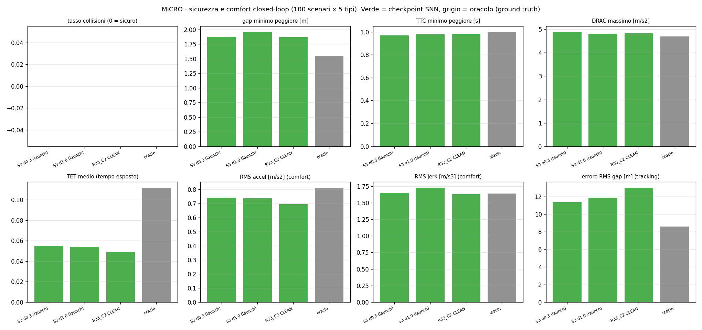
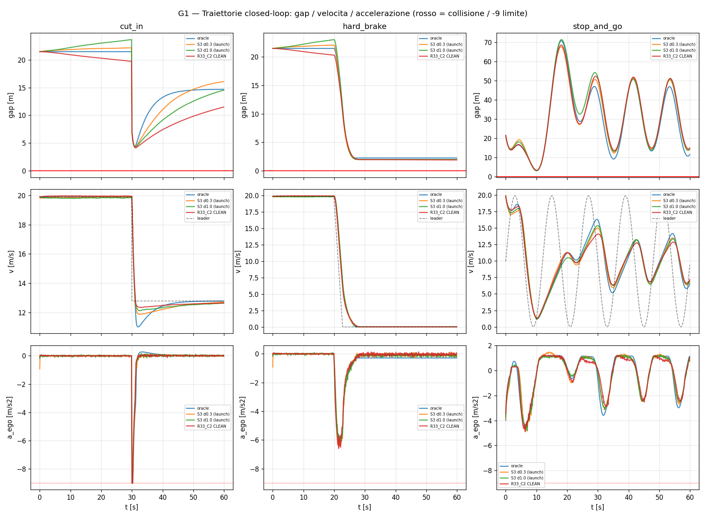
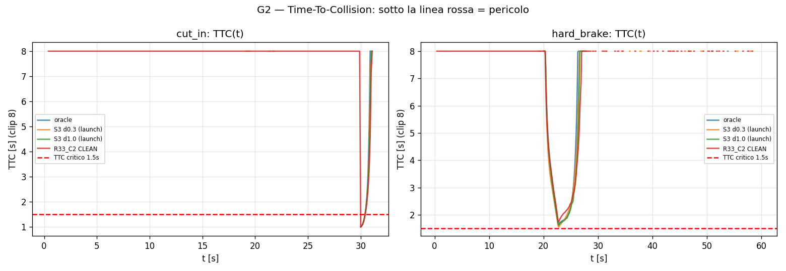
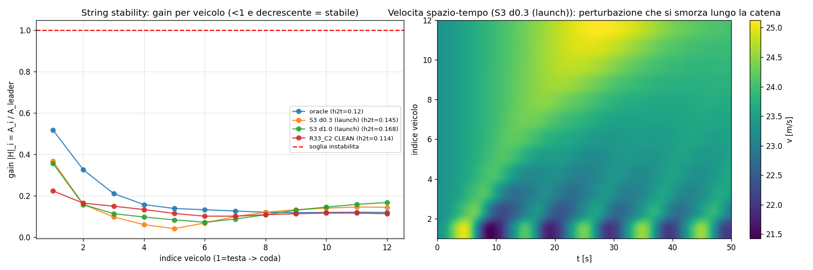
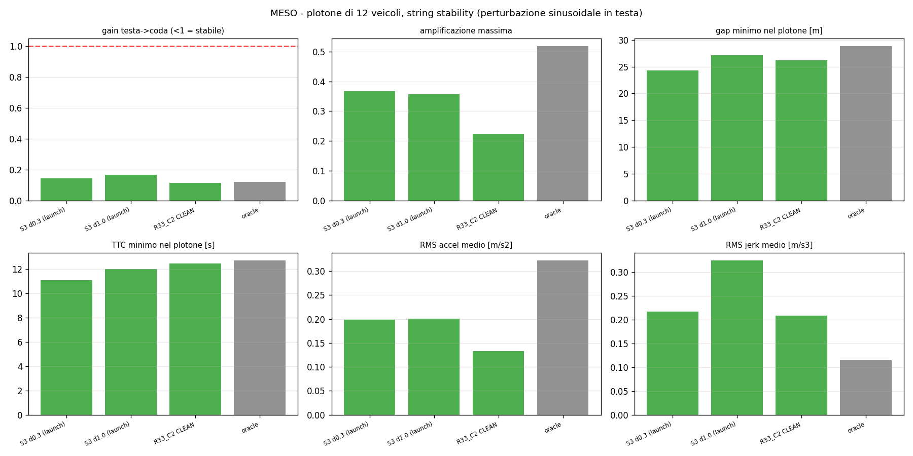
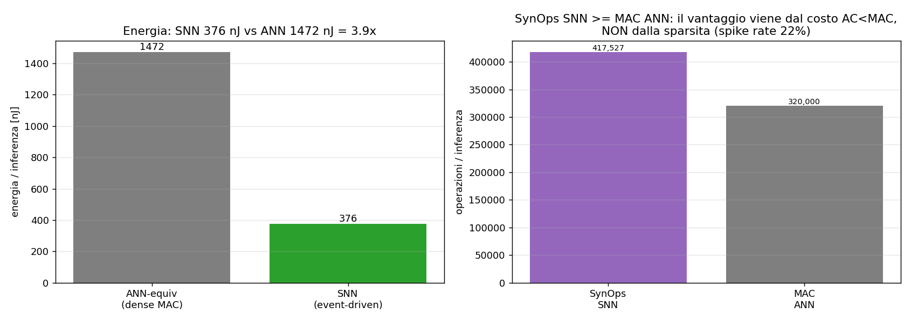

# CF_FSNN - Report di Validazione

> **Identificatore SNN di parametri car-following (ACC-IIDM) -- rete S3 consolidata e validazione closed-loop micro/meso**

> Versione: 2026-06-20  (branch Loss_Study)  
> Checkpoint validato: LS3_PEAK_R0_launch_d03  (864 parametri)  
> Analisi sorgente: results/evaluate/v1_realistic_cutin  
> Lettore atteso: ingegnere che non conosce il progetto e vuole piena  
> coscienza dello stato in ~30 minuti (rete + validazione).  

---

## 1. Sommario esecutivo

CF_FSNN è una rete neurale spiking (SNN, 864 parametri, target FPGA PYNQ-Z1) che osserva un veicolo follower via V2X (gap, velocità, Δv, velocità leader) e ne identifica i 5 parametri del modello di car-following ACC-IIDM: [v0, T, s0, a, b] (Treiber & Kesting, Ch.12). Questo documento valida la rete consolidata "S3" in un contesto di guida chiuso (la rete guida davvero un’auto), su scenari avversari.

Verdetto: la rete è VALIDATA per la sicurezza. Su 100 scenari per ciascuna delle 5 tipologie (following, stop&go, hard-brake, cut-in realistico, sinusoidale) e per tutti e 3 i checkpoint testati, il tasso di collisione è ZERO, identico all’oracolo (il modello ground-truth). A livello di plotone (12 veicoli) la catena è string-stable (le perturbazioni si smorzano). Esiste un solo limite residuo, netto e già diagnosticato: un bias sistematico sui parametri di frenata (a sottostimato, b sovrastimato) che rende la rete più conservativa del dovuto -- benevolo per la sicurezza, ma da correggere per realismo/prestazioni.

| Asse | Risultato | Lettura |
|---|---|---|
| Sicurezza (micro) | 0 collisioni / 500 scenari (per checkpoint) | come l’oracolo |
| Margini (micro) | gap min peggiore 1.87 m, TTC min 0.97 s | più cauta dell’oracolo |
| String stability (meso) | gain testa->coda 0.11-0.17 (<1) | plotone stabile |
| Identificazione | NRMSE media 0.23 (~77% accuratezza) | s0/v0/T buoni |
| Limite residuo | a: 0.66 vs 1.10 (-40%);  b: 1.95 vs 1.50 (+30%) | bias di frenata -> S4 |
| Energia | 3.9x vs ANN equivalente | da costo AC<MAC, non da sparsità |

> **Nota.** Scope. Questo report copre i livelli MICRO (1 veicolo, scenari avversari) e MESO (plotone, string stability). Il livello MACRO (diagramma fondamentale su anello chiuso) è ESCLUSO: la curva dell’oracolo prodotta dal simulatore ad anello è anomala (capacità e velocità di free-flow implausibilmente basse), segno di un artefatto del simulatore macro più che di una proprietà della rete. Finché non è chiarito, i numeri macro non sono affidabili e non vengono riportati.

## 2. La rete sotto test: il checkpoint S3 consolidato

### 2.1 CF_FSNN in una pagina

Architettura: input(4) -> Hidden ALIF (32 neuroni spiking, ricorrenza low-rank rank-8, ritardi assonali) -> Output LI (5) -> sigmoid + bounds fisici -> [v0, T, s0, a, b]. Ogni passo temporale reale (0.1 s) viene elaborato con 10 tick SNN interni; l’addestramento è BPTT con surrogate gradient. I pesi sono quantizzati a potenze-di-due (moltiplicazione -> bit-shift su FPGA) e il leak di membrana è un bit-shift. La loss è PINN (physics-informed): un termine dati (l’accelerazione ricostruita dai parametri predetti deve matchare quella ground-truth ACC-IIDM) più termini di coerenza fisica. Per i dettagli completi di architettura, neurone ALIF, quantizzazione e loss vedi document/HOW_IT_WORKS.md (questo report non li ripete).

> **Nota.** Punto chiave per leggere il resto: la rete non predice una traiettoria, ma i 5 NUMERI che caratterizzano lo stile di guida. La validazione verifica che, usando quei numeri per GUIDARE un’auto in anello chiuso, il comportamento sia sicuro e realistico.

### 2.2 Perché "S3": da non-identificabilità a osservabilità

Il problema centrale scoperto prima della validazione: dai soli segnali di car-following i 5 parametri NON sono congiuntamente identificabili. In particolare v0 e a formano una coppia "molle" (sloppy manifold): si compensano a vicenda (correlazione misurata -0.82 lungo il training; forzando v0 in basso, a sale, e viceversa). La causa-radice è fisica/osservativa, non un difetto di capacità della rete:

| Parametro | Dove diventa osservabile | Conseguenza pratica |
|---|---|---|
| v0 | in crociera libera (free-flow), quando v -> v0 | serve uno scenario "freeflow" |
| a | solo nei transitori di accelerazione forte | serve uno scenario "launch" |
| T, s0 | nel regime di inseguimento normale | già ben coperti |
| b | nelle frenate | osservabile ma accoppiato (vedi 2.3) |

S3 è il punto di arrivo di tre interventi, tutti sul DATO (decoder a 5 parametri mai toccato): (1) aggiunta dello scenario freeflow -> rende v0 osservabile; (2) aggiunta dello scenario launch (cicli di accelerazione forte) -> eccita a; (3) scheduler con restart a learning-rate decrescente (Opzione 1+4) -> elimina i "bump" di loss ai restart e migliora l’identificabilità congiunta. Il risultato è il checkpoint LS3_PEAK_R0_launch_d03, che porta v0 da NRMSE ~0.50 a ~0.22 senza degradare gli altri canali.

### 2.3 Stato di identificazione per-parametro (al checkpoint validato)

Al miglior epoca (epoca 33, minimo di val_data), l’identificazione per canale è la seguente. La NRMSE media è 0.235 (~77% di accuratezza). Importante: la NRMSE da sola nasconde la natura dell’errore -- per a e b l’errore non è rumore ma un BIAS sistematico orientato.

| Parametro | NRMSE | Predetto (media) | Vero | Bias | Giudizio |
|---|---|---|---|---|---|
| v0 | 0.224 | 32.418 m/s | 33.3 m/s | -0.88 | buono |
| T | 0.251 | 1.456 s | 1.2 s | +0.26 | buono |
| s0 | 0.133 | 2.844 m | 2.5 m | +0.34 | ottimo |
| a | 0.262 | 0.658 m/s2 | 1.1 m/s2 | -0.44 | bias sistematico |
| b | 0.305 | 1.949 m/s2 | 1.5 m/s2 | +0.45 | bias sistematico |

*Figura 2.1 - Accuratezza per parametro (sx) e confronto predetto-vs-vero (dx, scala log). s0/v0/T sono centrati; a è sottostimato (~0.66 vs 1.10) e b sovrastimato (~1.95 vs 1.50). I due errori si compensano in gran parte nella combinazione sqrt(a*b) -- l unica osservabile -- che resta vicina al vero (~-12%); l effetto netto di guida e dominato dal moltiplicatore a piu debole.*

Perche il closed-loop resta sicuro nonostante errori grandi su a e b: nel modello IIDM a e b entrano nel gap desiderato SOLO come prodotto sqrt(a*b) -- l unica direzione osservabile. La rete impara bene sqrt(a*b) (1.13 vs 1.28 vero, -12%) e scarica l errore lungo il rapporto a/b, che nei dati di following non e osservabile; cosi la dinamica del gap resta quasi preservata. ATTENZIONE al verso: sovrastimare b da solo RIDUCE il gap desiderato (margini piu stretti), non li allarga; ma l effetto e dominato dal moltiplicatore a piu debole (accelerazioni piu dolci, gap leggermente piu ampi), per cui l aggregato e piu conservativo -- coerente con i margini osservati nel micro. Causa strutturale del tetto: a entra come termine saturante (cap min(.,a), gradiente nullo fuori dalla saturazione) e a/b sono scambiabili in sqrt(a*b) -- finestra di osservabilita stretta per costruzione del modello (oggetto dello studio sui parametri dinamici).

### 2.4 Traiettoria di apprendimento per-canale

*Figura 2.2 - NRMSE per canale lungo le 50 epoche di QUESTA run S3 (che include gia freeflow+launch). v0 (blu) parte gia basso (~0.20) e resta basso: il confronto col valore pre-fix (~0.50) e cross-run, non visibile qui. s0 (verde) e il migliore. a (rosso) e b (viola) DERIVANO verso l alto durante il training -- il manifold molle ricollassa a/b -- percio il checkpoint e scelto all epoca 33 (tratteggio) sul minimo di val_data, prima che peggiorino oltre. E la firma del tetto strutturale di a/b.*

### 2.5 I checkpoint messi sotto test

La validazione confronta 3 checkpoint SNN più l’oracolo. Tutti hanno la stessa architettura (864 parametri); differiscono per ricetta di training. L’oracolo NON è una rete: è il modello ACC-IIDM con i parametri veri (ground truth), e serve da limite superiore di riferimento.

| Sorgente | Cos’è | Ruolo nel report |
|---|---|---|
| S3 d0.3 (launch) | checkpoint consolidato (restart decay 1.0->0.3) | PRIMARIO (vetrina, raster, energia) |
| S3 d1.0 (launch) | variante con restart non decrescente | confronto |
| R33_C2 CLEAN | champion pre-osservabilità (stabile) | confronto/baseline |
| oracle | ACC-IIDM coi parametri veri (non è una rete) | limite superiore di riferimento |

## 3. Metodologia di validazione

### 3.1 I due livelli riportati

MICRO (1 veicolo): la rete guida un ego che insegue un leader avversario; si misurano sicurezza e comfort. MESO (plotone di 12 veicoli): perturbazione in testa, si misura se l’onda si amplifica o si smorza lungo la catena (string stability). Il livello MACRO è escluso (vedi callout in 1).

### 3.2 Il simulatore closed-loop

A ogni passo (Dt=0.1 s) la rete riceve lo stato osservato dell’ego, predice [v0, T, s0, a, b], e questi parametri vengono dati in pasto al controllore ACC-IIDM che calcola l’accelerazione dell’ego; l’ego avanza, lo stato si aggiorna, e il ciclo si ripete (guida a anello chiuso, non identificazione offline). L’oracolo gira lo stesso loop ma con i parametri veri. Confrontare i due isola l’effetto dell’errore di identificazione sul comportamento di guida.

### 3.3 Scenari e la correzione del cut-in (v0 -> v1)

5 tipologie di scenario, 100 istanze randomizzate ciascuna (driver e condizioni iniziali variati): following (inseguimento nominale), stop_and_go (leader oscillante), hard_brake (frenata di emergenza del leader), cut_in (taglio di corsia), sinusoidal (velocità leader sinusoidale). Il cut-in è lo scenario critico: nella prima versione (v0) il taglio era così severo (gap 4 m, DRAC ~8) da essere fisicamente inevitabile -- anche l’oracolo collideva. È stato corretto a una geometria realistica e EVITABILE (TTC ~1 s, DRAC ~4): così lo scenario misura la rete, non un artefatto. Tutti i risultati di questo report sono sulla versione v1 (cut-in realistico).

### 3.4 Metriche definite

| Metrica | Definizione | Cosa cattura |
|---|---|---|
| collision_rate | frazione di scenari con gap -> 0 | sicurezza assoluta |
| min_gap / TTC | distanza e time-to-collision minimi | prossimità al pericolo |
| DRAC | decelerazione richiesta per evitare collisione | severità della manovra |
| TET / TIT | tempo (e integrale) sotto soglia TTC critica | esposizione al rischio |
| rms_accel / rms_jerk | RMS di accelerazione / strappo | comfort |
| rms_gap_error | errore RMS sul gap desiderato | qualità di tracking |
| head_to_tail_gain | ampiezza coda / ampiezza testa (plotone) | string stability (<1 = stabile) |

## 4. Risultati MICRO (sicurezza e comfort)

### 4.1 Verdetto: zero collisioni

Nessuna collisione in alcuno scenario, per nessun checkpoint, identico all’oracolo. La tabella per-tipologia (frazione di collisioni) è nulla ovunque:

| Scenario | S3 d0.3 (launch) | S3 d1.0 (launch) | R33_C2 CLEAN | oracle |
|---|---|---|---|---|
| cut_in | 0 | 0 | 0 | 0 |
| following | 0 | 0 | 0 | 0 |
| hard_brake | 0 | 0 | 0 | 0 |
| sinusoidal | 0 | 0 | 0 | 0 |
| stop_and_go | 0 | 0 | 0 | 0 |

Riepilogo sicurezza aggregato (su tutti i 500 scenari per sorgente). Si noti che i checkpoint SNN hanno gap minimo MAGGIORE e TET/TIT MINORE dell’oracolo: guidano in modo più cauto, non meno.

| Sorgente | collisioni | gap min | TTC min | DRAC max | TET med | TIT med |
|---|---|---|---|---|---|---|
| S3 d0.3 (launch) | 0.000 | 1.873 | 0.969 | 4.892 | 0.055 | 0.017 |
| S3 d1.0 (launch) | 0.000 | 1.960 | 0.977 | 4.810 | 0.054 | 0.017 |
| R33_C2 CLEAN | 0.000 | 1.872 | 0.982 | 4.829 | 0.049 | 0.017 |
| oracle | 0.000 | 1.552 | 1.000 | 4.697 | 0.112 | 0.020 |

### 4.2 Comfort e qualità di tracking

Il comfort della SNN è paragonabile (anzi accelerazioni più dolci) rispetto all’oracolo; l’errore di gap è leggermente maggiore, coerente con il profilo conservativo.

| Sorgente | RMS accel | max decel | RMS jerk | errore gap | string gain |
|---|---|---|---|---|---|
| S3 d0.3 (launch) | 0.743 | 9.000 | 1.652 | 11.378 | 0.376 |
| S3 d1.0 (launch) | 0.737 | 9.000 | 1.732 | 11.880 | 0.364 |
| R33_C2 CLEAN | 0.695 | 9.000 | 1.631 | 13.031 | 0.292 |
| oracle | 0.814 | 9.000 | 1.641 | 8.598 | 0.488 |

*Figura 4.1 - Scorecard MICRO: ogni metrica come barre per sorgente (verde = SNN, grigio = oracolo). Tutte le metriche di sicurezza sono allineate o migliori dell’oracolo.*

*Figura 4.2 - Traiettorie closed-loop (gap / velocità / accelerazione) per cut-in, hard-brake, stop&go. Nel cut-in il gap crolla al taglio e tutte le varianti SNN lo recuperano dolcemente senza toccare la linea di collisione.*

*Figura 4.3 - Time-to-collision nel tempo: i minimi restano sopra le soglie critiche per tutte le varianti.*

## 5. Risultati MESO (string stability del plotone)

Plotone di 12 veicoli in catena (ogni veicolo riceve il CAM dal predecessore che effettivamente segue), perturbazione sinusoidale sostenuta in testa. Tutte le varianti sono string-stable: il gain testa->coda è <1 e l’onda si smorza lungo la catena. R33_C2 ha il gain migliore; le varianti S3 restano stabili pur non essendo strettamente monotone come l’oracolo.

| Sorgente | gain testa->coda | amplif. max | gap min | TTC min | stabile? |
|---|---|---|---|---|---|
| S3 d0.3 (launch) | 0.145 | 0.367 | 24.255 | 11.096 | sì |
| S3 d1.0 (launch) | 0.168 | 0.357 | 27.120 | 12.000 | sì |
| R33_C2 CLEAN | 0.114 | 0.224 | 26.234 | 12.472 | sì |
| oracle | 0.120 | 0.518 | 28.816 | 12.706 | sì |

*Figura 5.1 - Gain per veicolo (tutte le curve <1 e decrescenti = stabile) e heatmap spazio-tempo della velocità: la perturbazione si smorza lungo la catena.*

*Figura 5.2 - Scorecard MESO: metriche scalari del plotone per sorgente. La linea rossa nel pannello del gain è la soglia di instabilità (=1).*

## 6. Profilo neuromorfico ed energia

Stima per-inferenza (modello di Horowitz 45nm: E_MAC=4.6 pJ, E_AC=0.9 pJ). La SNN consuma 376 nJ contro 1472 nJ di una ANN equivalente densa = 3.9x. NOTA ONESTA: le operazioni sinaptiche della SNN (417,527 SynOps) SUPERANO i MAC dell’ANN (320,000); quindi il vantaggio NON deriva dalla sparsità degli spike (spike rate 22%), ma dal minor costo unitario di un accumulo rispetto a un MAC. A parità di costo/operazione la SNN sarebbe peggiore: più sparsità = più vantaggio. Su FPGA con pesi potenze-di-due il margine cresce (l’AC diventa un semplice shift+add).

*Figura 6.1 - Energia per inferenza (sx) e conteggio operazioni (dx). Il pannello destro chiarisce che SynOps >= MAC: il guadagno è sul costo unitario, non sul numero di operazioni.*

*Figura 6.2 - Raster degli spike durante un cut-in (rete S3 d0.3). NOTA: il titolo interno alla figura ("spara più fitto nei transitori") è SUPERATO -- la lettura corretta è questa didascalia. Il pannello centrale mostra che il rate totale CALA dopo il cut-in (da ~75 a ~65 spike/step): la rete non spara di più nel transitorio, ma RICONFIGURA quali neuroni sono attivi (alcuni si accendono, altri si spengono). Il codice è stato corretto: i run futuri produrranno la caption giusta.*

## 7. Verdetto e limite residuo

La rete S3 è validata per la sicurezza: guida senza incidenti su tutti gli scenari avversari, con margini pari o superiori all’oracolo, ed è string-stable a livello di plotone. Non è una rete "timida che evita guidando piano": insegue, recupera i cut-in e segue le oscillazioni come l’oracolo, ma con un margine di sicurezza extra.

Il limite residuo è uno e ben definito: il bias di frenata (a sottostimato ~ -40%, b sovrastimato ~ +30%). È benevolo per la safety ma degrada il realismo e potenzialmente le prestazioni (accelerazioni sotto-brillanti). È la causa-radice già diagnosticata strutturalmente: la finestra di osservabilità di a è stretta per costruzione del modello IIDM. La prossima leva (studio S4) è lato training/loss: pesare il residuo PINN sulla fase di decelerazione e/o penalizzare esplicitamente il bias di b, per stringere a/b senza toccare l’identificabilità di v0/T/s0 già acquisita.

> **Nota.** In una frase: SICURA E STABILE oggi; il prossimo lavoro è rendere ACCURATA la frenata (a, b), non la sicurezza.

## 8. Riproducibilità e mappa dei file

| Cosa | Dove |
|---|---|
| Checkpoint validato | checkpoints/LS3_PEAK_R0_launch_d03/ (solo su Azure) |
| Log training S3 (per-canale) | results/Loss_Study/S3/PEAK/LS3_PEAK_R0_launch_d03/training_log.csv |
| Risultati validazione | results/evaluate/v1_realistic_cutin/{Eval_ClosedLoop,Meso,Showcase} |
| Simulatore micro | utils/closed_loop_eval.py |
| Simulatore meso | utils/platoon_eval.py |
| Vetrina (raster/energia) | utils/snn_showcase.py |
| Notebook di validazione | Loss_Study_Validation_Full.ipynb |
| Questo report (generatore) | scripts/build_validation_report.py |
| Dettagli architettura/loss | document/HOW_IT_WORKS.md / .pdf |
| Storia identificabilità/S3 | document/LOSS_STUDY_AND_EVALUATION.md |

Le figure quantitative di questo report (accuratezza, NRMSE, scorecard micro/meso, energia) sono RICOSTRUITE dai CSV/JSON dei risultati eseguendo "python scripts/build_validation_report.py" -- nessun checkpoint richiesto. Le figure di traiettoria, TTC, string-stability e raster sono riusate dai PNG prodotti dal notebook di validazione.
