# CF_FSNN - Report di Validazione (v3)

> **Chiusura dello studio EventProp: 4 champion (2 BPTT + 2 EventProp) a confronto con l'oracolo, su un evaluate esaustivo a 6-tier**

> Champion validati: Raffaello, Leonardo (BPTT) · Donatello, Michelangelo (EventProp)  
> Riferimento: Master Splinter (oracolo = ACC-IIDM coi parametri veri)  
> Sorgente dei dati: results/evaluate/v3_TURTLE_POWER!!! (15 dimensioni)  
> Documento della terna CF_FSNN — gemello di HOW_IT_WORKS_v3 (la rete) e FPGA_REPORT (il profilo hardware)  

---

## Indice

| Sezione | Contenuto |
|---|---|
| 1 | Sommario esecutivo |
| 2 | Il contesto: lo studio EventProp e i 4 champion |
| 3 | Metodologia: la valutazione a 6-tier |
| 4 | Identificazione dei parametri (accuratezza, osservabilità, FIM) |
| 5 | Sicurezza closed-loop |
| 6 | Robustezza fisica e curva di rottura |
| 7 | Traffico: micro, meso, macro |
| 8 | Robustezza V2X |
| 9 | Profilo FPGA (sommario) |
| 10 | Verdetto consolidato e raccomandazione di deploy |
| 11 | Limiti residui e prossimi passi |
| 12 | Riproducibilità e mappa dei file |
| 13 | Riferimenti |

## 1. Sommario esecutivo

CF_FSNN è una rete neurale spiking (SNN, ~860-1400 parametri secondo il rango della ricorrenza, target FPGA PYNQ-Z1) che osserva un veicolo follower via V2X (gap, velocità, delta-v, velocità leader) e ne identifica i 5 parametri del modello di car-following ACC-IIDM: [v0, T, s0, a, b] (Treiber & Kesting, Ch.12). Questo documento è il report di CHIUSURA dello studio EventProp: mette a confronto i 4 champion emersi dallo studio - due addestrati con BPTT+surrogate gradient (Raffaello, Leonardo) e due con EventProp, il gradiente aggiunto esatto (Donatello, Michelangelo) - più l'oracolo, su una validazione closed-loop esaustiva a 6 livelli (15 dimensioni: dall'accuratezza alla sicurezza, al traffico, al profilo hardware FPGA).

Verdetto. Tutti e 4 i champion guidano in sicurezza: in anello chiuso il loro tasso di collisione è allineato a quello dell'oracolo, con TTC pari o superiori e margini di frenata comparabili (guidano più cauti, non meno). Le collisioni residue non sono un difetto della rete ma un limite fisico: geometrie di cut-in inevitabili e fondo ghiacciato fanno collidere anche l'oracolo. Sul piano hardware emerge un discriminante netto: i due champion EventProp sono contrattivi (raggio spettrale della ricorrenza ρ<1) e non hanno neuroni morti, mentre i due BPTT sono espansivi (ρ>1) con ~31% di neuroni morti. Contrattivo = stato limitato in aritmetica a virgola fissa = sicuro su FPGA. Sommato alla migliore accuratezza, questo indica **Donatello (EventProp)** come candidato al deploy: ρ=0.05, accuratezza 84.75%, 0 neuroni morti. Avvertenza importante: tutti i risultati qui riportati sono in SIMULAZIONE closed-loop (plant e oracolo simulati); il deploy su FPGA è progettato ma NON ancora validato in hardware - la conversione in HDL è un problema aperto (sezione 11).

| Asse | Risultato | Lettura |
|---|---|---|
| Accuratezza (identificazione) | EventProp 82% vs BPTT 73% (media); best Donatello 84.75% | EventProp identifica meglio |
| Sicurezza (closed-loop) | collisione champion 6.67-7.56% ~ oracolo 7.56% | come l'oracolo (residuo = fisica) |
| Traffico (meso plotone) | string-stable: gain testa->coda 0.11-0.15 (<1) | plotone di 12 stabile |
| Stabilità FPGA (discriminante) | ρ EventProp 0.05/0.39 (<1) vs BPTT 1.16/2.99 (>1) | EventProp contrattivo -> fixed-point sicuro |
| Quantizzazione | fixed-point trascurabile fino a 2 bit; po2 assorbito dal QAT (delta<=0 su 3/4) | pronto per pesi potenze-di-due |
| Energia | 4.77x-6.01x vs ANN densa; spike rate 13.31-19.00% (NON sparso) | da costo AC (accumulo) < MAC (molt.-accum.), non da sparsità |
| V2X (perdita pacchetti) | blind = 66.67% collisione; con hold-last ~8.15% | robustezza data dall'handler, non dalla rete |
| Candidato deploy | Donatello (contrattivo + best accuracy + 0 morti) | runner-up Michelangelo |

> **Nota.** Una lezione trasversale dello studio, confermata qui in closed-loop: la fisica (errore sul dato/comportamento di guida) governa la sicurezza, non la sola NRMSE. Un champion con NRMSE più bassa non è automaticamente più sicuro; per questo il report privilegia le metriche di comportamento e i margini di sicurezza rispetto all'accuratezza nuda.

## 2. Il contesto: lo studio EventProp e i 4 champion

### 2.1 CF_FSNN in una pagina

Architettura: input(4) -> strato nascosto ALIF (neuroni spiking con soglia adattiva, ricorrenza a basso rango, ritardi assonali) -> output LI (5) -> sigmoide + bounds fisici -> [v0, T, s0, a, b]. Ogni passo reale (0.1 s) è elaborato con più tick SNN interni; i pesi sono destinati a essere quantizzati a potenze-di-due (moltiplicazione -> bit-shift su FPGA) e il leak di membrana è un bit-shift. La loss è PINN (physics-informed): un termine dati (l'accelerazione ricostruita dai parametri predetti deve combaciare con quella ACC-IIDM vera) più termini di coerenza fisica. La rete non predice una traiettoria ma i 5 NUMERI che caratterizzano lo stile di guida. Dettagli completi di architettura, neurone ALIF e loss in document/HOW_IT_WORKS_v3.md e GLOSSARY.md.

### 2.2 EventProp vs BPTT: un fronte di Pareto

Lo studio ha mappato e chiuso il confronto tra due modi di calcolare il gradiente attraverso i tick della SNN: BPTT con surrogate gradient (si "ammorbidisce" la soglia non-differenziabile dello spike) contro EventProp (adjoint esatto sugli istanti di spike). Il risultato è un fronte di Pareto, non un vincitore secco: il champion BPTT vince di poco sulla fisica pura (~5.5%), ma EventProp vince su NRMSE, su STABILITA' (raggio spettrale ρ 0.05-0.39 negli EventProp contro 1.16-2.99 nei BPTT champion — le famiglie BPTT storiche scartate toccavano ~22) e su FPGA-friendliness; ed entrambi guidano in sicurezza. Il presente evaluate quantifica quel fronte su tutte le dimensioni che contano per un deploy neuromorfico.

> **Nota.** ρ(U·V) è il raggio spettrale della ricorrenza low-rank: ρ<1 = mappa contrattiva (stato limitato, quantizzazione sicura in virgola fissa), ρ>1 = espansiva (rischio saturazione/overflow). I FONDAMENTI teorici sono in HOW_IT_WORKS_v3 §11; qui il RISULTATO: EventProp produce reti contrattive per costruzione (confermato sui champion, §9.3) - un vantaggio strutturale sul silicio.

### 2.3 I 4 champion e l'oracolo

Il confronto usa 4 champion più l'oracolo. Tutti i champion condividono la stessa struttura (input(4) → ALIF(32) → LI(5)); differiscono per metodo e ricetta di addestramento e per il rango della ricorrenza (8 nei BPTT, 16 negli EventProp). L'oracolo (nome in codice "Master Splinter") NON è una rete: è il modello ACC-IIDM con i parametri veri, e serve da limite superiore di riferimento. I nomi sono un tema (le Tartarughe Ninja); la run porta l'etichetta "TURTLE POWER!!!".

| Champion | Checkpoint | Metodo | Accuratezza | ρ(U·V) | Carattere |
|---|---|---|---|---|---|
| Raffaello | R33_C2_A1_T12_fix | BPTT | 69.34% | 2.99 | Prodigy, aggressivo |
| Leonardo | LS3_PEAK_R0_launch_d03 | BPTT | 77.53% | 1.16 | BPTT, conservativo |
| Donatello | PE_t05_gp0002 | EventProp | 84.75% | 0.05 | EventProp, best-NRMSE |
| Michelangelo | A_lr1e2_t06_r16 | EventProp | 79.18% | 0.39 | EventProp, best-Adam |
| Master Splinter | parametri veri | oracolo (ACC-IIDM) | 100% | - | riferimento |

## 3. Metodologia: l'evaluate a 6-tier

L'evaluate è passato da validazione "data-driven" a "physics/network-driven": misura non solo quanto la rete indovina i numeri, ma come si comporta quando quei numeri GUIDANO davvero un'auto, sotto plant fisico realistico e canale V2X imperfetto, e che aspetto ha la rete come futuro circuito. Le 15 dimensioni sono organizzate in 6 tier:

| Tier | Dimensioni (sezioni della run) | Cosa misura |
|---|---|---|
| T0 reporting | 00 Scorecard, 01 Accuratezza | identificazione, distribuzioni, metriche continue |
| T1 sicurezza+coda | 02 Sicurezza, 09 Traiettorie, 10 Reachability, 11 Breakdown | SSM estese, scenari di coda, curva di rottura |
| T2 plant+canale | 06 V2X, 07 VehicleDynamics | attuatore/attrito/pendenza, PDR/latenza/AoI |
| T3 traffico | 03 String, 12 Mesoscopico, 13 Macroscopico | string stability, plotone, diagramma fondamentale |
| T4 identificabilità | 04 Identifiability | FIM, equifinalità, causale, naturalisticità |
| T5 FPGA | 05 Quantizzazione, 08 Energia/Spiking | Qm.n/po2, energia, salute della rete, ρ |

### 3.1 Il simulatore closed-loop e l'oracolo

A ogni passo (Dt=0.1 s) la rete riceve lo stato osservato dell'ego, predice [v0, T, s0, a, b], e questi parametri alimentano il controllore ACC-IIDM che calcola l'accelerazione; l'ego avanza e il ciclo si ripete (guida ad anello chiuso, non identificazione offline). L'oracolo gira lo stesso loop coi parametri veri: confrontarli isola l'effetto dell'errore di identificazione sul comportamento.

### 3.2 Scenari e metriche

Scenari avversari: following, stop&go, hard-brake, cut-in (realistico ed evitabile), aggressive cut-in, panic-stop, sinusoidale; l'accuratezza è inoltre stratificata su 6 famiglie (highway, urban, launch, freeflow, truck, mixed). Le metriche di sicurezza usano indicatori CONTINUI (surrogate safety measures) che non saturano come il solo tasso di collisione:

| Metrica | Definizione | Cosa cattura |
|---|---|---|
| collision_rate | frazione di scenari con gap -> 0 | sicurezza assoluta |
| brake_margin_min | margine di decelerazione residuo (con segno) | quanto vicino al limite di frenata |
| min_ttc / min_gap | time-to-collision e distanza minimi | prossimità al pericolo |
| DRAC / TET / TIT | decel. richiesta; tempo e integrale sotto soglia TTC | severità ed esposizione |
| impact_dv | delta-v ipotetico d'impatto | gravità potenziale |
| rms_jerk / frac_iso | strappo RMS; frazione fuori soglia ISO | comfort |
| head_to_tail_gain | ampiezza coda / testa nel plotone | string stability (<1 = stabile) |
| ρ(U·V), dead_frac | raggio spettrale ricorrenza; neuroni morti | salute e stabilità hardware |

![Equazione 3.1 — Principali surrogate safety measures (indicatori continui di rischio). s = gap [m]; Δv = velocità di avvicinamento (v−v_leader) [m/s]; τ = soglia di time-to-collision; 𝟏[·] = indicatore. TTC = time-to-collision; DRAC = deceleration rate to avoid a crash; TET = tempo esposto a TTC sotto soglia.](figures_validation_v3/eq_ssm.png)
*Equazione 3.1 — Principali surrogate safety measures (indicatori continui di rischio). s = gap [m]; Δv = velocità di avvicinamento (v−v_leader) [m/s]; τ = soglia di time-to-collision; 𝟏[·] = indicatore. TTC = time-to-collision; DRAC = deceleration rate to avoid a crash; TET = tempo esposto a TTC sotto soglia.*

## 4. Identificazione dei parametri (Tier 0/4)

### 4.1 Accuratezza per champion e per parametro

Donatello (EventProp) è il più accurato (84.75%, NRMSE media 0.152), seguito da Michelangelo (79.18%) e Leonardo (77.53%). Raffaello è l'anello debole (69.34%): la sua NRMSE su v0 è 0.499, cioè sbaglia grossolanamente la velocità desiderata - un difetto che riemerge nel diagramma fondamentale macro (sezione 7). In media EventProp batte BPTT (82% vs 73%). Il canale più facile è s0 per quasi tutti; i più ostici sono v0 e b.

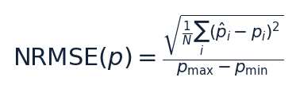
*Equazione 4.1 — NRMSE per parametro. p̂ = valore predetto, p = valore vero, N = numero di campioni; il denominatore (p_max − p_min) normalizza sul range fisico del parametro (0 = perfetto). L'accuratezza riportata è 1 − NRMSE media.*

| Champion | NRMSE v0 | NRMSE T | NRMSE s0 | NRMSE a | NRMSE b | media | accur. |
|---|---|---|---|---|---|---|---|
| Raffaello | 0.499 | 0.240 | 0.068 | 0.348 | 0.378 | 0.307 | 69.34% |
| Leonardo | 0.196 | 0.277 | 0.114 | 0.229 | 0.307 | 0.225 | 77.53% |
| Donatello | 0.180 | 0.169 | 0.093 | 0.215 | 0.105 | 0.152 | 84.75% |
| Michelangelo | 0.197 | 0.260 | 0.093 | 0.220 | 0.271 | 0.208 | 79.18% |

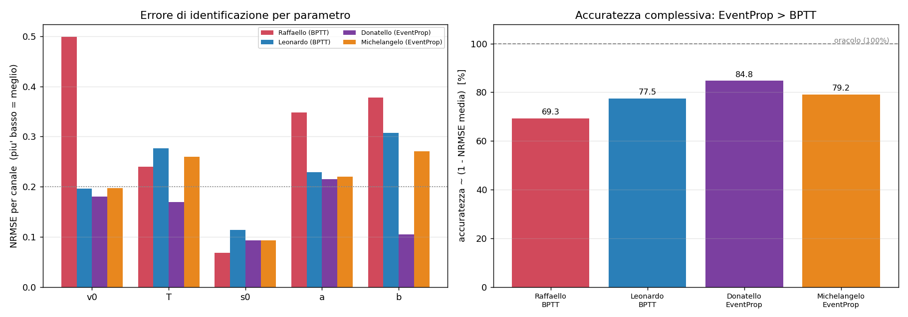
*Figura 4.1 - Errore per parametro (sx) e accuratezza complessiva (dx). I due champion EventProp (Donatello viola, Michelangelo arancione) hanno NRMSE per-canale più uniforme e bassa; Raffaello (rosso) crolla su v0. La linea tratteggiata a 100% è l'oracolo.*

### 4.2 Dove ogni parametro diventa osservabile (stratificazione)

La NRMSE stratificata per famiglia di scenario mostra QUANDO ciascun parametro è osservabile: v0 richiede tratti di free-flow/highway (Raffaello lo sbaglia proprio in urban, dove v0 non è eccitato), a emerge nei transitori di accelerazione (launch), b nelle frenate. È la firma della stessa non-identificabilità strutturale del modello car-following già nota dallo studio.

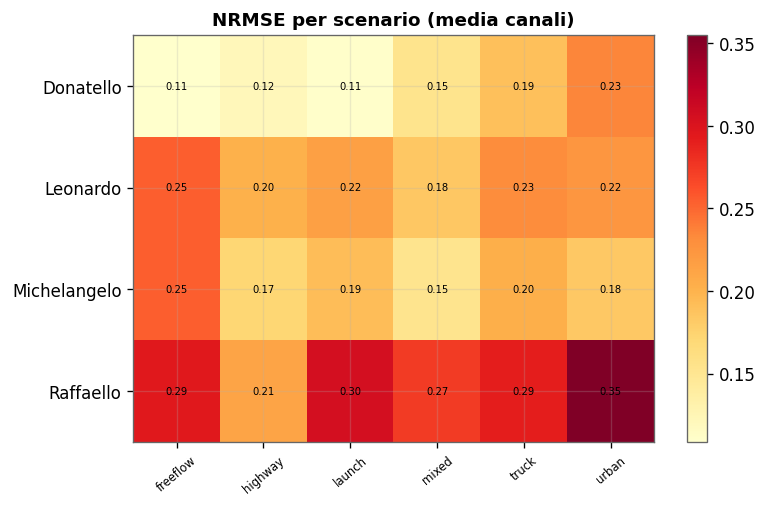
*Figura 4.2 - NRMSE per parametro x famiglia di scenario, per ciascun champion. Le celle più scure segnano dove un parametro resta poco osservabile (es. v0 in urban per Raffaello, b in freeflow per quasi tutti).*

### 4.3 Identificabilità strutturale (FIM ed equifinalità)

La matrice di Fisher (FIM) ha rango pieno (5 su 5): tutti i parametri sono in linea di principio identificabili, nessuno "sotto-eccitato". Ma il numero di condizionamento è enorme (~1.6 miliardi): il problema è fortemente mal-condizionato ("sloppy"), con un insieme di equifinalità stimato in ~29 combinazioni di parametri che producono traiettorie quasi indistinguibili. Il parametro localmente meno identificabile risulta s0, il più identificabile T. In pratica: più set di parametri spiegano ugualmente bene la stessa guida - ecco perché due champion possono avere NRMSE diverse e comportamenti di guida simili.

*Equazione 4.2 — Matrice di Fisher e numero di condizionamento. J = jacobiano delle predizioni rispetto ai 5 parametri; σ_max, σ_min = valori singolari estremi della FIM. κ grande = problema mal-condizionato (sloppy): molti set di parametri producono traiettorie quasi indistinguibili.*

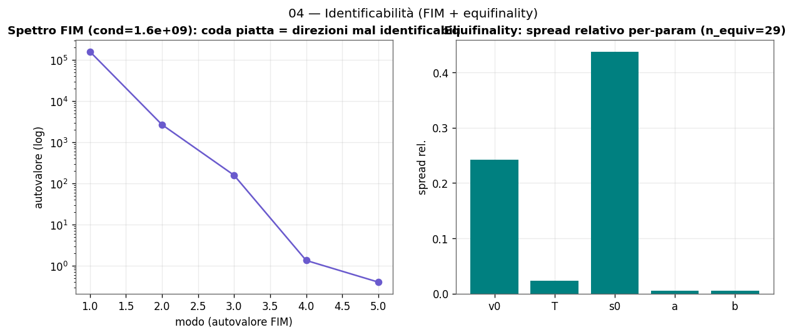
*Figura 4.3 - Analisi di identificabilità via FIM: sensibilità per parametro e struttura di correlazione (il mal-condizionamento è la ragione fisica dell'equifinalità).*

### 4.4 Sensibilità causale e naturalisticità

La sensibilità causale (risposta delle predizioni a interventi controllati sul leader) conferma che T reagisce alla variazione di velocità del leader in tutti i champion; le risposte di a/b differiscono per champion (Donatello mostra una firma causale distinta su s0/b). Sul realismo, il test di naturalisticità (distanza KS tra le distribuzioni di time-gap e jerk della rete e quelle umane) incorona Leonardo come il più "umano" (KS time-gap 0.209, KS jerk 0.089); nessun champion, però, rientra pienamente nella banda naturalistica di riferimento (within_floor = falso per tutti) - un limite residuo, non un difetto di sicurezza.

![Equazione 4.3 — Distanza di Kolmogorov-Smirnov tra la distribuzione della rete e quella umana (per time-gap e jerk). F = funzione di ripartizione empirica; D_KS ∈ [0,1], con 0 = distribuzioni identiche.](figures_validation_v3/eq_ks.png)
*Equazione 4.3 — Distanza di Kolmogorov-Smirnov tra la distribuzione della rete e quella umana (per time-gap e jerk). F = funzione di ripartizione empirica; D_KS ∈ [0,1], con 0 = distribuzioni identiche.*

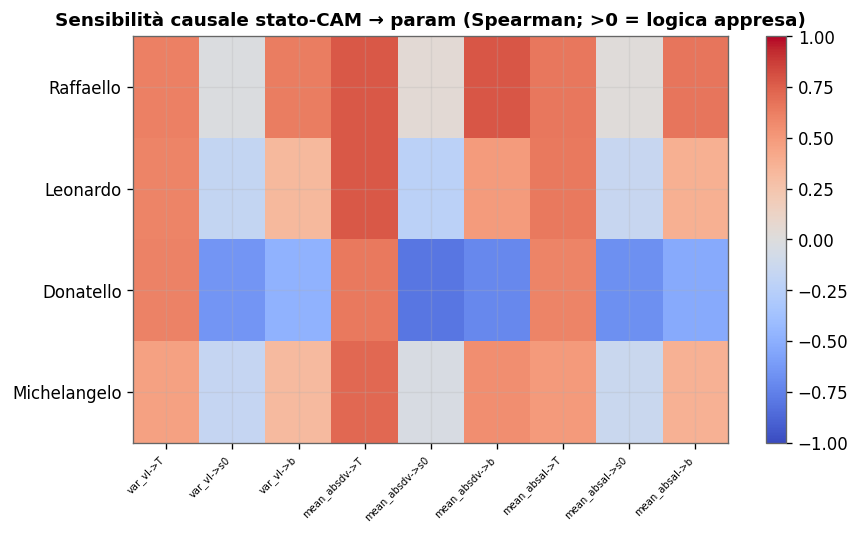
*Figura 4.4 - Sensibilità causale: quanto la stima di ciascun parametro risponde a interventi su velocità leader, |delta-v| e |accelerazione|.*

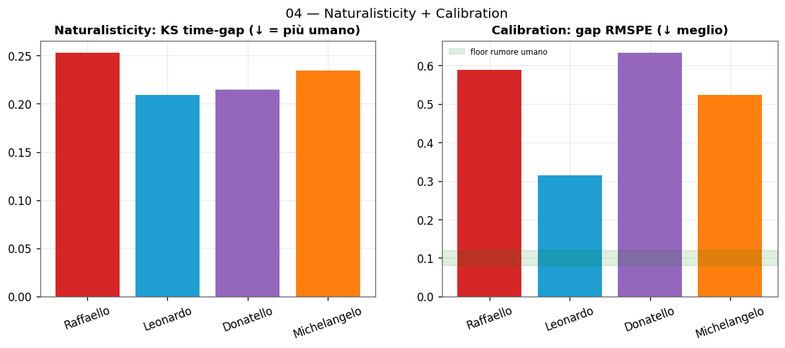
*Figura 4.5 - Naturalisticità/calibrazione: distanza dalle distribuzioni umane di time-gap e jerk. Leonardo è il più naturale; nessuno è ancora dentro la banda di riferimento.*

## 5. Sicurezza closed-loop (Tier 0/1)

### 5.1 Verdetto: sicuri come l'oracolo

In anello chiuso i 4 champion collidono quanto l'oracolo: il tasso di collisione va da 6.67% (Raffaello) a 7.56% (Donatello), contro 7.56% dell'oracolo. Il residuo non è la rete: deriva da geometrie di cut-in fisicamente inevitabili (vedi curva di rottura, 6.3) in cui anche l'oracolo collide. Sul TTC minimo tutti e 4 i champion sono pari o superiori all'oracolo (5.576 s), quindi più cauti. Sul margine di frenata minimo Leonardo (7.63 m) e Michelangelo (7.59 m) superano l'oracolo (7.56 m), mentre Raffaello (7.31 m) e Donatello (7.26 m) restano appena sotto: differenza piccola, che non intacca il tasso di collisione (allineato all'oracolo). Nota: Leonardo mostra un picco isolato di DRAC (97.45 m/s2) in un singolo scenario - un caso-limite da tenere d'occhio, non un pattern.

| Sorgente | collis. | brake margin | min TTC | min gap | impact dv | max DRAC | rms jerk |
|---|---|---|---|---|---|---|---|
| Raffaello | 6.67% | 7.312 | 6.726 | 7.475 | 0.323 | 10.71 | 2.103 |
| Leonardo | 7.11% | 7.634 | 7.025 | 7.804 | 0.348 | 97.45 | 2.153 |
| Donatello | 7.56% | 7.259 | 5.604 | 7.428 | 0.361 | 24.61 | 2.221 |
| Michelangelo | 7.11% | 7.593 | 7.126 | 7.756 | 0.332 | 18.65 | 2.135 |
| Master Splinter | 7.56% | 7.561 | 5.576 | 7.734 | 0.368 | 13.57 | 2.340 |

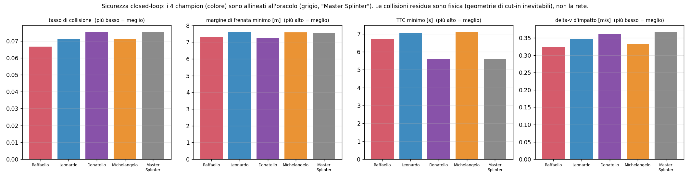
*Figura 5.1 - Sicurezza cross-champion. I 4 champion (colore) sono allineati o migliori dell'oracolo (grigio) su collisione, margine di frenata, TTC e delta-v d'impatto.*

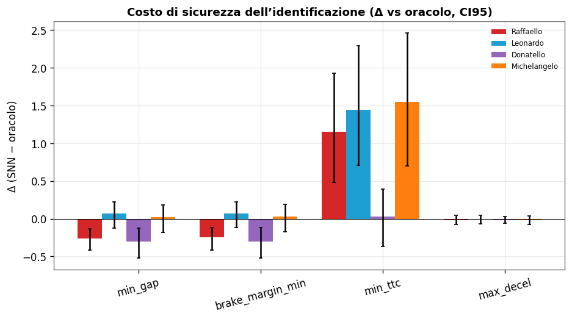
*Figura 5.2 - Delta di ciascuna metrica di sicurezza rispetto all'oracolo: valori dal lato "più sicuro" confermano il profilo conservativo dei champion.*

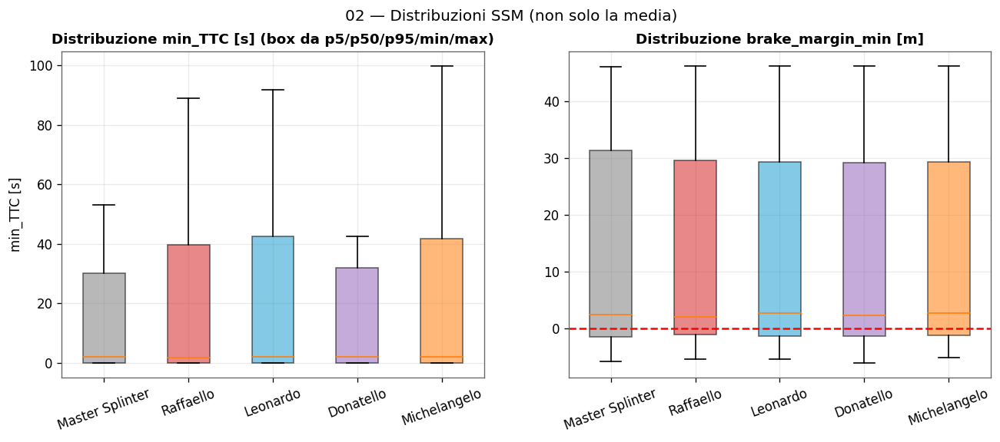
*Figura 5.3 - Distribuzioni delle surrogate safety measures (non solo la media): le code restano lontane dalle soglie critiche.*

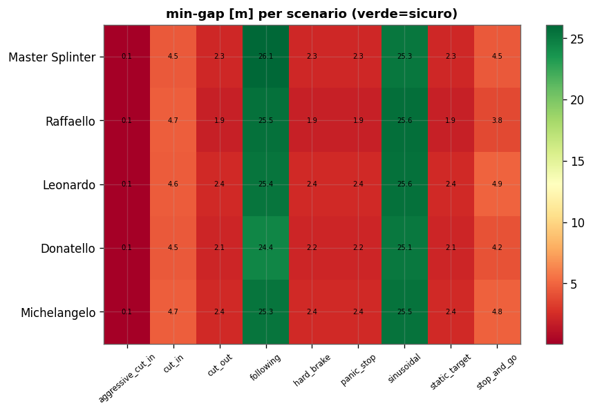
*Figura 5.4 - Gap minimo per tipologia di scenario: il cut-in è il più stressante, ma il gap resta sopra la linea di collisione tranne nelle geometrie impossibili.*

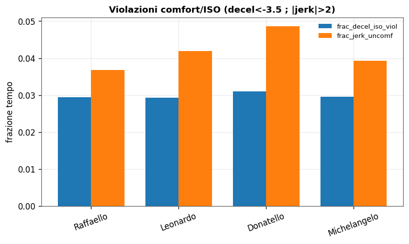
*Figura 5.5 - Comfort ISO (accelerazione/jerk): i champion sono comparabili all'oracolo, con accelerazioni tendenzialmente più dolci.*

### 5.2 Traiettorie closed-loop

Il modo più diretto di osservare la guida è la traiettoria in anello chiuso: gap, velocità e accelerazione dell'ego nel tempo, per ciascun champion sovrapposto all'oracolo. La run produce le tracce per i 5 scenari (cut-in, hard-brake, stop&go, panic-stop, aggressive cut-in) in results/evaluate/v3_TURTLE_POWER!!!/09_Trajectories/. Se ne riportano due rappresentative: nel cut-in il gap crolla al taglio e tutte le varianti lo recuperano dolcemente senza toccare la linea di collisione; nell'hard-brake l'ego insegue la decelerazione del leader mantenendo il margine.

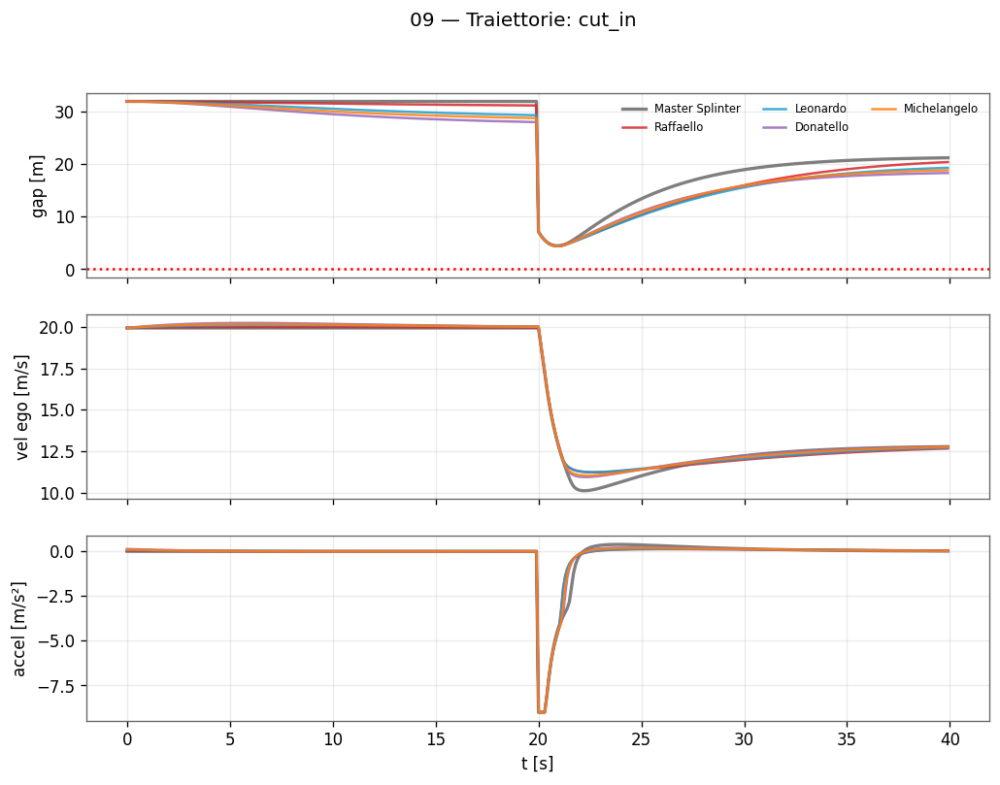
*Figura 5.6 - Traiettorie closed-loop nel cut-in: gap, velocità e accelerazione. Il gap si recupera senza collisione (salvo le geometrie impossibili, dove collide anche l'oracolo).*

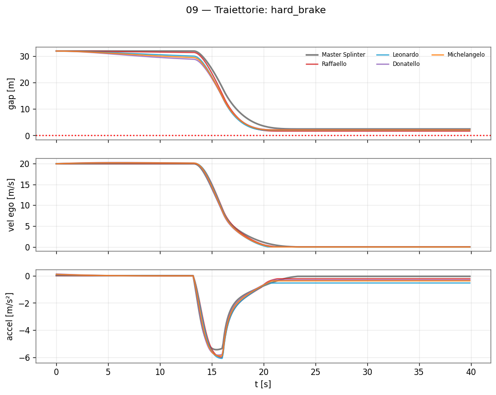
*Figura 5.7 - Traiettorie closed-loop nell'hard-brake: l'ego segue la frenata del leader mantenendo il margine di sicurezza.*

## 6. Robustezza fisica e curva di rottura (Tier 1)

### 6.1 Plant: asciutto, bagnato, ghiaccio

Ripetendo gli scenari sotto attrito degradato, la collisione sale con la strada, non con la rete: da ~8.15% su asciutto a ~26.67% su bagnato fino a ~59.26% su ghiaccio - e l'oracolo si comporta uguale (63.70% su ghiaccio). Il ~60% di collisioni su ghiaccio è un limite fisico (coefficiente d'attrito troppo basso per fermarsi in tempo), non un errore della SNN; anzi, su ghiaccio i champion mantengono un margine di frenata leggermente migliore dell'oracolo.

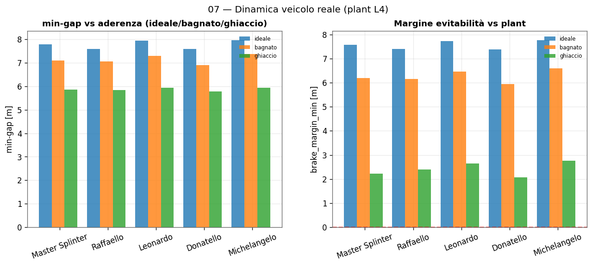
*Figura 6.1 - Collisione e margine di frenata su asciutto/bagnato/ghiaccio. La degradazione è guidata dall'attrito ed è identica tra champion e oracolo.*

### 6.2 Reachability e curva di rottura

L'analisi di reachability (gap minimo di sicurezza al variare del delta-v iniziale) mostra un inviluppo praticamente sovrapposto a quello dell'oracolo, marginalmente più conservativo ai delta-v alti (es. a delta-v=15 m/s i champion chiedono ~17-18 m contro i 16.7 m dell'oracolo). La curva di rottura conferma il punto centrale sulla sicurezza: sotto panic-braking fino a 10 m/s2 la collisione resta a zero per tutti; nel cut-in la collisione cresce al restringersi del gap ESATTAMENTE come per l'oracolo. La rete si rompe solo dove si rompe la fisica.

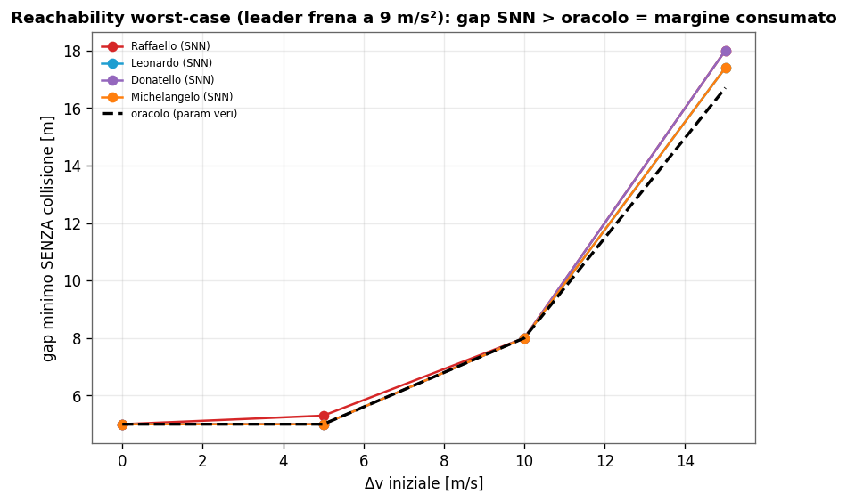
*Figura 6.2 - Inviluppo di gap-sicuro vs delta-v iniziale: champion (colore) ~ oracolo (grigio), leggermente più cauti.*

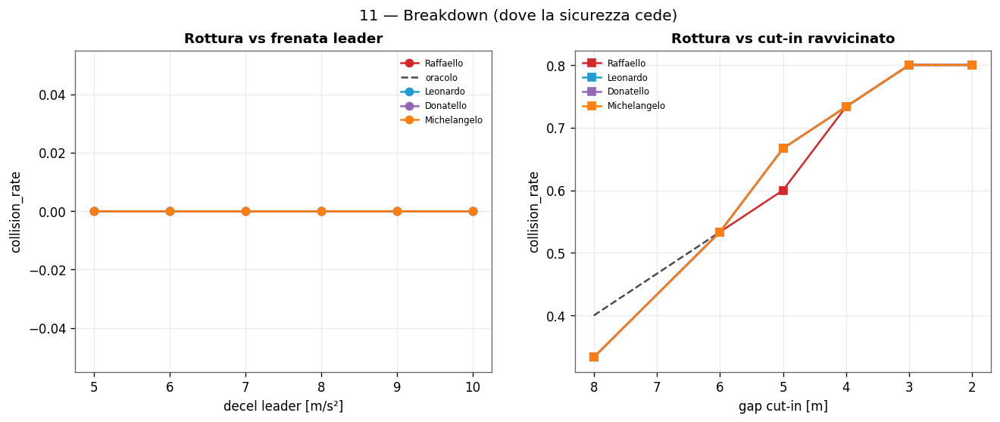
*Figura 6.3 - Curva di rottura: collisione vs severità (panic-decel e gap di cut-in). La frontiera dei champion coincide con quella dell'oracolo.*

## 7. Traffico: micro -> meso -> macro (Tier 3)

### 7.1 String stability (singolo veicolo)

Il guadagno testa->coda è <1 per tutti i champion (da 0.13 a 0.21), quindi le perturbazioni si smorzano. Nessuno è strettamente monotono come l'ideale; Michelangelo mostra un picco di amplificazione transitoria a certe frequenze (peak_gain 3.82) pur restando globalmente stabile.

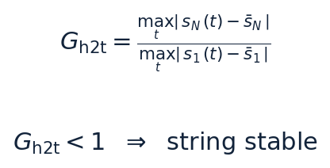
*Equazione 7.1 — Guadagno testa→coda (string stability). s_1, s_N = perturbazione del gap del primo e dell'ultimo veicolo del plotone; il plotone è string-stable se G_h2t < 1 (le perturbazioni si smorzano lungo la catena).*

### 7.2 Mesoscopico: plotone di 12 veicoli

In un plotone in catena di 12 veicoli, tutti i champion sono string-stable a livello testa->coda (gain 0.11-0.15, tutti <1) e nessuno collide; l'onda in testa si smorza lungo la catena. È il risultato di traffico più importante: i 5 numeri predetti, propagati su una fila di veicoli, non generano stop-and-go artificiali.

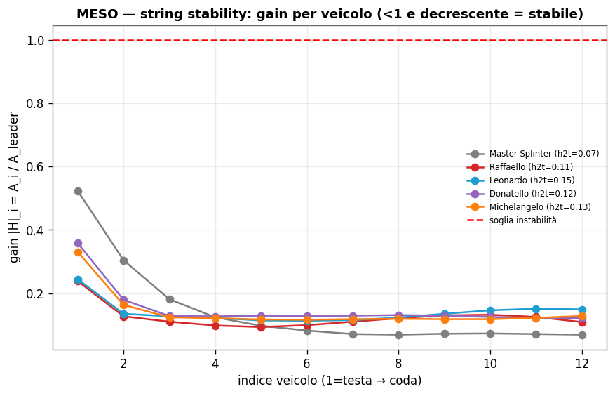
*Figura 7.1 - Guadagno per veicolo lungo il plotone: tutte le curve <1 e decrescenti = catena stabile.*

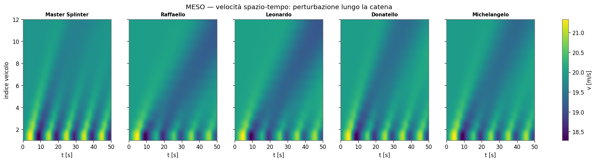
*Figura 7.2 - Heatmap spazio-tempo della velocità nel plotone: la perturbazione iniziale si attenua a valle.*

### 7.3 Macroscopico: diagramma fondamentale

Sul livello macro (simulazione ad anello -> diagramma fondamentale flusso-densità) emerge in modo netto l'effetto dell'errore di identificazione. Michelangelo, Leonardo e Donatello producono velocità di free-flow plausibili (65.70-71.10 km/h, vicine ai 74.30 km/h dell'oracolo), mentre Raffaello - che sbaglia v0 - gonfia la free-flow a 106.70 km/h e con essa la capacità (903 veic/h contro i ~765 dell'oracolo): il diagramma fondamentale ne esce distorto. L'insorgenza dell'instabilità stop-and-go (densità critica) è invece uniforme tra i modelli. Il livello macro è riportato con l'avvertenza sull'artefatto v0 di Raffaello.

![Equazione 7.2 — Diagramma fondamentale del traffico. ρ = densità [veicoli/km]; v(ρ) = velocità media in funzione della densità; q = flusso [veicoli/h]. La curva q(ρ) sintetizza capacità e densità critica.](figures_validation_v3/eq_fd.png)
*Equazione 7.2 — Diagramma fondamentale del traffico. ρ = densità [veicoli/km]; v(ρ) = velocità media in funzione della densità; q = flusso [veicoli/h]. La curva q(ρ) sintetizza capacità e densità critica.*

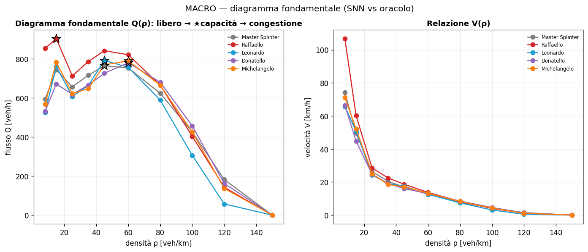
*Figura 7.3 - Diagramma fondamentale (flusso vs densità). La curva di Raffaello è spostata in alto per la sovrastima di v0; gli altri champion seguono l'oracolo.*

## 8. Robustezza V2X (Tier 2)

### 8.1 Il "hold-last-CAM" maschera la perdita di pacchetti

Il canale V2X è modellato in modo realistico: probabilità di consegna (PDR), latenza, jitter, perdite a raffica (Gilbert-Elliott), blackout, con tracciamento dell'Age-of-Information (AoI). Quando un pacchetto CAM manca, la strategia di default "hold-last" mantiene l'ultimo stato ricevuto (zero-order hold). Confrontando le strategie: con hold-last (o dead-reckoning) la collisione resta al livello nominale (~8.15%); ma in modalità "blind" - la rete lasciata sola, senza alcun handler di perdita - la collisione ESPLODE a ~66.67%. Lettura onesta: la robustezza alla perdita di pacchetti osservata NON è una proprietà intrinseca della SNN, ma dell'handler hold-last che le sta davanti. La rete da sola non è robusta al packet-loss; il livello di canale la protegge.

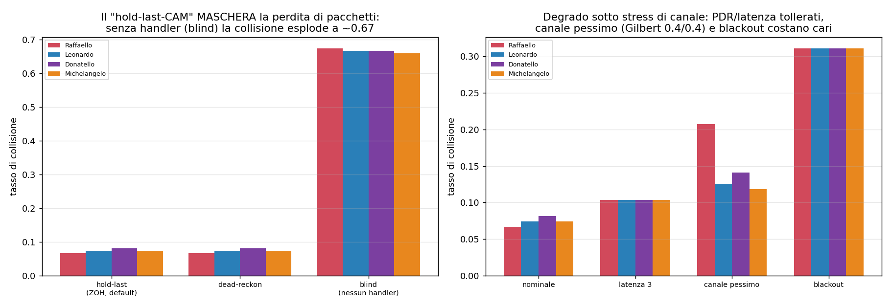
*Figura 8.1 - Sinistra: collisione per strategia di gestione perdita (hold-last/dead-reckon/blind); "blind" rivela la fragilità della rete nuda. Destra: degrado sotto stress di canale (PDR/latenza tollerati, canale pessimo e blackout costosi).*

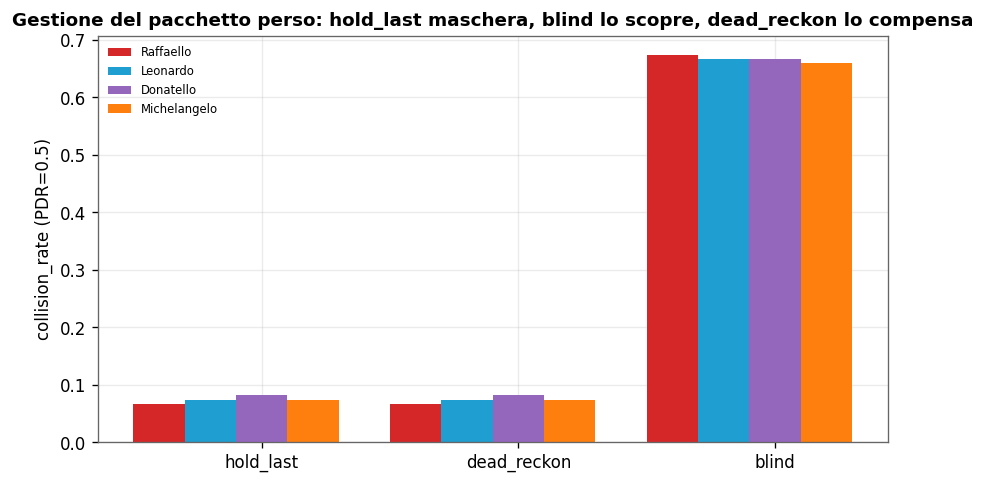
*Figura 8.2 - Dettaglio per champion delle tre strategie di gestione della perdita.*

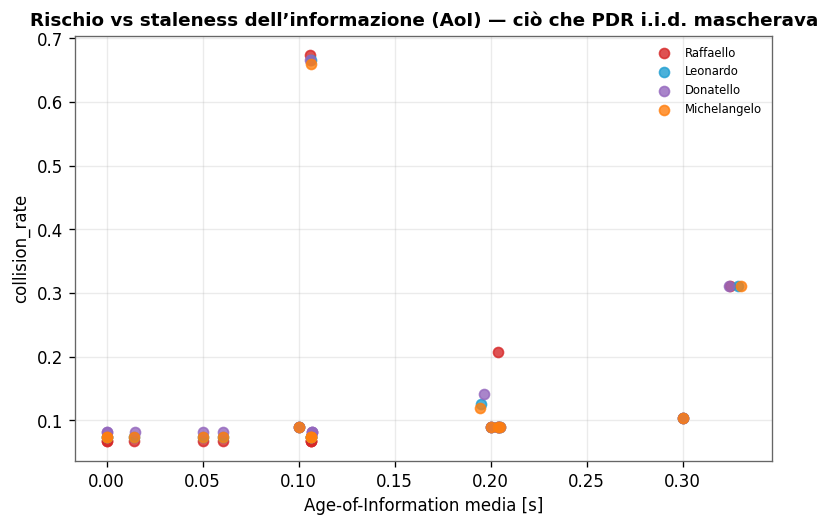
*Figura 8.3 - Age-of-Information: l'età dell'ultimo dato ricevuto cresce con latenza e blackout, spiegando il degrado.*

## 9. Profilo FPGA: quantizzazione, energia, salute della rete (Tier 5)

> **Nota.** Questa sezione è il SOMMARIO del profilo FPGA nel contesto dell'evaluate a 6-tier: i tre findings chiave (quantizzazione fixed-point, energia, discriminante di stabilità). Il profilo hardware COMPLETO — readiness/scorecard, pesi po2, fixed-point, spiking, energia, timing/WCET, risorse/DSE, SEU, I/O-HIL, thermal (45 figure su 10 sezioni) — è nel documento dedicato FPGA_REPORT (Fase A pre-silicio).

### 9.1 Quantizzazione: fixed-point e potenze-di-due

La rete tollera una quantizzazione aggressiva. In virgola fissa l'errore di identificazione resta praticamente invariato fino a 2 bit di parte frazionaria (es. Donatello: 1.480 in float -> 1.478 a 2 bit). Con pesi a potenze-di-due (po2, che trasformano la moltiplicazione in uno shift-add) l'errore è insensibile al numero di bit (dipende dall'esponente, non dalla mantissa) e, soprattutto, viene ASSORBITO dal training: il "peso di 2" è già quello nativo. L'ablazione dei pesi mostra delta_qat_absorbed <= 0 per 3 champion su 4 (accendere po2 non peggiora, anzi migliora), mentre Raffaello subisce un piccolo aumento (+0.16).

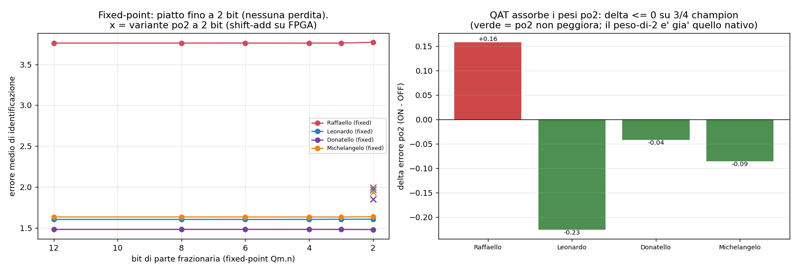
*Figura 9.1 - Sinistra: errore vs bit in fixed-point (piatto fino a 2 bit); le x segnano la variante po2. Destra: il QAT assorbe i pesi po2 (barre verdi = po2 non peggiora l'errore).*

### 9.2 Energia

Il vantaggio energetico per inferenza è modesto: da 4.77x a 6.01x rispetto a una ANN densa equivalente. Il vantaggio non deriva dalla sparsità: queste reti sparano ~13.31-19.00%, non l'1-2% talvolta attribuito alle SNN, e le operazioni sinaptiche (SynOps) eguagliano o superano i MAC dell'ANN. A parità di costo per operazione la SNN sarebbe in svantaggio; il guadagno viene dal minor costo unitario di un accumulo (AC) rispetto a un MAC (modello di Horowitz 2014), amplificato su FPGA dai pesi po2 (AC = shift+add) e dallo 0 DSP. Gli EventProp non vincono sull'energia: Donatello (il più contrattivo) ha anzi il vantaggio più basso (4.77x) perché spara di più (19.00%); il loro vantaggio FPGA sta altrove, in ρ<1 e 0 neuroni morti (§9.3). Il profilo op-count dettagliato e la stima energetica per architettura sono in FPGA_REPORT.

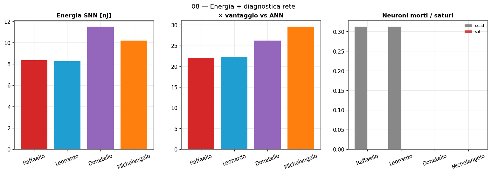
*Figura 9.2 - Energia per inferenza e conteggio operazioni per champion.*

### 9.3 Salute della rete e il discriminante di stabilità

Qui si consuma la differenza hardware tra le due famiglie. I champion EventProp hanno ZERO neuroni morti e una ricorrenza CONTRATTIVA (ρ 0.05 per Donatello, 0.39 per Michelangelo); i champion BPTT hanno ~31.25% di neuroni morti e una ricorrenza ESPANSIVA (ρ 1.16 per Leonardo, 2.99 per Raffaello). Su FPGA, ρ<1 garantisce uno stato limitato in aritmetica a virgola fissa (l'errore di quantizzazione si smorza), mentre ρ>1 espone al rischio di amplificazione/overflow e richiederebbe guardband e saturazione esplicita. È il motivo tecnico per cui EventProp è più "FPGA-friendly", e per cui Donatello - contrattivo al massimo e più accurato - è il candidato naturale al deploy.

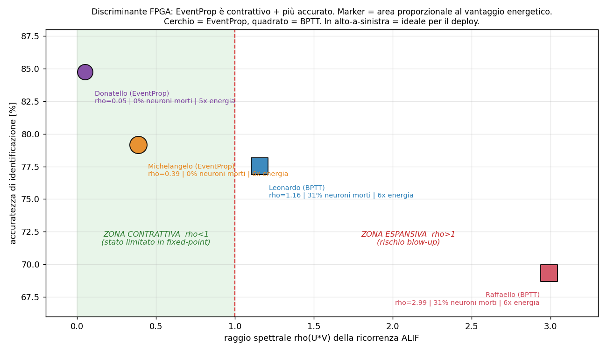
*Figura 9.3 - Il discriminante FPGA in un solo grafico: raggio spettrale (x) vs accuratezza (y), area del marker ~ vantaggio energetico. La zona verde (ρ<1) è quella sicura in fixed-point; Donatello e Michelangelo (cerchi) ci stanno, i BPTT (quadrati) no.*

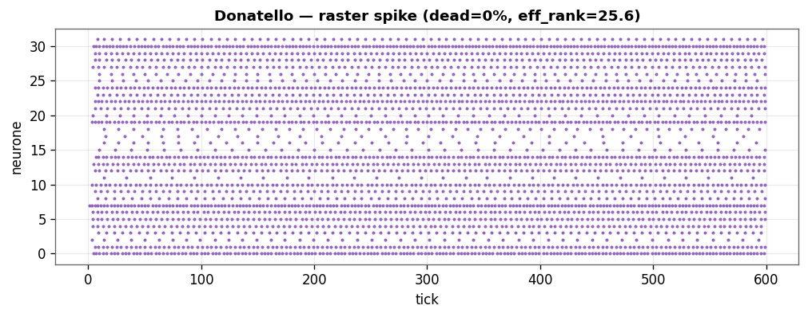
*Figura 9.4a - Raster/attività di Donatello (EventProp): attività distribuita su tutti i neuroni, NESSUN neurone spento (0 morti) -- nota: non è iper-sparsa, spara ~19%.*

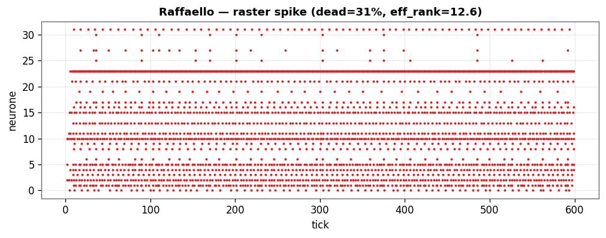
*Figura 9.4b - Raster di Raffaello (BPTT): ~31% di neuroni MAI attivi (capacità sprecata) -- la differenza con EventProp è l'utilizzo dei neuroni, non il tasso di spike.*

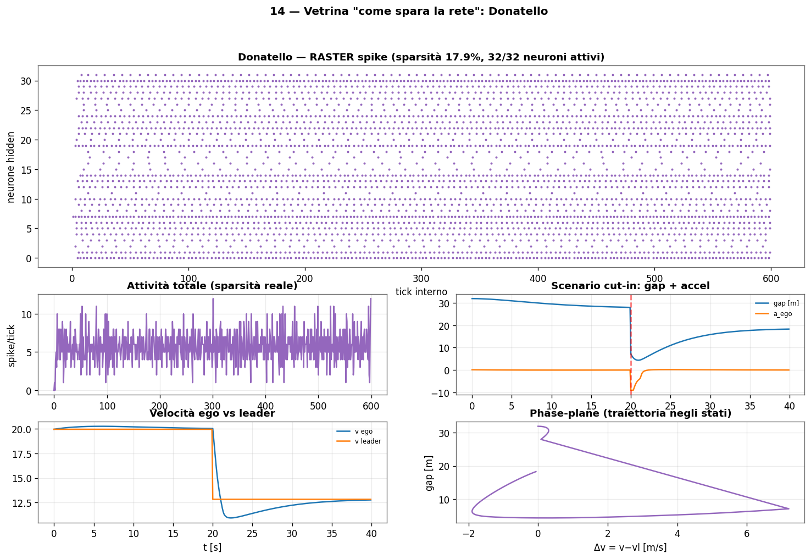
*Figura 9.5 - Vetrina di Donatello: identificazione, guida closed-loop e spiking su un episodio reale. La run contiene la vetrina per tutti e 4 i champion più una GIF "in diretta" (14_Showcase/showcase_*.png e showcase_live_Raffaello.gif).*

## 10. Verdetto consolidato e raccomandazione di deploy

| Champion | Sicurezza | Accuratezza | FPGA (ρ, morti) | Sintesi |
|---|---|---|---|---|
| Raffaello (BPTT) | ok (~oracolo) | 69.34% (v0 mal-id) | ρ 2.99, 31% morti | sconsigliato (instabile + v0) |
| Leonardo (BPTT) | ok, più umano | 77.53% | ρ 1.16, 31% morti | ottimo software, ma espansivo |
| Donatello (EventProp) | ok (~oracolo) | 84.75% (best) | ρ 0.05, 0 morti | CANDIDATO DEPLOY |
| Michelangelo (EventProp) | ok | 79.18% | ρ 0.39, 0 morti | runner-up deploy |

Raccomandazione. Per il deploy FPGA la scelta è Donatello: unisce la migliore accuratezza, una ricorrenza fortemente contrattiva (ρ~0.05, la più sicura in fixed-point), zero neuroni morti e sicurezza pari all'oracolo. Michelangelo è il runner-up (contrattivo, buona accuratezza). Leonardo resta il migliore sul piano software (più umano/naturale) ma la sua ricorrenza espansiva (ρ>1) imporrebbe guardband in hardware. Raffaello è sconsigliato: mis-identifica v0 (distorce il macro), è il più espansivo (ρ~3) e ha il 31% di neuroni morti.

> **Nota.** In una frase: lo studio EventProp si chiude confermando il fronte di Pareto - BPTT vince di poco sulla fisica, EventProp vince su accuratezza, stabilità e idoneità al silicio - e indica Donatello (EventProp) come la rete da portare su FPGA.

## 11. Limiti residui e prossimi passi

Limiti onesti di questa validazione: (1) nessun champion rientra ancora pienamente nella banda naturalistica umana (within_floor falso); (2) il problema resta mal-condizionato (cond ~1.6e9, equifinalità ~29 set) - più parametri spiegano la stessa guida; (3) i champion BPTT hanno neuroni morti e ricorrenza espansiva; (4) le collisioni su ghiaccio e nei cut-in impossibili sono limiti fisici del plant, non correggibili dalla rete; (5) la robustezza V2X osservata dipende dall'handler hold-last, non dalla rete nuda. Il livello macro è ora riportato ma con l'avvertenza sull'artefatto v0 di Raffaello.

Prossimi passi (fase FPGA). La presentazione della valutazione hardware è già progettata e bloccata per la Fase A "software_now" (pre-silicio) in document/FPGA_EVALUATE_DESIGN.md (il progetto) e il quadro tecnico in document/FPGA_EVALUATION_FRAMEWORK.md; il deliverable ESEGUITO di quella Fase A — la FPGA-evaluate profonda (45 figure su 10 sezioni) — è il FPGA_REPORT. Restano aperte la Fase B (HDL) e la Fase C (board): la conversione della SNN in HDL non è immediata (i tool tipo FINN non supportano il neurone ALIF-PINN; la strada probabile è import in Simulink + HDL Coder), ed è documentata come problema aperto. Su questo evaluate, il candidato Donatello è il punto di partenza del percorso di deploy.

## 12. Riproducibilità e mappa dei file

| Cosa | Dove |
|---|---|
| Risultati evaluate v3 (15 sezioni, csv+png) | results/evaluate/v3_TURTLE_POWER!!!/ |
| Notebook champion | Eval_v3_TURTLE_POWER.ipynb |
| Builder del notebook | scripts/_build_eval_v3_notebook.py |
| Verifica manifest post-run | scripts/verify_eval_v3.py |
| Questo report (generatore) | scripts/build_validation_report_v3.py |
| Simulatore closed-loop + plant/canale | utils/closed_loop_eval.py |
| Identificazione closed-loop + V2X sweep | scripts/closed_loop_identify.py |
| Identificabilità (FIM/causale/...) | utils/identifiability.py |
| Quantizzazione (Qm.n/po2) | utils/quantize.py |
| Diagnostica rete (dead/ρ/raster) | utils/net_diagnostics.py |
| Documento-master dello studio | document/EVENTPROP_STATUS.md |
| Design valutazione FPGA (progetto) | document/FPGA_EVALUATE_DESIGN.md / FPGA_EVALUATION_FRAMEWORK.md |
| Profilo FPGA profondo — Fase A (45 figure, 10 sez.) | document/FPGA_REPORT.md / .pdf |
| Architettura/fisica (come funziona) | document/HOW_IT_WORKS_v3.md / GLOSSARY.md |

Le figure-chiave di questo report (accuratezza, discriminante FPGA, sicurezza, quantizzazione, V2X) sono RICOSTRUITE dai CSV eseguendo "python scripts/build_validation_report_v3.py". Le figure di dettaglio (stratificazione, FIM, causale, naturalisticità, traiettorie, plant, reachability, breakdown, string/meso/macro, raster, showcase) sono RIUSATE dai PNG genuini prodotti dal notebook v3. La run completa contiene 46 figure; qui ne è riportato un sottoinsieme curato - il resto è nelle 15 sottocartelle dei risultati.

## 13. Riferimenti

| Riferimento | Tema |
|---|---|
| Greenshields, B.D. (1935). A study of traffic capacity. Highway Research Board Proceedings 14, 448–477. | Diagramma fondamentale (§7.3) |
| Massey, F.J. (1951). The Kolmogorov-Smirnov test for goodness of fit. J. American Statistical Association 46(253), 68–78. | Distanza di Kolmogorov-Smirnov (§4.4) |
| Gilbert, E.N. (1960). Capacity of a burst-noise channel. Bell System Technical Journal 39, 1253–1265. | Modello Gilbert-Elliott (§8.1) |
| Hayward, J.C. (1972). Near-miss determination through use of a scale of danger. Highway Research Record 384, 24–34. | Time-to-collision / SSM (§3.2) |
| ISO 2631-1 (1997). Mechanical vibration and shock — Evaluation of human exposure to whole-body vibration. ISO, Ginevra. | Soglia comfort/jerk (§5.1) |
| Transtrum, M.K., Machta, B.B., Sethna, J.P. (2011). Geometry of nonlinear least squares with applications to sloppy models and optimization. Physical Review E 83, 036701. | FIM, modelli sloppy (§4.3) |
| Kaul, S., Yates, R., Gruteser, M. (2012). Real-time status: how often should one update? IEEE INFOCOM, 2731–2735. | Age-of-Information (§8.1) |
| Treiber, M., Kesting, A. (2013). Traffic Flow Dynamics: Data, Models and Simulation. Springer. | ACC-IIDM, calibrazione, string stability (§1, §4, §7) |
| Horowitz, M. (2014). Computing's energy problem (and what we can do about it). IEEE Int. Solid-State Circuits Conf. (ISSCC), 10–14. | Energia AC/MAC (§9.2) |
| Bellec, G., Salaj, D., Subramoney, A., Legenstein, R., Maass, W. (2018). Long short-term memory and learning-to-learn in networks of spiking neurons. Advances in Neural Information Processing Systems (NeurIPS) 31. | Neurone ALIF (§2.1) |
| Neftci, E.O., Mostafa, H., Zenke, F. (2019). Surrogate gradient learning in spiking neural networks. IEEE Signal Processing Magazine 36(6), 51–63. | BPTT+surrogate (§2.2) |
| Raissi, M., Perdikaris, P., Karniadakis, G.E. (2019). Physics-informed neural networks: a deep learning framework for solving forward and inverse problems involving nonlinear PDEs. J. Computational Physics 378, 686–707. | Loss PINN (§2.1) |
| ETSI EN 302 637-2 (2019). Intelligent Transport Systems; Cooperative Awareness Basic Service (CAM). ETSI. | V2X / CAM (§8.1) |
| Wunderlich, T.C., Pehle, C. (2021). Event-based backpropagation can compute exact gradients for spiking neural networks. Scientific Reports 11, 12829. | EventProp (§2.2) |
| Mishchenko, K., Defazio, A. (2023). Prodigy: an expeditiously adaptive parameter-free learner. arXiv:2306.06101. | Ottimizzatore Prodigy (§2.3) |
