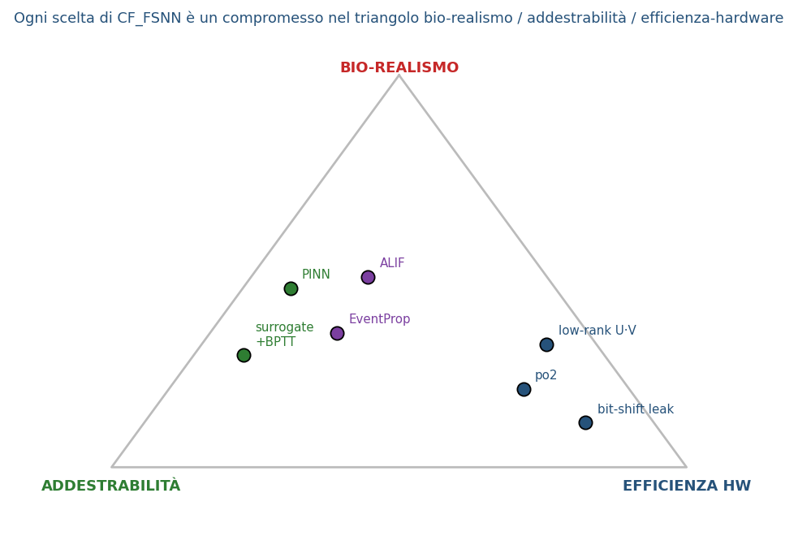

## {.center}

::: {.assertion}
Una rete spiking «cerebrale» (Spiking Neural Network) osserva un'auto e ne ricava le 5 impostazioni
del suo cruise-control (ACC) — abbastanza efficiente da girare su un FPGA da ~200 €.
:::

## Nel modo di guidare si nascondono 5 abitudini: le ricaviamo guardando

::: {.notes}
Ogni conducente ha uno "stile" — quanto tiene distanza, quanto accelera, quanto frena. Il problema
inverso: dalla traiettoria osservata (posizione, velocità nel tempo) risaliamo ai 5 parametri che la
generano, senza conoscerli a priori. È il cuore del progetto: identificazione, non solo classificazione.
:::

# Atto 1 — Le reti spiking (SNN), da zero

## Le reti neurali hanno tre generazioni; le spiking sono la terza

::: {.assertion}
Percettrone (soglia dura) → rete neurale artificiale (ANN, numeri continui) → rete spiking
(SNN, eventi nel tempo): ogni generazione aggiunge espressività, l'ultima aggiunge il tempo.
:::

::: {.notes}
Prima generazione: il percettrone di Rosenblatt, una soglia dura, on/off, niente da allenare col
gradiente. Seconda generazione: le ANN moderne (MLP, CNN, Transformer) — attivazioni continue e
differenziabili, allenate con backpropagation. Terza generazione: le SNN — i neuroni comunicano con
impulsi discreti (spike) e il TEMPO in cui arrivano porta informazione, non solo il "quanto". Questa
terza generazione è biologicamente più plausibile ed è quella che useremo.
:::

## Un neurone «tiene un numero», e la rete lo trasforma a strati

::: {.notes}
In una ANN classica ogni neurone mantiene un numero continuo (l'attivazione) e lo passa allo strato
successivo moltiplicato per pesi e sommato. È come un dimmer: sempre "acceso", con un livello che sale
o scende in modo continuo. Bene per riconoscere pattern statici; ma non c'è alcuna nozione di "quando"
succede qualcosa — solo "quanto".
:::

## Un neurone spiking non è sempre acceso: «scatta» solo a eventi (spike)

::: {.notes}
La SNN è l'opposto del dimmer: è un interruttore Morse, silenzioso finché non succede un evento. Il
neurone integra i segnali in ingresso e resta a zero finché non supera una soglia — poi emette un
impulso (spike) e si resetta. L'informazione non è nell'ampiezza del segnale ma nel TEMPO e nel
PATTERN degli spike. Rottura dell'analogia dimmer/Morse: qui semina già l'argomento energia — un
neurone silenzioso non consuma quasi nulla, a differenza del dimmer sempre acceso.
:::

## Il neurone LIF è un secchio che perde: riempi → superi la linea → scatti → svuoti

::: {.notes}
Il modello Leaky Integrate-and-Fire (LIF) è il mattone base delle SNN. Analogia: un secchio che perde
— l'ingresso lo riempie, una piccola perdita continua lo svuota lentamente, e se il livello supera la
linea di soglia il secchio "scatta" (spike) e si svuota di colpo, ripartendo da zero. Dove si rompe
l'analogia: l'uscita del neurone è tutto-o-niente (spike o non-spike), non c'è una via di mezzo come
per un secchio che trabocca gradualmente — e conta il TEMPO in cui scatta, non l'ampiezza del
traboccamento.
:::

## La soglia adattiva (ALIF) «stanca» il neurone → memoria a breve termine

::: {.notes}
Il neurone Adaptive-LIF (ALIF) aggiunge una soglia che sale dopo ogni spike e poi recupera lentamente
(su una scala di circa 100 millisecondi). Analogia: la stanchezza — dopo uno sforzo, serve più stimolo
per "scattare" di nuovo, poi ci si riprende col tempo. Questo dà al neurone una forma di memoria a
breve termine, utile per riconoscere pattern estesi nel tempo come una traiettoria di guida.
:::

::: {.content-visible when-profile="full"}
## Dentro è tutto spiking: come si codifica un input continuo

::: {.notes}
Le grandezze osservate (posizione, velocità, distanza) sono numeri continui, ma la SNN lavora solo con
spike. Serve quindi una codifica: si trasforma il segnale continuo in treni di impulsi (rate coding,
latency coding, o schemi ibridi) prima di darlo in pasto alla rete, e all'uscita si decodifica di nuovo
in un valore continuo (i 5 parametri stimati). Il datapath completo è: encoder → strati SNN ricorrenti
→ decoder.
:::
:::

## La ricorrenza è un'eco: >1 esplode, <<1 dimentica, ~1 = memoria utile

::: {.notes}
Molte SNN per serie temporali usano connessioni ricorrenti (l'uscita di uno strato rientra come
ingresso). Il raggio spettrale (ρ) della matrice ricorrente ne misura la stabilità. Analogia: un'eco in
un canyon — se il raggio spettrale è maggiore di 1, l'eco si amplifica all'infinito (la rete esplode,
instabile); se è molto minore di 1, l'eco si spegne subito (la rete dimentica tutto, nessuna memoria);
attorno a 1 c'è la zona utile, dove l'eco persiste abbastanza da portare informazione ma senza
esplodere. Va calibrato con cura.
:::

## Ma lo spike non ha derivata → il backprop classico non basta

::: {.notes}
Il backpropagation classico richiede che ogni funzione della rete sia derivabile, per calcolare come
un piccolo cambiamento nei pesi cambia l'errore. Ma la funzione che genera lo spike è un gradino: zero
finché la soglia non è superata, poi un salto istantaneo a 1. Analogia: è un dirupo verticale, senza
pendenza — la derivata è zero quasi ovunque e indefinita nel punto di scatto. Il gradiente classico,
calcolato ovunque tranne che nell'istante di spike, è semplicemente nullo: il backprop standard non ha
alcun segnale su cui allenarsi. Servono metodi ad hoc — è il problema che risolvono i prossimi tre
approcci.
:::

::: {.content-visible when-profile="full"}
## Metodo 1: surrogate gradient + BPTT (il dirupo trattato come una rampa)

::: {.notes}
Prima famiglia di soluzioni: durante il passo indietro (backward pass) si sostituisce la derivata vera
(che è zero) con una funzione surrogata continua — ad esempio una sigmoide o un triangolo stretto
attorno alla soglia — che approssima il gradino con una "rampa" morbida. Si combina poi con
Backpropagation Through Time (BPTT), srotolando la rete nel tempo come una RNN. È il metodo più diffuso
in pratica perché riusa l'infrastruttura standard di autograd, ma introduce un bias: il gradiente
usato in allenamento non è quello vero della rete a spike, è quello di un'approssimazione.
:::
:::

## Metodo 2: EventProp — gradiente esatto negli istanti di spike (adjoint)

::: {.notes}
Seconda famiglia: EventProp calcola il gradiente ESATTO del sistema a spike, senza approssimazioni,
sfruttando il metodo adjoint della teoria del controllo. L'idea chiave: tra due spike consecutivi la
dinamica del neurone è liscia e derivabile normalmente; tutta la "difficoltà" del dirupo si concentra
nell'istante preciso dello spike, dove EventProp applica una correzione analitica esatta (basata sulla
pendenza della traiettoria nel momento del salto) invece di ignorarla o approssimarla. Risultato:
gradiente corretto e efficiente in memoria, perché non serve srotolare l'intera storia come in BPTT.
A voce: EventProp è una delle tre famiglie di metodi; la scelta per la NOSTRA rete è nell'Atto 2.
:::

::: {.content-visible when-profile="full"}
## Metodo 3: STDP — apprendimento biologico locale, non supervisionato

::: {.assertion}
Spike-Timing-Dependent Plasticity: chi scatta insieme si lega — nessun errore globale, nessun
backprop, solo la relazione temporale locale tra spike pre- e post-sinaptici.
:::

::: {.notes}
Terza famiglia, di ispirazione biologica: STDP aggiorna ogni sinapsi solo in base all'ORDINE TEMPORALE
locale tra lo spike del neurone a monte (pre-sinaptico) e quello a valle (post-sinaptico) — se il
pre-sinaptico scatta poco prima del post-sinaptico, il collegamento si rinforza; se scatta poco dopo,
si indebolisce. Non serve un errore globale da propagare all'indietro, né un'etichetta supervisionata:
è una regola locale, non supervisionata, che riflette la plasticità sinaptica osservata nel cervello.
Va presentata senza sminuirla: è potente per apprendimento online e non supervisionato, anche se meno
diretta da usare per problemi di regressione supervisionata come il nostro.
:::
:::

## {.center}

::: {.assertion}
Le SNN sono efficienti **ma** difficili da addestrare — la nostra rete affronta proprio questo.
:::

# Atto 2 — La nostra rete

## Il nostro è un problema inverso: osservo la traiettoria, deduco i 5 parametri

::: {.notes}
Attenzione a un equivoco frequente: la nostra rete NON prevede la traiettoria futura — non è una rete
"forward" che risolve un'equazione differenziale come farebbe una PINN classica per la fisica. Il nostro
è il problema INVERSO: osserviamo la traiettoria già avvenuta (gap, velocità, delta-v, velocità del
leader — raccolti ad esempio via V2X) e da essa DEDUCIAMO i 5 parametri del cruise-control che l'hanno
generata. Osservare per dedurre, non calcolare per prevedere. Questo è il filo conduttore di tutto
l'Atto 2.
:::

## La nostra rete: spiking ricorrente, fisica-informata (PINN), addestrata con EventProp, che identifica i 5 parametri ACC

::: {.notes}
Mettiamo insieme tutti i pezzi dell'Atto 1 nella nostra architettura. È una rete SPIKING (i neuroni
scattano a eventi, non sono sempre accesi) RICORRENTE (ha una memoria interna, l'eco calibrata attorno
al raggio spettrale ~1) e FISICA-INFORMATA, cioè una PINN (Physics-Informed Neural Network): non impara
solo dai dati, ma è vincolata a rispettare un modello fisico noto. È addestrata con EventProp, il metodo
a gradiente esatto visto nell'Atto 1 — la scelta giusta per noi perché il nostro è un compito
supervisionato con una loss globale da propagare, non un apprendimento locale non supervisionato come
STDP (che non saprebbe come propagare "l'accelerazione stimata è sbagliata di X" fino ai pesi — è un
limite di identificabilità, non di preferenza). L'uscita sono i 5 parametri che descrivono lo stile di
guida del veicolo osservato.
:::

## La loss PINN sono due allenatori (dati + fisica): una penalità soft, non una regola rigida

::: {.notes}
La loss totale ha due "allenatori" che correggono la rete in parallelo. Il data-coach guarda
l'accelerazione ricostruita a partire dai 5 parametri stimati e la confronta con quella osservata
davvero: se sono diverse, corregge. Il physics-coach guarda se quei 5 parametri, messi dentro
l'equazione del modello ACC-IIDM, restituiscono un comportamento fisicamente plausibile: se la
violano, corregge anche lui. Punto chiave da non fraintendere: è una penalità SOFT, aggiunta alla loss
come termine di regolarizzazione — non è una regola hard-coded che impedisce alla rete di violare la
fisica. La rete PUÒ violarla, ma viene penalizzata quando lo fa. In totale la loss ha 5 componenti con
pesi diversi: dati (1.0), fisica (0.1), un termine di tipo Ornstein-Uhlenbeck sul rumore (0.05),
condizioni al contorno (1.0) e vincolo sul raggio spettrale (0.5) — l'eco dell'Atto 1 che torna qui
come termine di loss vero e proprio.
:::

::: {.content-visible when-profile="full"}
## Il bersaglio fisico è il modello di car-following ACC-IIDM

$$s^* = s_0 + \max\!\left(0,\; v\,T + \frac{v\,\Delta v}{2\sqrt{a\,b}}\right)$$

Il gap desiderato $s^*$ combina un modello IIDM (con esponente $\delta=4$) e un blend CAH; la rete
predice **5 dei 7** parametri del controllore — coolness ($c=0.99$) e $\delta$ restano fissi.

::: {.notes}
Questo è il "physics-coach" reso esplicito: il gap desiderato s* è la distanza di sicurezza che un ACC
dovrebbe mantenere, funzione della velocità v, del time-gap T, della differenza di velocità col leader
Δv, e di due parametri di comfort a (accelerazione) e b (decelerazione). Il modello completo è
IIDM (Improved Intelligent Driver Model, con esponente δ=4) mescolato con un blend CAH (Constant
Acceleration Heuristic) per gestire meglio i transitori. La rete non stima tutti e 7 i parametri del
controllore: ne stima 5, perché 2 — il fattore di "coolness" del blend CAH (fissato a 0.99) e
l'esponente δ (fissato a 4) — sono tenuti costanti per limitare la dimensionalità del problema di
identificazione (è lo stesso tema di identificabilità già incontrato nell'Atto 1 con l'analogia
sloppy/stiff).
:::
:::

## La ricorrenza a basso rango (low-rank) dà memoria potente ma economica

::: {.notes}
La matrice ricorrente che dà alla rete la sua memoria a breve termine è 32×32, cioè 1024 pesi — se
fosse piena. Noi la fattorizziamo come prodotto di due matrici più piccole, U (32×8) per V (8×32): il
risultato ha lo stesso "posto" nella rete (una connessione ricorrente 32×32) ma internamente ne bastano
512 pesi, la metà. È come comprimere un'immagine grande in una versione a bassa risoluzione che, una
volta riportata alla dimensione originale, cattura comunque l'essenziale: si perde un po' di
espressività teorica ma si guadagna moltissimo in memoria — cruciale per un FPGA economico. Il vincolo
sul raggio spettrale dell'Atto 1 si applica proprio al prodotto U·V.
:::

## I pesi potenza-di-due rendono la rete FPGA-economica: «moltiplicare è caro, scorrere è gratis»

::: {.notes}
Ogni peso della rete non è un numero qualsiasi in virgola mobile, ma è vincolato a essere una potenza di
due (power-of-two, po2) — scelto tra 13 livelli possibili. Il perché è tutto hardware: moltiplicare un
segnale per una potenza di due si riduce a uno SHIFT di bit — un'operazione che su un FPGA costa 1 ciclo
di clock e circa 10 LUT (Look-Up Table, le celle logiche configurabili del chip). Moltiplicare per un
numero qualsiasi, invece, richiede un vero moltiplicatore: circa 4 cicli di clock e 100 LUT. Rottura
dell'analogia: non è "moltiplicare più lentamente", è un'operazione strutturalmente diversa e quasi
gratuita — uno spostamento di bit invece che un vero calcolo. Su una rete con migliaia di pesi, questa
differenza si somma in un risparmio enorme di area e potenza sul chip.
:::

::: {.content-visible when-profile="full"}
## Si quantizza senza rompere il training con lo Straight-Through Estimator (STE)

::: {.notes}
Vincolare i pesi a potenze di due durante il forward pass crea lo stesso problema del gradino di spike
visto nell'Atto 1: la funzione di quantizzazione è a gradini, con derivata zero quasi ovunque — il
gradiente vero non direbbe alla rete come aggiustare i pesi. La soluzione è lo Straight-Through
Estimator: nel forward pass si usano i pesi REALMENTE quantizzati (potenza di due, come saranno sul
FPGA), ma nel backward pass il gradiente passa come se la quantizzazione fosse un'identità — cioè la
attraversa senza essere alterato, esattamente come un surrogate gradient fa con lo spike. È lo stesso
principio del Metodo 1 dell'Atto 1, applicato qui ai pesi anziché agli spike. Il costo in accuratezza è
sorprendentemente basso: circa lo 0.2% di errore in più, a fronte di un risparmio hardware enorme.
:::
:::

## Un vincolo sul raggio spettrale tiene l'«eco appena viva» → stabile per costruzione

::: {.notes}
Torniamo all'eco nel canyon dell'Atto 1. Invece di sperare che il raggio spettrale ρ della matrice
ricorrente U·V resti vicino a 1 per fortuna, lo mettiamo esplicitamente in un termine della loss (C11):
durante l'allenamento la rete viene penalizzata se ρ si allontana dalla zona sicura. Risultato: la rete
non è stabile per caso, è stabile per costruzione — un vincolo attivo, non una speranza. Questo chiude
il cerchio con l'Atto 1: la stessa metafora dell'eco che spiegava il problema, qui diventa la soluzione
matematica concreta che lo previene.
:::

::: {.content-visible when-profile="full"}
## Il triangolo: ogni scelta rilegge le altre (bio-realismo ↔ addestrabilità ↔ hardware)

::: {.notes}
Ogni scelta di design che abbiamo visto in questo atto è un compromesso tra tre vertici di un triangolo:
bio-realismo (quanto la rete assomiglia a un cervello reale — spike, ricorrenza, soglie adattive),
addestrabilità (quanto è facile allenarla col gradiente — EventProp, STE, surrogate gradient) ed
efficienza hardware (quanto costa in area, potenza e cicli su un FPGA — low-rank, potenza di due,
raggio spettrale). Nessuna scelta è gratis: il low-rank guadagna in memoria ma perde un po' di
espressività; il po2 guadagna in hardware ma richiede lo STE per restare addestrabile; il vincolo
spettrale guadagna in stabilità ma limita lo spazio dei pesi esplorabili. La nostra rete non è
"ottimale" su nessun singolo vertice — è un punto di equilibrio scelto con cura tra tutti e tre.
:::
:::

## {.center}

::: {.assertion}
Abbiamo una rete accurata, stabile e FPGA-frugale. **Funziona davvero?** →
:::

# Atto 3 — I risultati

## Funziona ed è distribuibile — ecco come lo misuriamo

::: {.assertion}
4 reti campione contro un oracolo, valutate su 6 livelli: dall'errore numerico alla guida reale.
:::

::: {.notes}
Per rispondere "funziona davvero?" mettiamo a confronto 4 reti campione (champion): Raffaello e
Leonardo, allenate con BPTT, contro Donatello e Michelangelo, allenate con EventProp. Il termine di
paragone è un oracolo — "Master Splinter" — cioè il modello ACC-IIDM alimentato con i parametri VERI
del veicolo simulato: è il miglior comportamento possibile, il tetto teorico contro cui misurarsi, non
un concorrente da battere. La valutazione (evaluate) copre 6 livelli e 15 dimensioni, dall'errore
numerico puro (NRMSE) fino al comportamento in closed-loop su strada: giudichiamo il COMPORTAMENTO
della rete, non solo quanto bene ha imparato i numeri.
:::

## Non «vinciamo»: siamo su un fronte di Pareto

::: {.notes}
Non c'è un vincitore assoluto. Il champion BPTT (Raffaello) vince sulla fisica di circa il 5.5% in più
(val_data 0.1926 contro 0.2031 di Donatello) — leggermente più fedele al modello fisico. Ma EventProp
vince su NRMSE, su STABILITÀ (raggio spettrale ρ 0.05–0.39 contro 1.16–2.99 di BPTT) e su
FPGA-friendliness. Sono su un fronte di Pareto: nessuno domina l'altro su tutte le dimensioni,
entrambi guidano in sicurezza. Il candidato per il deploy è Donatello (EventProp): ρ 0.05, accuratezza
84.75%, zero neuroni morti. La figura mostra ρ contro accuratezza, con la dimensione del marker
proporzionale al vantaggio energetico — il dettaglio del "-5.5% sulla fisica" va detto a voce, non è
nel grafico.
:::

# 3A — Il comportamento fisico

## Identifichiamo bene i 5 parametri (NRMSE per canale)

::: {.notes}
Donatello ha l'NRMSE per-canale più bassa e più uniforme fra i 5 parametri. Raffaello invece crolla
proprio sul canale v0 (velocità di free-flow). Guardando la difficoltà relativa: s0 (distanza minima)
è il canale più facile da identificare; v0 e b (decelerazione di comfort) sono i più ostici per tutte
le reti.
:::

::: {.content-visible when-profile="full"}
## L'identificazione è mal-condizionata: 29 combinazioni spiegano ugualmente i dati

::: {.notes}
La matrice di Fisher (FIM, Fisher Information Matrix) ha rango pieno — 5 su 5, nessuna direzione
completamente cieca — ma un numero di condizionamento enorme, circa 1.6 miliardi. In pratica, circa 29
combinazioni diverse dei 5 parametri spiegano ugualmente bene gli stessi dati osservati: il problema è
identificabile in linea di principio ma mal-condizionato nella pratica. La causa specifica: a
(accelerazione di comfort) e b (decelerazione) entrano nel modello fisico solo attraverso il prodotto
√(a·b) — il loro RAPPORTO individuale non è osservabile dai dati di traiettoria. Corollario da
ricordare per le prossime slide: NRMSE bassa non equivale a guida sicura, perché una rete può avere
trovato UNA delle 29 combinazioni equifinali, non necessariamente quella vera.
:::
:::

## In closed-loop siamo sicuri come l'oracolo: 0 collisioni evitabili

::: {.notes}
Il tasso di collisione delle reti (6.67–7.56%) è sostanzialmente uguale a quello dell'oracolo
(7.56%) — zero collisioni evitabili aggiuntive rispetto al riferimento fisico ideale. Il Time-To-
Collision (TTC) delle reti è anzi maggiore o uguale a quello dell'oracolo: sono leggermente più caute.
Il residuo di collisioni che rimane è dovuto alla FISICA dello scenario (cut-in geometricamente
impossibili da evitare in tempo), non a un limite della rete.
:::

::: {.content-visible when-profile="full"}
## La collisione sale con la strada, non con la rete (il ghiaccio è un limite fisico)

::: {.notes}
Il tasso di collisione cresce nettamente con le condizioni del fondo stradale: 8.15% su asciutto,
26.67% su bagnato, 59.26% su ghiaccio. Ma lo stesso identico pattern di degradazione si osserva anche
sull'oracolo (63.70% su ghiaccio) — è l'attrito del plant fisico a guidare la curva, in modo
sostanzialmente identico per rete e oracolo. Non è la rete a peggiorare sul ghiaccio: è la fisica del
problema a diventare più difficile per chiunque, oracolo incluso.
:::
:::

::: {.content-visible when-profile="full"}
## Nel plotone le perturbazioni si smorzano (gain testa→coda < 1)

::: {.notes}
Il "gain" testa-coda (head-to-tail), cioè quanto si amplifica o smorza una perturbazione lungo la
catena di veicoli, è 0.13–0.21 — ben sotto 1. In un plotone (platoon) più esteso, di 12 veicoli, il
gain resta 0.11–0.15, ancora sotto 1. In entrambi i casi l'onda di perturbazione si SMORZA muovendosi
lungo la catena, non si amplifica: è la proprietà di string stability, cruciale per la sicurezza del
plotone su strada.
:::
:::

::: {.content-visible when-profile="full"}
## Il diagramma fondamentale: solo Raffaello lo distorce (v0 sovrastimato)

::: {.notes}
Guardando il diagramma fondamentale macroscopico (fundamental diagram) — la relazione fra densità e
flusso di traffico — Raffaello gonfia la velocità di free-flow a 106.7 km/h, contro i 74.3 km/h reali
dell'oracolo, distorcendo così anche la capacità stimata del tratto stradale. Le altre tre reti seguono
fedelmente l'oracolo. È lo stesso difetto già visto nella slide sull'NRMSE per canale (Raffaello crolla
su v0): qui se ne vede la conseguenza a livello macroscopico, di traffico.
:::
:::

::: {.content-visible when-profile="full"}
## V2X: la robustezza è dell'handler «hold-last», non della rete (blind → ~67%)

::: {.notes}
Quando il segnale V2X (Vehicle-to-Everything, la comunicazione diretta col leader) si interrompe,
il tasso di collisione con l'handler "hold-last" (che mantiene l'ultimo valore noto) resta contenuto,
circa l'8%. Ma se si toglie l'handler e si lascia la rete "cieca" (blind, senza alcuna gestione del
segnale mancante), il tasso di collisione sale a circa il 67%. La conclusione onesta: la robustezza
osservata non è una proprietà della rete in sé, ma dell'handler esterno che gestisce il dato mancante.
:::
:::

## Salute della rete: EventProp = 0 neuroni morti (BPTT ~31%) e ρ<1

::: {.notes}
Le reti EventProp hanno zero neuroni morti (dead neurons), mentre BPTT ne ha circa il 31% — capacità
di calcolo sprecata, neuroni che non contribuiscono più. Il tasso di spike è 13–19%, quindi NON
iper-sparso come si potrebbe pensare per una SNN. Il raggio spettrale ρ è 0.05–0.39 per EventProp
contro 1.16–2.99 per BPTT: le reti EventProp sono nella zona stabile, BPTT no. E zero gradienti
infiniti (Inf) durante l'allenamento EventProp, un altro segnale di salute numerica.
:::

::: {.content-visible when-profile="full"}
## Solidità dello studio: multi-seed (std 0.0011) e copertura del dataset

::: {.assertion}
Ripetendo l'allenamento su semi (seed) diversi la variabilità è minima (std 0.0011): il caveat
single-seed è chiuso. Sul range più ampio del dataset l'identificazione resta difficile — non è un
quick-win, è lavoro futuro.
:::

::: {.notes}
Due punti di solidità metodologica, da presentare con onestà. Primo: ripetendo l'allenamento con seed
casuali diversi, la deviazione standard dei risultati è 0.0011 — molto piccola, il che chiude un
possibile dubbio "è stato solo un colpo di fortuna con quel seed?". Secondo, più onesto: sul range
pieno del dataset (le varianti wide e widebig, che coprono condizioni più estreme) l'identificazione
resta un problema difficile — non è qualcosa che si risolve con un piccolo aggiustamento, è lavoro
futuro genuino, non un quick-win.
:::
:::

# 3B — Idoneità FPGA

## Idoneità FPGA a colpo d'occhio (1 = ideale)

::: {.notes}
Sei dimensioni di readiness, ciascuna 0-1 con 1 = ideale FPGA: ρ<1 (ricorrenza contrattiva), fixed-point
(errore di quantizzazione po2), sparsità (poco firing), energia (vantaggio vs ANN densa), timing
(margine sul deadline), SEU (robustezza ai bit-flip). Sul timing: l'inferenza impiega pochi microsecondi
contro un deadline di controllo di 100 millisecondi — utilizzo intorno allo 0.1%. E una proprietà rara
per un sistema di sicurezza: il WCET (worst-case execution time) coincide col BCET (best-case), quindi
il jitter di calcolo è zero, puro determinismo. Onestà da mantenere: il deploy FPGA è un obiettivo di
design verificato pre-silicio, non ancora un risultato misurato su silicio; e la cifra energetica è una
stima basata sul modello di Horowitz a 45 nanometri, non una misura di laboratorio.
:::

## Sull'FPGA: 0 DSP, <1% BRAM, footprint di poche centinaia di byte

::: {.notes}
Il conto delle risorse è netto. Zero DSP: ogni operazione della rete è un accumulo semplice o uno
shift-add per i pesi po2 — nessun moltiplicatore vero serve mai. E meno di una BRAM su 140 disponibili,
quindi meno dell'1% del budget di memoria — per un footprint dei pesi di 400-656 byte a seconda del
champion. Lo "zero DSP" è un dato reale, verificato per costruzione dell'architettura; il "meno
dell'1% di BRAM" è la cifra di apertura del report FPGA, il numero da ricordare se ne resta uno solo.
:::

## La quantizzazione po2 è FPGA-ready: perdita trascurabile (QAT ≤ float su 3/4)

::: {.notes}
In virgola fissa l'errore di identificazione resta piatto fino a circa 2 bit di quantizzazione — la
rete tollera un troncamento aggressivo prima di degradare. I pesi po2 stessi non sono un ripiego
post-hoc: sono allenati direttamente con quello schema fin dall'inizio (quantization-aware, via
straight-through estimator), quindi per 3 champion su 4 il passaggio a po2 costa zero o addirittura
migliora leggermente rispetto al peso in virgola mobile. Leonardo è l'eccezione: ha l'errore po2 più
alto, circa il 15%. Donatello, il candidato al deploy, resta contenuto, circa il 2%.
:::

::: {.content-visible when-profile="full"}
## Il vantaggio energetico viene da AC<MAC + 0 DSP (non dalla sparsità)

::: {.notes}
Il vantaggio energetico rispetto a una ANN densa equivalente è circa 5-8 volte nel caso peggiore, fino
a 9-15 volte nel caso tipico. Da dove viene: NON dalla sparsità — le reti sparano il 13-21% delle
volte, quindi non sono affatto iper-sparse. Viene dal minor costo intrinseco di un accumulo (AC) rispetto
a una moltiplicazione-accumulo (MAC) tipica delle ANN, amplificato dallo zero DSP visto nella slide
precedente. C'è un paradosso da segnalare: Donatello, la rete più contrattiva (ρ più basso) e quindi il
candidato al deploy, è anche quella che spara di più fra i quattro champion — e ha di conseguenza il
vantaggio energetico più basso, circa 5.1 volte.
:::
:::

::: {.content-visible when-profile="full"}
## Robustezza ai bit-flip (SEU / ISO 26262): ECC/TMR mirati sui bit critici

::: {.notes}
Un Single Event Upset (SEU) è un bit-flip nella memoria dei pesi, causato tipicamente da un neutrone
atmosferico — un evento raro ma non trascurabile per un sistema safety-critical. Risultato misurato via
fault-injection: zero collisioni aggiuntive fino a 8 bit-flip accumulati, per tutti e quattro i champion.
Leonardo è il più fragile del gruppo. Il confronto fra strati nascosti e readout indica dove concentrare
la protezione: il readout è più critico, quindi la scelta di design è un TMR (Triple Modular Redundancy)
mirato lì, non una protezione totale e costosa su tutta la rete.
:::
:::

# Chiusura

## {.center}

::: {.assertion}
Sì: una rete «cerebrale» gira su una board da ~200 € — verso un'intelligenza al bordo sicura ed efficiente.
:::

::: {.notes}
Torniamo esattamente alla domanda d'apertura: può una rete spiking «cerebrale» girare su una board
minuscola? Sì — eccola, sul PYNQ-Z1. Chiusura simmetrica rispetto al cold-open: stesso linguaggio,
stessa promessa, ora sostenuta dai dati appena visti. Il filo conduttore (throughline) da ripetere a
voce: verso un'intelligenza al bordo (edge) che sia sicura, efficiente e distribuibile su hardware da
poche centinaia di euro, non su un datacenter.
:::

## In una frase: cosa portiamo a casa

::: {.assertion}
Una SNN fisica-informata, allenata con EventProp, identifica un controllore car-following in modo
stabile per costruzione — e passa una validazione a 6 livelli restando FPGA-friendly.
:::

1. Una rete spiking fisica-informata (PINN), allenata con EventProp, identifica i 5 parametri di un
   controllore ACC a partire dalla sola traiettoria osservata.
2. EventProp dà stabilità (ρ<1) e zero neuroni morti per costruzione dell'allenamento — non come
   aggiustamento successivo: è la ragione per cui il risultato è FPGA-friendly fin dall'inizio.
3. La validazione a 6 livelli mostra reti sicure quanto l'oracolo fisico, con un profilo hardware di
   0 DSP e meno dell'1% di BRAM.

::: {.notes}
Slide di riepilogo strategico, pensata per restare a schermo durante le domande. L'unico numero da
portare a casa se ne resta uno solo: Donatello — raggio spettrale ρ 0.05, accuratezza 84.75%, il
candidato al deploy. I tre contributi in una frase ciascuno: primo, una SNN fisica-informata (physics-
informed, PINN) addestrata con EventProp identifica i 5 parametri di un controllore car-following
osservando solo la traiettoria, un problema inverso. Secondo, EventProp dà stabilità (raggio spettrale
ρ<1) e zero neuroni morti per costruzione — non è un aggiustamento fatto a posteriori, è una proprietà
dell'allenamento stesso, ed è la ragione per cui il risultato è FPGA-friendly fin dall'inizio, non per
fortuna. Terzo, la validazione attraversa 6 livelli, dall'errore numerico al comportamento in closed-
loop: le reti sono sicure quanto l'oracolo fisico (zero collisioni evitabili aggiuntive) e il profilo
hardware resta magro — zero DSP, meno dell'1% di BRAM.
:::
