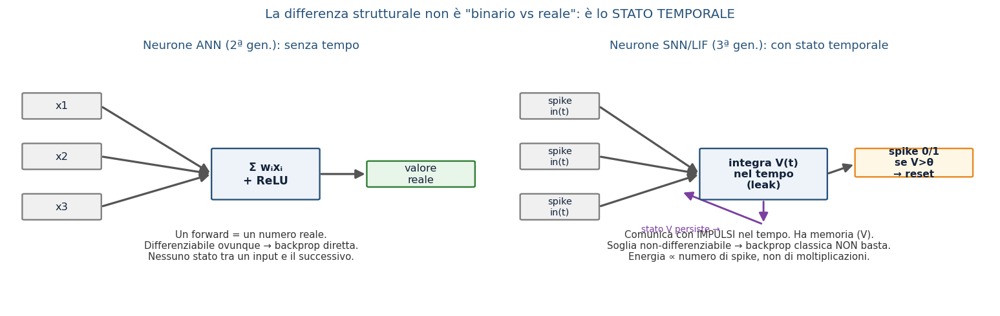
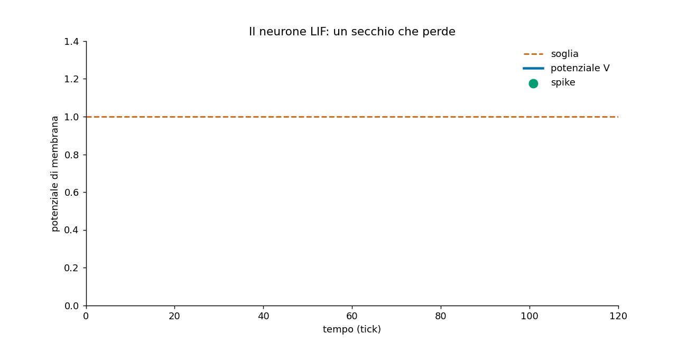
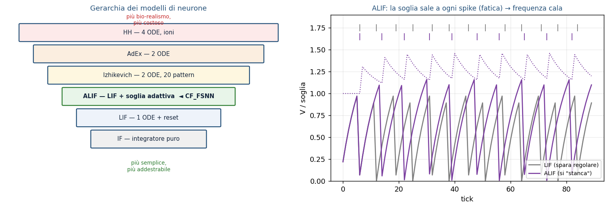
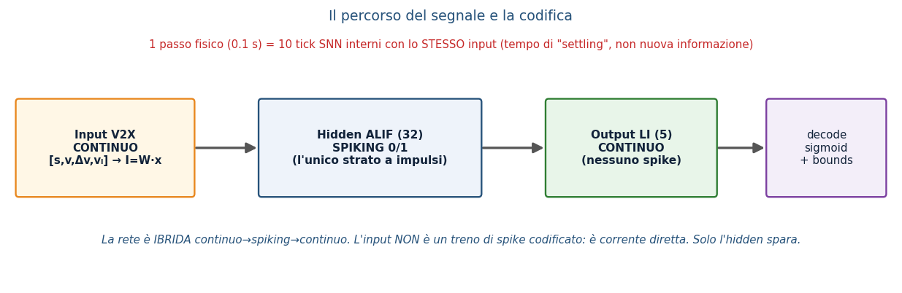
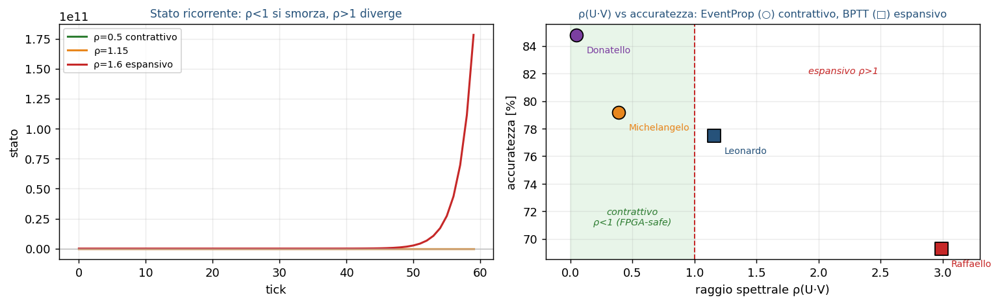
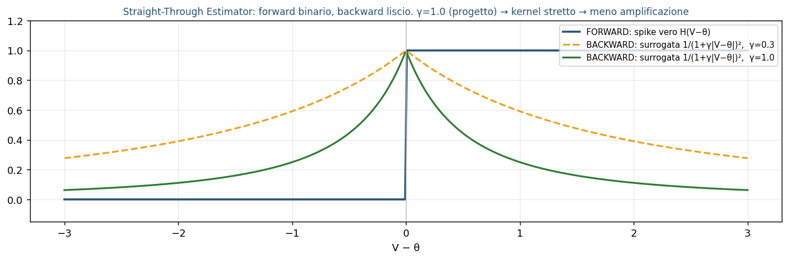
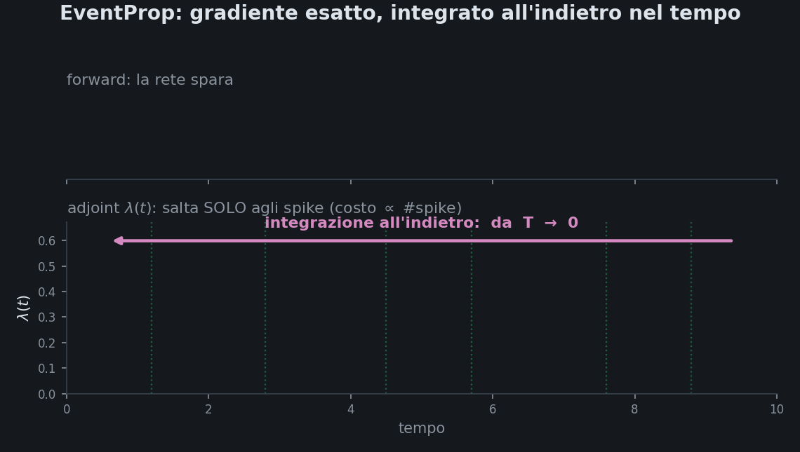

## {.center}

::: {.assertion}
Una rete spiking «cerebrale» (Spiking Neural Network) osserva un'auto e ne ricava le 5 impostazioni
del suo cruise-control (ACC) — abbastanza efficiente da girare su un FPGA da ~200 €.
:::

## Nel modo di guidare si nascondono 5 abitudini: le ricaviamo guardando

::: {.notes}
Ogni conducente ha uno "stile" — quanto tiene distanza, quanto accelera, quanto frena. Il problema
inverso: dalla traiettoria osservata (posizione, velocità nel tempo) risaliamo ai 5 parametri che la
generano, senza conoscerli a priori. È il cuore del progetto: identificazione, non solo classificazione.
:::

# Atto 1 — Le reti spiking (SNN), da zero

## Le reti neurali hanno tre generazioni; le spiking sono la terza

::: {.assertion}
Percettrone (soglia dura) → rete neurale artificiale (ANN, numeri continui) → rete spiking
(SNN, eventi nel tempo): ogni generazione aggiunge espressività, l'ultima aggiunge il tempo.
:::

::: {.notes}
Prima generazione: il percettrone di Rosenblatt, una soglia dura, on/off, niente da allenare col
gradiente. Seconda generazione: le ANN moderne (MLP, CNN, Transformer) — attivazioni continue e
differenziabili, allenate con backpropagation. Terza generazione: le SNN — i neuroni comunicano con
impulsi discreti (spike) e il TEMPO in cui arrivano porta informazione, non solo il "quanto". Questa
terza generazione è biologicamente più plausibile ed è quella che useremo.
:::

## Un neurone «tiene un numero», e la rete lo trasforma a strati

::: {.notes}
In una ANN classica ogni neurone mantiene un numero continuo (l'attivazione) e lo passa allo strato
successivo moltiplicato per pesi e sommato. È come un dimmer: sempre "acceso", con un livello che sale
o scende in modo continuo. Bene per riconoscere pattern statici; ma non c'è alcuna nozione di "quando"
succede qualcosa — solo "quanto".
:::

## Un neurone spiking non è sempre acceso: «scatta» solo a eventi (spike)

::: {.notes}
La SNN è l'opposto del dimmer: è un interruttore Morse, silenzioso finché non succede un evento. Il
neurone integra i segnali in ingresso e resta a zero finché non supera una soglia — poi emette un
impulso (spike) e si resetta. L'informazione non è nell'ampiezza del segnale ma nel TEMPO e nel
PATTERN degli spike. Rottura dell'analogia dimmer/Morse: qui semina già l'argomento energia — un
neurone silenzioso non consuma quasi nulla, a differenza del dimmer sempre acceso.
:::

## Il neurone LIF è un secchio che perde: riempi → superi la linea → scatti → svuoti

::: {.notes}
Il modello Leaky Integrate-and-Fire (LIF) è il mattone base delle SNN. Analogia: un secchio che perde
— l'ingresso lo riempie, una piccola perdita continua lo svuota lentamente, e se il livello supera la
linea di soglia il secchio "scatta" (spike) e si svuota di colpo, ripartendo da zero. Dove si rompe
l'analogia: l'uscita del neurone è tutto-o-niente (spike o non-spike), non c'è una via di mezzo come
per un secchio che trabocca gradualmente — e conta il TEMPO in cui scatta, non l'ampiezza del
traboccamento.
:::

## La soglia adattiva (ALIF) «stanca» il neurone → memoria a breve termine

::: {.notes}
Il neurone Adaptive-LIF (ALIF) aggiunge una soglia che sale dopo ogni spike e poi recupera lentamente
(su una scala di circa 100 millisecondi). Analogia: la stanchezza — dopo uno sforzo, serve più stimolo
per "scattare" di nuovo, poi ci si riprende col tempo. Questo dà al neurone una forma di memoria a
breve termine, utile per riconoscere pattern estesi nel tempo come una traiettoria di guida.
:::

::: {.content-visible when-profile="full"}
## Dentro è tutto spiking: come si codifica un input continuo

::: {.notes}
Le grandezze osservate (posizione, velocità, distanza) sono numeri continui, ma la SNN lavora solo con
spike. Serve quindi una codifica: si trasforma il segnale continuo in treni di impulsi (rate coding,
latency coding, o schemi ibridi) prima di darlo in pasto alla rete, e all'uscita si decodifica di nuovo
in un valore continuo (i 5 parametri stimati). Il datapath completo è: encoder → strati SNN ricorrenti
→ decoder.
:::
:::

## La ricorrenza è un'eco: >1 esplode, <<1 dimentica, ~1 = memoria utile

::: {.notes}
Molte SNN per serie temporali usano connessioni ricorrenti (l'uscita di uno strato rientra come
ingresso). Il raggio spettrale (ρ) della matrice ricorrente ne misura la stabilità. Analogia: un'eco in
un canyon — se il raggio spettrale è maggiore di 1, l'eco si amplifica all'infinito (la rete esplode,
instabile); se è molto minore di 1, l'eco si spegne subito (la rete dimentica tutto, nessuna memoria);
attorno a 1 c'è la zona utile, dove l'eco persiste abbastanza da portare informazione ma senza
esplodere. Va calibrato con cura.
:::

## Ma lo spike non ha derivata → il backprop classico non basta

::: {.notes}
Il backpropagation classico richiede che ogni funzione della rete sia derivabile, per calcolare come
un piccolo cambiamento nei pesi cambia l'errore. Ma la funzione che genera lo spike è un gradino: zero
finché la soglia non è superata, poi un salto istantaneo a 1. Analogia: è un dirupo verticale, senza
pendenza — la derivata è zero quasi ovunque e indefinita nel punto di scatto. Il gradiente classico,
calcolato ovunque tranne che nell'istante di spike, è semplicemente nullo: il backprop standard non ha
alcun segnale su cui allenarsi. Servono metodi ad hoc — è il problema che risolvono i prossimi tre
approcci.
:::

::: {.content-visible when-profile="full"}
## Metodo 1: surrogate gradient + BPTT (il dirupo trattato come una rampa)

::: {.notes}
Prima famiglia di soluzioni: durante il passo indietro (backward pass) si sostituisce la derivata vera
(che è zero) con una funzione surrogata continua — ad esempio una sigmoide o un triangolo stretto
attorno alla soglia — che approssima il gradino con una "rampa" morbida. Si combina poi con
Backpropagation Through Time (BPTT), srotolando la rete nel tempo come una RNN. È il metodo più diffuso
in pratica perché riusa l'infrastruttura standard di autograd, ma introduce un bias: il gradiente
usato in allenamento non è quello vero della rete a spike, è quello di un'approssimazione.
:::
:::

## Metodo 2: EventProp — gradiente esatto negli istanti di spike (adjoint)

::: {.notes}
Seconda famiglia: EventProp calcola il gradiente ESATTO del sistema a spike, senza approssimazioni,
sfruttando il metodo adjoint della teoria del controllo. L'idea chiave: tra due spike consecutivi la
dinamica del neurone è liscia e derivabile normalmente; tutta la "difficoltà" del dirupo si concentra
nell'istante preciso dello spike, dove EventProp applica una correzione analitica esatta (basata sulla
pendenza della traiettoria nel momento del salto) invece di ignorarla o approssimarla. Risultato:
gradiente corretto e efficiente in memoria, perché non serve srotolare l'intera storia come in BPTT.
A voce: EventProp è una delle tre famiglie di metodi; la scelta per la NOSTRA rete è nell'Atto 2.
:::

::: {.content-visible when-profile="full"}
## Metodo 3: STDP — apprendimento biologico locale, non supervisionato

::: {.assertion}
Spike-Timing-Dependent Plasticity: chi scatta insieme si lega — nessun errore globale, nessun
backprop, solo la relazione temporale locale tra spike pre- e post-sinaptici.
:::

::: {.notes}
Terza famiglia, di ispirazione biologica: STDP aggiorna ogni sinapsi solo in base all'ORDINE TEMPORALE
locale tra lo spike del neurone a monte (pre-sinaptico) e quello a valle (post-sinaptico) — se il
pre-sinaptico scatta poco prima del post-sinaptico, il collegamento si rinforza; se scatta poco dopo,
si indebolisce. Non serve un errore globale da propagare all'indietro, né un'etichetta supervisionata:
è una regola locale, non supervisionata, che riflette la plasticità sinaptica osservata nel cervello.
Va presentata senza sminuirla: è potente per apprendimento online e non supervisionato, anche se meno
diretta da usare per problemi di regressione supervisionata come il nostro.
:::
:::

## {.center}

::: {.assertion}
Le SNN sono efficienti **ma** difficili da addestrare — la nostra rete affronta proprio questo.
:::
