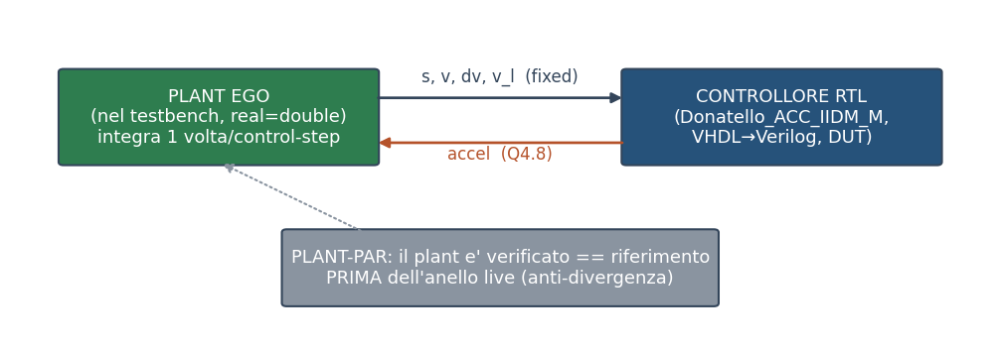
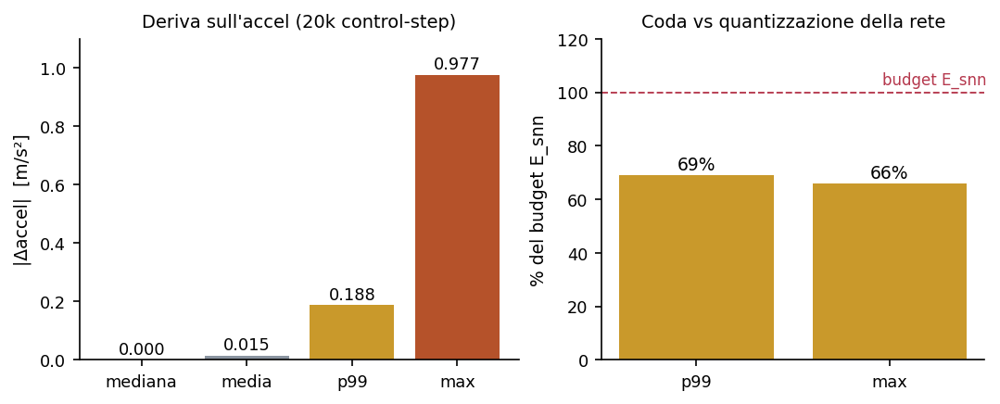

# CF_FSNN — Validazione RTL del controllore (Fase B2.0, checkpoint)

> **Validazione a livello RTL (testbench in Vivado xsim) del controllore car-following spiking: la rete SNN e il controllore completo SNN+ACC-IIDM, provati bit-esatti rispetto al blocco di riferimento, in anello aperto e in anello chiuso.**

> Livello di fedeltà: simulazione RTL comportamentale (Vivado xsim) del VHDL/Verilog generato da HDL Coder — non stima di risorse (Fase B) né misura su silicio (Fase C).  
> Stato: CHECKPOINT INTERMEDIO. Versione ATTUALE dei blocchi (pre-ottimizzazione 2b), validata sul dataset RIDOTTO (3 traiettorie). Il report finale seguirà 2b (ottimizzazione) e 2c (validazione completa sul dataset intero).  
> Grounding: i cancelli sono deterministici (esito 0/N) dai run in document/HDL_PHASE.md §6, ancorati nelle assert del codice (matlab/run_rtl_validate*.m, run_plant_par.m, run_closed_loop.m).  
> Documenti gemelli: Report FPGA Fase B (risorse/potenza post-sintesi) · SP4_ACC_IIDM_FAST.md (ottimizzazione del controllore).  

---

## Sommario

| Sezione |
|---|
| 1. Sintesi |
| 2. Oggetto, livello di fedeltà, limiti dichiarati |
| 3. Il problema: che cosa significa "il riferimento" |
| 3.1  Il golden fedele al blocco |
| 4. Harness A — la rete SNN (anello aperto) |
| 5. Harness B — il controllore completo (anello aperto e chiuso) |
| 5.1  Il DUT in Verilog, non in VHDL |
| 5.2  L'anello chiuso self-contained |
| 6. Tecniche e loro compromessi |
| 6.1  Time-mux e FSM a stadi (dall'ottimizzazione SP4) |
| 6.2  Golden fedele al blocco (§3.1) |
| 6.3  Verilog per il controllore (§5.1) |
| 6.4  Anello self-contained + PLANT-PAR (§5.2) |
| 7. Caratterizzazione della deriva blocco-fisico vs riferimento |
| 8. Quadro dei risultati |
| 9. Limiti dichiarati e prossimi passi |
| Riferimenti (fonti interne) |

## 1. Sintesi

Questo documento riporta la **validazione a livello RTL** del controllore car-following spiking destinato all'FPGA. L'obiettivo non è misurare risorse o potenza — già coperti dal Report FPGA Fase B — ma **dimostrare che il codice RTL generato si comporta come deve**, simulandolo in Vivado xsim contro un riferimento software, e non su una singola traiettoria ridotta ma con metriche vere su migliaia di control-step (l'errore che rese fragile il primo report di Fase B, qui deliberatamente evitato).

Sono stati costruiti **due harness di validazione**, entrambi self-contained in xsim: uno per la **rete SNN** (Donatello_Champion, che stima i cinque parametri IDM) e uno per il **controllore completo** (Donatello_ACC_IIDM_M, SNN+decodifica+ACC-IIDM, che produce l'accelerazione). Il secondo è validato sia in **anello aperto** sia in **anello chiuso** — con il plant del veicolo riprodotto nel testbench e la retroazione sull'accelerazione — così da provare non solo l'uguaglianza bit-a-bit ma il **funzionamento car-following corretto**.

Esito: su tutti i cancelli, **zero disallineamenti** rispetto al riferimento bit-esatto del blocco, con i cancelli provati **sensibili** (falliscono quando un valore è alterato di 1 LSB). La caratterizzazione della deriva del blocco fisico rispetto al riferimento software è quantificata (§7) e ne definisce il limite noto.

*Copertura di validazione della versione attuale sul dataset ridotto: per ogni cancello, il numero di confronti bit-esatti (control-step × grandezze) e l'esito (0 disallineamenti). A-1: rete SNN (5 parametri). B-1: controllore (accel), anello aperto. PLANT-PAR: fedeltà del plant nel testbench. B-LOOP: anello chiuso completo.*

## 2. Oggetto, livello di fedeltà, limiti dichiarati

I due blocchi validati provengono dalla libreria `snn_champions_lib` e sono l'esito della fase di ottimizzazione SP4 (documento SP4_ACC_IIDM_FAST.md). Il controllore completo Donatello_ACC_IIDM_M — rete B2 time-multiplexata, decodifica a LUT a 64 punti, ACC-IIDM con macchina a stati che condivide un solo divisore — occupa in sintesi out-of-context sullo Zynq-7020 **8614 LUT · 2134 FF · 71 DSP** e chiude il timing a **9.30 MHz** (latenza 358 clock per inferenza).

> **Nota.** Cosa NON è questo report. Non è una misura di risorse/potenza (Fase B), non è una misura su hardware (Fase C), e non è il report finale. È un checkpoint della VERSIONE ATTUALE, validata sul dataset RIDOTTO (3 traiettorie per gli anelli, 20 per la deriva). La validazione sul dataset intero (60k control-step) e a livello gate-level è la Fase 2c, che riuserà questi stessi harness sulla versione ottimizzata da 2b.

Il livello di fedeltà è la **simulazione RTL comportamentale** del codice generato da HDL Coder: si esercita esattamente il VHDL/Verilog che andrebbe in sintesi, con i tipi e le larghezze reali delle porte (ingressi a virgola fissa a 32 bit, parametri a 21 bit in formato Q7.13, accelerazione a 13 bit in Q4.8, lette dalle entità generate).

## 3. Il problema: che cosa significa "il riferimento"

Validare un blocco RTL significa confrontarne l'uscita con un **golden** — un riferimento di cui ci si fida. La scelta del golden è il punto delicato, e in questa fase ha prodotto il risultato più istruttivo. Il riferimento software "naturale" della rete (il forward `r16`, basato sulla normalizzazione `snn_normalize`) **non coincide con il blocco**: le due catene divergono attorno al 52° control-step. La causa è duplice e misurata: il blocco fisico usa una **normalizzazione interna in virgola fissa** (`local_normalize`, per avere ingressi in unità fisiche) che devia di 1 LSB dal riferimento, e **pilota il forward tenendo l'ingresso** mentre il riferimento lo alimenta con zeri durante l'inferenza.

Il forward della rete inlinato nel blocco è, invece, **identico** al sorgente corrente (zero righe diverse): il blocco non è "vecchio". A nascondere la divergenza era il cancello preesistente `run_block_traj_test`, che girava di default su **20 control-step soltanto** — meno del punto di divergenza. È la stessa lezione del bug §2.1 documentato in HDL_PHASE: un cancello troppo poco profondo dà falsa fiducia.

*La catena di fedeltà che gli harness stabiliscono: tre implementazioni indipendenti — il blocco Simulink, il golden software (MEX MATLAB Coder) e l'RTL (HDL Coder) — devono dare risultati bit-identici. Legenda: ≡ = uguaglianza bit-a-bit su ogni control-step del dataset provato.*

### 3.1  Il golden fedele al blocco

La soluzione è un golden **fedele al blocco**: si estrae verbatim l'algoritmo esatto della chart (normalizzazione fixed + rete + decodifica + ACC-IIDM), lo si compila in MEX e lo si **guida clock-per-clock tenendo l'ingresso**, esattamente come il blocco. Questo golden — a differenza del riferimento `r16` — riproduce il blocco per costruzione, ed è stato verificato uguale al blocco Simulink su una prova incrociata indipendente (differenza massima nulla). È lo stesso metodo per entrambi gli harness.

## 4. Harness A — la rete SNN (anello aperto)

Il primo harness valida `Donatello_Champion`, la rete che dai quattro ingressi fisici (s, v, Δv, v_lead) stima i cinque parametri IDM (v₀, T, s₀, a, b), a 21 bit ciascuno (Q7.13). Il testbench in Verilog pilota il VHDL generato con gli stimoli del dataset, campiona i cinque parametri a fine control-step e li confronta con il golden fedele.

**Cancello A-1**: su 3 traiettorie × 1000 control-step × 5 parametri = **15000 confronti**, **zero disallineamenti**. Il cancello è provato **sensibile**: alterando di 1 LSB un solo parametro del golden, il testbench riporta il disallineamento (non è cieco). L'RTL della rete riproduce dunque il blocco in modo bit-esatto.

> **Nota.** Perché la SNN va in VHDL e il controllore in Verilog. La rete da sola non contiene il divisore dell'IIDM e simula correttamente in VHDL. Il controllore no (vedi §5).

## 5. Harness B — il controllore completo (anello aperto e chiuso)

Il secondo harness valida `Donatello_ACC_IIDM_M`, il controllore completo che produce l'accelerazione (13 bit, Q4.8). L'anello aperto (**cancello B-1**) confronta l'accel RTL col golden fedele: **3000 confronti, zero disallineamenti**, cancello sensibile a 1 LSB.

### 5.1  Il DUT in Verilog, non in VHDL

Il controllore, in VHDL, **non simula a time-0** in xsim: il divisore combinatorio dell'IIDM indicizza una LUT con un indice che, prima che il reset asincrono si propaghi, vale −1 (i registri VHDL partono a `U`, metavalue). Generando il DUT in **Verilog**, HDL Coder inizializza i registri a 0 (`initial`): niente `U`, niente indice −1. È una scelta di simulazione, non di progetto — l'RTL è lo stesso; per questo `rtl_gen_dut` ha ora un parametro lingua.

### 5.2  L'anello chiuso self-contained

La prova che conta per il car-following è l'**anello chiuso**: il controllore RTL guida un **plant del veicolo riprodotto dentro il testbench** (in `real`, cioè double, con i valori trasferiti bit-esatti via rappresentazione IEEE-754), che integra la dinamica una volta per control-step e retroaziona sull'accelerazione. L'intero anello gira in xsim, senza cosim esterna (HDL Verifier è stato sondato e scartato: setup fragile headless e runtime per-clock sfavorevole).

*L'anello chiuso self-contained: il plant EGO vive nel testbench (real), il controllore RTL è il DUT; la retroazione è sull'accelerazione. Il cancello PLANT-PAR verifica il plant SEPARATAMENTE, contro il riferimento, prima di accendere l'anello live.*

La disciplina anti-divergenza è il cuore del metodo. Un anello chiuso amplifica ogni errore: se il plant nel testbench non fosse fedele, la traiettoria divergerebbe e non si saprebbe se la colpa è del plant o del controllore. Per questo le due metà sono verificate **separatamente e a buon mercato** prima di unirle:

| Cancello | Cosa prova | Conteggio | Esito | Sensibilità |
|---|---|---|---|---|
| PLANT-PAR | plant-nel-TB == riferimento (senza RTL) | 1800 | 0 mismatch | ordine v invertito → 166 |
| B-LOOP | anello RTL == traiettoria di riferimento | 2400 | 0 mismatch | (protetto da B-1 + PLANT-PAR) |
| BEHAV | gap sempre > 0 (nessuna collisione) | 600 step | 0 collisioni | gap ≤ 0 → conteggiato |

Con PLANT-PAR e B-1 verdi, se l'anello live divergesse la colpa sarebbe **solo** nell'integrazione (conversioni fixed↔real, temporizzazione) — una superficie stretta e diagnosticabile. L'anello, su 3 traiettorie, riproduce la traiettoria di riferimento bit-esatta e mantiene sempre il gap positivo: il controllore RTL **guida correttamente**, non solo produce numeri identici.

## 6. Tecniche e loro compromessi

### 6.1  Time-mux e FSM a stadi (dall'ottimizzazione SP4)

Il controllore elabora un neurone per ciclo (time-multiplexing) e sequenzia le cinque divisioni dell'IIDM su **un solo divisore** con una macchina a stati a stadi. Il time-mux taglia l'area; il registro fra gli stadi dà la frequenza. Compromesso: la latenza sale a 358 clock per inferenza — irrilevante (su un control-step da 0,1 s a 8 MHz sono 800.000 clock disponibili, margine ~2200×), ma è il motivo per cui il rate d'ingresso del blocco è più lento di un blocco puramente combinatorio.

### 6.2  Golden fedele al blocco (§3.1)

Vantaggio: elimina l'ambiguità sul riferimento e riproduce il blocco per costruzione. Compromesso: il golden va **rigenerato** quando il blocco cambia (l'algoritmo è estratto dalla chart), e la sua fedeltà va ri-verificata — un passo in più, ma a buon mercato.

### 6.3  Verilog per il controllore (§5.1)

Vantaggio: risolve il metavalue a time-0 senza toccare il progetto. Compromesso: l'harness usa due lingue (VHDL per la rete, Verilog per il controllore) — coerente, perché sono DUT distinti, ma va ricordato.

### 6.4  Anello self-contained + PLANT-PAR (§5.2)

Vantaggio: tutto in xsim, veloce, senza cosim esterna; l'anti-divergenza isola i guasti. Compromesso: il plant va **riprodotto** nel testbench in `real`; mitigato dal cancello PLANT-PAR che ne prova la fedeltà prima dell'anello live.

## 7. Caratterizzazione della deriva blocco-fisico vs riferimento

Il blocco fisico validato usa la normalizzazione interna in virgola fissa; il sistema deployato sull'FPGA normalizza in software (float). La differenza fra i due è la **deriva** — il limite noto della versione fisica. È stata quantificata sull'accelerazione confrontando il blocco (normalizzazione fixed, ingresso tenuto) col riferimento (normalizzazione software, serializzato) su 20.000 control-step.

*Deriva sull'accelerazione fra blocco fisico e riferimento software. A sinistra i percentili di |Δaccel|; a destra il rapporto della coda (p99, max) col budget E_snn, cioè il footprint in accel della quantizzazione che la rete già si porta.*

La deriva è **sparsa**: mediana **0.000**, media **0.0154** m/s² — sulla maggioranza dei control-step il blocco e il riferimento danno accel identica. Ma la **coda è significativa**: p99 = **0.1875**, max = **0.9766** m/s², cioè **69% / 66%** del budget E_snn. Verdetto onesto: trascurabile in media, **non trascurabile in coda** — sugli eventi di spike-flip la normalizzazione fixed aggiunge un errore dello stesso ordine della quantizzazione della rete. È la differenza reale fra il blocco fisico (che questi harness validano) e il riferimento software, da tenere presente per il futuro confronto con MPC.

> **Nota.** La misura qui è in anello APERTO. Se in anello chiuso questi picchi sparsi si smorzino (sistema car-following stabile) o si accumulino è una misura ancora da fare, dichiarata come nota aperta.

## 8. Quadro dei risultati

| Harness / cancello | Grandezza | Confronti | Disallineamenti | Sensibile |
|---|---|---|---|---|
| A-1 (SNN, anello aperto) | 5 parametri IDM | 15000 | 0 | sì (1 LSB) |
| B-1 (controllore, anello aperto) | accel | 3000 | 0 | sì (1 LSB) |
| PLANT-PAR (plant nel TB) | s, v, Δv | 1800 | 0 | sì (166) |
| B-LOOP (anello chiuso) | s, v, Δv, accel | 2400 | 0 | (transitivo) |
| BEHAV (comportamento) | gap | 600 | 0 collisioni | sì (gap≤0) |

Tutti i cancelli sono deterministici (esito 0/N) e provati sensibili. Le tre implementazioni indipendenti — blocco Simulink, golden MEX, RTL — concordano bit-a-bit.

## 9. Limiti dichiarati e prossimi passi

**Limiti di questo checkpoint.** (1) La validazione è sul dataset **ridotto** (3 traiettorie per gli anelli, 20 per la deriva), non sui 60k control-step interi — è la Fase 2c. (2) La deriva del blocco fisico non è trascurabile in coda (§7). (3) La misura in anello chiuso della deriva è ancora da fare. (4) Le risorse/timing sono la sintesi OOC di SP4, non post-route completo (manca il BRAM), coperto in Fase 2c/report finale.

**Prossimi passi.** 2b — ottimizzazione del timing (pipelining bit-esatto del `tanh`, il collo del percorso critico) per spingere oltre 9,30 MHz. 2c — validazione **completa** sul dataset intero e a gate-level (post-route con SDF), riusando **questi stessi harness** con la modalità "full". Poi il report finale, che sostituirà questo checkpoint con la versione ottimizzata e validata al completo.

## Riferimenti (fonti interne)

| Fonte | Contenuto |
|---|---|
| document/HDL_PHASE.md §6 | Stato e risultati dei cancelli (A-1, B-1, PLANT-PAR, B-LOOP, BEHAV) e della deriva |
| document/SP4_ACC_IIDM_FAST.md | Ottimizzazione del controllore: time-mux, FSM a stadi, risorse OOC 9,30 MHz |
| matlab/run_rtl_validate.m · run_rtl_validate_b.m | Orchestratori e assert dei cancelli A-1 / B-1 |
| matlab/run_plant_par.m · run_closed_loop.m | Cancelli PLANT-PAR / B-LOOP / BEHAV (anello chiuso) |
| matlab/cl_ref_acciidm_m.m | Anello di riferimento block-faithful (golden della traiettoria) |
| matlab/characterize_drift.m | Caratterizzazione della deriva blocco-vs-riferimento sull'accel |
| matlab/axi/acciidm_m/tb_*.v | Testbench Verilog: anello aperto, plant-parity, anello chiuso |
| docs/superpowers/specs+plans 2026-07-17/18 | Spec dei due harness e piani d'esecuzione M1/M2 |
