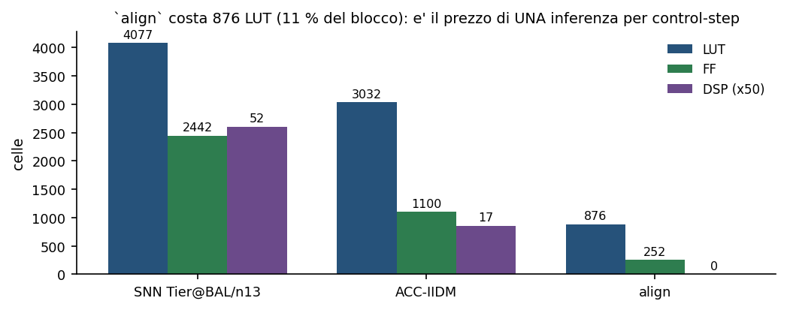

# CF_FSNN — Harness_SNN_IIDM: validazione in anello chiuso e caratterizzazione hardware (Fase B2.0 · T7)

> **Il Verilog generato del controllore composto — rete spiking, allineamento e legge di controllo — provato bit-esatto rispetto al blocco in ANELLO CHIUSO su 99 scenari di car-following con cut-in, e il sistema completo implementato, misurato in clock, risorse ed energia, e portato a bitstream.**

> Oggetto: blocco composto Donatello_SNN_IIDM = SNN Donatello_Tier@BALANCED (nfrac 13) + allineamento align + controllore ACC-IIDM. Ingressi s, v, dv, v_l; uscita accel.  
> Livelli di fedeltà: simulazione RTL in anello chiuso e simulazione di netlist post-place&route in Vivado xsim; sintesi e implementazione reali su xc7z020; energia da attività di commutazione registrata (SAIF). NON è una misura su silicio — quella è la Fase C.  
> Grounding: questo documento è GENERATO da uno script che LEGGE gli artefatti (t7_results.mat, metrics.json, sweep.json, netlist.json, power.json, power_params.json, saif_stats.json e i report Vivado grezzi). Nessun numero è trascritto a mano, con una sola eccezione dichiarata nel §5.1. I cancelli sono deterministici (esito 0/N); le grandezze non misurabili con questo flusso sono marcate come STIMA e mai presentate come misura.  
> Riproducibilità: bash FaseB2.0/Harness_SNN_IIDM/hw/run_harness_snniidm_hw.sh [stadio] — un comando per stadio, con cancello di provenienza sui sorgenti caratterizzati.  

---

## Sommario

| Sezione |
|---|
| 1. Sintesi |
| 2. Oggetto e perimetro |
| 2.1 Il blocco composto |
| 2.2 `align`: una inferenza per control-step |
| 2.2 I cinque parametri, e cosa significano |
| 2.3 Cosa è dentro e cosa è fuori |
| 3. Il problema della validazione in anello chiuso |
| 3.1 Perché un confronto diretto non basta |
| 3.2 La decomposizione in due prove disgiunte |
| 3.3 Il riferimento è il blocco, e un golden monolitico non lo è |
| 3.4 Tre termini di paragone distinti, e a cosa serve ciascuno |
| 4. Validazione in anello chiuso a livello RTL |
| 4.1 I cancelli |
| 4.2 Metriche dal motore canonico |
| Sicurezza (17 metriche) |
| Comfort (7 metriche) |
| Inseguimento (5 metriche) |
| Efficienza e stabilita (2 metriche) |
| 4.3 Un caso limite reale: il congelamento a parametri ripetuti |
| 5. Dal blocco al sistema |
| 5.1 Il processore legge ciò che il blocco calcola |
| 5.2 La netlist dopo place&route |
| 6. Frequenza e risorse |
| 6.1 Due numeri distinti, e come si leggono |
| 6.2 Fuori contesto e nel sistema sono perimetri diversi |
| 6.3 Risorse e costo dell'allineamento |
| 6.4 Margine sul control-step |
| 7. Energia nel funzionamento reale |
| 7.1 La finestra attiva si misura, non si assume |
| 7.2 L'inattività è stazionaria, e lo si è provato |
| 7.3 Gli otto carichi reali |
| 7.4 Energia per passo di controllo, misurata e non composta |
| 8. Quando il sommario nasconde la misura |
| 9. Bitstream e provenienza |
| 9.1 Riproducibilità |
| 10. Osservazioni di metodo |
| 10.1 Il numero che lo strumento stampa non è quello che si crede di leggere |
| 10.2 Un cancello che non può fallire non è un cancello |
| 10.3 Misurare il costo prima di impegnare le ore |
| 10.4 Il debito si paga sui numeri, non sul tempo |
| 11. Limiti dichiarati |
| 12. Conclusioni |
| Riferimenti |
| Artefatti del progetto |
| Strumenti |

## 1. Sintesi

Questo documento riporta la validazione e la caratterizzazione del **controllore completo** destinato all'FPGA: il blocco composto che dai quattro stati di car-following — distanza, velocità propria, velocità relativa e velocità del veicolo che precede — produce direttamente l'**accelerazione comandata**, passando per una rete neurale spiking che stima i parametri del modello di guida e per la legge di controllo che li usa.

La domanda a cui il documento risponde è una sola: **il codice che finirà sull'FPGA si comporta come il blocco progettato, e a quale costo?** La risposta è affermativa su ogni cancello, e i costi sono misurati.

*Copertura dei cancelli di equivalenza. Ogni barra è un confronto contro il **blocco** di riferimento, e ogni esito è zero disallineamenti. La scala è logaritmica: i quattro cancelli coprono perimetri di ampiezza molto diversa, e il più stretto — la netlist — è dichiarato tale, non nascosto.*

| Grandezza | Valore | Natura |
|---|---|---|
| RTL == blocco in anello chiuso (T7-EXACT) | 0 su 58 522 confronti, 99 scenari | misurato |
| Plant del banco == riferimento (PLANT-PAR, senza DUT) | 0 disallineamenti su 99 scenari | misurato |
| Parametri letti dal processore via AXI == blocco | 0 su 58 522, in entrambe le configurazioni di gating | misurato |
| Netlist post-place&route == blocco | 0 su 1 507 (3 scenari dichiarati) | misurato |
| Collisioni AGGIUNTIVE rispetto all'oracolo | 0 (RTL 3, oracolo 3) | misurato |
| Frequenza di clock deployabile | 40 MHz (WNS +0.022 ns, WHS +0.033 ns) | misurato |
| Limite del cammino critico | 41.1 MHz | derivato (da WNS a vincolo stretto) |
| Risorse post-place&route | 8453 LUT · 4556 FF · 69 DSP · 1 BRAM | misurato |
| Inferenza / margine sul control-step 0.1 s | 13.9 µs / ≈7 200× | derivato |
| Energia DINAMICA per control-step | 1.10 mJ (al duty reale, 0.0146 %) | misurato, non composto |
| Energia statica del dispositivo per control-step | 10.3 mJ | misurato — pavimento del chip, tenuto SEPARATO |
| Clock gating: commutazione in idle | da 26.0 a 2.0 toggle per clock (13×) | misurato nel SAIF |
| Clock gating: guadagno in watt | non ottenuto | NON misurabile con questo flusso |
| Bitstream PYNQ-Z1 | prodotto, WNS e utilizzo identici a quelli caratterizzati | artefatto |

> **Nota.** Tre grandezze **non** sono state ottenute, e il documento lo dice dove servirebbero: il **guadagno in watt del clock gating** (§8), il **caso peggiore energetico** (§7.3) e l'equivalenza della netlist **su tutti** i 99 scenari (§5.2). Per ciascuna è indicato il motivo e il costo che avrebbe avuto ottenerla.

## 2. Oggetto e perimetro

### 2.1 Il blocco composto

Il dispositivo sotto esame non è la rete neurale da sola, ma la **catena completa** che porta dagli stati misurati al comando di accelerazione. È composta di tre parti in cascata: la rete spiking, che stima cinque parametri del modello di guida; un blocco di **allineamento**; e la legge di controllo ACC-IIDM, che dai parametri e dagli stati calcola l'accelerazione.

*Il blocco composto dietro il wrapper AXI4-Lite, e il sistema che lo ospita. Il riquadro chiaro delimita ciò che è implementato in logica programmabile e caratterizzato in questo documento; il processore e il convertitore di protocollo sono il contorno con cui il blocco deve convivere.*

### 2.2 `align`: una inferenza per control-step

Il blocco di allineamento non è un dettaglio implementativo: è ciò che rende **corretto** il comportamento dell'anello. La rete produce i cinque parametri con una latenza rispetto agli ingressi fisici; se il controllore li ricevesse appena pronti, vedrebbe **due** transizioni per ogni passo di controllo — una quando cambiano gli stati e una quando arrivano i parametri — e il filtro interno che stima l'accelerazione del veicolo che precede verrebbe aggiornato **due volte**. Il risultato sarebbe più veloce e **sbagliato**.

`align` trattiene i quattro ingressi fisici finché i cinque parametri non cambiano, poi li rilascia **insieme**: un solo fronte, una sola inferenza, un solo aggiornamento del filtro per control-step. Il costo di questa correttezza è misurato in §6.3.

> **Nota.** Questo è un punto in cui una modifica plausibile ha prodotto un difetto reale durante lo sviluppo. Un tentativo di accelerare il blocco registrando le uscite **all'esterno** di `align` guadagnava frequenza ma reintroduceva il **doppio fronte**: più veloce, e con l'anello che si comportava diversamente. Da allora ogni modifica al confine è soggetta a un cancello che **conta i fronti** e ne pretende esattamente uno.

### 2.2 I cinque parametri, e cosa significano

La rete non produce direttamente l'accelerazione: stima **cinque parametri** del modello di guida IDM, che la legge di controllo poi usa insieme agli stati misurati. Sono la velocita' desiderata in strada libera, il tempo di via libera desiderato, la distanza minima da fermo, l'accelerazione massima confortevole e la decelerazione confortevole.

| Parametro | Significato | Unita |
|---|---|---|
| v0 | velocita' desiderata in strada libera | m/s |
| T | tempo di via libera desiderato rispetto al veicolo che precede | s |
| s0 | distanza minima da fermo | m |
| a | accelerazione massima confortevole | m/s2 |
| b | decelerazione confortevole | m/s2 |

Sono questi cinque valori che il blocco di allineamento tratta, che il cancello PARAM-RANGE verifica entro i limiti del decodificatore, e la cui **ripetizione** produce il comportamento descritto nel §4.3.

### 2.3 Cosa è dentro e cosa è fuori

| Dentro il perimetro | Fuori dal perimetro |
|---|---|
| Il Verilog generato dal blocco composto, simulato in xsim | Il comportamento su silicio (Fase C) |
| Il wrapper AXI4-Lite e il sistema con processore e convertitore | Il software applicativo sul processore |
| Sintesi, place&route e analisi statica dei tempi reali | La validazione del modello di guida in sé |
| Energia da attività di commutazione registrata (SAIF) | La misura di corrente su scheda |
| 99 scenari di car-following con cut-in, in anello chiuso | Scenari non rappresentati nel dataset |

## 3. Il problema della validazione in anello chiuso

### 3.1 Perché un confronto diretto non basta

Validare un componente in **anello aperto** è semplice: si danno gli stessi ingressi al codice e al riferimento e si confrontano le uscite. In **anello chiuso** questo non si può fare, perché gli ingressi del passo successivo dipendono dall'uscita del passo corrente: due implementazioni che divergono di un solo bit al passo *k* ricevono ingressi **diversi** al passo *k+1*, e da lì in poi il confronto non misura più l'equivalenza ma l'accumulo della divergenza.

Un confronto diretto fra le due traiettorie complete risponderebbe quindi a una domanda diversa da quella che interessa — «quanto divergono?» invece di «il codice **è** il blocco?» — e non permetterebbe di distinguere un difetto del codice da una differenza del modello di ambiente.

### 3.2 La decomposizione in due prove disgiunte

La validazione è stata quindi **scomposta in due prove che non condividono il componente che l'altra verifica**, ciascuna delle quali è un confronto in anello aperto e quindi deterministico.

*Le due prove. A sinistra il plant del banco viene confrontato con il modello di riferimento **senza alcun DUT** nell'anello, alimentandolo con la sequenza di accelerazioni registrata. A destra il DUT viene confrontato con il blocco **sugli ingressi che ha effettivamente ricevuto**, senza che il plant partecipi al confronto. Insieme coprono l'anello; separatamente, ciascuna è esatta.*

| Prova | Cosa verifica | Cosa NON contiene | Esito |
|---|---|---|---|
| PLANT-PAR | il modello di ambiente del banco è quello di riferimento | il DUT | 0 su 99 scenari |
| T7-EXACT | l'RTL riproduce il blocco sugli ingressi ricevuti | il plant | 0 su 58 522 confronti |

### 3.3 Il riferimento è il blocco, e un golden monolitico non lo è

Il termine di paragone di ogni cancello è il **blocco composto** eseguito in simulazione, non una sua riscrittura. La distinzione ha avuto conseguenze concrete: un golden costruito estraendo il codice di un blocco precedente, ormai **deprecato**, si è rivelato **non equivalente** al composto — 385 scarti su 600 passi di controllo. Il difetto non era nell'RTL, ma nel riferimento.

> **Nota.** Il controllo che avrebbe dovuto intercettarlo era passato, perché verificava il golden sugli stessi sei passi di controllo su cui era stato tarato: **verificava la premessa su cui era costruito**. Da allora il riferimento è il blocco stesso, guidato sugli ingressi che l'RTL ha davvero ricevuto.

### 3.4 Tre termini di paragone distinti, e a cosa serve ciascuno

Nel documento compaiono tre entità diverse. Confonderle rende ininterpretabile ogni numero, quindi vengono nominate qui una volta per tutte.

| Entita | Che cos e | A che domanda risponde |
|---|---|---|
| **il blocco** | il modello Simulink `Donatello_SNN_IIDM`, eseguito in simulazione | è il RIFERIMENTO DI EQUIVALENZA: il codice generato si comporta come il blocco progettato? |
| **l'RTL** (e a valle la netlist, e il sistema con processore) | ciò che finira' sull'FPGA, nelle sue tre forme successive | è l'OGGETTO della validazione |
| **l'oracolo** | un controllore IDEALE: la stessa legge IIDM in forma analitica, alimentata con i parametri VERI di ciascuno scenario invece che con quelli stimati dalla rete | è la BASELINE DI QUALITA': quanto si perde stimando i parametri invece di conoscerli? |

> **Nota.** La distinzione è sostanziale. L'equivalenza col **blocco** è una proprietà binaria e si prova bit per bit: o coincide o no. Il confronto con l'**oracolo** non è un cancello e non ha un valore atteso di zero: misura quanto costa, in qualità di guida, il fatto che i parametri siano stimati da una rete anziché noti. Un divario li' non è un difetto dell'implementazione.

Ne segue una domanda legittima: perché le metriche non confrontano l'RTL con il **blocco**, visto che il blocco viene eseguito in Simulink proprio per fare da riferimento? Perché quel confronto sarebbe **degenere per costruzione**. Il cancello T7-EXACT stabilisce che l'accel prodotta dall'RTL coincide con quella del blocco a **ogni** passo di controllo, su tutti i 58 522 confronti; il modello di ambiente è deterministico; quindi, a parità di stato iniziale, le due traiettorie coincidono passo per passo e **ogni metrica calcolata su di esse assume lo stesso valore**. Calcolarle separatamente produrrebbe due colonne identiche. Il confronto informativo è quello con l'oracolo, ed è quello riportato.

## 4. Validazione in anello chiuso a livello RTL

### 4.1 I cancelli

Sui **99 scenari** del dataset esaustivo, 600 passi di controllo ciascuno, i cancelli danno:

| Cancello | Domanda | Perimetro | Esito |
|---|---|---|---|
| PLANT-PAR | il plant del banco è quello di riferimento? | 99 scenari | **0** disallineamenti |
| T7-EXACT | l'RTL è il blocco? | 58 522 confronti | **0** disallineamenti |
| PARAM-RANGE | i cinque parametri stanno nei limiti del decodificatore? | 58 522 passi | **0** fuori dominio |
| T7-SAFE | l'RTL provoca collisioni che l'oracolo non ha? | 99 scenari | **0** collisioni aggiuntive |

Le 3 collisioni osservate sono le **stesse** per l'RTL e per l'oracolo: derivano da manovre di inserimento aggressive presenti nel dataset, non dall'implementazione. Il cancello di sicurezza non chiede che non ci siano collisioni, chiede che **l'hardware non ne aggiunga**.

La campagna completa — 99 scenari, 600 passi di controllo ciascuno, una simulazione per scenario — dura **60 minuti**.

> **Nota.** **Perché 58 522 confronti e non 59 400.** Novantanove scenari da 600 passi ne darebbero 59 400. I tre scenari che **collidono** terminano pero' in anticipo, perché la simulazione si ferma all'impatto: contribuiscono 922 passi invece di 1 800, cioè **878 in meno**. Il totale riportato è la somma effettiva dei passi eseguiti, non un arrotondamento, ed era stato dichiarato prima della campagna.

I cancelli sono stati provati **sensibili**, cioè li si è visti fallire su dati deliberatamente alterati: alterando di un solo bit meno significativo un valore di riferimento, T7-EXACT segnala esattamente un disallineamento; forzando un parametro fuori dominio, PARAM-RANGE lo rileva; e il rilevatore di ripetizione scatta su cinque parametri identici ma non su quattro. Un cancello che non si è mai visto fallire non è un cancello.

### 4.2 Metriche dal motore canonico

Per ciascuno dei 99 scenari sono calcolate **31 metriche** di comportamento e sicurezza. Il punto metodologico è che le metriche non provengono da una simulazione separata: sono calcolate sulle **serie prodotte dall'RTL** durante la validazione, con lo **stesso** motore di valutazione usato per il modello di riferimento. Prova e metrica insistono così sullo stesso perimetro.

La tabella che segue riporta **tutte e 31** le metriche, aggregate sui 99 scenari. La regola di aggregazione è dichiarata per famiglia e **non è la mediana**: sulla sicurezza conta la coda, e una mediana su 99 scenari cancellerebbe proprio lo scenario peggiore, che è l'unico che interessa. Per le grandezze di tipo *minimo* si riporta il minimo, per quelle di tipo *massimo* e per le frazioni di violazione il massimo, per le restanti la media.

#### Sicurezza (17 metriche)

| Metrica | Che cosa misura | Unita | Aggregazione | RTL | Oracolo | Rapporto |
|---|---|---|---|---|---|---|
| TED_drac | Tempo esposto a DRAC oltre soglia | s | massimo (caso peggiore) | 1.300 | 1.300 | 1.000 |
| TET | Tempo esposto a TTC sotto soglia (Time Exposed TTC) | s | massimo (caso peggiore) | 1.100 | 1.200 | 0.917 |
| TID_drac | Tempo integrato dell eccesso di DRAC | m/s2 x s | massimo (caso peggiore) | 26.303 | 819.268 | 0.032 |
| TIT | Tempo integrato del deficit di TTC (Time Integrated TTC) | s2 | massimo (caso peggiore) | 1.277 | 1.333 | 0.958 |
| brake_margin_min | Margine di evitabilita fisica | m | minimo (caso peggiore) | -3.790 | -3.877 | 0.978 |
| collided | Scenari con collisione | conteggio | somma | 3 | 3 | 1.000 |
| cpi | Crash Potential Index | - | media | 0.000858 | 0.000873 | 0.983 |
| frac_drac_critical | Frazione di tempo con DRAC critico | - | massimo (caso peggiore) | 0.026 | 0.026 | 1.000 |
| frac_ttc_below_1.0 | Frazione di tempo in avvicinamento con TTC sotto 1,0 s | - | massimo (caso peggiore) | 1 | 1 | 1.000 |
| frac_ttc_below_1.5 | Frazione di tempo in avvicinamento con TTC sotto 1,5 s | - | massimo (caso peggiore) | 1 | 1 | 1.000 |
| frac_ttc_below_2.0 | Frazione di tempo in avvicinamento con TTC sotto 2,0 s | - | massimo (caso peggiore) | 1 | 1 | 1.000 |
| frac_ttc_below_3.0 | Frazione di tempo in avvicinamento con TTC sotto 3,0 s | - | massimo (caso peggiore) | 1 | 1 | 1.000 |
| impact_dv | Velocita relativa all impatto (severita) | m/s | massimo (caso peggiore) | 7.632 | 7.688 | 0.993 |
| max_DRAC | Decelerazione massima richiesta per evitare la collisione | m/s2 | massimo (caso peggiore) | 165.334 | 8.08e+03 | 0.020 |
| min_gap | Distanza minima paraurti-paraurti | m | minimo (caso peggiore) | -0.387 | -0.536 | 0.721 |
| min_time_headway | Distanza temporale minima (s/v) | s | minimo (caso peggiore) | 0.0068 | 0.000156 | 43.743 |
| min_ttc | Tempo minimo alla collisione (TTC) | s | minimo (caso peggiore) | 0.017 | 0.000389 | 44.889 |

#### Comfort (7 metriche)

| Metrica | Che cosa misura | Unita | Aggregazione | RTL | Oracolo | Rapporto |
|---|---|---|---|---|---|---|
| frac_accel_iso_viol | Frazione con accelerazione oltre il limite ISO | - | massimo (caso peggiore) | 0 | 0 | — |
| frac_decel_iso_viol | Frazione con decelerazione oltre il limite ISO | - | massimo (caso peggiore) | 0.055 | 0.060 | 0.917 |
| frac_jerk_uncomf | Frazione di tempo con jerk scomodo | - | massimo (caso peggiore) | 0.290 | 0.554 | 0.524 |
| max_abs_jerk | Jerk massimo in valore assoluto | m/s3 | massimo (caso peggiore) | 90.625 | 90 | 1.007 |
| max_decel | Decelerazione piu forte | m/s2 | massimo (caso peggiore) | 9 | 9 | 1.000 |
| rms_accel | Accelerazione efficace (RMS) | m/s2 | media | 0.800 | 0.844 | 0.949 |
| rms_jerk | Jerk efficace (RMS) | m/s3 | media | 1.989 | 1.804 | 1.102 |

#### Inseguimento (5 metriche)

| Metrica | Che cosa misura | Unita | Aggregazione | RTL | Oracolo | Rapporto |
|---|---|---|---|---|---|---|
| mean_T_pred | Tempo di via libera desiderato, medio, predetto dalla rete | s | media | 1.400 | 1.249 | 1.121 |
| mean_abs_dv_ss | Velocita relativa media a regime | m/s | media | 0.982 | 0.923 | 1.064 |
| mean_abs_gap_err_ss | Errore di distanza medio a regime | m | media | 4.675 | 4.093 | 1.142 |
| mean_time_gap | Distanza temporale media (s/v) | s | media | 2.266 | 2.085 | 1.087 |
| rms_gap_error | Errore di distanza efficace (RMS) | m | media | 9.442 | 8.374 | 1.127 |

#### Efficienza e stabilita (2 metriche)

| Metrica | Che cosa misura | Unita | Aggregazione | RTL | Oracolo | Rapporto |
|---|---|---|---|---|---|---|
| energy_proxy | Proxy di energia: integrale della potenza specifica positiva | m2/s2 | media | 52.914 | 63.327 | 0.836 |
| string_stability | Guadagno di stabilita di stringa | - | media | 0.767 | 0.787 | 0.974 |

> **Nota.** Su alcune metriche il rapporto è molto lontano da uno. **Non è un segnale sulla qualità dell'implementazione**: il caso peggiore su tutti gli scenari è dominato dai 3 che **collidono**, dove il tempo alla collisione tende a zero e la decelerazione richiesta diverge — per l'RTL **e** per l'oracolo, che collidono negli **stessi** scenari. In quel regime il rapporto smette di misurare l'implementazione e misura la patologia dello scenario. Il confronto discriminante è quello del §4.3.

*Due metriche di sicurezza, RTL contro oracolo, uno scenario per punto. La diagonale è l'uguaglianza. Gli scostamenti sono la conseguenza del comportamento descritto in §4.3, non di un errore di calcolo: l'equivalenza bit-esatta è già stabilita dal cancello T7-EXACT.*

> **Nota.** **Due valori che sembrano errori e non lo sono.** La distanza minima risulta **negativa**: è la convenzione del motore di valutazione, che non satura la distanza a zero proprio per poter misurare *di quanto* una collisione è avvenuta — un valore negativo è una compenetrazione. E le frazioni di tempo con tempo alla collisione sotto soglia valgono **1** su tutte e quattro le soglie: significa che esiste almeno uno scenario in cui, per tutta la durata dell'avvicinamento, il tempo alla collisione resta sotto i 3 secondi. Sono i medesimi scenari che collidono, e valgono 1 anche per l'oracolo.

### 4.3 Un caso limite reale: il congelamento a parametri ripetuti

Il blocco è **sensibile al fronte**: riparte quando i suoi ingressi cambiano. Quando la rete produce due volte di seguito gli **stessi** cinque parametri, `align` rilascia valori identici, nessun fronte viene generato e l'accelerazione resta al valore precedente per quel passo.

| Grandezza | Valore |
|---|---|
| Passi di controllo con i cinque parametri ripetuti | 15 494 su 58 522 (**26.5 %**) |
| Frazione di quelli in cui l'accelerazione resta ferma | 100 % |
| Collisioni aggiuntive che ne derivano | 0 |

L'impatto sulla sicurezza si misura confrontando RTL e oracolo **sui soli scenari che hanno subito congelamenti** (46 su 99): è li' che l'effetto, se c'è, deve manifestarsi. Il confronto è fatto sul rapporto delle mediane.

| Metrica | RTL | Oracolo | Rapporto |
|---|---|---|---|
| min_ttc | 1.802 | 1.844 | **0.977** |
| max_DRAC | 2.149 | 2.008 | **1.070** |
| min_gap | 2.578 | 2.319 | **1.112** |
| min_time_headway | 1.384 | 1.512 | **0.915** |

Gli scostamenti sono di pochi punti percentuali e **di segno opposto fra loro** — il tempo alla collisione peggiora del 2.3 %, la distanza minima **migliora** dell'11.2 % — il che indica una perturbazione, non una degradazione sistematica. E le collisioni aggiuntive restano **0**.

> **Nota.** È una **diagnostica**, non un difetto: l'RTL riproduce il blocco esattamente (T7-EXACT è 0), quindi il comportamento è quello progettato. Va però conosciuto, perché a valle si traduce in un'accelerazione che si aggiorna meno spesso di quanto il control-step suggerirebbe. L'effetto sulle metriche di sicurezza è quantificato nella tabella qui sopra e **non produce collisioni aggiuntive**.

## 5. Dal blocco al sistema

### 5.1 Il processore legge ciò che il blocco calcola

Il cancello precedente prova che il Verilog è il blocco. Non prova che il **processore**, scrivendo gli ingressi e leggendo il risultato attraverso il bus, ottenga lo stesso valore: fra i due ci sono il wrapper, il protocollo, il contatore di latenza e il gating del clock. La cosim AXI colma questo tratto, guidando il sistema completo dal lato del processore.

| Configurazione | Confronti | Disallineamenti |
|---|---|---|
| gating del clock disattivo | 58 522 | **0** |
| gating del clock attivo (configurazione di deployment) | 58 522 | **0** |

Le due configurazioni sono **la stessa netlist**: il gating è comandato da un bit di registro, non da un parametro di compilazione. Il confronto isola così l'effetto del gating invece di confrontare due circuiti diversi.

> **Nota.** Nota di provenienza: questi due esiti sono gli **unici** numeri di questo documento che non vengono letti a macchina da un artefatto strutturato — provengono da `COSIM_AXI.md`, che registra la run del 2026-07-31 (76 minuti, 198 simulazioni). Tutti gli altri numeri sono letti dai file `.json`, `.mat` e `.rpt` citati in copertina.

### 5.2 La netlist dopo place&route

L'ultimo tratto è fra il Verilog e la **netlist piazzata e instradata**: la rete di celle reali del dispositivo. La simulazione a livello di porte cattura inizializzazione e propagazione degli indefiniti, che la simulazione RTL non vede.

| Grandezza | Valore |
|---|---|
| Scenari (sottoinsieme **dichiarato**) | 1, 4, 9 |
| Confronti | 1 507 |
| Disallineamenti | **0** |
| Costo rispetto alla simulazione comportamentale | **44×** (misurato su questo progetto) |
| Costo che avrebbero i 99 scenari completi | ≈ 28 ore |

| Scenario | Passi | Disallineamenti | Durata | s / passo |
|---|---|---|---|---|
| 1 | 600 | **0** | 16 m 31 s (include compilazione) | 1.65 |
| 4 | 600 | **0** | 15 m 43 s | 1.57 |
| 9 | 307 | **0** | 10 m 15 s | 2.00 |

Il sottoinsieme è **dichiarato in anticipo** e comprende uno scenario che **collide**, cioè con la serie più corta: è il caso che aveva scoperto un difetto del banco durante lo sviluppo, quando il confronto leggeva oltre la fine dei dati di riferimento. Il totale atteso — 1 507 confronti — era stato dichiarato **prima** della esecuzione, e torna: se non fosse tornato, un esito di zero disallineamenti non sarebbe stato credibile, perché un banco che confronta meno passi del previsto produce zero disallineamenti proprio perché **non guarda**.

> **Nota.** Questo cancello è un **conferma su N dichiarato**, non la base di una metrica: con 28 ore di costo per la copertura completa, l'estensione a tutti gli scenari è stata esclusa **sul costo misurato**, e il limite è scritto qui invece che taciuto.

## 6. Frequenza e risorse

Due grandezze ricorrono in questa sezione. Lo **slack di setup** (WNS, *worst negative slack*) è il margine temporale del cammino combinatorio peggiore: quanto tempo avanza, nel ciclo di clock, dopo che il segnale più lento è arrivato. Se è negativo il circuito **non funziona** a quella frequenza. Lo **slack di hold** (WHS) è il margine opposto: il segnale non deve arrivare troppo PRESTO, prima che il registro di destinazione abbia campionato il valore precedente; un hold negativo non si corregge rallentando il clock, ed è quindi un difetto più insidioso.

### 6.1 Due numeri distinti, e come si leggono

La frequenza di un progetto su FPGA non è un numero solo. Sono due, e confonderli porta a dichiarare prestazioni che il sistema non ha.

*Slack peggiore in funzione della frequenza **ottenuta**. Il punto più alto che chiude è la frequenza deployabile; il limite del cammino critico si legge invece al punto più stretto, dove il vincolo forza lo strumento a ottimizzare al massimo, anche se lì il timing non chiude.*

| Chiesta [MHz] | Ottenuta [MHz] | Periodo [ns] | WNS [ns] | WHS [ns] | LUT | FF | Chiude |
|---|---|---|---|---|---|---|---|
| 15 | 15.152 | 66.000 | +30.749 | +0.022 | 8416 | 4556 | si |
| 20 | 20.000 | 50.000 | +16.097 | +0.052 | 8405 | 4556 | si |
| 25 | 25.000 | 40.000 | +9.519 | +0.037 | 8412 | 4556 | si |
| 30 | 30.303 | 33.000 | +2.764 | +0.045 | 8408 | 4556 | si |
| 35 | 34.484 | 28.999 | +1.008 | +0.026 | 8404 | 4556 | si |
| 40 | 40.000 | 25.000 | +0.022 | +0.033 | 8453 | 4556 | si |
| 45 | 45.455 | 22.000 | -2.470 | +0.048 | 8483 | 4560 | **no** |
| 50 | 50.000 | 20.000 | -4.355 | +0.023 | 8503 | 4562 | **no** |

| Grandezza | Valore | Natura |
|---|---|---|
| Frequenza deployabile | 40 MHz (WNS +0.022 ns, WHS +0.033 ns) | misurato: il più alto fra i provati che chiude |
| Limite del cammino critico | 41.1 MHz | derivato: 1/ritardo al punto più stretto (50 MHz), che NON chiude |

Anche lo **slack di hold** è stato letto e non supposto: è positivo in tutti i punti, quindi il criterio di chiusura è leggibile sul solo setup. Un progetto che chiude il setup ma viola il hold non è deployabile, e la differenza non si vede se non si guarda.

> **Nota.** Il processore **quantizza** la frequenza richiesta: su 4 degli 8 punti provati la frequenza ottenuta differisce da quella chiesta (15 → 15.152 MHz, 30 → 30.303 MHz, 35 → 34.484 MHz, 45 → 45.455 MHz). Il periodo di clock **non** è quindi l'inverso della frequenza richiesta, e va letto dalla tabella dei clock del report. Una tabella costruita sull'assunzione contraria aveva 4 righe sbagliate su 8.

### 6.2 Fuori contesto e nel sistema sono perimetri diversi

La stessa logica può essere implementata **da sola** — fuori dal contesto del sistema — oppure dentro il sistema completo. I due risultati **non sono intercambiabili**, e in questo progetto la differenza è netta: a 40 MHz il sistema completo chiude con uno slack di **+0.022 ns**, mentre la stessa logica implementata fuori contesto **non chiude**, con **-0.194 ns**.

*Lo stesso circuito, alla stessa frequenza, chiude nel sistema completo e non chiude nell'implementazione fuori contesto. La stima fuori contesto è qui la più **pessimista**: ne segue che un numero ottenuto in quel modo non è una capacità del progetto ed è confrontabile solo con altri numeri dello stesso perimetro.*

> **Nota.** Ne discende anche che una regolarità osservata su un altro blocco di questo stesso progetto — per cui la frequenza deployabile valeva circa metà di quella fuori contesto — **non vale qui**: quella proporzione dipendeva dal fatto che il cammino critico passasse dal confine d'ingresso, il che su questo blocco non accade più.

### 6.3 Risorse e costo dell'allineamento

| Risorsa | Occupazione | Frazione del dispositivo |
|---|---|---|
| LUT | 8453 | 15.9 % |
| Flip-flop | 4556 | 4.3 % |
| DSP | 69 | 31.4 % |
| Blocchi di memoria | 1 | 0.7 % |

La risorsa più impegnata è il DSP, al 31.4 %; nessuna è vicina alla saturazione. La ripartizione interna mostra dove finisce l'area, e in particolare quanto costa la correttezza discussa in §2.2.

| Istanza | Ruolo | LUT | FF | DSP | RAMB18 |
|---|---|---|---|---|---|
| `sys_wrapper` | sistema completo | 8453 | 4556 | 69 | 2 |
| `tier0` | IP AXI (wrapper + blocco) | 8084 | 4097 | 69 | 2 |
| `u_dut` | **il blocco composto** | 7974 | 3794 | 69 | 2 |
| `u_Tier` | └ SNN Tier@BAL/n13 | 4077 | 2442 | 52 | 2 |
| `u_SNN` |   └ rete a spike | 2735 | 2045 | 36 | 2 |
| `u_DEC` |   └ decodifica del readout | 950 | 397 | 16 | 0 |
| `u_ACC` | └ controllore ACC-IIDM | 3032 | 1100 | 17 | 0 |
| `u_align` | └ allineamento | 876 | 252 | 0 | 0 |
| `ps7_axi_periph` | convertitore di protocollo (contorno) | 352 | 426 | 0 | 0 |

*Ripartizione delle risorse dentro il blocco, dopo place&route. Il blocco di allineamento non è logica gratuita: costa 876 LUT, il 11 % del blocco. È il prezzo di **una sola** inferenza per passo di controllo, cioè della correttezza del filtro interno.*

### 6.4 Margine sul control-step

Il solo requisito temporale del sistema è il passo di controllo, 0.1 s. L'inferenza completa dura 555 cicli di clock.

| Grandezza | Valore |
|---|---|
| Durata dell'inferenza a 40 MHz | 13.9 µs |
| Passo di controllo | 0.1 s |
| Margine | ≈ 7 200× |
| Finestra effettivamente occupata (protocollo incluso) | 582 cicli = 14.5 µs |
| Duty | 0.0146 % |

> **Nota.** I due numeri di duty che compaiono negli artefatti misurano cose diverse e non sono in contraddizione: 555 cicli è la **latenza pura del blocco** — la sua capacità — mentre 582 è la finestra **effettivamente occupata** dal sistema, protocollo di bus incluso. Per l'energia vale il secondo, ed è quello usato in §7.

## 7. Energia nel funzionamento reale

### 7.1 La finestra attiva si misura, non si assume

Un passo di controllo non dura quanto la latenza del blocco: ci sono anche le scritture sul bus e l'attesa del segnale di completamento. La finestra è stata quindi **derivata dal banco stesso** (582 cicli, di cui 27 di protocollo) invece di essere posta uguale alla latenza. Il duty che ne risulta, 0.0146 %, è la frazione di tempo in cui il circuito lavora davvero.

### 7.2 L'inattività è stazionaria, e lo si è provato

Perché una misura di potenza in inattività abbia senso, l'inattività deve essere uno stato **stazionario**: se il circuito avesse macchine a stati o contatori attivi, il valore dipenderebbe dalla finestra di osservazione. La verifica è stata fatta su tre finestre di ampiezza crescente.

| Finestra [cicli] | Commutazioni (TC) | TC / ciclo |
|---|---|---|
| 200 | 5200 | **26.0** |
| 1000 | 26000 | **26.0** |
| 5000 | 130000 | **26.0** |

Il rapporto è identico sulle tre finestre, che differiscono di un fattore 25. Con il gating attivo scende a **2.0** commutazioni per ciclo: è la misura del §8.

*Tre letture che il sommario dei watt non permette. A sinistra: il numero di commutazioni per ciclo è **costante** su tre finestre che differiscono di un fattore 25, il che prova la stazionarietà. Al centro: il gating riduce la commutazione di 13 volte. A destra: gli otto carichi reali differiscono del 2.9 % in commutazione. Nessuna delle tre è visibile nei watt arrotondati.*

> **Nota.** La distinzione non è pedanteria. Tre valori di potenza uguali a tre decimali potrebbero esserlo anche per **insensibilità dello strumento**; un rapporto commutazioni/ciclo costante su un fattore 25 di durata, no. La premessa è verificata sul meccanismo, non dedotta dal risultato.

### 7.3 Gli otto carichi reali

La fase attiva è stata misurata su **8 carichi reali**, uno per ciascuna combinazione di regime di guida e presenza di manovra di inserimento presente nel dataset. Sono otto e non nove: le combinazioni popolate sono state **enumerate**, non assunte. Ogni esecuzione della misura energetica ha anche confermato l'equivalenza funzionale sul proprio carico.

| Carico | Regime | Dinamica [W] | Commutazioni (TC) | Disallineamenti |
|---|---|---|---|---|
| wl1 | highway / senza inserimento | 0.026 | 44252587 | **0** |
| wl4 | highway / con inserimento | 0.026 | 43954392 | **0** |
| wl28 | urban / senza inserimento | 0.026 | 43017937 | **0** |
| wl31 | urban / con inserimento | 0.026 | 42973956 | **0** |
| wl55 | truck / senza inserimento | 0.026 | 44189478 | **0** |
| wl58 | truck / con inserimento | 0.026 | 43916965 | **0** |
| wl73 | mixed / senza inserimento | 0.026 | 43492426 | **0** |
| wl76 | mixed / con inserimento | 0.026 | 43201080 | **0** |

| Grandezza | Valore |
|---|---|
| Potenza dinamica in inattività | 0.011 W |
| Potenza dinamica mentre calcola | 0.026 W |
| Dispersione fra gli otto carichi, nei watt | identici a tre decimali |
| Dispersione fra gli otto carichi, in commutazione | **2.9 %** |

La dispersione fra i carichi **non è nulla**: vale 2.9 % in commutazione, che su 0.026 W corrisponde a circa 0.0008 W — cioè **sotto la terza cifra decimale** che lo strumento riporta. Dichiarare «dispersione nulla» significherebbe scambiare un limite di precisione per una proprietà del circuito.

> **Nota.** Il **caso peggiore** energetico non è determinato. Si riporta il massimo **osservato** fra carichi reali, dichiarato come tale: un caso peggiore sintetico costruito su ipotesi di alta commutazione era stato provato sul blocco SNN da solo (rapporto T6, in Riferimenti) ed era risultato il **più basso di tutti**, quindi come limite superiore è stato smentito su misura. Individuare il regime peggiore richiederebbe uno studio dedicato.

### 7.4 Energia per passo di controllo, misurata e non composta

La tentazione naturale è comporre: potenza attiva per il duty, più potenza inattiva per il complemento. Quella composizione è stata **confrontata con la misura diretta sul blocco SNN da solo (rapporto T6, in Riferimenti) e ha sottostimato di circa 1,6 volte**, con lo scarto localizzato sui moltiplicatori. Qui i moltiplicatori sono di più. La misura è quindi stata fatta simulando un passo di controllo **intero**, senza comporre.

*Le tre potenze dinamiche. Al duty reale il valore è dominato dall'inattività — per costruzione, dato che il circuito calcola per una frazione trascurabile del tempo. La statica del dispositivo resta separata perché è il pavimento del chip, non il costo del lavoro svolto.*

| Grandezza | Valore | Natura |
|---|---|---|
| Potenza dinamica al duty reale | 0.011 W | misurato su un passo di controllo intero |
| **Energia dinamica per passo di controllo** | **1.10 mJ** | derivato dal precedente |
| Potenza statica del dispositivo | 0.103 W | misurato — pavimento del chip |
| Energia statica per passo di controllo | 10.3 mJ | derivato, tenuto SEPARATO |
| Copertura della registrazione di attività | 12 506 su 19 951 reti = 62.7 % | misurato |
| Livello di confidenza dichiarato dallo strumento | High | misurato |

La copertura va letta **insieme** ai watt: sul 37 % delle reti l'attività non proviene dalla registrazione ma dal modello interno dello strumento. È una proprietà della misura, non una nota a piè di pagina.

> **Nota.** Un controllo indipendente conferma che la finestra di misura copre davvero un passo di controllo intero: il numero di commutazioni previsto dalla composizione dei due regimi — inattivo e attivo — differisce da quello registrato dell'**1.5 %**. È una verifica sui toggle, che nei watt sarebbe stata invisibile, perché a questo duty il valore è comunque dominato dall'inattività: una finestra sbagliata avrebbe prodotto un numero credibile.

## 8. Quando il sommario nasconde la misura

Il gating del clock è implementato e **funziona**: quando il blocco non lavora, il suo clock si ferma. La misura lo mostra senza ambiguità — la commutazione in inattività passa da 26.0 a 2.0 per ciclo, un fattore 13.

Nel sommario delle potenze, però, **non si vede nulla**: le due configurazioni riportano lo stesso valore. Non è una contraddizione, è un **limite dello strumento**, accertato sul blocco SNN da solo (rapporto T6, in Riferimenti) anche in negativo: la potenza delle reti di clock viene derivata dal **vincolo di frequenza**, non dall'attività registrata, e imporre attività nulla su quelle reti non cambiava il risultato. Qui il comportamento è riprodotto in modo indipendente, su un progetto diverso.

> **Nota.** La conclusione onesta è quindi doppia: il gating **agisce**, e questo è misurato; il suo **guadagno in watt non è ottenibile con questo flusso**, e non viene stimato. Ottenerlo richiede un flusso diverso — la misura su scheda della Fase C, o un modello di potenza che accetti attività per singola rete di clock.

## 9. Bitstream e provenienza

Il sistema è stato portato a **bitstream** alla frequenza deployabile, con i file di consegna per la piattaforma. La costruzione del bitstream è un'esecuzione **separata** da quella che ha prodotto la caratterizzazione: che i due coincidano non è scontato e non è stato supposto.

| Grandezza | Valore |
|---|---|
| Bitstream | 4.05 MB, più i file di consegna della piattaforma |
| Slack peggiore | +0.022 ns — **identico** a quello caratterizzato |
| Risorse | **identiche** a quelle caratterizzate |

Il confronto non è una verifica fatta una volta a mano: è un **cancello** eseguito a ogni rigenerazione della sintesi dei risultati, che si arresta se le due implementazioni divergono. Senza, una divergenza sarebbe invisibile guardando il solo bitstream.

### 9.1 Riproducibilità

Tutti i risultati si riproducono da un unico punto d'ingresso a stadi. Lo stadio di sintesi non esegue calcolo: riestrae i numeri dagli artefatti in pochi secondi, e **dichiara** gli artefatti mancanti invece di tacerli — un numero assente non deve somigliare a un numero verde.

La provenienza è garantita in forma di **integrità dei file**: la firma dei sorgenti caratterizzati è registrata e confrontata a ogni invocazione, e una differenza **blocca** gli stadi di calcolo. La forma alternativa — rigenerare il codice e confrontare — è stata scartata su verifica: il generatore non è deterministico sui nomi interni temporanei, quindi quel confronto fallirebbe sempre, anche a sorgenti identici.

## 10. Osservazioni di metodo

Le osservazioni che seguono non sono generalità: ciascuna corrisponde a un errore commesso e corretto durante questo lavoro, ed è documentata perché il costo di ri-commetterlo è alto.

### 10.1 Il numero che lo strumento stampa non è quello che si crede di leggere

Tre casi distinti in questo lavoro. Il processore **quantizza** la frequenza richiesta, quindi il periodo va letto e non calcolato. Il sommario delle potenze arrotonda a tre decimali, e sotto quella soglia la dispersione fra carichi **sparisce**. Le due implementazioni — fuori contesto e nel sistema — danno esiti opposti sullo **stesso** circuito alla **stessa** frequenza.

> **Nota.** La regola che li riassume: quando un numero sembra troppo uniforme, troppo tondo o troppo comodo, si guarda l'**artefatto sotto** prima di spiegarlo. Una spiegazione tecnica plausibile per un dato sbagliato è più pericolosa di nessuna spiegazione.

### 10.2 Un cancello che non può fallire non è un cancello

Ogni cancello di questo lavoro è stato provato **anche in negativo**, su dati alterati deliberatamente: la firma dei sorgenti, la coerenza dei totali, la presenza della copertura di registrazione, la corrispondenza fra bitstream e sistema caratterizzato. In due casi il cancello ha intercettato un errore **di chi scriveva**, non del progetto — ed è precisamente il motivo per cui esiste.

Un controllo mal costruito è peggio di nessun controllo. Un audit dei formati di stampa, scritto per intercettare un difetto ricorrente, alla prima stesura contava come specificatore anche il segno di percentuale letterale, e **mascherava così il difetto vero**: un controllo con falsi positivi ne nasconde anche di reali.

### 10.3 Misurare il costo prima di impegnare le ore

Il passo più costoso di questa caratterizzazione — la misura al duty reale, quattro milioni di cicli — aveva un costo ignoto a priori, con una forbice fra le ipotesi ragionevoli di oltre un ordine di grandezza. Invece di stimarlo, è stato **misurato** su una finestra breve, estrapolato in modo deliberatamente pessimista e confrontato con un budget dichiarato.

Nella stessa direzione, una stima di costo **scalata da un altro progetto** si è rivelata pessimista di circa due volte: la simulazione di netlist era stata stimata in ottanta minuti e ne ha richiesti 42. Una stima portata da un contesto diverso è un ordine di grandezza, non una previsione.

### 10.4 Il debito si paga sui numeri, non sul tempo

Una costante **misurata** era stata riscritta a mano nel generatore del rapporto oltre che nello script che la produce. Nessuna delle due copie era sbagliata al momento della scrittura, ma la struttura permetteva a una misura futura di convivere in silenzio con un documento che ne stampa un'altra. La correzione — lo script scrive i parametri effettivamente usati, il generatore li legge — non ha migliorato alcun numero: ha eliminato un modo di sbagliare.

## 11. Limiti dichiarati

| Domanda | Stato | Motivo |
|---|---|---|
| La netlist è equivalente su **tutti** gli scenari? | non provato — 3 dichiarati | costo misurato: ≈ 28 ore per la copertura completa |
| Qual è il caso peggiore energetico? | non determinato | si riporta il massimo osservato; il caso peggiore sintetico è stato smentito su misura |
| Quanto vale il gating in watt? | non misurabile con questo flusso | lo strumento deriva la potenza di clock dal vincolo, non dall'attività registrata |
| Il comportamento su silicio? | fuori perimetro | è l'oggetto della Fase C |
| La copertura della registrazione di attività? | 62.7 % delle reti | sul resto vale il modello interno dello strumento |

## 12. Conclusioni

Il controllore composto destinato all'FPGA **è** il blocco progettato, e lo è su ogni tratto della catena: dal Verilog al blocco in anello chiuso su 99 scenari, dal processore al blocco attraverso il bus in entrambe le configurazioni di gating, dalla netlist piazzata e instradata al blocco sul sottoinsieme dichiarato. Nessun cancello riporta un disallineamento, e nessuno di essi è stato accettato senza averlo prima visto fallire su dati alterati.

Il costo è misurato: 40 MHz deployabili con margine di 7 200 volte sul passo di controllo, 15.9 % delle LUT e 31.4 % dei DSP del dispositivo, 1.10 mJ di energia dinamica per passo di controllo. Il sistema è stato portato a bitstream, e il bitstream è **lo stesso** sistema su cui i numeri sono stati misurati.

Ciò che resta aperto è dichiarato: il guadagno in watt del gating, il caso peggiore energetico, l'equivalenza della netlist oltre il sottoinsieme scelto. Per ciascuno è indicato il motivo per cui non è stato ottenuto e il costo che avrebbe avuto ottenerlo — perché un limite scritto è una informazione, mentre un limite taciuto è un errore in attesa.

## Riferimenti

### Artefatti del progetto

| Artefatto | Contenuto |
|---|---|
| `FaseB2.0/Harness_SNN_IIDM/results/RESULTS.md` | validazione in anello chiuso (T7a): cancelli e metriche |
| `FaseB2.0/Harness_SNN_IIDM/results/RESULTS_HW.md` | sintesi della caratterizzazione hardware (T7b) |
| `FaseB2.0/Harness_SNN_IIDM/results/SWEEP_FCLK.md` | frequenza, risorse post-route, perimetri |
| `FaseB2.0/Harness_SNN_IIDM/results/NETLIST.md` | simulazione della netlist post-place&route |
| `FaseB2.0/Harness_SNN_IIDM/results/POWER.md` | energia, commutazione e copertura |
| `FaseB2.0/Harness_SNN_IIDM/results/COSIM_AXI.md` | cosim dal lato processore |
| `document/HDL_PHASE.md` §6, §9 | stato della fase e trappole verificate |
| `report/B2_0_HARNESS_SNN_REPORT.{md,pdf}` | rapporto sul blocco SNN da solo (Fase B2.0 · T6) |

### Strumenti

| Strumento | Uso |
|---|---|
| Vivado 2026.1 (`xsim`, `synth_design`, `report_power`) | simulazione, implementazione, analisi |
| MATLAB R2026a con HDL Coder | generazione del Verilog dal blocco |
| xc7z020clg400-1 (PYNQ-Z1) | dispositivo di riferimento |
