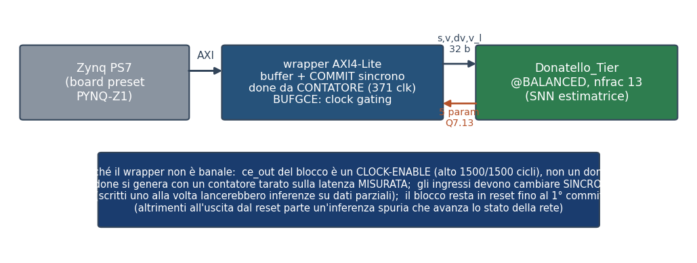
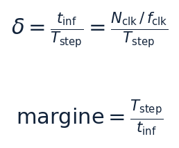
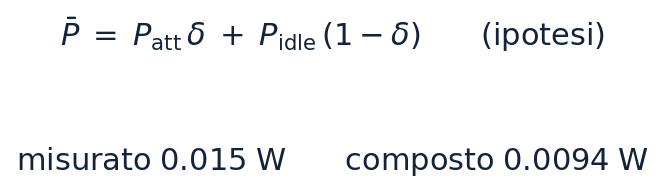

# CF_FSNN — Harness_SNN: validazione RTL e caratterizzazione hardware (Fase B2.0 · T6)

> **Il VHDL generato della SNN estimatrice provato bit-esatto rispetto al blocco su tutto il dataset, e il sistema completo — rete, wrapper AXI4-Lite e Zynq PS7 — implementato, misurato in clock, risorse ed energia, e portato a bitstream.**

> Oggetto: blocco Donatello_Tier @BALANCED (nfrac 13), la SNN che stima i cinque parametri IDM dagli stati di car-following.  
> Livelli di fedeltà: simulazione RTL e di netlist post-place&route in Vivado xsim; sintesi e implementazione reali su xc7z020; potenza da attività di commutazione registrata (SAIF). NON è una misura su silicio — quella è la Fase C.  
> Grounding: ogni numero proviene dagli artefatti di FaseB2.0/Harness_SNN/results/ (RESULTS.md, RESULTS_HW.md, PROBES_T6B.md, i log di esecuzione e i report Vivado grezzi); i fatti sulla varietà del dataset provengono dalla spec di progetto del banco. I cancelli sono deterministici (esito 0/N); le grandezze non misurabili con questo flusso sono marcate come STIMA.  
> Riproducibilità: bash FaseB2.0/Harness_SNN/hw/run_harness_snn_hw.sh [stadio] — un comando per stadio, con cancello di provenienza del DUT.  

---

## Sommario

| Sezione |
|---|
| 1. Sintesi |
| 2. Oggetto, perimetro e catena di fiducia |
| 2.1 Il blocco sotto esame |
| 2.2 Cosa è dentro e cosa è fuori |
| 2.3 La catena di fiducia: il riferimento è il blocco stesso |
| 3. Metodo di verifica |
| 3.1 Il dataset e il perimetro dei numeri |
| 3.2 Una simulazione per traiettoria |
| 3.3 Disciplina dei cancelli |
| 4. Validazione a livello RTL |
| 4.1 Accuratezza di stima dei parametri |
| 5. Il sistema hardware |
| 5.1 Tre scelte di progetto, tre fatti misurati |
| 5.2 Equivalenza del sistema completo |
| 5.3 Un caso limite reale: ingressi ripetuti |
| 6. Clock, risorse e netlist |
| 6.1 Frequenza: due numeri distinti |
| 6.2 Risorse e margine temporale |
| 6.3 La netlist dopo place&route |
| 7. Energia nel funzionamento reale |
| 7.1 La finestra di misura dell'inattività |
| 7.2 La fase attiva non dipende dal regime di guida |
| 7.3 Perché la potenza non si compone, e cosa si è fatto invece |
| 7.4 Energia per control-step |
| 8. Gestione del clock: quando il meccanismo contraddice il sommario |
| 9. Bitstream, riproducibilità e limiti |
| 9.1 Il bitstream e la sua provenienza |
| 9.2 Riproducibilità |
| 9.3 Limiti dichiarati |
| 10. Osservazioni di metodo |
| 10.1 Verificare le assunzioni prima di pianificare |
| 10.2 Non filtrare la diagnostica |
| 10.3 Guardare i valori, non gli indizi |
| 10.4 Misurare il costo prima di impegnare ore |
| 11. Conclusioni |
| Riferimenti |
| Artefatti del progetto (rimandi) |

## 1. Sintesi

Questo documento riporta la validazione e la caratterizzazione della **rete neurale spiking estimatrice** destinata all'FPGA: il blocco **Donatello_Tier @BALANCED**, che dai quattro stati di car-following (distanza, velocità propria, velocità relativa, velocità del leader) produce i **cinque parametri del modello IDM**. Il perimetro è la rete da sola; il controllore completo, che dai parametri ricava l'accelerazione, è oggetto di un documento gemello.

La domanda a cui si risponde è duplice. Primo: **il codice RTL generato si comporta come il blocco di riferimento?** Secondo: **cosa costa in hardware** — quanto clock regge, quante risorse occupa, quanta energia consuma nel funzionamento reale. La prima domanda è chiusa con confronti bit-esatti su tutto il dataset; la seconda con sintesi e implementazione reali, e con misure di potenza ricavate dall'attività di commutazione registrata in simulazione.

*Copertura dei cancelli di equivalenza. Ogni barra è un confronto bit-esatto contro il blocco di riferimento: il VHDL simulato in RTL, i parametri letti dal processore attraverso il bus AXI nelle due configurazioni di clock gating, e la netlist dopo place&route. In tutti i casi zero disallineamenti. Scala logaritmica.*

Esito, in breve: **0 disallineamenti su 300 000 confronti** fra il VHDL e il blocco su tutte le 60 traiettorie del dataset; **0 su 300 000** fra i parametri letti dal processore via AXI e il blocco, nelle due configurazioni di clock gating; **0 su 15 000** fra la netlist post-place&route e il blocco, su 3 traiettorie. I cancelli di equivalenza RTL, di sistema e di provenienza del codice sono provati **sensibili** — alterando un valore di riferimento di un solo bit meno significativo, o una riga del VHDL, il confronto fallisce; per i restanti la sensibilità non è stata dimostrata (§3.3).

| Grandezza | Valore | Natura |
|---|---|---|
| Equivalenza RTL e sistema-AXI vs blocco (60 traj) | 0 disallineamenti | misurato |
| Equivalenza netlist post-route vs blocco (3 traj) | 0 disallineamenti | misurato |
| Frequenza di clock deployabile | 52 MHz (WNS +0.358 ns) | misurato |
| Limite del cammino critico | 58.5 MHz | derivato (da WNS a vincolo stretto) |
| Risorse post-place&route | 4473 LUT · 3199 FF · 52 DSP · 1 BRAM | misurato |
| Tempo di inferenza / margine sul control-step | 7.13 µs / ≈14 000× | derivato |
| Energia dinamica per control-step | 0.9 mJ | misurato al duty reale, gating OFF |
| Energia statica del dispositivo per control-step | 10.3 mJ | stima del modello di dispositivo (typical, Tj 26.3 °C) |
| Clock gating: arresto del clock della rete | da 400 a 0 commutazioni | misurato |
| Clock gating: guadagno in potenza | 2–4× atteso | STIMA — non misurabile qui |
| Bitstream PYNQ-Z1 | prodotto, timing chiuso (WNS +0.358 ns) | artefatto |

> **Nota.** Tre grandezze **non** sono state ottenute e sono dichiarate come tali: il **guadagno in watt del clock gating** (lo strumento di analisi non lo rileva, §8), un **limite superiore** validato della potenza attiva (§7.2), e la **simulazione di timing** della netlist (§6.3). Nessuna di esse è stata sostituita da una stima presentata come misura. I numeri di potenza poggiano su un'attività registrata che copre il **56 % dei collegamenti** del circuito, il resto essendo stimato dallo strumento (§7.1); le implementazioni di netlist e potenza hanno perimetro **OOC (tier_axi_lite + Donatello_Tier)**, non l'intero sistema (§6.3).

## 2. Oggetto, perimetro e catena di fiducia

### 2.1 Il blocco sotto esame

Il dispositivo sotto test è il blocco di libreria **Donatello_Tier** configurato sul livello **BALANCED** con **13** bit frazionari interni. Espone un'interfaccia a **grandezze fisiche**: quattro ingressi in virgola fissa a 32 bit con 20 bit frazionari, e cinque uscite a 21 bit in formato Q7.13. La normalizzazione degli ingressi avviene **dentro** il blocco, in aritmetica a virgola fissa: è la configurazione che va effettivamente su FPGA.

Il blocco è **temporizzato a eventi**: una variazione degli ingressi innesca una singola inferenza, che si completa in **364 cicli di clock** misurati. Non è un circuito combinatorio né a flusso continuo: questa proprietà governa tutto il progetto del banco di prova e del wrapper.

### 2.2 Cosa è dentro e cosa è fuori

| Dentro il perimetro | Fuori dal perimetro |
|---|---|
| Equivalenza del VHDL generato rispetto al blocco, su tutto il dataset | Il controllore completo (rete + legge IDM): documento gemello |
| Il sistema deployato: rete + wrapper AXI4-Lite + processore Zynq | Metriche di car-following in anello chiuso: richiedono il controllore |
| Errore di stima dei cinque parametri sulle stesse 60 traiettorie (§4.1) | Qualità della rete come controllore in anello chiuso: documento gemello |
| Clock, risorse post-place&route, energia nel funzionamento reale — su implementazione OOC (tier_axi_lite + Donatello_Tier) | Implementazione e potenza dell'intero block design (richiede il modello del processore) |
| Bitstream e handoff per la board | Misura su silicio: è la Fase C, su board fisica |

### 2.3 La catena di fiducia: il riferimento è il blocco stesso

Un confronto bit-esatto vale quanto il riferimento con cui si confronta. Qui il riferimento è **il blocco stesso**, eseguito nel suo ambiente di modellazione e campionato ciclo per ciclo: l'uguaglianza fra RTL e riferimento è quindi, per costruzione, uguaglianza fra RTL e blocco, senza anelli intermedi da giustificare.

Questa scelta corregge un errore documentato della fase precedente. Un riferimento software "veloce" usato in passato **non** coincide con il blocco: se ne discosta dopo alcune decine di control-step, perché la normalizzazione interna in virgola fissa devia di un bit meno significativo e perché il blocco pilota il proprio nucleo mantenendo l'ingresso costante. Un riferimento sbagliato produce disallineamenti che sembrano difetti del codice generato: la catena di fiducia va quindi ancorata all'oggetto reale, non a un suo surrogato.

Il riferimento è calcolato **una volta sola** e messo in cache, e la **stessa** cache alimenta sia il confronto bit-esatto sia le metriche di accuratezza. Non è solo un'economia: garantisce che prova e numeri riportati si riferiscano agli **stessi identici dati**.

## 3. Metodo di verifica

### 3.1 Il dataset e il perimetro dei numeri

Il dataset di prova contiene **60 traiettorie** di car-following, ciascuna di 1000 control-step. La sua varietà è stata verificata sui dati e non assunta: i parametri-veicolo di riferimento sono **tutti distinti fra le 60 traiettorie**, gli scenari coprono **nove combinazioni** di contesto e profilo del veicolo che precede, e le forme d'onda della velocità del leader risultano fra loro praticamente scorrelate — la correlazione media fra le velocità del leader è **0.032**.

Il perimetro della prova coincide con il perimetro dei numeri riportati: le **metriche** sono calcolate sulle **stesse** traiettorie su cui è dimostrata l'equivalenza. Un sottoinsieme non è mai la base di una metrica pubblicata: su popolazioni diverse i valori non sono confrontabili e lo scostamento fra prova e riferimento diventa illeggibile — anche quando è nullo. Resta invece legittimo come **cancello di conferma**, purché il suo perimetro sia dichiarato accanto al risultato: è il caso del confronto sulla netlist (§6.3), dove la simulazione a livello di porte costa quasi **trenta volte** quella comportamentale.

### 3.2 Una simulazione per traiettoria

La rete mantiene uno **stato interno** in memoria su chip. Quello stato viene azzerato all'inizializzazione di una simulazione, **non** dal segnale di reset a tempo di esecuzione. Concatenare più traiettorie in una sola simulazione produrrebbe quindi risultati corretti solo per la prima: il banco esegue **una simulazione per traiettoria**, compilando una volta e rilanciando la sola esecuzione. Il costo è trascurabile e il confronto resta valido su tutte.

### 3.3 Disciplina dei cancelli

Ogni cancello è un'asserzione che **deve poter fallire**. Un cancello che non è mai stato visto fallire non è un cancello: la prova adottata è l'alterazione di **un bit meno significativo** in un valore di riferimento — se il cancello resta verde, non sta misurando nulla.

La sensibilità è stata dimostrata, con questa prova, per **tre** cancelli: l'equivalenza RTL, l'equivalenza del sistema attraverso il bus, e la provenienza del codice sintetizzato (dove l'alterazione è una riga aggiunta a un file VHDL, e la firma cambia di conseguenza). Per i cancelli sulla netlist, sulla sincronizzazione e sulla trasparenza del clock gating la sensibilità **non** è stata dimostrata: sono asserzioni sullo stesso meccanismo già provato sensibile a monte, ma questo resta un argomento di trasferimento, non una prova.

La stessa disciplina si applica agli **artefatti**: un cancello verifica il file prodotto — esistenza, dimensione non nulla, firma attesa — e non una riga di diario che ne annuncia l'intenzione. Durante questo lavoro un controllo scritto in quel modo ha dichiarato successo tre volte mentre non veniva prodotto alcun file di attività: da lì si sarebbero generati numeri di potenza perfettamente plausibili e privi di fondamento.

## 4. Validazione a livello RTL

Il VHDL è generato dal blocco forzando la variante desiderata, così che il codice prodotto sia esattamente quello del livello e della precisione sotto esame. Un banco di prova pilota gli ingressi, li mantiene per un intervallo superiore alla latenza, campiona i cinque parametri a fine intervallo e li confronta con il riferimento.

| Cancello | Che cosa dimostra | Perimetro | Esito |
|---|---|---|---|
| Equivalenza | i 5 parametri del VHDL coincidono col blocco | 60 traj × 1000 control-step × 5 parametri = 300 000 | 0 disallineamenti |
| Latenza | la latenza è misurata dal banco, non assunta | ogni simulazione | 364 cicli, costante, < 500 |
| Formato delle porte | le uscite sono interpretate nel formato corretto | implicito nell'equivalenza | coerente |
| Sensibilità | il cancello fallisce quando deve | 1 bit alterato | rilevato |

Il cancello sul **formato delle porte** merita una nota di metodo: non è una verifica separata, ma una conseguenza dell'equivalenza. Se il formato delle uscite fosse interpretato male, il disallineamento sarebbe **sistematico** su ogni control-step; poiché i disallineamenti sono zero, l'interpretazione è necessariamente corretta. Dichiararlo esplicitamente evita di contare due volte la stessa evidenza.

### 4.1 Accuratezza di stima dei parametri

Poiché il codice generato è dimostrato equivalente al blocco, l'accuratezza del blocco **è** l'accuratezza della versione hardware. Le cifre seguenti sono l'**errore assoluto** fra parametro stimato e parametro di riferimento del dataset, sulle stesse 60 traiettorie della prova di equivalenza, riportato come **massimo** e **99° percentile** — cioè la coda, non la mediana. Ogni riga è nell'unità della grandezza corrispondente.

| Parametro (unità) | errore max | errore p99 | Lettura |
|---|---|---|---|
| v0 — velocità desiderata [m/s] | 15.01 | 13.80 | errore elevato per **identificabilità**, non per difetto del codice |
| T — tempo di reazione desiderato [s] | 1.125 | 0.9127 | contenuto |
| s0 — distanza minima [m] | 0.9368 | 0.8435 | contenuto |
| a — accelerazione massima [m/s²] | 0.9908 | 0.892 | contenuto |
| b — decelerazione confortevole [m/s²] | 1.003 | 0.867 | contenuto |

> **Nota.** L'errore su **v0** non è un difetto dell'implementazione: quel parametro è osservabile solo quando il veicolo viaggia a flusso libero, cioè in una frazione delle situazioni presenti nel dataset. È un limite di **identificabilità** del problema di stima, non della sua realizzazione in hardware — e come tale non si corregge con più bit o più cicli di clock. La qualità della rete come controllore si valuta in anello chiuso, che è oggetto del documento gemello.

## 5. Il sistema hardware

Per portare la rete su FPGA servono due cose che il blocco da solo non ha: un'interfaccia verso il processore e una politica di alimentazione del clock. Il sistema è quindi composto dal blocco, da un wrapper con bus **AXI4-Lite** e dal processore **Zynq** configurato col preset della board.

*Architettura del sistema deployato e le tre scelte non banali del wrapper, ciascuna derivata da un fatto misurato anziché da un'assunzione.*

### 5.1 Tre scelte di progetto, tre fatti misurati

**Il segnale di fine elaborazione non esiste.** Il blocco espone un'uscita che, per convenzione del generatore di codice, si potrebbe interpretare come indicatore di completamento. La misura dice altro: quel segnale è alto in **1500 cicli su 1500**, cioè è un abilitatore di clock, non un completamento. Usarlo come tale farebbe leggere al processore parametri **non ancora pronti**. Il wrapper genera quindi il completamento con un **contatore**, tarato sulla latenza misurata.

La taratura richiede attenzione: le uscite diventano valide a **commit + 365 cicli** (misurato su control-step successivi), e campionare *esattamente* a quel ciclo cattura il valore **precedente**, perché l'aggiornamento avviene sullo stesso fronte di clock su cui si campiona. Il wrapper attende quindi **371 cicli**, con un margine di pochi cicli che non costa nulla: il control-step reale è di 0.1 s, cioè milioni di cicli.

**Gli ingressi devono cambiare insieme.** Essendo il blocco temporizzato a eventi, scrivere i quattro ingressi uno alla volta farebbe partire un'inferenza sul **primo** cambiamento, con dati parziali. I registri del bus sono perciò un'area di transito, e un comando di **commit** trasferisce i quattro valori **contemporaneamente**. Un cancello dedicato conta i fronti del bus interno e verifica che a ogni commit corrisponda una sola inferenza.

**Il blocco resta in reset fino al primo commit.** Senza questa precauzione, all'uscita dal reset gli ingressi passano da indefinito a zero: il rilevatore di fronte interpreta la transizione come un evento e avvia un'inferenza **spuria** che avanza lo stato della rete, disallineando tutte le inferenze successive. La misura lo ha mostrato senza ambiguità — un cambiamento delle uscite compariva prima del primo commit, a **circa una latenza** dal rilascio del reset (uscita al ciclo 379, reset rilasciato al ciclo 16, cioè 363 cicli: la latenza è 364, e la differenza di un ciclo dipende dalla convenzione di campionamento). Tenere l'acceleratore fermo finché il processore non gli assegna lavoro è anche il comportamento corretto in campo.

### 5.2 Equivalenza del sistema completo

Un banco che si comporta da processore scrive i quattro ingressi, emette il commit, attende il completamento e legge i cinque parametri attraverso il bus, confrontandoli con il riferimento. L'esito è **0 disallineamenti su 300 000** confronti, sull'intero dataset, e **identico nelle due configurazioni di clock gating**: la gestione del clock non altera un solo bit del risultato.

### 5.3 Un caso limite reale: ingressi ripetuti

Il cancello sulla sincronia degli ingressi conta **59 797** inferenze contro le 60 000 attese. Lo scarto è stato verificato sul dataset e non giustificato a parole: esattamente **203** control-step hanno i quattro ingressi **bit-identici** al precedente, concentrati in **6** traiettorie su 60 di tipo "parti e fermati", con un massimo di 79 ripetizioni in una singola traiettoria. Su ingressi identici il rilevatore di fronte non scatta e la rete non ricalcola.

> **Nota.** In anello aperto il fenomeno è **innocuo**: a ingressi identici corrispondono parametri identici, e i valori mantenuti restano quelli corretti — lo dimostra l'assenza di disallineamenti, perché un commit realmente perso produrrebbe valori obsoleti che il confronto bit-esatto rileverebbe. In **anello chiuso** la conclusione non si trasferisce: là gli ingressi del passo successivo dipendono dall'uscita, quindi un'inferenza non rieseguita si propaga. È un elemento da verificare nel documento gemello, proprio negli scenari dove il fenomeno si concentra.

## 6. Clock, risorse e netlist

### 6.1 Frequenza: due numeri distinti

La frequenza di funzionamento è stata determinata con una scansione a punti discreti — il generatore di clock del processore produce valori quantizzati — implementando il sistema completo a ciascun punto con parametri di parallelismo **fissi**, così che i risultati siano riproducibili.

*Frequenza limite del cammino critico. **T_vincolo**: periodo richiesto in fase di implementazione; **WNS** (worst negative slack): margine peggiore riportato dall'analisi statica dei tempi — positivo se il timing chiude. Il ritardo effettivamente ottenuto è la differenza fra i due.*

*A sinistra: margine di timing per frequenza richiesta; il sistema chiude fino a 52 MHz e non chiude a 55. A destra: il ritardo del cammino critico effettivamente ottenuto. A frequenze basse lo strumento si arresta intorno ai 22 ns perché il margine è ampio e non ha motivo di ottimizzare; stringendo il vincolo il ritardo scende fino a 17.08 ns. Il limite del circuito si legge quindi **stringendo**, non al punto in cui il margine si annulla.*

| Grandezza | Valore | Significato |
|---|---|---|
| Frequenza deployabile | 52 MHz, WNS +0.358 ns | la più alta fra quelle provate che chiude il timing; è quella del bitstream |
| Ritardo minimo ottenuto | 17.081 ns | stringendo il vincolo oltre il punto di chiusura |
| Limite del cammino critico | 58.5 MHz | grandezza **derivata** dal ritardo minimo; non concedibile dal generatore di clock |

> **Nota.** Entrambe le frequenze sono riferite al **sistema completo** con i suoi ingressi e uscite, non a un nucleo isolato con i confini registrati. Non sono quindi confrontabili con misure fuori contesto dello stesso progetto, che risultano sistematicamente più alte perché non includono i cammini di interfaccia.

### 6.2 Risorse e margine temporale

Le risorse sono misurate **dopo place&route**, non stimate: è la differenza che permette di catturare anche la memoria su chip, assente dalle valutazioni fuori contesto condotte in passato.

| FCLK [MHz] | WNS [ns] | LUT | FF | DSP | BRAM |
|---|---|---|---|---|---|
| 30 | +10.892 | 4474 | 3199 | 52 | 1 |
| 40 | +2.626 | 4472 | 3199 | 52 | 1 |
| 50 | +0.335 | 4476 | 3199 | 52 | 1 |
| 52 | +0.358 | 4473 | 3199 | 52 | 1 |
| 55 | -0.345 | 4524 | 3199 | 52 | 1 |
| 60 | -0.414 | 4613 | 3199 | 52 | 1 |

L'occupazione è **quasi insensibile** al vincolo temporale: fra 40 e 60 MHz le celle logiche crescono di circa il 3 %, mentre registri, moltiplicatori e memoria restano invariati. Il costo in area non è quindi la leva su cui agire per guadagnare frequenza.

*Ciclo di lavoro e margine temporale. **N_clk**: cicli per inferenza; **f_clk**: frequenza di funzionamento; **T_step**: periodo del control-step richiesto dall'applicazione. Il ciclo di lavoro è la frazione di tempo in cui il circuito calcola.*

Con 371 cicli per inferenza a 52 MHz, un'inferenza dura **7.13 µs** contro un control-step richiesto di **0.1 s**: il margine è di circa **14 000 volte** e il ciclo di lavoro è dello **0.0071 %**. Il circuito è dunque fermo per oltre il 99.99 % del tempo.

> **Nota.** Ne segue una conseguenza di progetto che vale la pena esplicitare: la frequenza massima è una **caratterizzazione**, non necessariamente la scelta di funzionamento migliore. Salire in frequenza non produce alcun beneficio applicativo — il margine è già di quattro ordini di grandezza — mentre aumenta la potenza dinamica in modo proporzionale, soprattutto quella spesa nei periodi di inattività se il clock non viene fermato.

### 6.3 La netlist dopo place&route

L'equivalenza dimostrata a livello RTL non copre ciò che sintesi e place&route possono cambiare: in particolare l'inizializzazione degli elementi di memoria, che i modelli comportamentali del livello RTL azzerano per convenzione. Il confronto è stato quindi ripetuto sulla **netlist implementata**, ottenendo **0 disallineamenti su 15 000** su 3 traiettorie complete.

> **Nota.** Perimetro dell'implementazione: la netlist è quella dell'implementazione **OOC (tier_axi_lite + Donatello_Tier)**, non dell'intero sistema. Simulare il block design completo richiederebbe il modello di bus del processore, che non è parte di questo lavoro: l'integrazione col processore è coperta dall'equivalenza attraverso il bus (§5.2) e dall'analisi statica dei tempi sul sistema completo (§6.1). Lo stesso perimetro vale per le misure di potenza (§7).

Il numero di traiettorie è stato deciso **dal costo misurato**, non a priori: la simulazione della netlist costa **22 minuti per traiettoria** contro 0.8 della comportamentale — circa **29 volte** tanto — cosicché l'intero dataset richiederebbe oltre **22 ore** senza parallelismo. Le 3 traiettorie costituiscono un cancello di **conferma** con perimetro dichiarato; l'esaustività resta quella del confronto comportamentale sull'intero dataset.

Una simulazione della netlist **con i ritardi annotati** non ha invece prodotto risultati utilizzabili. La causa è nel banco e non nel circuito, e lo dimostra il fatto che la simulazione funzionale sulla **stessa** netlist è corretta: se lo stato iniziale fosse indefinito, entrambe fallirebbero. Va inoltre ricordato che la firma del timing spetta all'**analisi statica**, non alla simulazione — ed è pulita, con margine positivo alla frequenza scelta.

## 7. Energia nel funzionamento reale

La potenza è ricavata dall'**attività di commutazione registrata** durante la simulazione della netlist implementata — nel perimetro **OOC (tier_axi_lite + Donatello_Tier)** di §6.3 — e non da stime a vuoto. Il perimetro fisico è la logica programmabile: il processore è un blocco fisso del dispositivo e il suo consumo non appartiene a questo progetto.

> **Nota.** Due limiti dichiarati del metodo, entrambi nella direzione della **sottostima**. **Primo:** l'attività registrata copre **56 % dei collegamenti** del circuito (6 906 su 12 380); il consumo dei restanti è stimato dallo strumento con i suoi modelli statistici. Il livello di confidenza «alto» che lo strumento dichiara non è un avallo di accuratezza: sui nodi interni scatta quando l'attività fornita supera il **25 %**, soglia ampiamente superata qui. **Secondo:** l'attività proviene da una simulazione **funzionale**, poiché quella con i ritardi annotati non è utilizzabile (§6.3), quindi i transitori spurii non sono catturati.

### 7.1 La finestra di misura dell'inattività

Nei periodi di inattività il circuito è in regime **stazionario**: gli ingressi non cambiano e commuta essenzialmente la rete di distribuzione del clock — 7 dei 8 mW dinamici, il resto essendo quasi tutto memoria su chip. La lunghezza della finestra di misura non è stata scelta a giudizio ma verificata: a **200**, **1000** e **5000** cicli la potenza risulta **identica**, quindi la finestra più corta è sufficiente. Lo stesso controllo ha confermato la **premessa** — che il circuito sia davvero fermo quando non calcola — che non era garantita e senza la quale la gestione del clock non avrebbe nulla da spegnere.

### 7.2 La fase attiva non dipende dal regime di guida

La potenza durante il calcolo è stata misurata su **nove** carichi di lavoro reali, uno per ciascuna combinazione di contesto e profilo presente nel dataset, più un carico sintetico costruito per massimizzare l'attività.

*Potenza dinamica nella fase attiva. La dispersione fra i nove regimi reali è di circa il 7 %: il consumo durante il calcolo è poco sensibile al tipo di guida. Il carico sintetico costruito come caso peggiore (in rosso) risulta il più basso di tutti e **non** costituisce quindi un limite superiore valido.*

I nove valori reali stanno in **42–45 mW** — una dispersione di circa il 7 % — e il massimo osservato è **45 mW**, nel regime «launch|launch». Il carico sintetico misura **41 mW**, cioè meno di tutti i reali.

Il controllo predisposto per validare il carico sintetico **è fallito**: gli ingressi scelti a priori — distanza minima, forte velocità di avvicinamento, velocità elevata — non massimizzano la commutazione. Il valore non viene perciò riportato come limite superiore; il massimo utilizzabile è quello **osservato** fra i carichi reali, cioè **45 mW**. Individuare il regime effettivamente peggiore richiede uno studio dedicato.

### 7.3 Perché la potenza non si compone, e cosa si è fatto invece

La via naturale per ottenere l'energia di un control-step reale sarebbe comporre le due fasi: potenza attiva per la durata del calcolo, più potenza di inattività per il resto. Questa composizione è stata **messa alla prova** e si è rivelata **non valida**.

*Composizione lineare della potenza fra le due fasi, e suo esito sperimentale a ciclo di lavoro del 3.85 %. **P_att**: potenza durante il calcolo; **P_idle**: potenza in inattività; **δ**: ciclo di lavoro. La relazione sottostima di circa 1.6 volte.*

Lo scarto è **localizzato**: i moltiplicatori dedicati consumano, nella miscela, circa il 40 % del valore che hanno in piena attività, pur essendo attivi solo per il 3.85 % del tempo. Una spiegazione plausibile — dichiarata come ipotesi, non verificata — è che il modello di potenza dipenda anche dalla probabilità statica dei segnali e non soltanto dalla loro frequenza di commutazione: in inattività gli ingressi dei moltiplicatori mantengono gli ultimi valori calcolati, che nel modello non equivale a "spento".

La composizione è stata quindi **abbandonata** e l'energia è stata **misurata direttamente**, simulando un control-step reale per intero: oltre cinque milioni di cicli di clock, pari a 0.1 s alla frequenza scelta. Il costo effettivo è stato di dodici minuti, perché in simulazione il costo è dato dagli eventi di clock e non dal tempo simulato.

*Convergenza della potenza dinamica al ridursi del ciclo di lavoro. I tre punti misurati tendono al valore di inattività: al control-step reale la fase di calcolo è energeticamente trascurabile. Lo scostamento sui moltiplicatori osservato a ciclo di lavoro elevato **svanisce**, confermando che dipendeva dal ciclo di lavoro e non era uno scostamento fisso.*

### 7.4 Energia per control-step

*Energia per control-step. **P̄**: potenza media misurata al ciclo di lavoro reale; **T_step**: periodo del control-step. Le componenti dinamica e statica sono tenute distinte.*

*A sinistra: energia per control-step, con la componente dinamica — il costo del progetto — distinta dalla componente statica del dispositivo, che è presente anche a circuito inattivo. A destra: composizione della sola parte dinamica; la rete di distribuzione del clock ne costituisce la quota dominante, ed è precisamente ciò che la gestione del clock aggredisce.*

| Voce | Potenza | Energia per control-step | Natura |
|---|---|---|---|
| Dinamica — costo del progetto | 9 mW | 0.9 mJ | misurato al ciclo di lavoro reale, **gating OFF** |
| di cui rete di distribuzione del clock | 7 mW | 0.7 mJ | 78 % della dinamica |
| Statica del dispositivo | 103 mW | 10.3 mJ | stima del modello (typical, Tj 26.3 °C) |

La configurazione della misura va dichiarata: l'energia dinamica è stata misurata con la gestione del clock **disattivata**, cioè col clock sempre libero. Non è la configurazione di deployment — le prove di equivalenza e i nove carichi di lavoro sono a gestione **attiva** — ed è una scelta prudente, perché lo strumento non sa contabilizzare il clock fermo (§8): attivarla non avrebbe cambiato il numero, e dichiararlo come misura «a clock gestito» ne avrebbe falsato il significato. Il valore va quindi letto come **limite superiore** dell'energia dinamica del deployment.

> **Nota.** Le due voci **non vanno sommate in un unico numero senza dirlo**: la componente statica è del dispositivo e c'è anche a circuito spento, mentre la dinamica è ciò che il progetto aggiunge. Sul totale la parte dinamica pesa circa l'8 %, in linea con quanto osservato nella fase precedente su questo stesso dispositivo.

## 8. Gestione del clock: quando il meccanismo contraddice il sommario

Poiché il circuito è inattivo per oltre il 99.99 % del tempo e la sua potenza dinamica è dominata dalla rete di distribuzione del clock, fermare il clock nei periodi di inattività è la leva naturale. Il sistema la implementa con una porta dedicata, comandata da un **bit di registro** — una scelta deliberata: così le due configurazioni condividono la **stessa** netlist e il confronto isola l'effetto della gestione del clock, non differenze di sintesi.

*A sinistra il meccanismo, a destra il sommario dello strumento. Le commutazioni del clock della rete, registrate nel file di attività, passano da 400 a **zero**: il clock si ferma completamente. La potenza riportata resta però **identica** nelle due configurazioni.*

La gestione del clock **funziona**, ed è provata su due piani indipendenti. Sul piano funzionale, l'equivalenza col blocco resta perfetta con la porta attiva: **0 disallineamenti su 300 000**, cioè il circuito calcola correttamente pur avendo il clock fermato e riavviato a ogni control-step. Sul piano del meccanismo, le commutazioni del clock della rete passano da **400 a 0**.

Il **guadagno in potenza**, però, non è ottenibile da questo flusso di analisi. Lo strumento ricava la potenza delle reti di clock dal **vincolo di frequenza** dichiarato, non dall'attività registrata: un clock fermo continua perciò a essere conteggiato come se commutasse. La cosa è stata verificata anche in negativo, imponendo esplicitamente attività nulla sulle reti interessate — il risultato non cambia di una cifra.

> **Nota.** Se ci si fosse fermati al sommario, la conclusione sarebbe stata "la gestione del clock non serve": un'affermazione **falsa**, e credibile, prodotta da uno strumento autorevole che dichiara su quel report confidenza «alta» — etichetta che, come si è visto in §7.1, misura quanta attività le è stata fornita, non quanto sia corretto il risultato. È la ragione per cui un risultato va sempre confrontato col meccanismo che lo genera, e non accettato dal solo valore riassuntivo.

Il guadagno atteso, dichiarato come **stima** e non come misura: la quota dominante della potenza dinamica è la rete di distribuzione del clock, e la parte spenta serve la quasi totalità dei registri, tutti i moltiplicatori e l'unica memoria del progetto. Fermandola, la potenza dinamica dovrebbe ridursi di un fattore compreso fra **2 e 4**.

La verifica è rimandata alla misura su board, dove è **immediata** proprio grazie alla scelta progettuale iniziale: essendo la gestione del clock comandata da un bit di registro, **lo stesso bitstream** consente di leggere la corrente assorbita a riposo nelle due configurazioni e di ricavare il risparmio per differenza. Non serve un secondo bitstream né una ricompilazione.

## 9. Bitstream, riproducibilità e limiti

### 9.1 Il bitstream e la sua provenienza

Il bitstream è generato con la **stessa procedura** usata per la caratterizzazione, cosicché il circuito programmato sia quello misurato e non una variante ricostruita a parte. Il margine di timing del percorso che produce il bitstream — **+0.358 ns** — coincide con quello della scansione alla stessa frequenza, il che conferma anche la riproducibilità del flusso.

| Artefatto | Dimensione | Destinazione |
|---|---|---|
| bitstream | 4.05 MB | programmazione della logica sulla board |
| descrizione hardware | 138 kB | ambiente Python della board |
| archivio di piattaforma | 1.15 MB | ambiente di sviluppo software |

La provenienza è verificata nell'artefatto stesso: la descrizione hardware riporta la board `www.digilentinc.com:pynq-z1:part0:1.0`, il dispositivo e il package attesi.

### 9.2 Riproducibilità

L'intera catena è eseguibile **da un comando per stadio** — verifica di provenienza, prove sulle assunzioni, equivalenza, scansione della frequenza, netlist, energia, bitstream — e uno stadio di sintesi riestrae i valori chiave **dagli artefatti su disco**, non da costanti nel programma. Un rilancio si **confronta** quindi con quanto documentato, invece di duplicarlo.

Un cancello dedicato verifica che il codice caratterizzato sia l'artefatto validato: confronta l'impronta dei sorgenti con quella registrata e, se il codice è assente, lo rigenera **e** ripete la prova di equivalenza prima di procedere. Anche questo cancello è provato sensibile: alterando una riga di un file, l'impronta cambia e il cancello blocca.

> **Nota.** Il cancello di provenienza ha esso stesso contenuto, in prima stesura, il difetto che era destinato a prevenire: una sostituzione di comando spezzava il percorso del progetto in corrispondenza di uno spazio, cosicché non veniva letto alcun file e l'impronta calcolata era quella della stringa vuota — dichiarando successo. È il motivo per cui un cancello va provato **anche in negativo**, e non soltanto visto passare.

### 9.3 Limiti dichiarati

| Voce | Stato | Come si chiude |
|---|---|---|
| Guadagno in potenza della gestione del clock | non misurabile con questo flusso | misura di corrente su board, stesso bitstream, due configurazioni |
| Limite superiore della potenza attiva | carico sintetico invalidato | studio dedicato sul regime che massimizza l'attività |
| Simulazione della netlist con ritardi annotati | non riuscita (causa nel banco) | la funzionale è corretta e la firma del timing è dell'analisi statica |
| Composizione lineare della potenza fra fasi | invalidata dal proprio controllo | superata: l'energia è misurata direttamente al ciclo di lavoro reale |
| Equivalenza della netlist sull'intero dataset | confermata su 3 traiettorie | l'esaustività è del confronto comportamentale su tutte e 60 |

## 10. Osservazioni di metodo

Alcune delle difficoltà incontrate hanno valore oltre questo lavoro, e sono registrate nei documenti di processo perché non vengano ripercorse.

### 10.1 Verificare le assunzioni prima di pianificare

I modelli di banco ereditati da un blocco precedente si sono rivelati **non trasferibili** al blocco attuale, che è mascherato, gerarchico e con stato in memoria: quattro correzioni sono state necessarie in corso d'opera. Nella fase successiva le assunzioni sono state invece verificate con **prove mirate prima** di scrivere il piano, e una di esse — il presunto segnale di fine elaborazione — si è rivelata falsa, con conseguenze dirette sul progetto del wrapper. Il costo delle prove è stato di minuti; quello delle correzioni in corsa, di ore.

### 10.2 Non filtrare la diagnostica

Tre volte, in questo lavoro, un programma di verifica ha nascosto l'informazione necessaria a diagnosticare un fallimento: uscita reindirizzata al nulla, output catturato e mai stampato, filtro ristretto ai soli messaggi di errore. La causa comune è scrivere il filtro pensando al caso in cui tutto funziona, mentre serve nel caso opposto. Negli strumenti di verifica la diagnostica si **limita in lunghezza, non in contenuto**.

### 10.3 Guardare i valori, non gli indizi

Un primo tentativo di diagnosi si è appoggiato a una misura di temporizzazione compatibile con l'ipotesi formulata — e anche con altre: la correzione applicata non ha cambiato nulla. Il quadro si è chiarito solo confrontando **i valori che discriminano**: quanto letto dal bus, quanto memorizzato dal wrapper, quanto prodotto dal blocco e quanto atteso dal riferimento. Quel confronto ha separato due difetti distinti in un solo passaggio.

### 10.4 Misurare il costo prima di impegnare ore

La regola è stata applicata con profitto in più punti — il costo del riferimento, il primo punto della scansione di frequenza, le verifiche preliminari alla simulazione del control-step completo — e violata una volta, lanciando tre simulazioni di netlist senza cronometrarne una. Le stime a priori si sono rivelate sbagliate in entrambe le direzioni: una volta troppo pessimistiche di un fattore dieci, perché dominate dal costo fisso di avvio dello strumento.

## 11. Conclusioni

La rete neurale spiking estimatrice è **validata a livello di codice generato, di netlist implementata e di sistema completo**, con confronti bit-esatti: su **tutto il dataset** per il codice generato e per il sistema attraverso il bus, su **3 traiettorie** con perimetro dichiarato per la netlist. È inoltre **caratterizzata in hardware**: frequenza deployabile e limite del circuito, risorse dopo place&route comprensive della memoria su chip, energia per control-step misurata al ciclo di lavoro reale. Il bitstream per la board è prodotto, con timing chiuso e provenienza verificata.

Il quadro applicativo che ne emerge è netto: con un margine temporale di quattro ordini di grandezza sul control-step richiesto, il vincolo di questo progetto **non è la velocità**. L'energia è dominata dai periodi di inattività, e in quei periodi dalla rete di distribuzione del clock: la leva utile è fermare il clock, non aumentarlo. La gestione del clock è implementata, funzionalmente trasparente e provata attiva; la quantificazione del suo beneficio è l'oggetto naturale della misura su board.

Tre grandezze non sono state ottenute e sono dichiarate come tali, con l'indicazione di come si chiudono. Preferire una lacuna dichiarata a una stima presentata come misura è una scelta deliberata: un numero plausibile e infondato è più dannoso di un numero assente, perché non si distingue da uno corretto.

## Riferimenti

Documentazione degli strumenti utilizzata per il flusso di implementazione, simulazione e analisi. I risultati interni al progetto sono rimandi ai propri artefatti, non citazioni.

| Riferimento | Rilevanza per questo documento |
|---|---|
| AMD/Xilinx, *Vivado Design Suite User Guide: Power Analysis and Optimization* (UG907) | metodo di analisi della potenza; ruolo dell'attività di commutazione registrata e del vincolo di clock |
| AMD/Xilinx, *Vivado Design Suite User Guide: Logic Simulation* (UG900) | simulazione comportamentale, funzionale e di timing; registrazione dell'attività di commutazione |
| AMD/Xilinx, *Vivado Design Suite User Guide: Synthesis* (UG901) | sintesi fuori contesto e sue differenze dal flusso di sistema |
| AMD/Xilinx, *UltraFast Design Methodology Guide for FPGAs and SoCs* (UG949) | ruolo dell'analisi statica dei tempi come firma del timing |
| AMD/Xilinx, *Zynq-7000 SoC Technical Reference Manual* (UG585) | processore, generazione dei clock verso la logica programmabile e loro quantizzazione |
| MathWorks, *HDL Coder User's Guide* | generazione del codice da modello; semantica dei segnali di abilitazione del clock |
| Digilent, *PYNQ-Z1 Reference Manual* | board di destinazione e suo preset di configurazione |
| Treiber, M., Hennecke, A., Helbing, D. (2000). *Congested traffic states in empirical observations and microscopic simulations.* Physical Review E 62(2), 1805–1824 | modello di car-following i cui parametri sono l'uscita della rete |

### Artefatti del progetto (rimandi)

| Artefatto | Contenuto |
|---|---|
| FaseB2.0/Harness_SNN/results/RESULTS.md | cancelli e metriche della validazione RTL |
| FaseB2.0/Harness_SNN/results/RESULTS_HW.md | caratterizzazione hardware completa, con natura di ogni numero |
| FaseB2.0/Harness_SNN/results/PROBES_T6B.md | esito delle prove sulle assunzioni hardware |
| FaseB2.0/Harness_SNN/results/*.rpt | report grezzi di potenza, timing e utilizzo |
| FaseB2.0/Harness_SNN/bitstream/ | bitstream e artefatti di handoff |
| document/HDL_PHASE.md §6, §9 | stato della fase e gotcha tecnici e di metodo |
