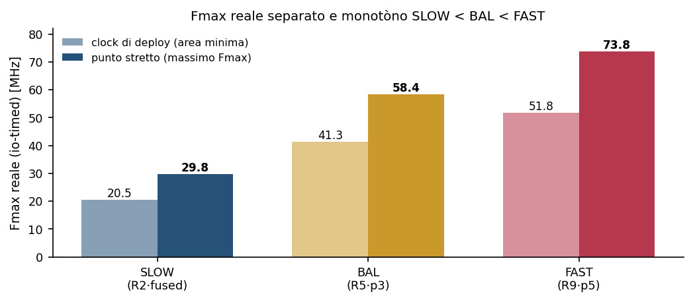

# CF_FSNN — Report FPGA "Blocco A": trade-off dei tier Donatello

> **Caratterizzazione dei tre tier del blocco Donatello (SLOW/BAL/FAST) sul Fmax reale io-timed e sul trade-off area–potenza, per scegliere il candidato al Blocco B su Zynq-7020 (PYNQ-Z1).**

> Livello di fedeltà: stima Vivado post-implementazione con timing d'integrazione (io-timed) — non misura su silicio.  
> Fonte dei numeri: matlab/study_tradeoff/donatello/points_phase2.tsv (18 punti, dai report Vivado util/timing/power via sweep_phase2.sh).  
> Contesto e metodo: RESULTS.md §15 (Fmax reale io-timed e fix splitpipe), HDL_PHASE.md §3.1.5.  
> Toolchain: Vivado 2026.1 · FPGA Xilinx Zynq-7000 xc7z020-clg400-1 (scheda PYNQ-Z1).  

---

## Sommario

| Sezione |
|---|
| 1. Sommario esecutivo |
| 2. Oggetto e vincoli |
| 3. Metodo — Fase 1: verifica del blocco |
| 3.1 La firma strutturale di identità |
| 4. Metodo — Fase 2: curve a clock vincolato (io-timed) |
| 4.1 Il metro reale: timing d'integrazione |
| 4.2 Le varianti nascono dal vincolo di clock, non dai preset |
| 5. Risultati |
| 5.1 Il Fmax reale, separato e monotòno |
| 5.2 Le curve area–clock e la potenza |
| 5.2.1 Curva del tier SLOW (R2 · decode fused) |
| 5.2.2 Curva del tier BAL (R5 · decode p3) |
| 5.2.3 Curva del tier FAST (R9 · decode p5) |
| 5.3 Timing di tenuta e determinismo |
| 6. Tempo d'inferenza e margine |
| 7. Scelta del candidato Donatello per il Blocco B |
| 8. Riproducibilità e limiti |
| 9. Riferimenti |

## 1. Sommario esecutivo

Il blocco Donatello è la rete spiking che identifica i cinque parametri del controllore car-following a partire da quattro grandezze cinematiche. Lo studio ne caratterizza tre realizzazioni — i tier **SLOW**, **BAL** e **FAST** — ottenute accoppiando tre profondità di rete (round SNN R2, R5, R9) con tre profondità di decodifica (fusa, pipeline a 3 stadi, pipeline a 5 stadi). Ogni tier è sintetizzato per lo Zynq-7020 e misurato sul **Fmax reale io-timed**, la frequenza effettivamente disponibile quando gli ingressi sono registrati, non sul Fmax interno reg-reg che sovrastima la via di calcolo.

Al metro reale le tre realizzazioni si separano in modo netto e monotòno: la frequenza massima vale **29.8**, **58.4** e **73.8 MHz** per SLOW, BAL e FAST. Il valore di FAST coincide con il blocco deployabile già congelato (73.6 MHz), a conferma che il metro di misura e l'RTL descrivono lo stesso oggetto. L'area di logica e i registri crescono con la profondità di pipeline, e la potenza è dominata dalla dispersione statica del dispositivo, costante, mentre la quota dinamica scala con il clock.

La conclusione operativa è che il **Fmax è margine, non requisito**. Il tempo di inferenza di ogni tier resta fra 5.5 e 16.7 µs, cioè fra circa **5980×** (il margine più stretto) e **18180×** (il più largo) sotto il budget di un passo di controllo (0.1 s). Poiché nessuna soglia di frequenza vincola, e poiché l'estensione futura verso la comunicazione veicolo-infrastruttura (V2I) richiederà spazio sul chip, il criterio che discrimina i tier è l'**area** (e la potenza), non la velocità. Lo studio presenta il trade-off completo; la scelta finale del candidato resta all'utente dove i dati non impongono un vincitore netto (§7).

> **Nota.** Convenzione dei marcatori: ● grandezza misurata o verificata bit-esatta (correttezza funzionale, latenza in clock); ○ stima Vivado post-implementazione (Fmax, area, potenza) con timing d'integrazione io-timed, precedente alla misura su silicio.

## 2. Oggetto e vincoli

L'oggetto è il blocco Donatello: la rete spiking di car-following con la sua decodifica, esposta come singolo blocco con **interfaccia fissa a quattro ingressi e cinque uscite**. Gli ingressi sono la distanza dal veicolo di testa, la velocità propria, la velocità relativa e la velocità del veicolo di testa; le uscite sono i cinque parametri del controllore a inseguimento intelligente (velocità desiderata, tempo di via, distanza minima, accelerazione massima e decelerazione confortevole). L'interfaccia non cambia fra i tier: cambia solo l'implementazione interna.

*Figura 2.1 — Il blocco Donatello e la sua interfaccia fissa. Le quattro grandezze cinematiche sono normalizzate in virgola fissa, elaborate dal core spiking a multiplazione temporale (macchina a stati con memoria su blocchi RAM, dieci tick interni per passo) e decodificate in cinque parametri tramite una tabella a 64 punti. Il registro sugli operandi del normalize (op_reg, architettura splitpipe) appartiene a tutti e tre i tier. Fonte: architettura del blocco, RESULTS.md §15.*

Ogni tier è il blocco **completo e autonomo**: il VHDL è generato dal solo modello Simulink, senza cablaggi manuali, e la rete è realizzata a multiplazione temporale, riusando una sola via di calcolo con lo stato tenuto in memoria a doppia porta. I tre tier differiscono per due assi ortogonali — la profondità della rete spiking (round R2, R5, R9) e la profondità della pipeline di decodifica (fusa, tre stadi, cinque stadi) — accoppiati come SLOW = R2 con decodifica fusa, BAL = R5 con pipeline a tre stadi, FAST = R9 con pipeline a cinque stadi.

Il vincolo di deployment è la scheda PYNQ-Z1, che porta uno Zynq-7020 (xc7z020-clg400-1). Il fine dello studio non è massimizzare una metrica, ma **scegliere il tier candidato** a entrare nel Blocco B, dove la rete sarà chiusa in anello con il controllore a inseguimento intelligente. Poiché è previsto un secondo blocco di comunicazione veicolo-infrastruttura sullo stesso dispositivo, lo spazio di logica lasciato libero è una risorsa di progetto: la compattezza pesa quanto la frequenza, e spesso di più.

## 3. Metodo — Fase 1: verifica del blocco

Prima di caratterizzare le prestazioni va stabilito che ciascun tier sia davvero il blocco che dichiara di essere, e che calcoli i parametri corretti. La verifica agisce sull'artefatto che si sta per misurare, non su quello appena costruito, così da non lasciar passare VHDL riciclato da una configurazione precedente. Due garanzie indipendenti la compongono: la correttezza funzionale in streaming e la firma strutturale di identità.

La correttezza è la **parità bit-esatta** con il modello in virgola fissa di riferimento, verificata facendo scorrere una traiettoria reale nel blocco un campione alla volta: lo scarto massimo sui cinque parametri è nullo (dmax = 0). La macchina a stati è edge-triggered sul cambiamento d'ingresso, per cui un campione produce esattamente una inferenza, con qualunque tempo di mantenimento superiore alla latenza.

### 3.1 La firma strutturale di identità

Un blocco può passare il test funzionale pur avendo la metà sbagliata: due configurazioni diverse possono dare gli stessi parametri a valle se la differenza è combinatoria. Per questo la verifica legge nel VHDL la **firma di entrambe le metà**. La profondità della decodifica si riconosce dai registri di fase; il round della rete spiking si riconosce dagli stadi di pipeline, che nascono a round noti e ne fissano l'identità.

| Tier | Round · decode | Firma round (nel VHDL) | Verifica |  |
|---|---|---|---|---|
| SLOW | R2 · fused | pCa assente, pCm assente, pCx assente | dmax = 0 in streaming | ● |
| BAL | R5 · p3 | pCa presente, pCm assente, pCx assente | dmax = 0 in streaming | ● |
| FAST | R9 · p5 | pCa, pCm, pCx tutti presenti | dmax = 0 in streaming | ● |

Gli stadi pCa, pCm e pCx compaiono rispettivamente ai round R4, R6 e R9 della rete: la loro presenza o assenza discrimina R2, R5 e R9 senza ambiguità. La firma della decodifica e quella della rete, lette insieme sull'artefatto, chiudono la porta agli scambi silenziosi di mezzo blocco.

Il cancello bit-esatto è provato anche **in negativo**, perché una verifica che non può fallire non verifica nulla. Degradando la precisione dell'ingresso sotto la soglia richiesta per la parità — da almeno venti bit frazionari (dove il blocco resta bit-esatto fino a Q?.13) a Q?.10 — la normalizzazione arrotonda diversamente, un solo bit meno significativo ribalta uno spike, lo stato diverge e i parametri a valle si scostano fino a circa **0.23** entro venti passi di controllo. La stessa prova che a piena precisione dà dmax = 0 respinge dunque il caso falso: il cancello discrimina.

## 4. Metodo — Fase 2: curve a clock vincolato (io-timed)

La seconda fase misura le prestazioni al variare del vincolo di clock. Due scelte di metodo ne determinano la validità: il timing d'integrazione e la natura delle varianti.

### 4.1 Il metro reale: timing d'integrazione

Il Fmax di una sintesi out-of-context senza vincoli sulle porte è un metro **interno**, reg-reg: misura solo i percorsi fra registri e ignora il cammino che va dall'ingresso, attraverso la normalizzazione, fino all'inizio dell'inferenza. Quel cammino, invisibile finché le porte non sono temporizzate, diventa reale non appena gli ingressi del blocco sono registrati — cioè in ogni deployment. Il metro interno sovrastima perciò la frequenza disponibile, e appiattisce i tier l'uno sull'altro perché tutti condividono lo stesso muro di normalizzazione. Il **Fmax reale** si ottiene temporizzando gli ingressi e le uscite (io-timed): è la frequenza su cui si sceglie davvero.

Perché il cammino d'ingresso non domini, gli operandi del normalize sono registrati fra il clamp e la moltiplicazione (architettura splitpipe), e l'edge-trigger confronta gli operandi registrati. Lo stadio aggiunto spezza il muro e costa un solo clock di latenza, restando bit-esatto. Il residuo è la moltiplicazione intrinseca a 34 bit, che non si spezza senza aumentare l'area — la risorsa che questo studio vuole preservare.

### 4.2 Le varianti nascono dal vincolo di clock, non dai preset

Le curve non sono generate da direttive di ottimizzazione di Vivado: quelle sono state provate e spostano gli estremi di appena qualche punto percentuale, un guadagno immateriale per un progetto così piccolo. Le varianti nascono invece dal **vincolo di clock** imposto alla sintesi. Il periodo target è spazzato su una griglia {0.90; 1.00; 1.40; 2.00; 3.00} volte il ritardo io misurato al punto di ancoraggio, più il clock lasco di deploy (125 ns). Stringendo il vincolo, lo strumento compra velocità con area: il punto più stretto è la variante a massimo Fmax e area alta, il clock lasco è la variante ad area minima. Un solo sweep mappa così l'intero trade-off area–clock.

> **Nota.** Riproducibilità: numero di thread di Vivado fissato, seme 0, VHDL byte-identico fra i punti, versione dello strumento registrata (Vivado 2026.1). Il ritardo di ancoraggio è misurato io-timed su un seme, non ereditato dal metro interno.

## 5. Risultati

### 5.1 Il Fmax reale, separato e monotòno

Al metro io-timed i tre tier non si appiattiscono più: la frequenza massima cresce in modo monotòno da SLOW a FAST. Che il valore di FAST (73.8 MHz) coincida con il blocco deployabile congelato (73.6 MHz) è la prova che il metro e l'RTL misurano lo stesso oggetto, senza deriva fra caratterizzazione e artefatto.

*Figura 5.1 — Fmax reale io-timed per tier, al clock di deploy (area minima) e al punto stretto (massimo Fmax). La progressione SLOW < BAL < FAST è netta a entrambi gli estremi della curva. Fonte: points_phase2.tsv (punti x0.90 e deploy-ref).*

### 5.2 Le curve area–clock e la potenza

La griglia di vincoli disegna per ogni tier una curva monotòna: al crescere della frequenza richiesta cresce l'occupazione di logica, fino al pavimento d'area raggiunto al clock lasco. Le curve dei tre tier sono separate — quella di FAST sta più a destra e più in alto — perché il pavimento è fissato dalla profondità di pipeline, non dal vincolo. I registri, in particolare, non dipendono dal clock ma solo dal tier: 1998, 2354 e 3474 per SLOW, BAL e FAST.

*Figura 5.2 — A sinistra: LUT contro Fmax reale; ogni punto è un vincolo di clock, dal più stretto (stella, massimo Fmax) al lasco (cerchio vuoto, area minima). A destra: potenza totale contro Fmax; la dispersione statica (linea tratteggiata) è costante, la quota dinamica cresce con il clock. Fonte: points_phase2.tsv.*

La potenza racconta la stessa fisica dal lato energetico. La componente statica del dispositivo è costante intorno a 104 mW e non dipende dal progetto; la componente dinamica cresce con il clock. La quota statica domina perciò al clock di deploy — dove supera il novanta per cento del totale — e resta comunque la maggioranza persino al punto più aggressivo. Non esiste un unico valore di quota statica: sull'intero dataset va da circa il **53%** (FAST e BAL al punto stretto, dove la dinamica pesa di più) a circa il **95%** (al clock di deploy).

#### 5.2.1 Curva del tier SLOW (R2 · decode fused)

| Vincolo | Ritardo [ns] | Fmax [MHz] | LUT | Ptot [mW] | Hold int. [ns] | Regime |
|---|---|---|---|---|---|---|
| x0.90 | 33.58 | 29.78 | 3857 | 127 | +0.100 | stretto (max Fmax) |
| x1.00 | 35.17 | 28.43 | 3596 | 124 | +0.121 | intermedio |
| x1.40 | 39.93 | 25.05 | 3446 | 118 | +0.098 | intermedio |
| x2.00 | 44.29 | 22.58 | 3450 | 113 | +0.101 | intermedio |
| x3.00 | 48.17 | 20.76 | 3450 | 110 | +0.098 | intermedio |
| deploy | 48.90 | 20.45 | 3446 | 108 | +0.098 | deploy (area min.) |

#### 5.2.2 Curva del tier BAL (R5 · decode p3)

| Vincolo | Ritardo [ns] | Fmax [MHz] | LUT | Ptot [mW] | Hold int. [ns] | Regime |
|---|---|---|---|---|---|---|
| x0.90 | 17.13 | 58.37 | 4217 | 197 | +0.111 | stretto (max Fmax) |
| x1.00 | 17.90 | 55.86 | 4028 | 189 | +0.121 | intermedio |
| x1.40 | 20.88 | 47.89 | 3979 | 163 | +0.098 | intermedio |
| x2.00 | 21.62 | 46.26 | 3977 | 144 | +0.100 | intermedio |
| x3.00 | 23.06 | 43.36 | 3980 | 130 | +0.121 | intermedio |
| deploy | 24.18 | 41.35 | 3980 | 114 | +0.098 | deploy (area min.) |

#### 5.2.3 Curva del tier FAST (R9 · decode p5)

| Vincolo | Ritardo [ns] | Fmax [MHz] | LUT | Ptot [mW] | Hold int. [ns] | Regime |
|---|---|---|---|---|---|---|
| x0.90 | 13.55 | 73.81 | 4677 | 188 | +0.098 | stretto (max Fmax) |
| x1.00 | 14.02 | 71.34 | 4649 | 180 | +0.098 | intermedio |
| x1.40 | 16.05 | 62.33 | 4625 | 157 | +0.098 | intermedio |
| x2.00 | 16.79 | 59.56 | 4625 | 141 | +0.098 | intermedio |
| x3.00 | 19.63 | 50.95 | 4626 | 128 | +0.096 | intermedio |
| deploy | 19.31 | 51.78 | 4628 | 111 | +0.101 | deploy (area min.) |

In tutte le curve i registri, i blocchi aritmetici dedicati e la memoria a blocchi restano invariati col vincolo (52 DSP48 e 1 blocco RAM per tutti i punti): a muoversi col clock sono solo la logica combinatoria e la quota dinamica di potenza.

### 5.3 Timing di tenuta e determinismo

Il tempo di tenuta interno reg-reg è **positivo in ogni punto** (fra +0.096 e +0.121 ns): il blocco è chiuso sul fronte di tenuta. Il tempo di tenuta misurato sulle porte risulta invece negativo (circa −0.50 ns), ma è un **artefatto del modello io-timed** che azzera i ritardi di porta (set_input/output_delay a zero) sulle interfacce fisiche: il tempo di tenuta reale del blocco è quello interno reg-reg, positivo. Nel deployment le porte hanno ritardi non nulli e il margine negativo apparente scompare.

La proprietà qualitativamente più forte non è un margine ma il **determinismo**: la struttura di calcolo non ha diramazioni dipendenti dai dati, per cui il numero di cicli per inferenza è costante e il tempo di esecuzione nel caso peggiore coincide con quello nel caso migliore. Il jitter di calcolo è nullo per costruzione, un requisito hard-real-time garantito dall'architettura anziché conquistato a fatica.

## 6. Tempo d'inferenza e margine

La latenza di un'inferenza è costante e nota per ciascun tier: 342, 364 e 406 cicli per SLOW, BAL e FAST (il conteggio in clock è indipendente dal metro di frequenza; lo stadio splitpipe ne aggiunge uno). Il tempo di inferenza è la latenza divisa per la frequenza operativa, e il margine è il rapporto fra il budget di un passo di controllo e quel tempo.

*Equazione 6.1 — t_inf = tempo di inferenza (s); N_clk = cicli per inferenza (SLOW 342, BAL 364, FAST 406); f_clk = frequenza operativa (Hz); M = margine (adimensionale); t_step = budget del passo di controllo (0.1 s). Ogni simbolo è definito qui, non nell'immagine.*

Ai due estremi della curva — alla frequenza massima e al clock di deploy — il tempo di inferenza resta nell'ordine dei microsecondi, contro un budget di cento millisecondi. Il margine più stretto dell'intero dataset, SLOW al clock di deploy, è comunque intorno a **5980×**; il più largo, FAST alla frequenza massima, intorno a **18180×**.

| Tier | Latenza [clk] | t_inf @ max-Fmax [µs] | t_inf @ deploy [µs] | Margine @ deploy |
|---|---|---|---|---|
| SLOW | 342 | 11.49 | 16.72 | ~5980× |
| BAL | 364 | 6.24 | 8.80 | ~11359× |
| FAST | 406 | 5.50 | 7.84 | ~12755× |

*Figura 6.1 — Tempo di inferenza per tier ai due estremi della curva, contro il budget del passo di controllo (linea tratteggiata, 100 ms; scala logaritmica). Ogni tier è oltre tre ordini di grandezza sotto la deadline. Fonte: points_phase2.tsv e latenze in clock (RESULTS.md §12).*

La lettura è univoca: nessuna soglia di frequenza vincola il progetto. L'Fmax è un margine abbondante, non un requisito, e ogni frazione di velocità in più è priva di valore pratico. Il tier si sceglie perciò su altre grandezze.

## 7. Scelta del candidato Donatello per il Blocco B

Poiché il Fmax è solo margine, il criterio che discrimina i tier è ciò che costa davvero sul dispositivo: l'**area** occupata e, in seconda battuta, la potenza. La rilevanza dell'area non è astratta — sullo stesso Zynq-7020 dovrà trovare posto anche il blocco di comunicazione veicolo-infrastruttura, quindi ogni tabella di lookup e ogni registro lasciati liberi sono un margine di progetto per il seguito.

| Tier | Round · decode | Fmax deploy [MHz] | Fmax max [MHz] | LUT (deploy) | FF | t_inf deploy [µs] |
|---|---|---|---|---|---|---|
| SLOW | R2 · fused | 20.5 | 29.8 | 3446 | 1998 | 16.72 |
| BAL | R5 · p3 | 41.3 | 58.4 | 3980 | 2354 | 8.80 |
| FAST | R9 · p5 | 51.8 | 73.8 | 4628 | 3474 | 7.84 |

Agli estremi, il trade-off è chiaro. **SLOW** ha l'area minima — 3446 LUT e 1998 registri al clock di deploy — al prezzo del Fmax più basso, che però resta migliaia di volte oltre il bisogno. **FAST** offre il massimo margine di frequenza, ma costa **+34% di logica e +74% di registri** rispetto a SLOW: un prezzo d'area pagato per una velocità di cui non c'è domanda. **BAL** siede in mezzo con un rapporto favorevole — raddoppia il margine di frequenza rispetto a SLOW (41.3 contro 20.5 MHz al deploy) per un sovrapprezzo d'area contenuto, **+15% di logica e +18% di registri**.

Il criterio dell'area indica quindi **SLOW o BAL** come candidati naturali per il Blocco B, con FAST relegato al ruolo di opzione ad alto margine per il caso in cui il seguito del progetto dovesse richiedere frequenze oggi non previste. Fra SLOW e BAL la scelta non è imposta dai dati: SLOW minimizza il chip riservato, BAL raddoppia il margine per un sovrapprezzo modesto. La decisione dipende da quanto spazio il V2I richiederà e da quanto margine di frequenza si voglia tenere di riserva — un compromesso di progetto che questo studio documenta ma **lascia esplicitamente all'utente**.

## 8. Riproducibilità e limiti

Le curve sono rigenerabili dal driver di sweep con lo stesso VHDL byte-identico, thread e seme fissati e versione dello strumento registrata; il dato grezzo è il file points_phase2.tsv, diciotto punti da cui questo documento è interamente derivato. Restano da dichiarare tre limiti di fedeltà.

Il primo è la natura della stima di **potenza**, che è vectorless: l'attività di commutazione è stimata dallo strumento, non estratta da una simulazione della traiettoria reale. Il raffinamento con file di attività dalla traiettoria è rinviato; il suo peso è però contenuto, perché il dispositivo è per la maggior parte dispersione statica e la quota dinamica — l'unica che una stima di attività correggerebbe — è una minoranza del bilancio ai punti di deploy. Il secondo è il tempo di **tenuta sulle porte**, negativo solo come artefatto del modello a ritardo di porta nullo: il tempo di tenuta reale, interno reg-reg, è positivo ovunque. Il terzo, il più importante, è che tutte le grandezze di frequenza, area e potenza sono **stime Vivado io-timed, non misure su silicio**: sono il metro corretto per confrontare i tier e per stimare il deployabile, ma la verità di riferimento richiede la sintesi completa nel contenitore di sistema e, per la potenza, la misura sulla scheda fisica. La verifica RTL del candidato scelto nel contenitore reale è il passo che precede il deploy.

## 9. Riferimenti

| Riferimento | Tema |
|---|---|
| CF_FSNN, matlab/study_tradeoff/donatello/points_phase2.tsv — dataset delle curve io-timed (18 punti). | Dati (§5-§7) |
| CF_FSNN, matlab/study_tradeoff/donatello/RESULTS.md §15 — Fmax reale io-timed e fix splitpipe. | Metodo (§4) |
| CF_FSNN, matlab/study_tradeoff/donatello/RESULTS.md §12-§13 — latenze in clock e curva area-vs-clock. | Latenza, curve (§5-§6) |
| CF_FSNN, document/HDL_PHASE.md §3.1.3-§3.1.5 — precisione di normalizzazione, edge-trigger, splitpipe. | Verifica (§3-§4) |
| CF_FSNN, matlab/study_tradeoff/common/run_block_a_matrix.sh — cancello strutturale (firma decode + round). | Verifica (§3) |
| CF_FSNN, matlab/study_tradeoff/common/sweep_phase2.sh — driver dello sweep io-timed a clock vincolato. | Riproducibilità (§4, §8) |
| AMD/Xilinx. Vivado Design Suite 2026.1; Zynq-7000 SoC Data Sheet (DS187). | Toolchain e dispositivo |
| Digilent. PYNQ-Z1 Reference Manual (board xc7z020-clg400-1). | Scheda di deploy |
