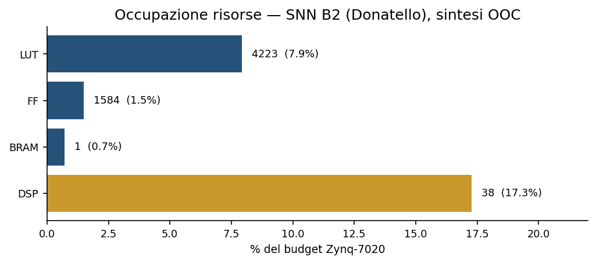
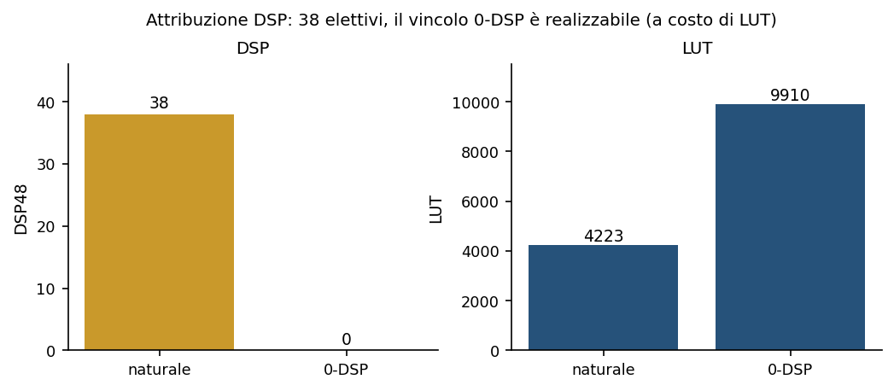
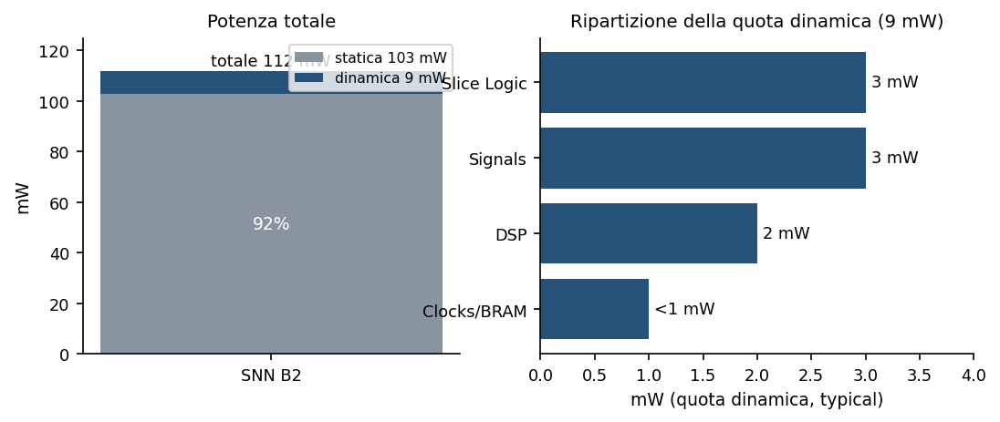
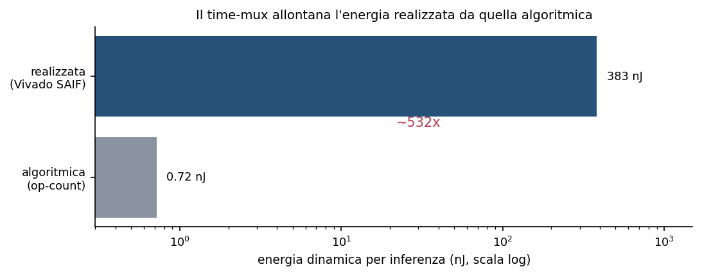
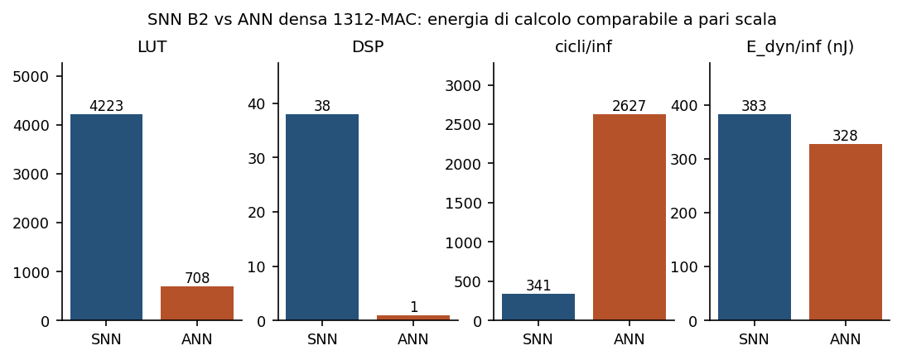

# CF_FSNN — Report FPGA Fase B (post-sintesi)

> **Validazione post-sintesi del profilo di idoneità FPGA del candidato al deploy (Donatello, architettura B2 time-multiplexata) su Zynq-7020 / PYNQ-Z1.**

> Livello di fedeltà: stima Vivado post-implementazione con switching reale (SAIF, confidenza alta) — non misura su silicio (Fase C, predisposta).  
> Fonte dei numeri: matlab/axi/build/phase_b/results.csv (dai report Vivado util/timing/power).  
> Documento gemello: Report FPGA Fase A (profilazione software pre-silicio).  

---

## Sommario

| Sezione |
|---|
| 1. Sintesi |
| 2. Scopo e metodo: tre livelli di fedeltà |
| 3. Correttezza funzionale: la rete genera bene i parametri |
| 4. Risorse occupate |
| 5. Timing e determinismo |
| 6. Potenza di sistema ed energia |
| 7. Costo per operazione: e_MAC ed e_AC su FPGA |
| 8. Confronto con una rete densa e ruolo della compattezza |
| 9. Quadro di validazione |
| 10. Termica e limiti residui |
| 11. Riferimenti |

## 1. Sintesi

Il presente documento riporta la validazione hardware del candidato al deploy della rete spiking per il car-following, ottenuta sintetizzando su Vivado l'architettura B2 (Donatello, rete time-multiplexata con memoria su blocchi RAM) per lo Zynq-7020 della scheda PYNQ-Z1. La generazione dell'RTL preserva la parità bit-esatta con il modello in virgola fissa (e, a monte, con la rete PyTorch): l'implementazione hardware calcola i cinque parametri del controllore senza errore rispetto al riferimento, entro l'incertezza di quantizzazione già nota.

La sintesi con switching reale precisa tre grandezze che la stima software per conteggio di operazioni non poteva fissare. La rete occupa **4223 LUT (7.9% dello Zynq-7020)** e **38 DSP**; il datapath opera a **8 MHz** (frequenza massima della via di calcolo 8.5 MHz), per cui una inferenza dura **42.6 µs** contro una deadline di controllo di 100 ms. La potenza totale è di **112 mW**, dominata al **92%** dalla dispersione statica del dispositivo; la quota dinamica della logica è di soli 9 mW.

Il confronto energetico con una rete densa di pari compito conferma un vantaggio, ma ne individua la vera origine. A pari nodo tecnologico l'energia di un accumulo (AC) eguaglia quella di una moltiplicazione-accumulo (MAC): il guadagno non nasce dal costo unitario dell'operazione, bensì dalla **compattezza del modello** — circa 800 operazioni contro le migliaia-decine di migliaia delle reti di car-following pubblicate. Il vantaggio stimato si colloca nell'intervallo **~5-65x** secondo la scala della rete densa di riferimento.

> **Nota.** Convenzione dei marcatori usata nel documento: ● dato misurato o verificato bit-esatto (correttezza funzionale, cosim); ○ stima Vivado post-implementazione (risorse, timing, potenza) con switching reale SAIF, precedente alla misura su silicio. La conferma finale della potenza appartiene alla Fase C.

## 2. Scopo e metodo: tre livelli di fedeltà

La valutazione di idoneità FPGA procede per livelli di fedeltà crescente, ciascuno con una garanzia diversa e un costo diverso. Il primo livello è la profilazione software per conteggio di operazioni sui tensori e sul forward reale della rete: fissa gli ordini di grandezza (numero di operazioni, footprint dei pesi, sparsità di firing) ma non conosce né la mappatura sulle risorse del dispositivo né lo switching reale del silicio.

Il secondo livello, oggetto di questo documento, è la sintesi su Vivado in modalità out-of-context, seguita da una stima di potenza guidata dall'attività di commutazione reale (file SAIF prodotto da una simulazione gate-level su stimolo di traiettoria). Restituisce le risorse effettivamente occupate, il timing di chiusura e una stima di potenza a confidenza alta, tutte pre-silicio. Il terzo livello è la misura su scheda PYNQ-Z1 fisica (Fase C): unica verità di riferimento per la potenza, predisposta con bitstream e stimolo pronti ma non ancora eseguita.

La modalità out-of-context merita una nota, perché è la scelta corretta per un blocco destinato a vivere dentro un sistema più grande e non come modulo di sommità con terminali fisici. La sintesi esclude gli anelli di ingresso/uscita verso i piedini del contenitore, isolando la potenza e le risorse della sola logica. Nel deploy effettivo la rete è incapsulata in un blocco AXI4-Lite: i suoi segnali diventano registri mappati in memoria sul bus interno fra processore e logica programmabile, non piedini del dispositivo. Il bitstream flashabile, ottenuto con questa architettura e con timing pulito, ne è la conferma.

## 3. Correttezza funzionale: la rete genera bene i parametri

Prima di ogni considerazione su risorse ed energia va stabilito che l'implementazione hardware calcoli i parametri corretti. La catena di conversione conserva il comportamento a ogni anello, con una garanzia esplicita per ciascuno, e l'errore complessivo dell'hardware rispetto alla rete originale coincide con l'errore di quantizzazione già documentato — non con un difetto di conversione.

| Anello di verifica | Evidenza | Errore |  |
|---|---|---|---|
| RTL vs core in virgola fissa | parità cyclo-accurata (test FSM) | bit-esatto (err = 0) | ● |
| IP AXI vs rete B2 | cosim del testbench AXI | bit-esatto (v0=26.49, T=1.63, s0=2.45, a=1.01, b=1.71) | ● |
| fixed vs double | sweep sui bit frazionari | ≤ 0.028 sul parametro v0 | ● |
| double vs PyTorch | confronto col forward originale | ~ 2·10⁻⁶ (arrotondamento) | ● |
| decode a LUT vs float | test del decodificatore | 0.002 | ● |

Poiché l'RTL coincide esattamente con il core in virgola fissa, l'errore dell'hardware rispetto alla rete PyTorch è interamente la catena fixed-double-PyTorch riportata sopra, dominata dallo scarto di 0.028 sul parametro v0. La generazione dei parametri di controllo è dunque riprodotta in hardware entro la quantizzazione nota.

## 4. Risorse occupate

La sintesi out-of-context del blocco che comprende la rete e il decodificatore restituisce un'occupazione contenuta su tutte le famiglie di risorse del dispositivo. Il footprint di logica lascia margine, mentre la voce più alta in percentuale sono i blocchi aritmetici dedicati.

*Figura 4.1 — Occupazione del budget Zynq-7020 per la rete B2 (Donatello), sintesi out-of-context. Valori assoluti e percentuali del dispositivo (53 200 LUT, 106 400 FF, 220 DSP48, 140 BRAM). Fonte: results.csv, gruppo A.*

La presenza di 38 blocchi aritmetici dedicati (DSP48) richiede una lettura attenta, perché la premessa di co-progetto era l'assenza di moltiplicatori sinaptici. L'analisi per nome di cella mostra che questi blocchi sono adder e accumulatori larghi del core e del readout, più poche moltiplicazioni del decodificatore: **nessun moltiplicatore sinaptico**. Le sinapsi a potenza di due restano operazioni di scorrimento, senza blocchi dedicati. Vincolando esplicitamente la sintesi a zero blocchi aritmetici, il progetto chiude comunque, a 9910 LUT (18.6% del dispositivo): la premessa a zero moltiplicatori è dunque **realizzabile**, e i 38 blocchi presenti sono una scelta elettiva del sintetizzatore per dimezzare l'uso di logica combinatoria.

*Figura 4.2 — Il compromesso fra blocchi aritmetici e logica: la sintesi naturale usa 38 DSP e 4223 LUT; il vincolo a zero DSP è realizzabile a 9910 LUT. Fonte: results.csv, gruppo A.*

## 5. Timing e determinismo

Il datapath soddisfa tutti i vincoli temporali a 8 MHz (periodo 125 ns). Una inferenza completa richiede 341 cicli, pari a 42.6 µs, contro una deadline di controllo di 100 ms: il budget temporale impiegato è intorno allo 0.04%. La frequenza massima della via di calcolo si attesta a 8.5 MHz, un solo punto operativo utile — un margine sul deadline di circa 2346x rende irrilevante ogni ulteriore incremento di frequenza.

*Equazione 5.1 — t_inf = tempo di inferenza (s); N_cyc = numero di cicli per inferenza (341); T_clk = periodo di clock (125 ns); f_clk = frequenza di clock (8 MHz).*

Il valore qualitativamente più rilevante non è il margine, ma il **determinismo**. La struttura di calcolo non contiene diramazioni dipendenti dai dati: il numero di operazioni per inferenza è costante a prescindere dall'ingresso, per cui il tempo di esecuzione nel caso peggiore coincide con quello nel caso migliore. Il jitter di calcolo è quindi nullo, un requisito hard-real-time qui garantito dall'architettura anziché conquistato a fatica. La quasi indipendenza dai dati emerge anche dalla potenza (§6), pressoché identica fra stimolo tipico e stimolo peggiore.

## 6. Potenza di sistema ed energia

La stima di potenza guidata dall'attività reale colloca il consumo totale a 112 mW, di cui 103 mW di dispersione statica del dispositivo e appena 9 mW di quota dinamica della logica (stimolo tipico; 8 mW nel caso peggiore). La dispersione statica, comune a qualunque progetto sullo stesso dispositivo, domina il bilancio al 92%.

*Figura 6.1 — A sinistra: la potenza totale (112 mW) è dominata dalla dispersione statica. A destra: la quota dinamica (9 mW) suddivisa per contributo. Fonte: results.csv, gruppo A (SAIF, stimolo tipico).*

Il fatto più istruttivo riguarda il divario fra l'energia realizzata e quella algoritmica. Moltiplicando la quota dinamica per il tempo di inferenza si ottengono 383 nJ per inferenza, contro i circa 0.72 nJ del solo conteggio di operazioni: oltre due ordini di grandezza di distanza. La multiplazione temporale su 341 cicli e la dispersione statica stravolgono l'energia di sistema rispetto alla stima algoritmica. L'efficienza suggerita dal conteggio di operazioni è una proprietà algoritmica che l'implementazione a multiplazione temporale non esibisce a livello di sistema.

*Figura 6.2 — Energia dinamica per inferenza: la realizzazione a multiplazione temporale (383 nJ) dista oltre due ordini di grandezza dalla stima algoritmica per conteggio di operazioni (0.72 nJ). Scala logaritmica. Fonte: results.csv, gruppo A.*

## 7. Costo per operazione: e_MAC ed e_AC su FPGA

La premessa energetica del profilo software era che un accumulo costasse significativamente meno di una moltiplicazione-accumulo, con un rapporto di riferimento intorno a cinque a uno sul nodo ASIC a 45 nm. Due micro-datapath isolati, uno per l'operazione di scorrimento-e-somma delle sinapsi a potenza di due e uno per la moltiplicazione-accumulo densa, permettono di misurare quel rapporto sul dispositivo reale.

*Figura 7.1 — A sinistra: potenza dinamica di una singola operazione per ciclo, accumulo a potenza di due (3 mW, 0 DSP) contro moltiplicazione-accumulo (4 mW, 1 DSP). A destra: il rapporto e_MAC/e_AC misurato su FPGA (~1) contro il valore di riferimento ASIC (5.1). Fonte: results.csv, gruppo B.*

Il blocco aritmetico dedicato che esegue la moltiplicazione-accumulo consuma quanto la logica combinatoria che esegue lo scorrimento-e-somma: entrambe le operazioni sono dominate dall'infrastruttura di registri e instradamento della matrice programmabile, non dall'aritmetica pura del silicio dedicato. Sul dispositivo il rapporto **e_MAC/e_AC vale circa uno**, non cinque. Ne consegue che il vantaggio energetico per operazione, che nel profilo software nasceva dalla disuguaglianza fra i due costi, sul dispositivo largamente svanisce. La direzione è comunque confermata dai totali dei due micro-datapath (4 mW contro 3 mW), ma di entità modesta.

> **Nota.** Caveat di risoluzione: a una operazione per ciclo la potenza è dominata dall'albero di clock e dai registri, al fondo scala dello strumento di stima. I valori per operazione hanno perciò valore di ordine di grandezza, non di misura puntuale; il rapporto qualitativo (~1, non 5) è robusto, il numero esatto no.

## 8. Confronto con una rete densa e ruolo della compattezza

Per collocare il vantaggio energetico serve un termine di paragone omogeneo. La rete densa equivalente per numero di operazioni (1312 moltiplicazioni-accumulo, l'analogo denso della rete spiking) è stata sintetizzata e stimata con lo stesso flusso. A pari scala e pari frequenza l'energia di calcolo delle due reti è comparabile: la via spiking brucia più potenza per ciclo ma termina in meno cicli, e i due effetti si compensano.

*Figura 8.1 — Rete spiking B2 contro rete densa di pari numero di operazioni (1312), stesso flusso di sintesi e stesso clock. L'energia dinamica per inferenza è comparabile (383 contro 328 nJ). Fonte: results.csv, gruppi A e C.*

La rete densa a 1312 operazioni, tuttavia, non svolge il compito: è l'equivalente dimensionale della rete spiking, non una rete addestrata a identificare i parametri di car-following. Le reti neurali di car-following pubblicate operano su scale ben maggiori, da alcune migliaia fino a oltre centomila operazioni per passo. Scalando l'energia misurata della rete densa in proporzione al numero di operazioni — lecito perché con la multiplazione temporale l'energia cresce con il numero di operazioni, ed è ciò che si osserva — il vantaggio della rete spiking si colloca fra circa cinque e sessantacinque volte.

*Equazione 8.1 — E_ANN, E_SNN = energia dinamica per inferenza (nJ); N_MAC task = numero di operazioni della rete densa che svolge il compito (da letteratura, 7400–100000); 1312 = operazioni della rete densa equivalente misurata.*

*Figura 8.2 — Vantaggio energetico della rete spiking al variare della scala della rete densa di riferimento (da letteratura). A pari scala il vantaggio è circa unitario; cresce a ~5-65x per le reti dense che svolgono davvero il compito. Fonte: results.csv, gruppi A e C, e letteratura (§10).*

Il vantaggio energetico è dunque reale, ma la sua origine è la **compattezza del modello** — circa 800 pesi a potenza di due — non un minor costo per operazione. La rete spiking fa lo stesso lavoro con molte meno operazioni, e su quel divario si costruisce il guadagno.

> **Nota.** Caveat sull'intervallo: il numero esatto entro ~5-65x dipende dalla rete densa di riferimento e richiederebbe di addestrare una rete densa alla stessa accuratezza, non fatto. La letteratura ne fissa l'intervallo; le reti ricorrenti dense hanno inoltre operazioni non moltiplicative aggiuntive, per cui lo scaling qui è conservativo.

## 9. Quadro di validazione

Le grandezze che la sintesi con switching reale precisa o rivede rispetto alla stima per conteggio di operazioni sono raccolte di seguito. La colonna di stima e quella di sintesi rappresentano due livelli di fedeltà distinti, non due versioni dello stesso numero.

| Grandezza | Stima op-count | Sintesi Vivado | Esito |
|---|---|---|---|
| Blocchi aritmetici (DSP) sinaptici | 0 | 38 elettivi (0 realizzabile a 9910 LUT) | precisata |
| Frequenza massima | 100–200 MHz | 8.5 MHz | rivista |
| Rapporto e_MAC / e_AC | 5.1 (ASIC 45 nm) | ~1 (FPGA) | rivista |
| Energia per inferenza | ~0.72 nJ (op-count) | 383 nJ (statica 92%) | precisata |
| Origine del vantaggio vs ANN | costo AC < MAC | compattezza del modello (~5-65x) | ri-attribuita |
| Temperatura di giunzione | stima | ~26 °C (non critica) | confermata |
| Correttezza dei parametri | — | bit-esatta al riferimento | confermata |

## 10. Termica e limiti residui

La stima termica colloca la temperatura di giunzione intorno a 26 °C con ambiente a 25 °C, un innalzamento di circa un grado dovuto alla scala di potenza in milliwatt. Il derating di frequenza con la temperatura è quindi irrilevante: il progetto opera lontanissimo dalle soglie di preoccupazione termica, e nessuna analisi termica ulteriore è necessaria a questo livello.

Restano da dichiarare quattro limiti. I costi per singola operazione (§7) hanno valore di ordine di grandezza, essendo al fondo scala dello strumento. Il confronto con la rete densa (§8) usa una rete non addestrata al compito per l'energia e si affida alla letteratura per la capacità, per cui il vantaggio è un intervallo e non un valore singolo. Tutte le grandezze di risorse, timing e potenza sono stime Vivado con switching reale, non misure su silicio: la verità di riferimento sulla potenza spetta alla misura su scheda PYNQ-Z1 fisica. Quest'ultima è predisposta — bitstream, stimolo di traiettoria e driver di lettura sono pronti — e attende soltanto l'esecuzione sulla scheda, con la sola avvertenza che la quota dinamica in milliwatt è al limite della risoluzione di un sensore di corrente ordinario.

## 11. Riferimenti

| Riferimento | Tema |
|---|---|
| Horowitz, M. (2014). Computing's energy problem (and what we can do about it). ISSCC, 10-14. | Costi e_MAC/e_AC (§7) |
| Mo, Z., Shi, R., Di, X. (2021). A physics-informed deep learning paradigm for car-following. Transp. Res. C 130, 103240. | Scala reti dense (§8) |
| Hatazawa, Y., Hamada, R., Oikawa, M., Hirose, T. (2023). Personalized driver model using LSTM. J. Adv. Mech. Design Syst. Manuf. 17(2). | Scala reti ricorrenti (§8) |
| Lu, W., Yi, Z., Liang, R., Rui, Y., Ran, B. (2023). Improved seq2seq deep learning for CAV. IEEE Access 11. | Scala reti ricorrenti (§8) |
| Wang, X., Jiang, R., Li, L., Lin, Y., Zheng, X., Wang, F. (2018). Capturing car-following by deep learning. IEEE T-ITS 19(3), 910-920. | Reti CF profonde (§8) |
| Kesting, A., Treiber, M., Helbing, D. (2010). Enhanced IDM (ACC/CAH). Phil. Trans. R. Soc. A 368, 4585-4605. | Modello di controllo |
| AMD/Xilinx. Zynq-7000 SoC Data Sheet (DS187); Digilent PYNQ-Z1 Reference Manual. | Dispositivo e scheda |
