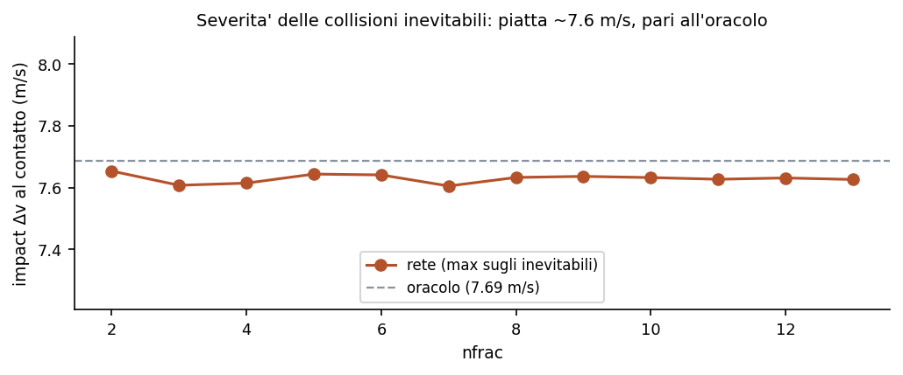
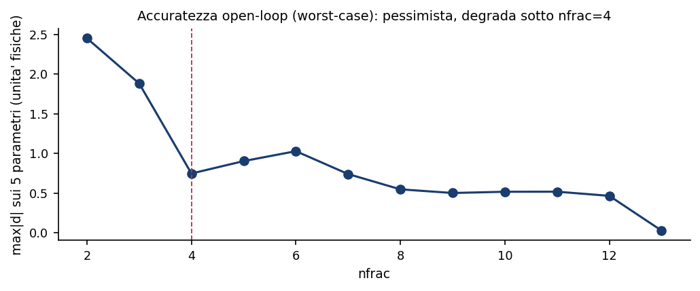
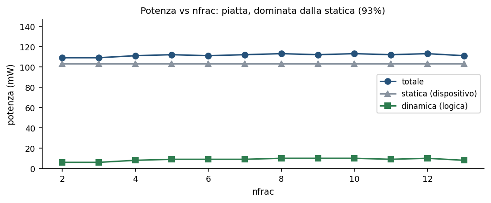

# CF_FSNN — Studio di quantizzazione della rete spiking Donatello

> **Caratterizzazione del compromesso di quantizzazione fixed-point del core spiking per il car-following (Donatello): sicurezza del comportamento in anello chiuso e costo hardware su Zynq-7020, al variare dei bit frazionari del calcolo neurale.**

> Livello di fedeltà: il car-following è da simulazione in anello chiuso provata bit-vicina al motore di riferimento; risorse, potenza e frequenza sono stime Vivado post-implementazione (out-of-context), non misura su silicio.  
> Fonte dei numeri: matlab/Quantizzation_Study/{cl_sweep, res_sweep, acc_sweep, sev_sweep}.tsv, prodotti dagli script dello studio. Nessun numero è scritto a mano nel testo.  
> Campione: Donatello, il forward deployato del blocco Donatello_Tier. Dataset di prova: 99 traiettorie su 9 scenari canonici, di cui 33 con evento di cut-in.  

---

## Sommario

| Sezione |
|---|
| 1. Sintesi |
| 2. Scopo e metodo |
| 3. Cosa quantizza nfrac |
| 4. Sicurezza del car-following |
| 5. Fedeltà dei parametri e il ginocchio |
| 6. Costo hardware |
| 7. Livelli utili e menu nel blocco |
| 8. Quantizzazione per-campo (mixed-precision) |
| 9. Limiti residui |
| 10. Riferimenti |

## 1. Sintesi

La rete spiking che stima i cinque parametri del controllore di car-following opera in virgola fissa. Il numero di bit frazionari del suo calcolo interno, indicato nel seguito con nfrac, governa insieme l'accuratezza e il costo su silicio: più bit danno più precisione ma occupano più area e dissipano più potenza. Questo studio ne caratterizza il compromesso su due fronti indipendenti — l'accuratezza del comportamento in strada e l'occupazione hardware — spingendo la quantizzazione fino al limite estremo di due soli bit frazionari.

Il risultato centrale è che la **sicurezza del car-following resta invariata fino a due bit frazionari**. Su 99 traiettorie che comprendono 33 eventi di discontinuita' del gap (cut-in, dove un veicolo si inserisce a distanza ridotta, e cut-out, dove il leader esce) e frenate del leader alla decelerazione fisica massima, la rete quantizzata non provoca **alcuna collisione aggiuntiva** rispetto a un controllore a conoscenza perfetta, a qualunque profondita' di bit. Le sole 3 collisioni presenti sono fisicamente inevitabili, e la loro severita' non cresce riducendo i bit.

Il costo hardware scende con i bit, ma in modo più sottile di quanto una lettura ingenua suggerirebbe. I registri diminuiscono in modo pulito, del **51%** passando da tredici a due bit; i blocchi aritmetici calano a gradino; le celle logiche seguono invece un andamento non monotono, governato dal confine di inferenza fra blocchi aritmetici dedicati e logica combinatoria. La potenza resta pressoché costante — scende di appena l'**1.8%** da tredici a due bit — perché su questo dispositivo domina la dispersione statica. La frequenza massima è un margine amplissimo a ogni livello.

Ne discende la conclusione operativa: **il fattore che limita la scelta dei bit non è l'hardware né la sicurezza, bensì la fedeltà dei parametri stimati**. La quantizzazione sposta i parametri interni pur preservando il controllo — un comportamento da equilibri interni della rete probabilistica — e il ginocchio di quella fedeltà cade attorno a quattro-cinque bit. I quattro livelli utili che ne risultano sono stati resi selezionabili come menu nel blocco di deploy.

> **Nota.** Marcatori usati nel documento: ● grandezza misurata o verificata (comportamento in anello chiuso, parità col riferimento); ○ stima Vivado post-implementazione (risorse, potenza, frequenza), precedente alla misura su silicio.

## 2. Scopo e metodo

Lo studio di trade-off a monte aveva stabilito che, essendo la frequenza massima un margine enorme, il criterio di progetto rilevante è l'area — lasciare spazio ad altri blocchi sullo stesso dispositivo. La quantizzazione attacca proprio quella leva: meno bit frazionari significano meno logica e meno potenza dinamica, al costo di accuratezza. La domanda che lo studio risolve è fin dove sia lecito spingersi, e cosa fissi davvero il limite.

La valutazione poggia su tre scelte metodologiche, ciascuna volta a evitare una conclusione credibile ma falsa. La prima è il **dataset di prova esaustivo**. Un insieme di sole traiettorie di inseguimento dolce non mette mai il controllore in difficoltà, e vi si sopravvive banalmente anche molto degradati; perciò la prova usa i 9 scenari canonici del progetto — inseguimento, stop-and-go, frenata forte, cut-in, sinusoidale, e quattro scenari di coda fra cui il cut-in aggressivo e la frenata di emergenza — replicati su più estrazioni di parametri, per un totale di 99 traiettorie di cui 33 con un vero evento di cut-in, modellato come una discontinuita' del gap.

La seconda scelta è l'**anello chiuso fedele**. La sicurezza si misura simulando l'ego guidato dalla rete quantizzata contro il profilo del leader, con il gap tracciato senza clamp inferiore, così che una collisione sia rilevabile; l'evento di cut-in vi è iniettato come teletrasporto del gap. Questo anello riproduce il motore canonico del progetto: sui nove scenari, l'oracolo simulato in MATLAB e la funzione di riferimento in Python coincidono passo per passo entro **2.2e-06 m** sul gap, con i medesimi verdetti di collisione. La misura di comportamento è dunque quella vera, non quella di un anello che nasconde le collisioni dietro un clamp.

La terza scelta è la **linea di base oracolo per traiettoria**. Prima dello sweep, un controllore a parametri veri (l'oracolo) percorre tutte le traiettorie e marca quali collisioni siano fisicamente evitabili. Per la rete a ciascun nfrac, allora, contano solo le collisioni su traiettorie che l'oracolo evita: quelle, e solo quelle, sono il **costo reale della quantizzazione**, separato da ciò che nessun controllore potrebbe evitare. Sul dataset, 3 traiettorie su 99 sono inevitabili già per l'oracolo.

## 3. Cosa quantizza nfrac

La quantizzazione agisce sul calcolo neurale interno, non sull'ingresso-uscita del blocco. Il parametro nfrac fissa il numero di bit frazionari dei tipi in virgola fissa del core spiking, lasciando invariati i bit interi — dunque il campo di rappresentazione non cambia, cambia solo la risoluzione. I segnali interessati sono il potenziale di membrana del neurone, la soglia adattiva, gli accumulatori della corrente sinaptica, i pesi a potenza di due e l'uscita grezza del readout, oltre all'ingresso normalizzato, che eredita il tipo del potenziale di membrana.

*Equazione 3.1 — i tipi del core al variare di n = nfrac (notazione Qm.n: m bit interi, n bit frazionari). V = potenziale di membrana; fatigue = soglia adattiva; acc/accw = accumulatori (accw più largo per gli scorrimenti esatti); raw = uscita del readout; w = pesi. I bit interi sono fissi; solo n varia. Fonte: matlab/snn_types.m.*

Restano fuori dalla quantizzazione, per costruzione, due elementi. Gli **ingressi fisici** — distanza, velocita' dell'ego, velocita' relativa e velocita' del leader — arrivano a piena risoluzione: la loro quantizzazione sul canale di comunicazione è un asse separato, estraneo a questo studio. E il **decodificatore** che trasforma l'uscita grezza nei cinque parametri: la sua aritmetica e le sue costanti sono fisse a tredici bit frazionari, indipendenti da nfrac. L'uscita grezza, calcolata alla precisione nfrac, vi entra e viene portata a tredici bit senza perdita ulteriore. In una frase, nfrac è la profondita' di bit del calcolo neurale — stato, pesi, accumulatori, readout — non dell'ingresso-uscita né della ricostruzione finale dei parametri.

## 4. Sicurezza del car-following

La misura di sicurezza confronta, a ogni nfrac, le collisioni della rete con la linea di base oracolo. Il conteggio delle collisioni aggiuntive — quelle su traiettorie che l'oracolo evita — è **zero a ogni livello, fino a due bit frazionari**. Le sole 3 collisioni presenti a ogni nfrac sono le stesse dell'oracolo: scenari di cut-in aggressivo in cui la decelerazione richiesta supera il limite fisico del veicolo, dunque inevitabili per qualunque controllore. La rete quantizzata eguaglia il controllore a conoscenza perfetta sull'evitamento a ogni profondita' di bit.

*Figura 4.1 — Sicurezza car-following al variare di nfrac. La curva (asse sinistro) è l'errore normalizzato dei parametri rispetto a piena precisione; le barre (asse destro) sono le collisioni aggiuntive rispetto all'oracolo, nulle a ogni livello. Fonte: cl_sweep.tsv.*

Anche i margini di sicurezza istantanei confermano l'invarianza. Il passaggio più stretto su tutte le traiettorie evitabili è di circa **0.22 m** nel caso peggiore, non si annulla mai e non peggiora riducendo i bit; il margine di evitabilita' e la decelerazione richiesta critica oscillano con la geometria degli scenari, non con nfrac. In altre parole, l'inviluppo di sicurezza è fissato dai casi più duri del dataset, e la rete lo percorre allo stesso modo a tredici come a due bit.

*Equazione 4.1 — margine di frenata e decelerazione richiesta (DRAC). s = gap (m); Δv = velocita' di avvicinamento (m/s); B_max = 9 m/s2 = decelerazione fisica massima. Un margine di frenata negativo segnala che, se il leader frenasse al massimo in quell'istante, la collisione sarebbe inevitabile. Fonte: matlab/Quantizzation_Study/qz_safety_metrics.m (porta di utils/closed_loop_eval.py).*

Resta da chiudere il caso delle collisioni inevitabili: dove nessun controllore evita l'urto, la quantizzazione lo rende più violento? La severita', misurata come velocita' relativa al contatto, è **piatta su tutti i livelli**: il suo massimo è 7.65 m/s, appena sotto la severita' dell'oracolo (7.69 m/s), da tredici fino a due bit frazionari. Dove la collisione è comunque inevitabile, la rete a due bit non urta né più né meno di quella a tredici bit o del controllore a conoscenza perfetta.

*Figura 4.2 — Severita' (velocita' relativa al contatto) sulle 3 traiettorie inevitabili, al variare di nfrac. La linea tratteggiata è la severita' dell'oracolo. La curva della rete è piatta e le si sovrappone. Fonte: sev_sweep.tsv.*

## 5. Fedeltà dei parametri e il ginocchio

Se la sicurezza non si degrada, cosa lo fa? La fedeltà dei parametri stimati. L'errore normalizzato medio dei cinque parametri rispetto a piena precisione cresce in modo liscio al calare dei bit, con un ginocchio attorno a quattro-cinque bit frazionari: è pressoché costante sopra — passa da **0.089** a otto bit a **0.097** a cinque — e poi accelera sotto, raddoppiando quasi a ogni bit, fino a **0.201** a tre e **0.327** a due. La rete probabilistica riorganizza i propri parametri sotto quantizzazione, ma la legge di controllo e la retroazione ne assorbono lo scarto: è questo che spiega la sicurezza invariante a fronte di parametri visibilmente diversi.

*Equazione 5.1 — errore normalizzato del parametro p a nfrac = n, rispetto al riferimento a tredici bit; la media è sul dataset e la normalizzazione è sull'escursione del parametro nel riferimento (adimensionale). Fonte: matlab/Quantizzation_Study/qz_cl_validate.m.*

Questa vista in anello chiuso capovolge quella open-loop. Misurando lo scarto massimo dei parametri sul solo forward, senza retroazione, la rete appare sensibile già a bit medi: il parametro peggiore devia di mezzo-un'unità fisica ben prima del limite. Ma quel massimo peggiore è una vista pessimista; il comportamento in strada, che è ciò che conta, la smentisce. La stessa quantizzazione che sembra rovinosa sui numeri grezzi lascia il controllo sicuro fino a due bit.

*Figura 5.1 — Accuratezza open-loop worst-case (massimo scarto assoluto sui cinque parametri, in unità fisiche) al variare di nfrac. Vista pessimista che il comportamento in anello chiuso ridimensiona. Fonte: acc_sweep.tsv.*

## 6. Costo hardware

Il costo su silicio è stato misurato sintetizzando il forward a ciascun nfrac su Vivado, in modalità out-of-context su una configurazione di pipeline di riferimento, con lo stesso vincolo di clock di deploy per tutti i livelli, così che il confronto sia omogeneo. Il risparmio d'area non è un semplice andamento monotono: è governato dal confine di inferenza fra blocchi aritmetici dedicati e logica combinatoria.

*Figura 6.1 — Risorse al variare di nfrac. A sinistra celle logiche e registri; a destra i blocchi aritmetici. I registri calano in modo pulito, i blocchi aritmetici a gradino sotto cinque bit, le celle logiche in modo non monotono per il travaso dai blocchi aritmetici. Fonte: res_sweep.tsv.*

I **registri** sono la metrica pulita: monotoni, calano del **51%** da tredici a due bit. I **blocchi aritmetici** scendono a gradino — restano stabili sopra i cinque bit, poi crollano sotto, quando le moltiplicazioni più strette smettono di occupare un blocco dedicato. Proprio quel travaso rende le **celle logiche** non monotone: calano da tredici a cinque bit (**21%** a cinque bit), poi risalgono a quattro — dove le moltiplicazioni uscite dai blocchi diventano logica — e infine scendono di nuovo a due-tre bit, dove quella stessa logica si restringe. Il livello a quattro bit è perciò dominato dal livello a cinque, che usa meno celle a pari fedeltà.

La **potenza** non partecipa a questo compromesso: è piatta — scende di appena l'1.8% da tredici a due bit. La ragione è che su questo dispositivo la dispersione statica vale il **93%** della potenza totale; la quota dinamica della logica, la sola che scala con i bit, è troppo piccola per spostare il totale. La quantizzazione, su questo silicio, non fa risparmiare potenza. Vi è pero' un corollario: la rete è idle per costruzione per oltre il 99,9% del tempo, dunque su un dispositivo dove la potenza dinamica fosse il collo di bottiglia il risparmio si materializzerebbe; qui non lo fa perché domina la statica del dispositivo, non un difetto della rete.

*Figura 6.2 — Potenza al variare di nfrac: totale, statica del dispositivo e dinamica della logica. La statica domina e il totale è piatto. Fonte: res_sweep.tsv.*

La **frequenza massima**, infine, è un margine e non una proprietà del progetto a questo vincolo: oscilla fra circa 51 e 60 MHz al punto di deploy, ma il tool non spinge (lo slack è ampiamente positivo). Poiché ogni inferenza richiede alcune centinaia di cicli, il passo di controllo di 100 ms si accontenta di un clock dell'ordine di qualche kilohertz: ogni livello vi resta migliaia di volte sopra. Non è quindi una leva di scelta dei bit.

## 7. Livelli utili e menu nel blocco

Incrociando i tre fronti — sicurezza, fedeltà, costo — la lettura è netta. La sicurezza regge fino a due bit e non pone limite; la potenza è piatta; il risparmio d'area è modesto e non monotono. Ciò che detta la scelta dei bit è la fedeltà dei parametri. Ne emergono quattro livelli utili.

| Livello (nfrac) | Uso | NRMSE parametri | Risorse vs 13 bit | Collisioni extra |
|---|---|---|---|---|
| 13 | piena precisione (riferimento) | 0.000 | — | 0 |
| 8 | conservativo | 0.089 | -13% celle, -18% registri | 0 |
| 5 | compromesso area/fedeltà | 0.097 | -21% celle, -28% registri | 0 |
| 2 | aggressivo (solo sicurezza) | 0.327 | -39% celle, -51% registri | 0 |

Questi quattro livelli sono stati resi selezionabili nel blocco di deploy Donatello_Tier, come secondo menu accanto a quello del profilo di pipeline. La rete a ciascun livello è una variante distinta con i tipi in virgola fissa già fissati a quel nfrac; alla piena precisione la variante coincide bit per bit con il forward storico, come atteso da una sostituzione che a tredici bit è un'operazione neutra.

> **Nota.** Nota realizzativa: un menu che pilotasse la profondita' di bit come parametro vivo, rigenerando i tipi a runtime, non si è potuto ottenere, perché un parametro di contenitore non raggiunge una funzione annidata dentro un sotto-sistema a varianti. Le quattro varianti discrete, coi tipi già fissati, aggirano il vincolo e sono la soluzione robusta adottata.

## 8. Quantizzazione per-campo (mixed-precision)

Le sezioni precedenti usano un unico nfrac per l'intero core. Ma i sei tipi in virgola fissa — potenziale di membrana, soglia adattiva, i due accumulatori, il readout e i pesi — non hanno la stessa sensibilità. Questa sezione assegna a ciascuno un nfrac **indipendente** e chiede: la precisione mista per campo permette tagli che quella uniforme non concede? Il criterio qui è più severo della sicurezza: è l'**indistinguibilita' comportamentale** — scarto massimo del gap sotto **0.5 m** rispetto alla piena precisione, su tutto il dataset, con zero collisioni extra. È un cancello molto più stretto di quello di sicurezza della Sezione 4, ed è ciò che rende informativa l'analisi.

*Figura 8.1 — Sensibilità per-campo: scarto massimo del gap quando si abbassa il nfrac di un solo campo, tenendo gli altri cinque a tredici. acc e w restano a zero (bit-identici) fino a quattro bit, poi saltano; V, fatigue, accw e raw superano il cancello già al primo bit tolto. Fonte: mp_sens.tsv.*

Il verdetto è netto e **asimmetrico**. Solo due campi sono riducibili: gli accumulatori d'ingresso e i pesi scendono a **quattro** bit frazionari senza alcuna perdita — l'uscita resta bit-identica alla piena precisione. Gli altri quattro non tollerano nemmeno un bit in meno sotto il cancello dei 0.5 m.

| Campo | Ruolo | Floor (nfrac) | Comportamento scendendo |
|---|---|---|---|
| V | potenziale di membrana | 13 | rompe subito a 12 |
| fatigue | soglia adattiva | 13 | rompe subito a 12 |
| acc | accumulatore d'ingresso | 4 | bit-identico 13→4, rompe a 3 |
| accw | accumulatore largo | 13 | rompe subito a 12 |
| raw | uscita del readout | 13 | rompe subito a 12 |
| w | pesi a potenza di due | 4 | bit-identico 13→4, rompe a 3 |

Il meccanismo è verificato, non ipotizzato. Ispezionando i pesi del campione, **tutte** le matrici (fc, ricorrenti, readout) sono potenze di due con modulo minimo esattamente **2⁻⁴**. Quindi 4 bit frazionari rappresentano ogni peso in modo esatto (a tre bit il peso 2⁻⁴ sparisce, e la rete si rompe); e l'accumulatore d'ingresso, che somma pesi-po2 per spike interi, vive su una griglia da 2⁻⁴ e serve anch'esso a quattro bit. Gli altri quattro campi portano grandezze **continue** — pilotate da quantità non-po2 come la soglia e i parametri del decode — e usano tutta la loro precisione: sotto il cancello stretto, ogni bit tolto si amplifica nell'anello oltre i 0.5 m.

Ne segue la tesi dello studio. La config **area-ottimale accettata è [13 13 4 13 13 4]** — soli acc e w a quattro bit — e passa il cancello con scarto massimo del gap di **0 m**: è **bit-identica** alla piena precisione, non un compromesso. Per contrasto, una quantizzazione **uniforme** non può scendere sotto tredici: già a dodici rompono V, fatigue, accw e raw. Il valore della precisione mista è esattamente questo — sfrutta la struttura a potenze di due per tagliare i due campi che portano i pesi, un taglio che l'uniforme non concede.

*Figura 8.2 — Risorse dei finalisti a 125 ns io-timed, in percentuale del full-precision (etichette = valori assoluti). La finale taglia i blocchi aritmetici e i registri ma alza le celle logiche; la uniforme a quattro bit (fuori cancello, solo riferimento hardware) mostra il soffitto. Fonte: mp_res.tsv.*

| Config | LUT | FF | DSP | slack WNS (ns) | P dinamica (mW) |
|---|---|---|---|---|---|
| full 13×6 | 4628 | 3474 | 52 | 106 | 8 |
| finale [13,13,4,13,13,4] | 5203 | 3045 | 36 | 106 | 10 |
| uniform 4×6 (fuori cancello) | 4856 | 2381 | 31 | 106 | 8 |

In hardware, pero', il pranzo comportamentalmente gratis **non** è un risparmio pulito. La finale taglia i blocchi aritmetici del **31%** e i registri del **12%**, ma **alza** le celle logiche del **12%**: è lo stesso confine fra blocchi dedicati e logica già visto nella Sezione 6 — le moltiplicazioni strette di acc e w escono dai blocchi e diventano celle. La potenza non aiuta: la **dinamica** passa da 8 a 10 mW (sale, per le celle in più), e a questa scala di pochi milliwatt stimati la differenza è entro la risoluzione. Il **margine di timing** è enorme — slack di circa 106 ns sul vincolo di deploy da 125 ns — dunque la frequenza non è il collo. La lettura onesta: i bit sovra-dimensionati di acc e w sono liberi da togliere nel comportamento, ma su questo Zynq DSP-ricco e static-dominato il taglio **ribilancia blocchi verso celle** senza vero guadagno d'area né di potenza. Il valore dell'analisi per-campo è **diagnostico** — dice quali campi portano informazione e quali no — e conferma, per via indipendente, il verdetto dello studio uniforme: il collo dei bit è la fedeltà, non l'hardware.

I sei nfrac per campo sono esposti nel blocco di deploy come **Modalità Avanzata**: una casella di spunta accanto ai menu di base sblocca sei cursori (uno per campo, da 1 a 13). Come per il menu di base, la configurazione è realizzata da varianti coi tipi già fissati — il generatore del blocco cuoce la variante avanzata ai valori scelti — perché un blocco legato alla libreria non può rigenerare la propria logica a runtime. Alla piena precisione la variante avanzata coincide bit per bit con quella di base.

## 9. Limiti residui

Vanno dichiarati quattro limiti. Le curve di risorse, potenza e frequenza sono stime Vivado post-implementazione con vincolo di deploy, non misure su silicio; il loro andamento relativo fra i livelli è affidabile, i valori assoluti attendono la misura su scheda. La caratterizzazione hardware è inoltre condotta su una configurazione di pipeline di riferimento: il ginocchio e le curve di risorsa e potenza sono robusti al profilo scelto — la quantizzazione tocca la logica del core, comune ai profili — mentre il solo valore assoluto di frequenza massima è specifico di quella configurazione. Lo studio varia esclusivamente i bit del core: la quantizzazione degli ingressi è un asse separato, fuori campo. Infine, la caratterizzazione hardware della precisione mista (Sezione 8) poggia su un insieme ridotto di tre configurazioni sintetizzate, non su uno sweep completo per campo — che richiederebbe ore di sintesi; le curve di sensibilità sono isolate, un campo per volta, e la verifica congiunta delle interazioni è svolta sulla sola configurazione finale.

## 10. Riferimenti

| Riferimento | Tema |
|---|---|
| Treiber, M., Kesting, A. (2013). Traffic Flow Dynamics. Springer (IIDM/ACC, cap. 11-12). | Modello di car-following |
| Kesting, A., Treiber, M., Helbing, D. (2010). Enhanced IDM (ACC/CAH). Phil. Trans. R. Soc. A 368, 4585-4605. | Legge di controllo |
| Minderhoud, M. M., Bovy, P. H. L. (2001). Extended time-to-collision safety measures. Accid. Anal. Prev. 33(1), 89-97. | Metriche di sicurezza (TTC/TET/TIT) |
| Archer, J. (2005). Traffic conflict techniques and micro-simulation (DRAC critico ~3.35 m/s2). KTH, Stockholm. | DRAC e conflitti |
| AMD/Xilinx. Zynq-7000 SoC Data Sheet (DS187); Vivado Design Suite 2026.1. | Dispositivo e sintesi |
